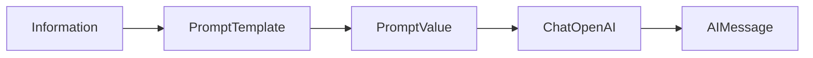

# 🔨 Xây chain đầu tiên: Tóm tắt và "đào" sự thật thú vị về Elon Musk

> Nguồn: `009-Building-a-LangChain-Chain-to-Summarize-Text.txt` · [Udemy](https://ua.udemy.com/course/langchain/learn/lecture/52015765)

Chào các bạn, Eden đây! Lý thuyết đã đủ rồi — giờ là lúc **viết chain LangChain đầu tiên** của chúng ta. Nhiệm vụ: lấy thông tin về Elon Musk, gửi cho LLM để **tóm tắt** và tạo ra **hai sự thật thú vị** về ông ấy.

Cùng mình đi qua từng bước nhé, mọi thứ đều rất trực quan.

---

### 📄 Bước 1 — Chuẩn bị dữ liệu đầu vào

Đầu tiên, mình định nghĩa một biến tên `information` để chứa dữ liệu. Mình lên Google tìm "Elon Musk", lấy đoạn thông tin đầu tiên từ **Wikipedia** và dán vào biến này.

```python
from dotenv import load_dotenv

load_dotenv()

information = """Elon Reeve Musk is a businessman and investor known for his roles at Tesla,
SpaceX, and X Corp. He is also involved in ventures such as Neuralink, the Boring Company,
and xAI."""
```

Hai dòng đầu là phần "khởi động" quen thuộc từ bài Project Setup: nạp API key từ file `.env` trước khi làm bất cứ điều gì. Còn biến `information` chính là dữ liệu thô — bạn thay bằng đoạn tiểu sử đầy đủ lấy từ Wikipedia cũng được, dài bao nhiêu cũng chẳng sao.

Đây sẽ là dữ liệu được "chảy" vào LLM — nhưng không phải trực tiếp, mà thông qua một **prompt template**.

---

### 🧱 Bước 2 — Viết prompt template

Tiếp theo, mình viết template với một placeholder nằm trong dấu ngoặc nhọn:

```python
from langchain_core.prompts import PromptTemplate

template = """Given the information {information} about a person I want you to create a short summary and two interesting facts about them"""

summary_prompt_template = PromptTemplate(
    input_variables=["information"],
    template=template,
)
```

Có thể bạn đoán ngay: `{information}` sẽ không giữ nguyên trong prompt cuối cùng — nó sẽ được **thay bằng giá trị thật của biến** `information` **lúc runtime**.

Mình khởi tạo object `PromptTemplate` với template vừa viết, kèm danh sách `input_variables` — danh sách các key sẽ được "bơm" vào lúc chạy. Danh sách này **phải khớp chính xác** với các placeholder trong dấu ngoặc nhọn.

**Vậy vì sao không dùng f-string cho nhanh?** Câu hỏi rất hợp lý! Prompt template mang lại:

* **Ràng buộc chặt chẽ:** nó bắt bạn cung cấp đúng các biến mong đợi. Nếu quên hoặc gõ sai tên biến, bạn nhận được **lỗi rõ ràng** thay vì một prompt hỏng bị âm thầm gửi tới LLM.
* **Tái sử dụng và rõ ràng:** prompt có thể dùng lại trong một chain khác.
* **First-class citizen:** đây là công dân hạng nhất trong LangChain — nó được **log lại, trace lại**, giúp việc debug dễ thở hơn nhiều.
* **An toàn hơn trước prompt injection:** nó có thể áp đặt format và cấu trúc nghiêm ngặt, đặc biệt mạnh khi kết hợp với **output parsers**.

| Tiêu chí | f-string | Prompt Template |
|---|---|---|
| Ràng buộc biến | Không kiểm tra, dễ gửi prompt hỏng | Bắt cung cấp đúng biến, báo lỗi rõ ràng |
| Tái sử dụng | Khó dùng lại ở chain khác | Dùng lại được, prompt là first-class citizen |
| Tracing và debug | Không được log/trace | Được log lại, trace lại đầy đủ |
| Prompt injection | Dễ bị nhồi text tùy ý | Áp format chặt, mạnh khi ghép output parser |

f-string khuyến khích ta cứ "nhồi" text vào — cũng chẳng sao, nhưng nếu muốn code **đáng tin cậy (reliable)**, hãy dùng prompt template. *Nghe hơi nhiều buzzword phải không? Cứ từ từ, cuối khóa bạn sẽ nắm hết.*

---

### 💬 Bước 3 — Khởi tạo Chat Model

Giờ đến lượt model. Mình tạo một **OpenAI chat model** và đặt tên biến là `llm`:

```python
from langchain_openai import ChatOpenAI

llm = ChatOpenAI(temperature=0, model="gpt-5")
```

Đây là cách chúng ta tương tác với **GPT-5**, và cũng chính object này sẽ thực hiện các **API call** tới OpenAI để gửi prompt và nhận phản hồi.

**Ai trả tiền cho các API call này?** Nhớ lại video trước: chúng ta đã tạo API key trên OpenAI, gắn với tài khoản có thông tin thanh toán, và lưu vào biến môi trường `OPENAI_API_KEY`. LangChain sẽ tự tìm biến môi trường này và dùng nó làm thông tin xác thực. *Bài tập nhỏ: bạn thử mở source code của `ChatOpenAI` xem việc này diễn ra ở đâu nhé!*

Mình khởi tạo model với `temperature=0`. **Temperature quyết định độ ngẫu nhiên/sáng tạo của phản hồi**:

* **Thấp (0 – 0.3):** kết quả mang tính **deterministic (xác định), khách quan và có thể lặp lại** — rất hợp cho **tóm tắt, viết code, hướng dẫn, viết test**.
* **Cao (trên 0.8 đến 1):** kết quả **cực kỳ sáng tạo** — hợp cho **thơ ca, tiểu thuyết và những ý tưởng đột phá**.

Muốn hiểu temperature hoạt động thế nào, bạn ghé phần lý thuyết của khóa học nhé.

---

### 🔀 Bước 4 — Nối chain bằng pipe operator và chạy

Và đây, khoảnh khắc quan trọng nhất — chain đầu tiên của chúng ta:

```python
chain = summary_prompt_template | llm

response = chain.invoke({"information": information})
print(response.content)
```

Mình cùng "mổ xẻ" chuyện gì đang xảy ra nhé. Chúng ta đang dùng **LCEL — LangChain Expression Language**. Cú pháp này tạo chain bằng cách **compose hai component**: một prompt template và một LLM.

* `summary_prompt_template` sẽ format các input variables — ở đây là `information` — thành một **prompt string**.
* `llm` nhận prompt string đó và sinh ra phản hồi dạng text.
* **Pipe operator `|`** tạo ra một **runnable chain** mới: nối output của component bên trái thành input của component bên phải.

Nói cách khác: **format input bằng prompt template trước, rồi đưa prompt string thu được vào LLM để sinh phản hồi.** Kết quả trả về là một **runnable object** — nghĩa là ta gọi được method `invoke` với input khớp với template.

Khi bạn chạy `chain.invoke`, chuỗi sự kiện diễn ra như sau:

1. `invoke` của **prompt template** được gọi với input là key `information` (mang giá trị tiểu sử Elon Musk).
2. Kết quả là một **PromptValue** — nôm na là một "string xịn".
3. String này được pipe vào `invoke` của **LLM**.
4. Prompt cuối cùng được gửi tới model.

Luồng chạy của chain trông như sau:



Đó là cách "nối chuỗi" thông minh — và cũng chính là ý nghĩa cái tên **LangChain**.

Mình nói thật lòng: **LCEL là thứ khó tiêu hóa nhất trong LangChain.** *Không hiểu ngay từ lần đầu là chuyện hoàn toàn bình thường!* Chúng ta sẽ đào sâu vào implementation và có thêm nhiều ví dụ xuyên khóa. Ở thời điểm này, chỉ cần hiểu ở mức cao: ta lấy biến `information`, nhét nó vào string, và gửi string đó cho LLM.

*(Fun fact: hiểu và implement agents còn dễ hơn hiểu pipe operator của chain expression language đấy!)*

Cuối cùng, chạy code thôi. GPT-5 khá chậm nên mình tua nhanh một chút, và ở cuối ta in ra `response.content` — chính là string LLM trả về. Kết quả: một **bản tóm tắt ngắn** và **hai sự thật thú vị** về Elon Musk. Tuyệt vời!

---

### 🧪 Code mẫu đầy đủ — copy là chạy

Toàn bộ những gì chúng ta vừa làm nằm gọn trong một file `main.py` dưới đây. Bạn thay đoạn `information` bằng tiểu sử đầy đủ trên Wikipedia, và nhớ đã cài `langchain`, `langchain-openai`, `python-dotenv` cùng file `.env` chứa `OPENAI_API_KEY` như bài Project Setup nhé!

```python
from dotenv import load_dotenv
from langchain_core.prompts import PromptTemplate
from langchain_openai import ChatOpenAI

load_dotenv()

information = """Elon Reeve Musk is a businessman and investor known for his roles at Tesla,
SpaceX, and X Corp. He is also involved in ventures such as Neuralink, the Boring Company,
and xAI."""

template = """Given the information {information} about a person I want you to create a short summary and two interesting facts about them"""

summary_prompt_template = PromptTemplate(
    input_variables=["information"],
    template=template,
)

llm = ChatOpenAI(temperature=0, model="gpt-5")

chain = summary_prompt_template | llm

response = chain.invoke({"information": information})
print(response.content)
```

Đối chiếu nhanh với 4 bước phía trên:

1. **Dữ liệu đầu vào:** biến `information` — bạn cứ dán đoạn text dài bao nhiêu cũng được.
2. **Prompt template:** `PromptTemplate` với đúng một input variable là `information`.
3. **Chat model:** `ChatOpenAI(temperature=0, model="gpt-5")` — temperature thấp cho kết quả ổn định.
4. **Chain:** `summary_prompt_template | llm`, rồi `invoke` với dict `{"information": information}` và in `response.content`.

*Mẹo nhỏ: `input_variables` có thể bỏ trống cũng chạy — LangChain tự suy ra từ template — nhưng mình cứ khai báo tường minh cho rõ ràng, đúng tinh thần "reliable" của prompt template.*

---

### 🎯 Tự kiểm tra nhanh

**Câu 1:** Vì sao nên dùng PromptTemplate thay vì f-string?

<details>
<summary><b>Xem đáp án</b></summary>

**Đáp án:** Vì template ràng buộc chặt biến (báo lỗi rõ ràng), tái sử dụng được, được log/trace, và an toàn hơn trước prompt injection.

Giải thích: f-string dễ khiến ta "nhồi" text và gửi prompt hỏng âm thầm; template giúp code đáng tin cậy hơn.

Tham chiếu: Mục Bước 2 — Viết prompt template.

</details>

**Câu 2:** Temperature thấp (0 – 0.3) phù hợp với việc gì?

<details>
<summary><b>Xem đáp án</b></summary>

**Đáp án:** Tóm tắt, viết code, hướng dẫn, viết test — nơi cần kết quả deterministic (xác định), khách quan và lặp lại được.

Giải thích: Nhiệt độ thấp giảm độ ngẫu nhiên của phản hồi.

Tham chiếu: Mục Bước 3 — Khởi tạo Chat Model.

</details>

**Câu 3:** Temperature cao (trên 0.8) dùng cho việc gì?

<details>
<summary><b>Xem đáp án</b></summary>

**Đáp án:** Thơ ca, tiểu thuyết và những ý tưởng đột phá — vì kết quả cực kỳ sáng tạo.

Giải thích: Đây là mặt đối lập với các tác vụ cần tính xác định ở nhiệt độ thấp.

Tham chiếu: Mục Bước 3 — Khởi tạo Chat Model.

</details>

**Câu 4:** Pipe operator `|` trong LCEL làm gì?

<details>
<summary><b>Xem đáp án</b></summary>

**Đáp án:** Nối output của component bên trái thành input của component bên phải, tạo ra một runnable chain.

Giải thích: Đây chính là cách "nối chuỗi" làm nên ý nghĩa cái tên LangChain.

Tham chiếu: Mục Bước 4 — Nối chain bằng pipe operator.

</details>

**Câu 5:** PromptValue là gì trong luồng chạy của chain?

<details>
<summary><b>Xem đáp án</b></summary>

**Đáp án:** Là kết quả của prompt template sau khi format — nôm na là một "string xịn" — được pipe vào invoke của LLM.

Giải thích: Sau đó prompt cuối cùng mới được gửi tới model.

Tham chiếu: Mục Bước 4 — Nối chain bằng pipe operator.

</details>

Ở video tiếp theo, chúng ta sẽ **debug, mổ xẻ các object** và **trace toàn bộ quá trình này với LangSmith** để bạn thấy tận mắt mọi thứ diễn ra bên trong. Hẹn gặp lại nhé! 🚀

## Nguồn tham khảo

- [Udemy — Building a LangChain Chain to Summarize Text](https://ua.udemy.com/course/langchain/learn/lecture/52015765)
- [LangChain Docs — Overview](https://docs.langchain.com/oss/python/langchain/overview)
