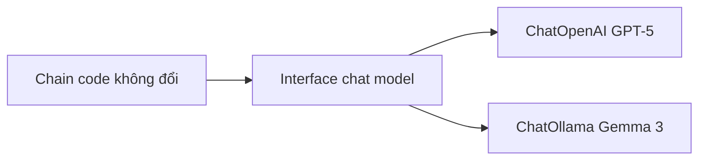

# 🦙 Chạy model "open-weights" trên máy với Ollama: Đổi LLM dễ như thay tất!

> Nguồn: `011-Using-Local-Open-Weights-Models-with-LangChain-and-Ollama.txt` · [Udemy](https://ua.udemy.com/course/langchain/learn/lecture/52016041)

Chào các bạn, Eden đây! Hôm nay chúng ta sẽ "đổi gió": rời **OpenAI GPT-5** để chạy **Gemma 3 của Google** — một **open-weights model** — ngay trên máy của bạn bằng **Ollama**.

Đây là một trong những điểm mạnh nhất của LangChain, và cũng là lý do nó nổi tiếng: khả năng **hoán đổi LLM linh hoạt**. Cùng xem mình làm nhé!

---

### 🔄 Đổi LLM như... đổi tất

Mình hay nói vui rằng: **với LangChain, ta đổi LLM như đổi tất**. Quy trình đơn giản đến mức chỉ gói gọn trong **một dòng code** — bạn chỉ cần khởi tạo client tương ứng với model muốn dùng.

Điều tuyệt vời nhất là **toàn bộ phần còn lại của code giữ nguyên interface**. Bạn không phải viết lại logic, chỉ thay đúng "đầu vào model".

Bên cạnh việc chạy model local, bạn cũng có thể dùng các **cloud provider như Groq** để truy cập những model tương tự từ cloud — chỉ cần tạo API key và khởi tạo client tương ứng.

Sức mạnh "đổi tất" nằm ở interface chung giữa các model:



---

### 🖥️ Cài Ollama và tải model về máy

Trước khi đổi code, ta cần cài **Ollama** và tải **Gemma 3** về máy:

1. Vào trang Ollama, bấm **Download** và chọn đúng hệ điều hành của bạn (mình dùng macOS; nếu bạn dùng Windows, chỉ cần chạy installation wizard và làm theo hướng dẫn).
2. Mở terminal, gõ `ollama` để xem CLI cùng các command khả dụng.
3. **`ollama pull <tên đầy đủ của model>`** để tải model về máy.
4. **`ollama list`** để xem danh sách model đã tải.
5. **`ollama run <tên model>`** để mở một instance CLI và trò chuyện trực tiếp với model.

Trong trang model của Ollama, bạn sẽ thấy từng biến thể với **kích thước và số tham số** khác nhau. Ví dụ **GPT-OSS** là một model rất tốt, quá đủ cho khóa học, hỗ trợ **function calling** và các tác vụ **agentic**. *Nhưng kích thước của nó quá lớn — không vừa máy của mình!*

Vì vậy mình chuyển sang **Gemma 3**, vốn có nhiều biến thể nhẹ hơn để lựa chọn. Cho bản demo này, mình chọn bản **270 triệu tham số** — nhẹ và nhanh nhất. Sau khi pull xong, mình thử `ollama run` và gõ "Hello" — model trả lời ngay: "Hello how can I help you today".

---

### 🐍 Cắm model local vào LangChain

Giờ đến phần thú vị: dùng **LangChain Ollama integration** để đưa model local này vào code. Mình thay biến `llm` bằng:

```python
from langchain_ollama import ChatOllama

llm = ChatOllama(temperature=0, model="gemma3:270m")
```

Object này thuộc class **`ChatOllama`**, với `temperature=0` và model chính là Gemma 3 bản 270 triệu tham số đã nằm trong máy. Phần import cũng rất gọn — package `langchain-ollama` đã được cài từ trước.

Chạy lại code với breakpoint cũ, ta xem được `response` mới.

---

### ⚖️ Kết quả và "cái giá" của model nhẹ

Điểm cộng đầu tiên: **cực kỳ nhanh**, vì model chạy local và lại siêu nhẹ.

Nhưng kết quả cũng cho thấy vấn đề:

* Ta vẫn có **bản tóm tắt về Elon Musk**.
* Tuy nhiên **không có phần riêng về các sự thật thú vị** — model đã **không tuân thủ đầy đủ** yêu cầu trong prompt.

| Tiêu chí | GPT-5 qua API | Gemma 3 270M chạy local |
|---|---|---|
| Nơi chạy | Cloud của OpenAI | Máy của bạn qua Ollama |
| Chi phí | Trả tiền theo API call | Miễn phí |
| Tốc độ | Chậm hơn | Cực kỳ nhanh |
| Tuân thủ prompt | Tốt | Có thể bỏ sót yêu cầu |

Đây chính là **trade-off** của các open-weights model nhẹ: nhanh hơn, rẻ hơn, nhưng **chất lượng câu trả lời thường thấp hơn các first-tier model**.

Vậy nên nếu bạn muốn dùng open-weights model cho khóa học này, mình **khuyên dùng GPT-OSS**: model này có **khả năng suy luận sâu (deep reasoning)**, hỗ trợ **function calling** và rất phù hợp với các workload agentic mà chúng ta sắp triển khai.

---

### 🎯 Tự kiểm tra nhanh

**Câu 1:** Vì sao nói LangChain cho phép "đổi LLM như đổi tất"?

<details>
<summary><b>Xem đáp án</b></summary>

**Đáp án:** Vì chỉ cần khởi tạo client tương ứng với model muốn dùng trong một dòng code, toàn bộ phần còn lại giữ nguyên interface.

Giải thích: Bạn không phải viết lại logic, chỉ thay "đầu vào model".

Tham chiếu: Mục Đổi LLM như... đổi tất.

</details>

**Câu 2:** Ba lệnh Ollama quan trọng để quản lý model là gì?

<details>
<summary><b>Xem đáp án</b></summary>

**Đáp án:** `ollama pull` để tải model, `ollama list` để xem danh sách đã tải và `ollama run` để trò chuyện trực tiếp.

Giải thích: Ngoài ra gõ `ollama` để xem CLI cùng các command khả dụng.

Tham chiếu: Mục Cài Ollama và tải model về máy.

</details>

**Câu 3:** Vì sao Eden chọn Gemma 3 270M cho bản demo?

<details>
<summary><b>Xem đáp án</b></summary>

**Đáp án:** Vì GPT-OSS quá lớn, không vừa máy; Gemma 3 có nhiều biến thể nhẹ hơn và bản 270 triệu tham số là nhẹ, nhanh nhất.

Giải thích: GPT-OSS vẫn là model rất tốt, hỗ trợ function calling và tác vụ agentic.

Tham chiếu: Mục Cài Ollama và tải model về máy.

</details>

**Câu 4:** Kết quả của Gemma 3 thiếu gì so với yêu cầu trong prompt?

<details>
<summary><b>Xem đáp án</b></summary>

**Đáp án:** Thiếu phần riêng về các sự thật thú vị — model không tuân thủ đầy đủ yêu cầu.

Giải thích: Đây là trade-off của open-weights model nhẹ: nhanh, rẻ nhưng chất lượng thường thấp hơn first-tier model.

Tham chiếu: Mục Kết quả và "cái giá" của model nhẹ.

</details>

**Câu 5:** Nếu muốn dùng open-weights model cho khóa học, Eden khuyên chọn gì?

<details>
<summary><b>Xem đáp án</b></summary>

**Đáp án:** GPT-OSS — vì có khả năng suy luận sâu (deep reasoning), hỗ trợ function calling và phù hợp với workload agentic.

Giải thích: Đây là lựa chọn cân bằng hơn so với các model quá nhẹ.

Tham chiếu: Mục Kết quả và "cái giá" của model nhẹ.

</details>

Chỉ với một dòng code, chúng ta đã thay "trái tim" của ứng dụng. Ở bài tiếp theo, mình sẽ tích hợp **LangSmith** để trace toàn bộ hành trình của chain — hẹn gặp lại nhé! 🚀

## Nguồn tham khảo

- [Udemy — Using Local Open-Weights Models with LangChain and Ollama](https://ua.udemy.com/course/langchain/learn/lecture/52016041)
- [Ollama](https://ollama.com)
- [Ollama Library — Gemma 3](https://ollama.com/library/gemma3)
- [LangChain Docs — ChatOllama Integration](https://docs.langchain.com/oss/python/integrations/chat/ollama)