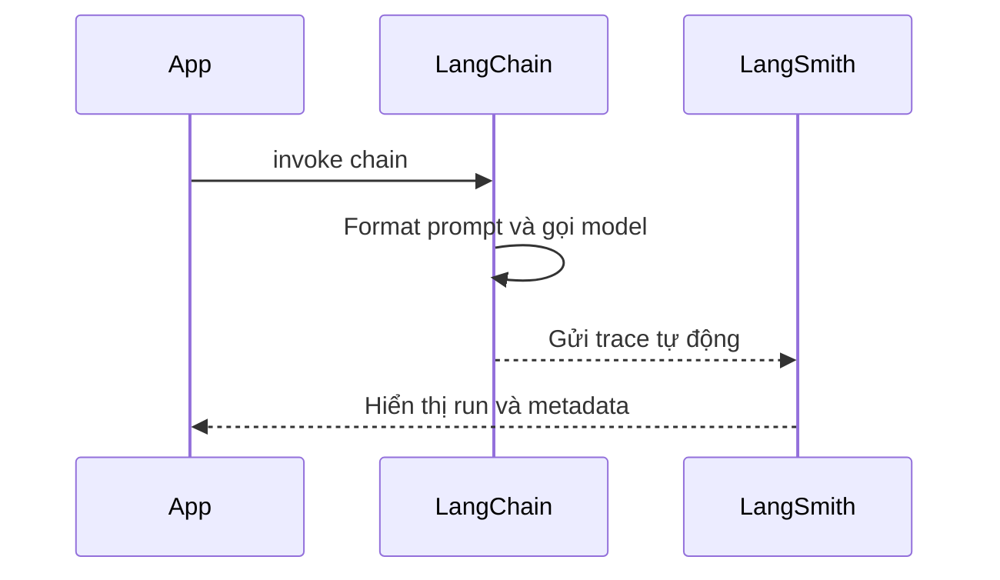

# 🛰️ Tích hợp LangSmith: Nhìn xuyên suốt mọi bước chạy của chain

> Nguồn: `012-Integrating-LangSmith-for-LangChain-Application-Tracing.txt` · [Udemy](https://ua.udemy.com/course/langchain/learn/lecture/52016043)

Chào các bạn, Eden đây! Ứng dụng của chúng ta đã chạy, đã biết đổi model — nhưng làm sao để **nhìn thấy toàn bộ những gì diễn ra bên trong** mỗi lần chain thực thi? Câu trả lời là **LangSmith tracing**.

Trong bài này, chúng ta sẽ cấu hình LangSmith và xem lại trace của những chain đã gọi.

---

### 🧭 Bắt đầu với LangSmith

Mình vào trang **LangSmith** và đăng ký tài khoản — thủ tục **rất, rất đơn giản**. Có thể bạn sẽ cần nhập thẻ tín dụng, nhưng bù lại bạn được dùng **free tier khá hào phóng** — quá đủ cho khóa học này.

Trong dashboard, có nút **"Set up tracing"**. Các bước hiện ra khá trực quan:

1. **Cài LangChain** — chúng ta đã có sẵn.
2. **Tạo API key** — bấm nút để generate.
3. **Thiết lập các biến môi trường**.

---

### ⚙️ Cấu hình biến môi trường

Đây là phần quan trọng nhất. Ta cần set những biến sau:

* **`LANGSMITH_TRACING`** — đặt thành `true` để bật tracing.
* **`LANGSMITH_ENDPOINT`** — biến endpoint, mặc định trỏ tới **endpoint US**. Nếu bạn ở Mỹ (như mình trong video này) thì **không cần set**. Nhưng nếu bạn ở **ngoài nước Mỹ**, bắt buộc phải set biến này để trỏ sang **region EU** — cùng URL nhưng thêm tiền tố `eu` ở đầu.
* **`LANGSMITH_API_KEY`** — API key vừa generate.
* **`LANGSMITH_PROJECT`** — tên project, một chuỗi do bạn tự đặt; nó sẽ chứa toàn bộ trace của bạn trên nền tảng LangSmith. Ở đây mình đặt là **Hello World**.

Tóm gọn bốn biến cần nhớ:

| Biến môi trường | Giá trị | Vai trò |
|---|---|---|
| `LANGSMITH_TRACING` | `true` | Bật tracing |
| `LANGSMITH_ENDPOINT` | Endpoint region EU nếu ở ngoài nước Mỹ | Tránh lỗi authentication |
| `LANGSMITH_API_KEY` | API key vừa generate | Xác thực với LangSmith |
| `LANGSMITH_PROJECT` | Tên project, ví dụ Hello World | Chứa toàn bộ trace của bạn |

*Lưu ý cực kỳ quan trọng:* nếu bạn ở ngoài nước Mỹ mà **không set biến endpoint**, bạn sẽ gặp **lỗi authentication** khi LangChain cố gắng trace ứng dụng. Đừng bỏ qua bước nhỏ này nhé!

Mình mở file `.env`, dán các giá trị vào. Một chi tiết nhỏ: giá trị `true` **không cần dấu ngoặc kép** vẫn hoạt động tốt. *API key của mình sẽ được thu hồi ngay sau khi quay xong video, các bạn cứ yên tâm.*

Và thế là xong toàn bộ phần tích hợp LangSmith! Từ giờ, mỗi khi chạy chain, mọi thứ sẽ được **trace tự động, out of the box** — bạn vẫn dùng các object LangChain quen thuộc như bình thường.

---

### 🔍 Đọc một trace chạy

Mình chạy lại `main.py` ở chế độ debug, rồi quay sang LangSmith và refresh trang. Kết quả:

* Project mới **hello world** đã xuất hiện.
* Bên trong là một **runnable sequence** — chính là lần thực thi của chain.

Bấm vào, ta thấy:

* **Lệnh gọi tới ChatOllama với Gemma 3**.
* **Input** là một **human message**.
* **Output** là một **AI message**.
* Cột bên phải hiển thị: **start time**, **end time**, **thời gian để lấy được token đầu tiên** (cực kỳ quan trọng với một số ứng dụng), **status** (request thành công hay không) và **tổng số token đã dùng** trong chain.

Bạn cũng có thể **tùy biến trace** bằng cách thêm **tags** để filter về sau.

Một điểm mình muốn các bạn chú ý: trace hiển thị rõ **các object LangChain**. Runnable sequence này gồm **prompt template** chạy trước để format string, rồi lấy **prompt value** đầu ra "cắm" vào chat model và gửi đi — đúng như những gì chúng ta đã học ở các bài trước.

Dòng chảy của một lần trace diễn ra như sau:

---

### 📊 So sánh các lần chạy và tận dụng bộ lọc

Giờ mình muốn so sánh với GPT-5. Trong code, mình **comment dòng Ollama** và **bỏ comment dòng GPT-5** đã viết trước đó, rồi chạy trực tiếp file Python. GPT-5 chạy lâu hơn nên mình tua nhanh.

Khi có kết quả, refresh LangSmith:

* Lần chạy thứ hai này mất **16 giây**.
* Phía bên trái hiển thị rõ đây là **GPT-5**.

Quay lại view tổng của tất cả các trace, bạn có thể:

* **Filter** để chỉ xem các lần gọi (runs).
* **Filter theo tag**.
* Xem các **thống kê** như **error rate**, **median tokens**, **P90**, **P50**.

Thật lòng mà nói, mình nghĩ **LangSmith là một trong những nền tảng tracing tốt nhất — nếu không muốn nói là tốt nhất — cho các ứng dụng dựa trên LLM**. Giá trị của nó sẽ còn thể hiện rõ hơn khi chúng ta implement **agents**: lúc đó, việc kiểm tra execution của agent sẽ trở nên cực kỳ tiện lợi và tự nhiên.

Cuối cùng, các trace có thể được **chia sẻ công khai** — tạo thành một **link shareable**. Mình sẽ để link trong Resources của video.

Về phần code: mình chạy `git status` để xem các file thay đổi, `git add main.py`, tạo commit mới với tên **hello world chain** và push lên repo. Vào branch **project/hello world**, xem commit list — bạn sẽ thấy toàn bộ code của bài này. Link trực tiếp có trong Resources nhé.

---

### 🎯 Tự kiểm tra nhanh

**Câu 1:** Biến môi trường nào dùng để bật tracing?

<b>Xem đáp án</b>

**Đáp án:** `LANGSMITH_TRACING`, đặt thành `true`.

Giải thích: Giá trị `true` không cần dấu ngoặc kép vẫn hoạt động tốt.

Tham chiếu: Mục Cấu hình biến môi trường.

**Câu 2:** Người ở ngoài nước Mỹ cần lưu ý điều gì với `LANGSMITH_ENDPOINT`?

<b>Xem đáp án</b>

**Đáp án:** Bắt buộc phải set biến này để trỏ sang region EU — cùng URL nhưng thêm tiền tố `eu` ở đầu.

Giải thích: Nếu không set, bạn sẽ gặp lỗi authentication khi LangChain cố trace ứng dụng.

Tham chiếu: Mục Cấu hình biến môi trường.

**Câu 3:** `LANGSMITH_PROJECT` dùng để làm gì?

<b>Xem đáp án</b>

**Đáp án:** Đặt tên project — một chuỗi do bạn tự chọn — nơi chứa toàn bộ trace của bạn trên nền tảng LangSmith.

Giải thích: Trong video, Eden đặt tên project là Hello World.

Tham chiếu: Mục Cấu hình biến môi trường.

**Câu 4:** Một trace trên LangSmith hiển thị những thông tin nào?

<b>Xem đáp án</b>

**Đáp án:** Runnable sequence, lệnh gọi model, input/output message, start time, end time, thời gian lấy token đầu tiên, status và tổng số token.

Giải thích: Bạn cũng có thể tùy biến trace bằng tags để filter về sau.

Tham chiếu: Mục Đọc một trace chạy.

**Câu 5:** Eden so sánh các lần chạy GPT-5 và Ollama như thế nào?

<b>Xem đáp án</b>

**Đáp án:** Comment dòng Ollama, bỏ comment dòng GPT-5 rồi chạy lại; trace cho thấy lần chạy GPT-5 mất 16 giây, có thể filter và xem thống kê như error rate, median tokens, P90, P50.

Giải thích: Đây là lý do LangSmith được đánh giá là nền tảng tracing tốt nhất cho ứng dụng LLM.

Tham chiếu: Mục So sánh các lần chạy và tận dụng bộ lọc.

LangSmith sẽ là người bạn đồng hành đắc lực của bạn từ giờ. Hẹn gặp lại ở bài tiếp theo! 🚀

## Nguồn tham khảo

- [Udemy — Integrating LangSmith for LangChain Application Tracing](https://ua.udemy.com/course/langchain/learn/lecture/52016043)
- [LangSmith Docs](https://docs.langchain.com/langsmith)
