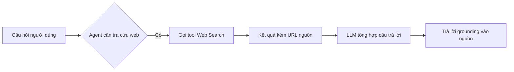

# 🔍 Chúng ta sẽ xây gì? AI Job Search Agent biết tự tìm việc

> Nguồn: `015-What-are-we-building-AI-Job-Search-Agent.txt` · [Udemy](https://ua.udemy.com/course/langchain/learn/lecture/52107225)

Chào các bạn, lại là Eden đây! 👋 Trong bài này, mình sẽ cho các bạn xem trước "thành phẩm" mà chúng ta sẽ cùng nhau xây dựng trong section này: một **search agent (agent có khả năng tìm kiếm)**.

Hãy bắt đầu bằng một demo nhanh để mục tiêu của chúng ta rõ ràng hơn nhé.

---

### 💻 Demo: nhờ ChatGPT tìm việc trên LinkedIn

Mình đang ở trong ChatGPT, bấm nút dấu cộng và chọn **Web Search** — tức là trao cho ChatGPT khả năng tìm kiếm trên web. Khi câu hỏi cần tra cứu, nó sẽ dùng tool này, lấy kết quả về, "nhai" lại rồi trả lời dựa trên chính kết quả đó.

Mình thử một câu lệnh: **"Search for three job postings for an AI engineer using LinkedIn in the Bay area and list their details."** Các bạn có thể thấy nó bắt đầu tìm kiếm, hiện lên các biểu tượng LinkedIn — đây là ví dụ của **generative UI (giao diện sinh động theo hành động của agent)**, một chủ đề chúng ta cũng sẽ bàn trong khóa học. Ứng dụng đang "phản chiếu" những gì agent đang làm.

Kết quả trả về gồm:

* Từng vị trí tuyển dụng kèm **URL nguồn** để bạn kiểm chứng.
* Một vị trí AI engineer đang tuyển, một vị trí làm về **LangChain** và **RAG**, và một vị trí **Generative AI Software Engineer**.
* Phần tóm tắt và các bước tiếp theo ở cuối câu trả lời.

---

### 🧾 Vì sao "nguồn" lại quan trọng đến vậy?

Điểm mình muốn các bạn ghi nhớ: mỗi câu trả lời đều đi kèm **source (nguồn)**. Chính sự **grounding (neo câu trả lời vào nguồn)** này tạo nên **niềm tin** giữa người dùng và hệ thống.

Lý do rất thực tế: nếu chỉ nhận về đáp án khô khan, chúng ta không thể tự quyết định xem nó có đáng tin hay không. Trong khi đó, LLM có thể **hallucinate (tạo thông tin sai lệch)** và sinh ra đủ thứ "rác". Nhờ có URL nguồn, chúng ta có thể mở ra kiểm chứng, đối chiếu, và tự đánh giá độ tin cậy của từng nguồn.

---

### 🌐 Vì sao LLM cần search?

Các bạn cần nhớ một điều cốt lõi: **bản thân LLM chỉ là text in, text out**. Nếu là model đa phương thức (multimodal), nó có thể nhận thêm ảnh, video, âm thanh và sinh ra chúng — nhưng nó **không có thông tin thời gian thực**.

Lý do: LLM được huấn luyện trên một "kho" dữ liệu khổng lồ, nên kiến thức của nó **đóng băng tại một thời điểm**. Nó cũng **không có quyền truy cập internet**. Muốn cho nó "ra ngoài" tra cứu, chúng ta phải cung cấp **tools** — và đó chính là việc chúng ta sẽ làm trong section này.

*Nếu bạn muốn đào sâu hơn về chủ đề này, cứ ghé phần lý thuyết của khóa học nhé — mình đã bàn kỹ ở đó.*

---

### 🚀 Kế hoạch của section này

Một câu chuyện thú vị: khi mình làm khóa học này vào khoảng năm 2022, ChatGPT và các ứng dụng chat khác **chưa có tìm kiếm tích hợp**. Còn ngày nay, hầu hết đều có sẵn và nó trở thành tiêu chuẩn. Thật hay khi nhìn lại sự tiến hóa đó!

### 🎯 Tự kiểm tra nhanh

**Câu 1:** Vì sao "nguồn" (source) lại quan trọng trong câu trả lời của agent?

<b>Xem đáp án</b>

**Đáp án:** Vì grounding vào nguồn tạo niềm tin, và URL cho phép người dùng mở ra kiểm chứng, đối chiếu thông tin.

Giải thích: LLM có thể hallucinate, nên nếu chỉ có đáp án khô khan thì ta không thể tự đánh giá độ tin cậy.

Tham chiếu: Mục Vì sao "nguồn" lại quan trọng.

**Câu 2:** Vì sao bản thân LLM không thể trả lời câu hỏi cần thông tin mới?

<b>Xem đáp án</b>

**Đáp án:** Vì kiến thức của nó đóng băng tại thời điểm huấn luyện và nó không có quyền truy cập internet.

Giải thích: LLM chỉ là text in, text out; muốn tra cứu thời gian thực thì phải cấp tools cho nó.

Tham chiếu: Mục Vì sao LLM cần search.

**Câu 3:** Generative UI trong demo là gì?

<b>Xem đáp án</b>

**Đáp án:** Giao diện sinh động phản chiếu những gì agent đang làm — ví dụ các biểu tượng LinkedIn hiện lên khi nó tìm kiếm.

Giải thích: Ứng dụng "phản chiếu" hành động của agent để người dùng thấy nó đang làm gì.

Tham chiếu: Mục Demo.

**Câu 4:** Kết quả ChatGPT trả về trong demo gồm những gì?

<b>Xem đáp án</b>

**Đáp án:** Từng vị trí tuyển dụng kèm URL nguồn, gồm một vị trí AI engineer, một vị trí về LangChain và RAG, một vị trí Generative AI Software Engineer, cùng phần tóm tắt và bước tiếp theo.

Giải thích: Mỗi câu trả lời đều đi kèm source để đảm bảo grounding.

Tham chiếu: Mục Demo.

**Câu 5:** Section này sẽ hiện thực điều gì bằng LangChain?

<b>Xem đáp án</b>

**Đáp án:** Một search engine cho LLM, có khả năng tìm kiếm giống hệt demo.

Giải thích: Đây là bước đầu để agent tự tìm kiếm thông tin thực tế trên web.

Tham chiếu: Mục Kế hoạch của section này.

Trong section này, chúng ta sẽ dùng **LangChain** để hiện thực một search engine cho LLM — **có khả năng tìm kiếm y hệt những gì bạn vừa xem trong demo**. Hẹn gặp các bạn ở bài tiếp theo! 🚀

## Nguồn tham khảo

- [Udemy — What are we building - AI Job Search Agent](https://ua.udemy.com/course/langchain/learn/lecture/52107225)
- [LangChain Docs — Agents](https://docs.langchain.com/oss/python/langchain/agents)
