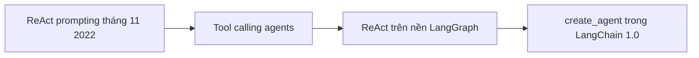

# 🧬 Lịch sử tiến hóa của LangChain ReAct Agents (và vì sao chúng ta phải quay về gốc)

> Nguồn: `016-The-Evolution-of-LangChain-ReAct-Agents.txt` · [Udemy](https://ua.udemy.com/course/langchain/learn/lecture/53365481)

Chào mọi người, Eden đây! Trong bài này, mình muốn kể cho các bạn nghe câu chuyện **tiến hóa của ReAct Agent trong LangChain** — từ thuở sơ khai đến kiến trúc hiện đại ngày nay.

Hiểu được các "phiên bản" của agent và lý do chúng ra đời sẽ giúp bạn có **trực giác cực tốt khi xây agent cho môi trường production**. Nào, cùng nhìn lại từng cột mốc.

---

### 🕰️ Khởi đầu: ReAct prompting thuần túy

Pattern ReAct ra mắt trong LangChain từ **tháng 11 năm 2022**. Thuở ban đầu, LangChain ReAct agent **chỉ dựa vào ReAct prompting**: model suy luận về các action và observation hoàn toàn dưới dạng **văn bản**.

Nói cách khác, LLM tự "kể" ra mình muốn gọi tool nào, và framework phải đọc hiểu đoạn văn bản đó để làm theo. Cách này hoạt động được, nhưng độ tin cậy và hiệu quả chưa cao.

---

### 🔧 Bước tiến: Tool calling agents

Khi bức tranh LLM thay đổi với **native function calling (gọi hàm gốc)** — khả năng trả về lời gọi hàm có cấu trúc thay vì chỉ text — kiến trúc agent chuyển mình thành **tool calling agents**.

Thay vì "đoán ý" qua prompt, agent dùng **structured function calling (gọi hàm có cấu trúc)**. Nhờ đó, việc thực thi tool trở nên **đáng tin cậy và hiệu quả hơn** rất nhiều.

| Tiêu chí | ReAct prompting | Tool calling agents |
|---|---|---|
| Cách LLM báo gọi tool | Viết ra trong văn bản, framework phải đọc hiểu | Trả về lời gọi hàm có cấu trúc |
| Độ tin cậy | Chưa cao | Cao hơn hẳn |
| Hiệu quả | Chưa cao | Hiệu quả hơn nhiều |

---

### 🏗️ Cú nhảy vọt: ReAct trên nền LangGraph

Bước tiến lớn tiếp theo diễn ra khi LangChain **giữ nguyên function calling** nhưng xây lại agent **trên nền tảng orchestration cấp thấp của LangGraph**. Bản nâng cấp này mang lại:

* **Durable execution (thực thi bền bỉ, không mất tiến trình).**
* **Persistence (lưu trữ trạng thái).**
* **Fine-grained control (kiểm soát chi tiết)** — thứ mà mọi ứng dụng **production-grade (chuẩn môi trường thực tế)** đều cần.

Nhớ nhé: đây không chỉ là chuyện "dùng được", mà là chuyện chạy nghiêm túc trong môi trường thật.

---

### ✨ Hiện đại: create_agent trong LangChain v1.0

Ở **LangChain phiên bản 1.0**, framework giới thiệu hàm **`create_agent`** — giao diện cấp cao, gọn gàng, nhưng bên dưới là một **LangGraph ReAct agent đã được kiểm chứng qua thực chiến**.

Điểm đặc biệt trong khóa học này: chúng ta sẽ đi qua **từng phiên bản agent** đó, không bỏ sót bước nào:

1. Bắt đầu từ **`create_agent`** — cái mới nhất và "ngon" nhất.
2. Quay ngược về **bản ReAct "OG"** nguyên bản.
3. Rồi **từng bước xây dựng ngược lên** kiến trúc agent v1 hiện đại.

Cách học này giúp bạn hiểu **không chỉ cách dùng agent, mà cả cách chúng vận hành bên dưới**, mỗi phiên bản cải thiện điều gì — từ đó có trực giác cực mạnh khi tự tay làm agent cho môi trường thật. Và điều duy nhất bạn cần nhớ từ bài này: **chúng ta sẽ lần lượt đi qua các phiên bản agent, cho đến khi chạm tới bản agent cuối cùng — robust (vững chắc) và sẵn sàng cho production.**

*Đừng lo nếu bạn thấy các khái niệm như tool calling hay LangGraph còn lạ lẫm — chúng ta sẽ có rất nhiều thời gian để đi thật sâu vào từng chủ đề.*

### 🎯 Tự kiểm tra nhanh

**Câu 1:** ReAct prompting xuất hiện trong LangChain từ khi nào?

<b>Xem đáp án</b>

**Đáp án:** Tháng 11 năm 2022.

Giải thích: Thuở đầu, agent chỉ dựa vào ReAct prompting, model suy luận ra action và observation dưới dạng văn bản.

Tham chiếu: Mục Khởi đầu.

**Câu 2:** Vì sao kiến trúc chuyển sang tool calling agents?

<b>Xem đáp án</b>

**Đáp án:** Nhờ native function calling, LLM trả về lời gọi hàm có cấu trúc thay vì text, giúp thực thi tool đáng tin cậy và hiệu quả hơn.

Giải thích: Framework không còn phải "đoán ý" bằng cách đọc hiểu văn bản.

Tham chiếu: Mục Bước tiến.

**Câu 3:** Việc xây ReAct agent trên nền LangGraph mang lại ba lợi ích gì?

<b>Xem đáp án</b>

**Đáp án:** Durable execution, persistence và fine-grained control.

Giải thích: Đây là những thứ ứng dụng production-grade cần, không chỉ là "dùng được".

Tham chiếu: Mục Cú nhảy vọt.

**Câu 4:** `create_agent` trong LangChain 1.0 thực chất là gì?

<b>Xem đáp án</b>

**Đáp án:** Giao diện cấp cao, gọn gàng, bọc bên ngoài một LangGraph ReAct agent đã được kiểm chứng qua thực chiến.

Giải thích: Đây là cái mới nhất và "ngon" nhất mà khóa học bắt đầu.

Tham chiếu: Mục Hiện đại.

**Câu 5:** Lộ trình học agent trong khóa này diễn ra thế nào?

<b>Xem đáp án</b>

**Đáp án:** Bắt đầu từ `create_agent`, quay ngược về bản ReAct "OG", rồi từng bước xây dựng ngược lên kiến trúc agent v1 hiện đại.

Giải thích: Cách này giúp hiểu cả cách dùng lẫn cách agent vận hành bên dưới.

Tham chiếu: Mục Hiện đại.

Trong section này, mình chọn cách dạy **chỉ tập trung vào giao diện (interface)**: cách tạo và bắt đầu thật nhanh với `create_agent`. Những section sau sẽ bóc từng lớp để trả lời câu hỏi: **"ma thuật" của agent nằm ở đâu, và nó diễn ra như thế nào?** Mình hứa đấy, sẽ rất hay! 😉🚀

## Nguồn tham khảo

- [Udemy — The Evolution of LangChain ReAct Agents](https://ua.udemy.com/course/langchain/learn/lecture/53365481)
- [LangChain Docs — Agents](https://docs.langchain.com/oss/python/langchain/agents)
- [LangGraph Overview](https://docs.langchain.com/oss/python/langgraph/overview)
