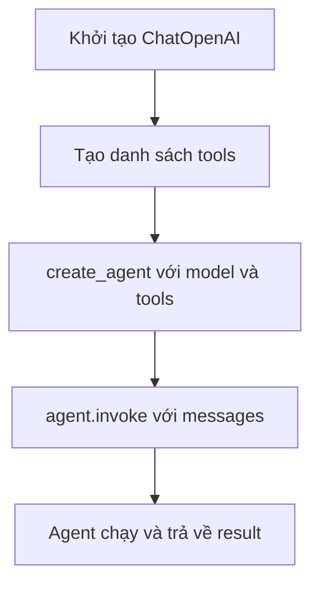

# 🧰 Tạo LangChain Agent đầu tiên: Tools, LLM và lần invoke "thần thánh"

> Nguồn: `018-Creating-Your-First-LangChain-Agent-Tools-and-LLMs.txt` · [Udemy](https://ua.udemy.com/course/langchain/learn/lecture/53365485)

Chào các bạn, Eden đây! Đây là bài mà chúng ta sẽ **chạm tay vào agent thật**: tạo một agent bằng hàm `create_agent`, gắn tool và chạy thử câu hỏi đầu tiên.

Trước khi bấm chạy, mình muốn làm rõ vài khái niệm nền tảng — vì hiểu đúng ngay từ đầu sẽ giúp bạn đi nhanh hơn rất nhiều về sau.

---

### 🧩 Một agent cần tối thiểu hai thứ

Để tạo agent, chúng ta cần import **`create_agent`** từ **LangChain**, cùng với:

1. **Tools** — công cụ mà agent có thể thực thi.
2. **Một LLM** — đóng vai trò **reasoning engine (động cơ lý luận)**.

Ngoài ra mình import thêm **`HumanMessage`** từ `langchain-core` để làm **input cho agent execution (đầu vào cho quá trình chạy agent)**, và **`ChatOpenAI`** để cung cấp LLM cho agent.

---

### 🔨 Tool là gì, và vì sao nó "dễ" đến vậy?

**Tool là một hàm mà agent có thể thực thi** — hàm gì cũng được, bạn tự viết phần thân hàm. Nghĩa là agent có thể làm mọi việc bạn muốn: gọi API, tìm trong database, chạy code... tự do hoàn toàn.

Cách tạo một tool rất đơn giản:

1. Viết một hàm Python **bình thường**, có **type hints** cho tham số.
2. Viết **docstring** mô tả hàm làm gì, nhận tham số gì, trả về gì.
3. Trang trí hàm bằng **decorator `@tool`** của LangChain — hàm Python bình thường biến thành **LangChain Tool**, sẵn sàng cắm vào agent.

| Tiêu chí | Hàm Python thường | LangChain Tool |
|---|---|---|
| Cách định nghĩa | Hàm + type hints + docstring | Thêm decorator `@tool` lên trên |
| LLM có nhìn thấy không | Không — chỉ là code Python | Có — kèm name, description và schema |
| Vai trò | Logic xử lý thuần túy | Cùng logic đó, sẵn sàng cắm vào agent |

*Điều mình cần nhấn mạnh:* **type hints và docstring cực kỳ quan trọng**. Bên dưới lớp vỏ, chính mô tả và kiểu tham số này là căn cứ để LLM **quyết định có gọi tool hay không, và gọi với tham số nào**. Các model xịn ngày nay làm việc này qua cơ chế **function calling** — tức LLM không chỉ trả về text/ảnh/video, mà có thể trả về một **lời gọi hàm có cấu trúc**. Trong khóa học mình sẽ mổ xẻ rất nhiều về nó; còn hôm nay hãy tạm xem nó như một hộp đen đã.

Quy tắc vàng khi viết mô tả tool: **càng rõ ràng, càng ít mập mờ (unambiguous) càng tốt**, để LLM dễ dàng quyết định.

---

### 🔍 Viết tool search đầu tiên (bản "giả")

Agent của chúng ta là **search agent**, nên tool là một hàm **`search(query)`**: nhận câu truy vấn, "tìm" trên internet, rồi trả kết quả về.

Trong video, mình cố tình viết phần thân hàm siêu đơn giản:

* **In ra** giá trị `query` để xem agent truyền gì vào.
* **Trả về** chuỗi tĩnh: **"Tokyo weather is sunny right now."**

Đúng vậy, hàm này **chưa hề tìm kiếm gì cả** — nó chỉ trả về một câu cố định. Mình làm vậy để bạn thấy rõ luồng chạy trước, còn bản hiện thực thật sẽ có ngay sau đó. Docstring thì mình mô tả đơn giản: đây là tool tìm kiếm trên internet, tham số là `query`, trả về kết quả tìm kiếm.

---

### 🤖 Tạo agent và invoke

Các bước lắp ráp:

1. Khởi tạo **`ChatOpenAI`**.
2. Tạo **list tools** — ở đây chỉ gồm một phần tử là `search` tool.
3. Tạo biến **`agent`** bằng `create_agent`, truyền vào **model** và **danh sách tools**. Chỉ vậy là xong — agent đã sẵn sàng!

Điểm hay: agent trả về là một **Runnable**, nên ta gọi **`agent.invoke(...)`**. Đối số cần là một dictionary có **key `messages`** — danh sách message, ở đây là câu hỏi của người dùng: *"What's the weather in Tokyo?"*

Một chi tiết nhỏ thú vị: bạn có thể truyền **một HumanMessage đơn lẻ** thay vì cả list, và LangChain sẽ tự **cast** nó thành list một phần tử. Vẫn chạy ngon lành!

### 🎯 Tự kiểm tra nhanh

**Câu 1:** Một agent cần tối thiểu hai thứ gì?

<b>Xem đáp án</b>

**Đáp án:** Tools và một LLM đóng vai trò reasoning engine.

Giải thích: `create_agent` cần model để suy luận và danh sách tools để thực thi.

Tham chiếu: Mục Một agent cần tối thiểu hai thứ.

**Câu 2:** Vì sao type hints và docstring của tool cực kỳ quan trọng?

<b>Xem đáp án</b>

**Đáp án:** Vì chúng là căn cứ để LLM quyết định có gọi tool hay không và gọi với tham số nào.

Giải thích: Mô tả càng rõ ràng, ít mập mờ thì LLM càng dễ quyết định đúng.

Tham chiếu: Mục Tool là gì.

**Câu 3:** Function calling là gì?

<b>Xem đáp án</b>

**Đáp án:** Cơ chế để LLM trả về một lời gọi hàm có cấu trúc, thay vì chỉ text, ảnh hay video.

Giải thích: Các model xịn ngày nay dùng function calling để chọn tool; trong khóa sẽ được mổ xẻ kỹ.

Tham chiếu: Mục Tool là gì.

**Câu 4:** Tool search trong video trả về gì, và vì sao lại cố tình "giả"?

<b>Xem đáp án</b>

**Đáp án:** Nó trả về chuỗi tĩnh "Tokyo weather is sunny right now." để ta thấy rõ luồng chạy trước khi hiện thực thật.

Giải thích: Hàm chỉ in ra `query` mà agent truyền vào rồi trả chuỗi cố định, chưa hề tìm kiếm.

Tham chiếu: Mục Viết tool search đầu tiên.

**Câu 5:** `agent.invoke(...)` cần đối số gì?

<b>Xem đáp án</b>

**Đáp án:** Một dictionary với key `messages`; bạn có thể truyền một HumanMessage đơn lẻ và LangChain sẽ tự cast thành list một phần tử.

Giải thích: Agent trả về là một Runnable nên gọi được bằng `invoke`.

Tham chiếu: Mục Tạo agent và invoke.

Cuối cùng, **in `result` ra** để xem agent trả về gì. Chạy thử nào — và hãy xem chúng ta nhận được "mớ" gì trong đó nhé. 😉🚀

## Nguồn tham khảo

- [Udemy — Creating Your First LangChain Agent - Tools and LLMs](https://ua.udemy.com/course/langchain/learn/lecture/53365485)
- [LangChain Docs — Agents](https://docs.langchain.com/oss/python/langchain/agents)
- [LangChain Docs — Tools](https://docs.langchain.com/oss/python/langchain/tools)
