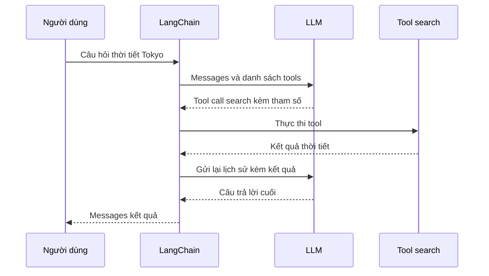

# 🧠 Từ câu hỏi đến câu trả lời: bên trong "cái đầu" của LangChain Agent

> Nguồn: `019-From-Query-to-Answer-How-a-LangChain-Agent-Thinks.txt` · [Udemy](https://ua.udemy.com/course/langchain/learn/lecture/53365487)

Chào các bạn, Eden đây! Ở bài trước agent đã chạy được — nhưng nó **thực sự làm gì** để ra câu trả lời? Bài này chúng ta sẽ mổ xẻ từng bước một.

Chạy lại chương trình, bạn sẽ thấy **print từ bên trong tool** in ra tham số mà agent truyền vào: **"weather in Tokyo"**. Và phần response trả về thì có "một đống" thứ. *Đừng lo — đến cuối khóa bạn sẽ hiểu hết chúng!*

---

### 🔬 Debug mode: đọc cho bằng hết "mớ" response

Mình bật **debug mode** và đặt breakpoint để xem biến `result` cho tử tế. Đây là một **dictionary** với key **`messages`**, gồm:

* **Message đầu tiên** — input của người dùng: HumanMessage chứa *"What is the weather in Tokyo?"*.
* **Message cuối cùng** — câu trả lời: AIMessage nói rằng thời tiết Tokyo hiện đang nắng.
* **Ở giữa** — một AIMessage và một **ToolMessage** (message đại diện cho kết quả thực thi tool): đây chính là **những gì agent đã làm để có được câu trả lời**.

Lúc này mọi thứ trông như ma thuật — nhưng sẽ hết sớm thôi.

---

### 🛰️ Mở trace trên LangSmith: cuộc gọi LLM đầu tiên

Mở **LangSmith**, phần trace của lần chạy này có tiêu đề là **LangGraph** — vì bên dưới, agent được thực thi qua **framework graph**. Đừng lo, khóa học sẽ nói kỹ phần này.

Mở **cuộc gọi đầu tiên**, tên là **ChatOpenAI**. Một chi tiết thú vị: **model mặc định của LangChain** tại thời điểm quay video (7/11/2025) là **GPT-3.5** chứ không phải GPT-5.

Trong trace, bạn thấy:

* **Input của cuộc gọi LLM:** câu hỏi *"What is the weather in Tokyo?"*
* **Thông tin về các tool** mà LLM được phép gọi — mở model ra là thấy toàn bộ metadata của tool chúng ta viết ban đầu.

Để ý cách mình dùng từ nhé: mình nói **"gửi danh sách tools cho LLM"** — chứ không nói "cho agent" — vì đây là **cấp độ LLM call**. Ta trang bị tool cho LLM, và với câu hỏi về thời tiết, nó **quyết định gọi tool search** với tham số `weather in Tokyo`, kèm một **tool call ID**.

Điểm rất quan trọng: **phản hồi của LLM không phải là kết quả của tool** — nó chỉ nói **gọi tool nào, với tham số gì**. Việc đó diễn ra nhờ **function calling**.

---

### ⚡ LangChain thực thi tool, rồi gọi LLM lần hai

Sau khi LLM quyết định, **LangChain đứng ra gọi tool** `search` với tham số `weather in Tokyo`. Kết quả trả về là chuỗi tĩnh **"Tokyo, weather is sunny"** — đúng như hàm Python chúng ta viết.

Rồi LangChain thực hiện **một cuộc gọi LLM nữa**, lần này trong prompt có:

1. Input ban đầu.
2. Quyết định gọi tool của LLM.
3. Kết quả sau khi tool chạy.



Có đầy đủ thông tin, lần này LLM **không gọi tool nữa** mà trả về câu trả lời cuối: **"The weather in Tokyo is currently sunny."**

Và thế là "bó đũa" message trở nên rõ nghĩa:

* **Message 1:** input của người dùng.
* **AIMessage:** quyết định gọi tool cùng tham số.
* **ToolMessage:** cấu trúc dữ liệu đại diện cho kết quả thực thi tool.
* **AIMessage cuối:** câu trả lời tự nhiên vì đã đủ dữ kiện.

| Message | Nội dung | Vai trò |
|---|---|---|
| HumanMessage | Câu hỏi của người dùng | Input ban đầu |
| AIMessage | Quyết định gọi tool và tham số | Reasoning engine phán quyết |
| ToolMessage | Kết quả thực thi tool | Dữ liệu để LLM đọc ở lần gọi sau |
| AIMessage cuối | Câu trả lời tự nhiên | Kết quả trả về cho người dùng |

Đây chính là bức tranh tổng quát: **một reasoning engine quyết định gọi tool gì** + **một agent execution runtime thật sự chạy tool và nhận kết quả**. Hai vai diễn, phối hợp với nhau.

---

### 🔁 Đổi model sang GPT-5

---

### 💻 Code mẫu đầy đủ — `main.py`

Toàn bộ code của bài nằm trong file `main.py` (tham khảo từ repo chính thức của khóa học):

```python
from dotenv import load_dotenv

load_dotenv()
from langchain.agents import create_agent
from langchain.tools import tool
from langchain_core.messages import HumanMessage
from langchain_openai import ChatOpenAI


@tool
def search(query: str) -> str:
    """
    Tool that searches over internet
    Args:
        query: The query to search for
    Returns:
        The search result
    """
    print(f"Searching for {query}")
    return "Tokyo weather is sunny right now."


llm = ChatOpenAI(model="gpt-5")
tools = [search]
agent = create_agent(model=llm, tools=tools)


def main():
    print("Hello from langchain-course!")
    result = agent.invoke(
        {"messages": HumanMessage(content="What's the weather in Tokyo?")}
    )
    print(result)


if __name__ == "__main__":
    main()
```

---

### 🎯 Tự kiểm tra nhanh

**Câu 1:** Vì sao phải gọi LLM tới hai lần cho một câu hỏi?

<details>
<summary><b>Xem đáp án</b></summary>

**Đáp án:** Lần một để LLM quyết định gọi tool nào; sau khi tool chạy, lần hai để LLM trả lời dựa trên đầy đủ dữ kiện.

Giải thích: Ở lần hai, prompt đã có input ban đầu, quyết định gọi tool và kết quả tool.

Tham chiếu: Mục LangChain thực thi tool.

</details>

**Câu 2:** Phản hồi của LLM ở lần gọi đầu tiên chứa gì?

<details>
<summary><b>Xem đáp án</b></summary>

**Đáp án:** Nó chỉ nói gọi tool nào, với tham số gì, kèm một tool call ID — không phải kết quả của tool.

Giải thích: Đây là điểm rất quan trọng, và việc đó diễn ra nhờ function calling.

Tham chiếu: Mục Mở trace trên LangSmith.

</details>

**Câu 3:** Ai là bên thực sự chạy tool?

<details>
<summary><b>Xem đáp án</b></summary>

**Đáp án:** LangChain — agent execution runtime — chứ không phải LLM.

Giải thích: Một reasoning engine quyết định gọi tool, một runtime thực thi và nhận kết quả: hai vai diễn phối hợp.

Tham chiếu: Mục LangChain thực thi tool.

</details>

**Câu 4:** ToolMessage đại diện cho điều gì?

<details>
<summary><b>Xem đáp án</b></summary>

**Đáp án:** Cấu trúc dữ liệu đại diện cho kết quả thực thi tool.

Giải thích: Nó nằm giữa các message và chính là "những gì agent đã làm" để có câu trả lời.

Tham chiếu: Mục Debug mode.

</details>

**Câu 5:** Model mặc định của LangChain tại thời điểm quay video là gì?

<details>
<summary><b>Xem đáp án</b></summary>

**Đáp án:** GPT-3.5 — chứ không phải GPT-5.

Giải thích: Sau đó mình đổi sang GPT-5 và trace mới chỉ khác tên model, chạy chậm hơn một chút.

Tham chiếu: Mục Mở trace trên LangSmith.

</details>

Cuối cùng, mình đổi model thành **GPT-5** và chạy lại. Lần này chậm hơn một chút — vì **GPT-5 chậm hơn GPT-3.5 Turbo**. Trace lần chạy mới gần như y hệt, chỉ khác **tên model**. Và chúng ta sẽ còn "làm dày" con search agent này thêm nữa ở bài sau! 🚀

## Nguồn tham khảo

- [Udemy — From Query to Answer - How a LangChain Agent Thinks](https://ua.udemy.com/course/langchain/learn/lecture/53365487)
- [LangSmith Docs — Observability](https://docs.langchain.com/langsmith/observability)
- [LangChain Docs — Agents](https://docs.langchain.com/oss/python/langchain/agents)
