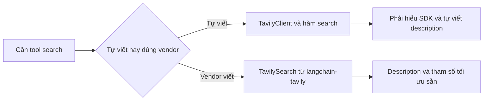

# 🌐 Tích hợp tìm kiếm thực tế với Tavily và LangChain Tools

> Nguồn: `020-Integrating-Real-World-Search-with-Tavily-and-LangChain-Tool.txt` · [Udemy](https://ua.udemy.com/course/langchain/learn/lecture/53365489)

Chào các bạn, Eden đây! Đã đến lúc bỏ cái kết quả "Tokyo weather is sunny" giả lập kia đi và cho agent **tìm kiếm internet thật**.

Bài này có một bài học best-practice rất đáng giá: khi nào nên tự viết tool, khi nào nên dùng tool do nhà cung cấp viết sẵn. Cùng đi từng bước nhé.

---

### 🔌 Tự viết tool với Tavily SDK

Đầu tiên, mình import **`TavilyClient`** từ package **`tavily-python`** và khởi tạo client. Khi khởi tạo, client sẽ tự tìm biến môi trường **`TAVILY_API_KEY`** — đúng cái key chúng ta đã đặt trong file `.env`.

Rồi mình sửa tool search: thay vì trả về chuỗi tĩnh, gọi **`tavily.search(query=query)`** và trả kết quả thật về.

Chạy lại, lần này agent **thật sự tìm kiếm trên web**. Mở **LangSmith** xem trace:

* Phần thực thi search trả về **thông tin thời tiết Tokyo thật**, lấy từ **weather API**.
* Kết quả còn kèm **danh sách top results**; tham số số lượng kết quả có thể tùy chỉnh.
* **Lần gọi LLM cuối** cho ra câu trả lời chi tiết hơn hẳn, vì được **grounding trên thông tin thời gian thực**.

---

### 💼 Thử thách "thật": tìm việc LangChain ở Bay Area

Đổi câu hỏi thành bài toán như trong demo: **tìm 3 tin tuyển dụng AI engineer ở khu vực Bay Area trên LinkedIn và liệt kê chi tiết**.

*Bạn yên tâm, prompt này mình đã để sẵn trong repo ở phần Tài nguyên, cứ copy-paste là được.*

Trong log, bạn sẽ thấy LangChain **chạy tool search tới 5 lần với 5 query khác nhau** — ví dụ query đầu tiên nhắm vào `LinkedIn.com/jobs` cho khu vực San Francisco/San Jose.

Mở trace, có một điểm rất hay: trong **output của LLM**, ta thấy **nhiều tool call cùng lúc**. AI quyết định gọi nhiều tool một lần và chúng được **thực thi song song**. Lý do: **function calling của GPT-5 hỗ trợ multiple function calling (gọi hàm nhiều lần trong một lượt)** — chúng ta sẽ bàn kỹ ở phần sau của khóa học. Cuộc gọi LLM cuối cùng nhận **toàn bộ tool call và câu trả lời tương ứng**.

*Lưu ý nhỏ khi xem kết quả:* có tin tuyển dụng đã ngừng nhận ứng viên — nhưng đó là dữ liệu thật từ web, kèm URL LinkedIn cho từng vị trí.

---

### 💡 Best practice: đừng tự viết tool nếu vendor đã viết

Đây là phần mình muốn các bạn ghi nhớ nhất.

Khi tự viết tool, chúng ta — lập trình viên — phải hiểu **từng bit từng byte** của SDK. Thú thật, mình cũng không biết hết nội bộ của SDK Tavily. Trong khi đó, vì có tích hợp LangChain, **đội ngũ Tavily đã viết package `langchain-tavily`**, bọc SDK thành **LangChain tool** sẵn sàng dùng.

Và nên tin tưởng vendor: họ viết **description tốt hơn**, **tham số hợp lý hơn**, làm tool **chỉn chu hơn hẳn** so với bản tự chế của chúng ta.

Nên mình làm lại:

1. Thêm package **`langchain-tavily`**.
2. **Xóa hết** tool tự viết và cả `TavilyClient` — không cần nữa.
3. Import **`TavilySearch`** từ `langchain_tavily`; kiểm tra implementation thì thấy nó là một **BaseTool** — tức đã là tool sẵn.
4. Chỉ cần **khởi tạo object**, không cần tham số gì đặc biệt, và chạy lại.

---

### 🔬 So sánh hai trace

Trong trace mới, tên tool là **`_search`** — do đội Tavily đặt; còn bản của mình tên là `search`. So với trace cũ, lần này **tool call "giàu" thông tin hơn**:

* **`include_domains=linkedin.com`** — một tham số mình **không hề biết** trước đó, giúp giới hạn kết quả vào LinkedIn.
* **`search_depth=advanced`** — tham số nâng cao khác mà LLM tự quyết định dùng.

Câu trả lời tuy tương tự lần trước nhưng **chính xác hơn**, nhờ các tool call cụ thể hơn — và vì thế cũng **grounding vào nguồn tốt hơn**.

| Tiêu chí | Bản tự viết | Bản `langchain-tavily` |
|---|---|---|
| Tên tool | `search` | `_search` |
| Tham số LLM tự chọn | `query` cơ bản | `include_domains`, `search_depth=advanced` |
| Chất lượng kết quả | Cơ bản | Chính xác và grounding tốt hơn |

### 🎯 Tự kiểm tra nhanh

**Câu 1:** Best practice quan trọng nhất của bài này là gì?

<b>Xem đáp án</b>

**Đáp án:** Đừng tự viết tool nếu vendor đã viết sẵn — hãy dùng tool chính chủ từ vendor.

Giải thích: Vendor viết description tốt hơn, tham số hợp lý hơn và tool chỉn chu hơn bản tự chế.

Tham chiếu: Mục Best practice.

**Câu 2:** `TavilySearch` từ `langchain_tavily` là gì?

<b>Xem đáp án</b>

**Đáp án:** Một `BaseTool` — tức đã là LangChain tool sẵn, chỉ cần khởi tạo object là dùng được.

Giải thích: Đây là package do đội ngũ Tavily viết, bọc SDK thành tool sẵn sàng cắm vào agent.

Tham chiếu: Mục Best practice.

**Câu 3:** Bản tool tự viết và bản vendor khác nhau ở tên tool thế nào?

<b>Xem đáp án</b>

**Đáp án:** Bản tự viết tên `search`, còn bản vendor tên `_search`.

Giải thích: Tên do đội Tavily đặt, và trace mới cho thấy tool call "giàu" thông tin hơn.

Tham chiếu: Mục So sánh hai trace.

**Câu 4:** LLM đã tự chọn thêm những tham số nâng cao nào ở trace mới?

<b>Xem đáp án</b>

**Đáp án:** `include_domains=linkedin.com` và `search_depth=advanced`.

Giải thích: Đây là các tham số mình không hề biết trước đó, giúp câu trả lời chính xác và grounding tốt hơn.

Tham chiếu: Mục So sánh hai trace.

**Câu 5:** Vì sao LangChain chạy tool search tới 5 lần trong thử thách tìm việc?

<b>Xem đáp án</b>

**Đáp án:** Vì GPT-5 hỗ trợ multiple function calling — AI gọi nhiều tool trong một lượt và chúng được thực thi song song.

Giải thích: Mỗi query nhắm vào một khía cạnh khác nhau, ví dụ `LinkedIn.com/jobs` cho khu vực San Francisco/San Jose.

Tham chiếu: Mục Thử thách "thật".

Cuối bài, mình mang lại implementation dùng tool tùy chỉnh, **commit và push** toàn bộ lên repository (message: *intro to search agents*) và set upstream. Các bạn tìm branch **`project/search-agent`** trong repo là thấy đủ code nhé! 🚀

## Nguồn tham khảo

- [Udemy — Integrating Real-World Search with Tavily and LangChain Tools](https://ua.udemy.com/course/langchain/learn/lecture/53365489)
- [LangChain Docs — Tavily Search integration](https://docs.langchain.com/oss/python/integrations/tools/tavily_search)
- [Tavily Docs — LangChain integration](https://docs.tavily.com/documentation/integrations/langchain)
- [GitHub — tavily-ai/langchain-tavily](https://github.com/tavily-ai/langchain-tavily)
