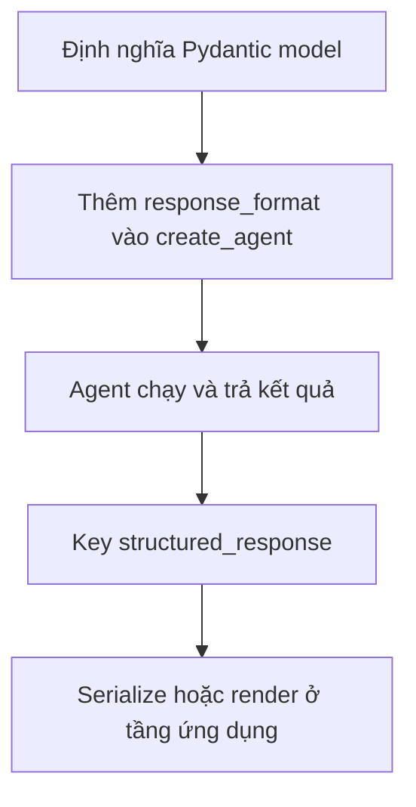

# 📦 Structured Output với Pydantic: cho agent trả lời "đúng khuôn"

> Nguồn: `021-Structured-Output-with-LangChain-Agents-Using-Pydantic.txt` · [Udemy](https://ua.udemy.com/course/langchain/learn/lecture/53383947)

Chào các bạn, Eden đây! Trong bài này chúng ta sẽ học cách buộc agent trả về **dữ liệu có cấu trúc** thay vì text thuần — kỹ năng bắt buộc khi bạn muốn nối agent vào một ứng dụng thật.

Và tin vui: với `create_agent`, việc này dễ đến mức... khó tin.

---

### 🤔 Vì sao cần structured output?

Hầu hết thời gian khi xây agent và ứng dụng AI, chúng ta dùng LLM và nhận về **text**. Nhưng nếu muốn tạo cấu trúc cho phần text đó để **đẩy xuống các tầng sau của ứng dụng** — chẳng hạn để **serialize** hoặc **render lên giao diện** — thì text là không đủ.

Lúc đó ta cần **structured output (đầu ra có cấu trúc)**: không chỉ text, mà là **JSON object** hoặc **Pydantic object** để chương trình có thể **parse và xử lý bằng code**.

Cách làm với LangChain: thêm **một argument duy nhất** vào `create_agent` là **`response_format`**. Bạn đưa vào đó **schema** mong muốn — có thể là **JSON schema** hoặc **Pydantic object** — và "phép màu" xảy ra: câu trả lời của agent sẽ **tuân thủ đúng schema đó**.

*Bài này chúng ta chỉ khám phá giao diện và cách dùng; còn cách nó chạy bên dưới sẽ được mổ xẻ ở section sau.*

---

### 🧱 Xây Pydantic model: Source lồng trong AgentResponse

Mình import **`BaseModel`** và **`Field`** từ **Pydantic**, cùng kiểu **`List`** từ `typing`.

Nói nhanh cho bạn nào chưa quen: **`BaseModel`** là class nền để kế thừa, cung cấp **parse dữ liệu, serialize và tự động validate kiểu**. Còn **`Field`** cho phép thêm **metadata** vào thuộc tính — ví dụ **description** để LLM hiểu nên điền gì vào field đó.

Mình xây hai class lồng nhau (cố tình thêm độ phức tạp cho vui):

1. **`Source`** — mô tả nguồn mà agent dùng để lấy câu trả lời. Class có mô tả ngắn *"scheme for a source used by the agent"*, cùng một field **`url`** kiểu `str` và `Field` mô tả: URL của nguồn.
2. **`AgentResponse`** — kết quả trả về của agent, gồm:
   * **`answer`** — câu trả lời của agent cho truy vấn.
   * **`sources`** — **list các `Source`**; mình dùng `Field` với **`default_factory=list`**, nghĩa là nếu không truyền `sources`, field này sẽ **mặc định là list rỗng**. Description: danh sách nguồn dùng để tạo câu trả lời.

| Model | Vai trò | Field chính |
|---|---|---|
| `Source` | Mô tả nguồn agent dùng để lấy câu trả lời | `url` |
| `AgentResponse` | Kết quả cuối cùng agent trả về | `answer`, `sources` |

*Một chi tiết vui:* mình có một lỗi typo trong description, nhưng cứ yên tâm — **LLM xử lý được** hết.

---

### 🔗 Gắn vào create_agent bằng response_format

Giờ thay vì nhận string, ta muốn agent trả về **object `AgentResponse`** để có thể:

* **Serialize** và trả về từ server.
* **Render** ở front-end.

Cách làm: thêm argument **`response_format=AgentResponse`** vào `create_agent`. Vậy là xong! Kết quả trả về sẽ thuộc **kiểu `AgentResponse`** với đầy đủ các field ta yêu cầu.

---

### 🧪 Chạy thử và kiểm tra trace

Mình chạy ở **debug mode**, đặt breakpoint ngay trước dòng print. Trong `result` xuất hiện key mới: **`structured_response`** — và kiểu của nó đúng là **`AgentResponse`**, gồm field `answer` và `sources` (list các source).

Trong **debug console**, mình in biến này ra xem:

* **`answer`**: câu trả lời của agent.
* **`sources`**: là một list; mở một phần tử bất kỳ thì thấy **URL**; mở URL lên — đúng là một job posting trên LinkedIn, có tin đã **không còn nhận ứng viên** nhưng vẫn đang tìm lập trình viên LangChain.

Trên **LangSmith**, trace cuối cùng cũng vậy: có thêm field **`structured_response`** chứa `answer` và danh sách `sources`, mỗi source có field `url`.

### 🎯 Tự kiểm tra nhanh

**Câu 1:** Vì sao cần structured output?

<b>Xem đáp án</b>

**Đáp án:** Để chương trình có thể parse và xử lý bằng code — serialize hoặc render lên giao diện — thay vì chỉ có text thuần.

Giải thích: Text là không đủ khi muốn đẩy dữ liệu xuống các tầng sau của ứng dụng.

Tham chiếu: Mục Vì sao cần structured output.

**Câu 2:** Argument duy nhất nào của `create_agent` giúp có structured output?

<b>Xem đáp án</b>

**Đáp án:** `response_format` — nhận vào schema mong muốn như JSON schema hoặc Pydantic object.

Giải thích: Câu trả lời của agent sẽ tuân thủ đúng schema đó.

Tham chiếu: Mục Vì sao cần structured output.

**Câu 3:** `BaseModel` và `Field` của Pydantic dùng để làm gì?

<b>Xem đáp án</b>

**Đáp án:** `BaseModel` là class nền cung cấp parse, serialize và validate kiểu; `Field` thêm metadata như description để LLM hiểu nên điền gì.

Giải thích: Description trong Field giúp định hướng dữ liệu LLM sinh ra.

Tham chiếu: Mục Xây Pydantic model.

**Câu 4:** `default_factory=list` trong field `sources` có tác dụng gì?

<b>Xem đáp án</b>

**Đáp án:** Nếu không truyền `sources`, field này mặc định là list rỗng.

Giải thích: Nhờ vậy model lẫn agent đều không bắt buộc phải cung cấp danh sách nguồn.

Tham chiếu: Mục Xây Pydantic model.

**Câu 5:** Kết quả structured nằm ở key nào trong `result`, và cơ chế bên dưới là gì?

<b>Xem đáp án</b>

**Đáp án:** Key `structured_response`; cơ chế bên dưới là function calling.

Giải thích: Chi tiết cách hoạt động sẽ được mổ xẻ ở các section tiếp theo.

Tham chiếu: Mục Chạy thử và kiểm tra trace.

Và câu hỏi lớn vẫn còn đó: **cơ chế nào giúp việc này chạy?** Gợi ý nhanh: **function calling**. Nhưng chi tiết thì để dành cho các section tiếp theo nhé — *hứa là rất đáng chờ đấy!* 😉🚀

## Nguồn tham khảo

- [Udemy — Structured Output with LangChain Agents Using Pydantic](https://ua.udemy.com/course/langchain/learn/lecture/53383947)
- [LangChain Docs — Structured output](https://docs.langchain.com/oss/python/langchain/structured-output)
- [LangChain Docs — Agents](https://docs.langchain.com/oss/python/langchain/agents)
