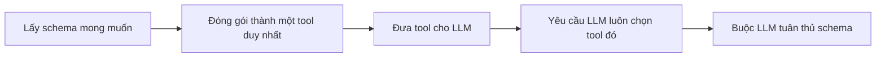

# 🧩 Structured Output nhìn từ bên trong: Tool strategy hay Provider strategy?

> Nguồn: `022-THEORY-Predictable-Agent-Responses-with-LangChain-Structured.txt` · [Udemy](https://ua.udemy.com/course/langchain/learn/lecture/54004171)

Chào các bạn, Eden đây! Bài này là một chút "đào sâu lý thuyết" về **structured output** — mổ xẻ xem có những cách nào để buộc agent trả về dữ liệu đúng khuôn.

Nếu bài trước mới chỉ là "dùng thì thấy chạy", thì bài này sẽ trả lời câu hỏi: **vì sao nó chạy được?**

---

### 📌 Nhắc lại: structured output cho ta điều gì?

Structured output cho phép agent trả về dữ liệu theo **định dạng cụ thể, đoán trước được**. Thay vì một câu trả lời text thô, ta có thể nhận:

* **Pydantic object**
* **JSON response**
* **dataclass**

...và tất cả đều **downstream được vào ứng dụng** để dùng tiếp. Chúng ta đã thấy cách dùng nó qua `create_agent`, với argument `response_format`.

Điều thú vị là bên dưới có **nhiều cách hiện thực** khác nhau, chia thành **hai chiến lược chính**.

---

### 🛡️ Provider strategy: để nhà cung cấp model "gánh"

Hầu hết các **model top-tier** đều hỗ trợ **structured output theo kiểu native**. Nghĩa là ta dùng thẳng **API của họ** với argument structured output, và họ sẽ **làm hết phần việc nặng**, trả về đúng định dạng ta muốn.

Các **schema type** được hỗ trợ gồm:

1. **Pydantic model**
2. **dataclass**
3. **TypedDict**
4. **JSON schema**

**Theo mặc định, LangChain chọn provider strategy** nếu model bạn dùng trong `create_agent` có hỗ trợ structured output — trừ khi bạn chỉ định khác.

Triết lý khá hay: làm vậy là **đẩy toàn bộ trách nhiệm về phía model provider** trong việc trả về câu trả lời chuẩn. *Và đương nhiên, nếu câu trả lời sai... bạn biết "gõ cửa" ai rồi đấy!*

---

### 🔧 Tool strategy: "chiêu" dùng tool calling

Không phải model nào cũng có API structured output. Nhưng tin vui: **gần như mọi model top-tier đều hỗ trợ tool calling** — và đó là **workaround (giải pháp vòng)** để có structured output.

Cách làm:

1. Lấy **schema** của object mong muốn.
2. Đóng gói nó thành **một tool duy nhất** và đưa cho LLM.
3. Yêu cầu LLM **luôn luôn phải chọn tool đó**.

Bằng cách "ép" LLM luôn đi qua con đường duy nhất ấy, ta **buộc nó tuân thủ schema** đã gửi. Nghe đơn giản nhưng cực kỳ hiệu quả — và đây cũng chính là cách mà mọi thứ **tiến hóa** đến ngày nay.

LangChain đã hiện thực sẵn chiến lược này cho chúng ta, và nó cũng hỗ trợ đủ bộ: **Pydantic model, dataclass, TypedDict và JSON schema**.

---

### 🎯 Tóm gọn lại

Vậy là có hai "con đường" để có structured output:

* **Provider strategy** — dùng năng lực gốc của model, được ưu tiên mặc định.
* **Tool strategy** — dùng tool calling làm giải pháp vòng khi model không hỗ trợ API structured output.

| Tiêu chí | Provider strategy | Tool strategy |
|---|---|---|
| Cách hoạt động | Dùng API structured output gốc của model | Đóng gói schema thành tool và ép LLM luôn chọn |
| Điều kiện dùng | Model top-tier hỗ trợ native structured output | Model chỉ cần hỗ trợ tool calling |
| Vị trí mặc định | Được LangChain ưu tiên chọn | Giải pháp vòng khi model không hỗ trợ |
| Schema hỗ trợ | Pydantic model, dataclass, TypedDict, JSON schema | Pydantic model, dataclass, TypedDict, JSON schema |

### 🎯 Tự kiểm tra nhanh

**Câu 1:** Structured output có thể trả về những dạng dữ liệu nào?

<b>Xem đáp án</b>

**Đáp án:** Pydantic object, JSON response, dataclass — và cả TypedDict, JSON schema ở tầng schema.

Giải thích: Tất cả đều downstream được vào ứng dụng để dùng tiếp.

Tham chiếu: Mục Nhắc lại.

**Câu 2:** Provider strategy hoạt động thế nào?

<b>Xem đáp án</b>

**Đáp án:** Dùng thẳng API structured output native của model top-tier, để nhà cung cấp làm hết phần việc nặng.

Giải thích: Triết lý là đẩy toàn bộ trách nhiệm về phía model provider.

Tham chiếu: Mục Provider strategy.

**Câu 3:** Khi nào LangChain mặc định chọn provider strategy?

<b>Xem đáp án</b>

**Đáp án:** Khi model dùng trong `create_agent` có hỗ trợ structured output — trừ khi bạn chỉ định khác.

Giải thích: Đây là mặc định của LangChain cho các model top-tier.

Tham chiếu: Mục Provider strategy.

**Câu 4:** Tool strategy hoạt động ra sao?

<b>Xem đáp án</b>

**Đáp án:** Lấy schema, đóng gói thành một tool duy nhất, rồi yêu cầu LLM luôn luôn chọn tool đó để buộc tuân thủ schema.

Giải thích: Nghe đơn giản nhưng cực kỳ hiệu quả, và chính là cách mọi thứ tiến hóa đến ngày nay.

Tham chiếu: Mục Tool strategy.

**Câu 5:** Vì sao tool strategy được gọi là "giải pháp vòng"?

<b>Xem đáp án</b>

**Đáp án:** Vì nó dùng tool calling để có structured output khi model không hỗ trợ API structured output gốc.

Giải thích: Gần như mọi model top-tier đều hỗ trợ tool calling, nên đây là workaround đáng tin cậy.

Tham chiếu: Mục Tool strategy.

Hiểu được hai chiến lược này sẽ giúp bạn **tự tin chọn cách phù hợp** khi ghép bất kỳ model nào vào ứng dụng. Hẹn gặp các bạn ở bài tiếp theo — nơi chúng ta bắt đầu bóc lớp "ma thuật" của agent! 🚀

## Nguồn tham khảo

- [Udemy — Predictable Agent Responses with LangChain Structured Output](https://ua.udemy.com/course/langchain/learn/lecture/54004171)
- [LangChain Docs — Structured output](https://docs.langchain.com/oss/python/langchain/structured-output)
- [LangChain Reference — create_agent](https://reference.langchain.com/python/langchain/agents/create_agent)
