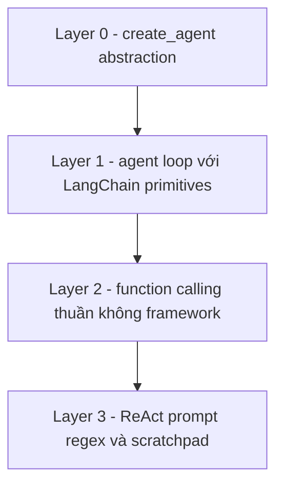

# 🕵️ Kiến trúc lõi của AI Agent: bóc từng lớp "ma thuật" (Layer 0 → Layer 3)

> Nguồn: `023-Introduction-to-The-Core-Architecture-of-AI-Agents-A-Deep-Di.txt` · [Udemy](https://ua.udemy.com/course/langchain/learn/lecture/54803231)

Chào các bạn, Eden đây! Đây là section **mình thích nhất trong toàn bộ khóa học** — vì chúng ta sẽ lấy các abstraction của LangChain và **bóc từng lớp một**, cho đến khi nhìn thấy tường tận agent chạy như thế nào.

Mục tiêu rất rõ ràng: sau section này, bạn sẽ có **hiểu biết sâu nhất có thể về AI agent**. Khi tự xây agent cho dự án thật, bạn sẽ biết chính xác chuyện gì đang diễn ra bên dưới.

---

### 📦 Layer 0: abstraction create_agent

Những gì chúng ta làm đến giờ là **layer zero**. Ở tầng này, chúng ta dùng **`create_agent`** — LangChain làm mọi thứ, còn chúng ta... không biết gì về bên trong cả.

Ta chỉ đưa **model**, đưa **tools** (như Tavily search tool), và — bùm — có ngay một agent biết gọi tool. Tiện lợi, nhưng đúng là một **hộp đen**.

Từ đây, ta sẽ bóc dần từng lớp.

---

### 🔁 Layer 1: tự tay viết agent loop bằng LangChain primitives

Việc đầu tiên: tự hiện thực **agent loop** — một **`while` loop chạy liên tục** cho đến khi agent hoàn thành nhiệm vụ, dựa trên **function calling**.

Phiên bản này vẫn dùng các abstraction của LangChain để đỡ phải viết **boilerplate code (code khuôn mẫu lặp đi lặp lại)**, cụ thể là những "đồ nghề" quen thuộc:

* **`tool`** — decorator tạo công cụ.
* **`bind_tools`** — gắn danh sách tool vào chat model.
* **ChatModel** — model đảm nhiệm phần suy luận.
* **`ToolMessage`** — cấu trúc dữ liệu cho kết quả thực thi tool.

Sau khi viết xong vòng lặp, ta tiếp tục bóc lớp tiếp theo: **từng abstraction này hoạt động ra sao, làm gì, và vì sao cần chúng?**

---

### 🧱 Layer 2: function calling "thuần" — không framework

Ở tầng này, ta viết lại **đúng agent loop đó** với function calling, nhưng **hoàn toàn không dùng framework**: mọi thứ **raw**, tự tay viết **toàn bộ JSON schema**.

Chính tại đây bạn sẽ **thấy rõ giá trị của LangChain**:

* Toàn bộ những việc LangChain âm thầm làm giúp ta sẽ hiện nguyên hình.
* Ta hiểu được vì sao một **interface duy nhất** và khả năng **chuyển đổi giữa các model** lại quý giá đến vậy.

Điều này mang lại **khả năng tùy biến và độ linh hoạt tối đa** khi xây agent — thứ luôn cần cho môi trường production. Bởi khi một model mới xuất hiện, bạn muốn **đổi sang nó với thay đổi code ít nhất có thể**.

---

### 🧪 Layer 3: ReAct prompt, regex và scratchpad — bản "nguyên thủy"

Lớp cuối cùng (và cũng sâu nhất): hiểu **function calling vận hành thế nào bên dưới** bằng cách tự viết một agent **không có cả function calling** — chỉ với:

* Một **ReAct prompt**.
* **Regular expressions (biểu thức chính quy)**.
* Một **scratchpad (bản nháp ghi lại diễn biến)**.

Đây là cách agent được hiện thực **khi chúng mới ra đời**, nên bạn sẽ thấy vì sao **từng lớp abstraction là cần thiết**.

Một lưu ý quan trọng: trong section này mình dùng **Ollama** để chạy model **open-weight như Qwen**, thỉnh thoảng dùng **OpenAI**, nhưng bạn có thể dùng bất kỳ model nào **hỗ trợ function calling**.

Và điều mình muốn nhấn mạnh nhất: **hãy học hands-on!**

| Layer | Cách hiện thực | Bài học chính |
|---|---|---|
| Layer 0 | `create_agent` | Dùng abstraction, bên trong là hộp đen |
| Layer 1 | Agent loop với LangChain primitives | Vòng lặp chạy ra sao và vai trò từng primitive |
| Layer 2 | Function calling thuần, tự viết JSON schema | Hiểu giá trị của LangChain |
| Layer 3 | ReAct prompt, regex và scratchpad | Function calling vận hành bên dưới thế nào |

### 🎯 Tự kiểm tra nhanh

**Câu 1:** Layer 0 là gì?

<b>Xem đáp án</b>

**Đáp án:** Tầng dùng `create_agent` — LangChain làm mọi thứ, còn ta chỉ đưa model và tools.

Giải thích: Tiện lợi nhưng đúng là một hộp đen, nên ta sẽ bóc dần từng lớp.

Tham chiếu: Mục Layer 0.

**Câu 2:** Layer 1 dùng những "đồ nghề" LangChain nào?

<b>Xem đáp án</b>

**Đáp án:** `tool`, `bind_tools`, ChatModel và `ToolMessage`.

Giải thích: Ta tự viết agent loop nhưng vẫn dùng primitives của LangChain để đỡ boilerplate.

Tham chiếu: Mục Layer 1.

**Câu 3:** Layer 2 dạy cho ta điều gì?

<b>Xem đáp án</b>

**Đáp án:** Giá trị của LangChain — vì ta phải tự viết toàn bộ JSON schema và thấy hết những việc framework âm thầm làm giúp.

Giải thích: Từ đó hiểu vì sao một interface duy nhất và khả năng chuyển đổi giữa các model lại quý giá.

Tham chiếu: Mục Layer 2.

**Câu 4:** Layer 3 dùng gì để hiện thực agent?

<b>Xem đáp án</b>

**Đáp án:** Một ReAct prompt, regular expressions và một scratchpad — không có cả function calling.

Giải thích: Đây là cách agent được hiện thực khi mới ra đời, cho thấy vì sao từng lớp abstraction là cần thiết.

Tham chiếu: Mục Layer 3.

**Câu 5:** Trong section này dùng model gì để chạy code?

<b>Xem đáp án</b>

**Đáp án:** Ollama với các open-weight model như Qwen, thỉnh thoảng dùng OpenAI — miễn model hỗ trợ function calling.

Giải thích: Bạn có thể dùng bất kỳ model nào hỗ trợ function calling, không bắt buộc open-weight.

Tham chiếu: Mục Layer 3.

Toàn bộ code có trên **GitHub** (mình để link trong Resources). Đừng chỉ xem — hãy **gõ code, chạy code, đọc trace**, làm y như mình làm. Chỉ khi tự tay làm, bạn mới thấy hết "ma thuật" và có được hiểu biết sâu sắc nhất. Hẹn gặp các bạn ở bài đầu tiên của hành trình này! 🚀

## Nguồn tham khảo

- [Udemy — Introduction to The Core Architecture of AI Agents](https://ua.udemy.com/course/langchain/learn/lecture/54803231)
- [LangChain Docs — Agents](https://docs.langchain.com/oss/python/langchain/agents)
- [LangGraph Overview](https://docs.langchain.com/oss/python/langgraph/overview)
