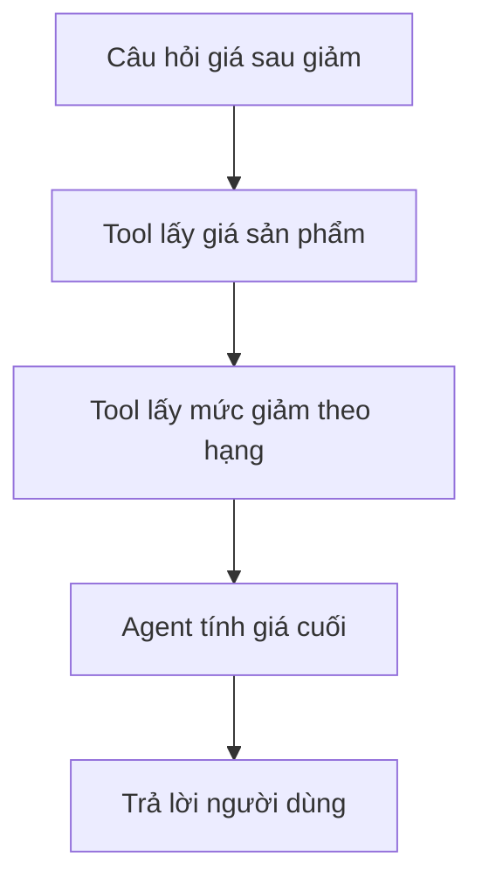

# 🛒 Chúng ta sẽ xây gì? Một E-Commerce Agent tính giá sau giảm

> Nguồn: `024-What-are-we-building-An-E-Commerce-Agent.txt` · [Udemy](https://ua.udemy.com/course/langchain/learn/lecture/54813333)

Chào các bạn, Eden đây! Section "Agents Under The Hood" sẽ xoay quanh một bài toán rất đời: **một agent cho cửa hàng thương mại điện tử**.

Nghe đơn giản, nhưng đây là ví dụ hoàn hảo để mổ xẻ kiến trúc agent — vì nó có đủ "đất" cho agent suy luận qua nhiều bước. Cùng xem đề bài nhé.

---

### 🏪 Bối cảnh: cửa hàng bán đồ công nghệ

Cửa hàng của chúng ta bán **hardware (phần cứng)**:

* **Tai nghe (headphones)**
* **Bàn phím (keyboards)**
* **Laptop**

Cửa hàng đang chạy **chương trình khuyến mãi, giảm giá** với các hạng khách hàng:

* **Bronze discount** — hạng đồng.
* **Silver discount** — hạng bạc.
* **Gold discount** — hạng vàng.

Mỗi hạng tương ứng với **một mức giảm giá khác nhau**. Ví dụ: hạng **bronze** được giảm **15%**.

---

### 🎯 Yêu cầu: agent trả về giá sau giảm

Chúng ta cần một agent có thể **nhận câu hỏi từ người dùng** và **trả về giá của món hàng sau khi áp dụng giảm giá**.

Ví dụ: *"Giá của một chiếc laptop với hạng giảm giá gold là bao nhiêu?"*

Để làm được điều đó, agent sẽ dùng **hai tool**:

1. **Lấy giá của sản phẩm** — ví dụ giá của laptop (hay máy tính).
2. **Lấy số tiền giảm giá** tương ứng với hạng thành viên (bronze, silver, gold).

| Tool | Nhận vào | Trả về |
|---|---|---|
| Lấy giá sản phẩm | Tên sản phẩm, ví dụ laptop | Giá gốc của sản phẩm |
| Lấy số tiền giảm giá | Hạng thành viên bronze, silver hoặc gold | Mức giảm tương ứng của hạng |

Chỉ hai tool thôi — nhưng đủ để agent phải **lý luận theo nhiều bước**: lấy giá trước, rồi mới áp giảm giá.

---

### 🧰 Cách "chuẩn LangChain" và cách chúng ta sẽ làm

Nếu dùng abstraction của **LangChain**, bài này gọn gàng trong vài dòng: gọi **`create_agent`**, đưa **LLM**, đưa **danh sách tools** (lấy giá + lấy giảm giá). Đúng ra thì chúng ta sẽ làm như vậy.

Nhưng trong section này, chúng ta sẽ không đi đường tắt. Thay vào đó, mình sẽ **hiện thực một phiên bản tinh gọn (lean version)** của agent loop — để bạn thấy rõ **từng bước bên trong**: LLM quyết định gọi tool nào, ta thực thi ra sao, và kết quả quay ngược trở lại prompt như thế nào.

### 🎯 Tự kiểm tra nhanh

**Câu 1:** Cửa hàng trong ví dụ bán những gì?

<b>Xem đáp án</b>

**Đáp án:** Hardware — tai nghe, bàn phím và laptop.

Giải thích: Đây là bối cảnh để agent thực hiện bài toán tính giá sau giảm.

Tham chiếu: Mục Bối cảnh.

**Câu 2:** Chương trình giảm giá có những hạng khách hàng nào?

<b>Xem đáp án</b>

**Đáp án:** Bronze, silver và gold — mỗi hạng một mức giảm khác nhau, ví dụ bronze được giảm 15%.

Giải thích: Hạng thành viên là tham số để tool lấy đúng mức giảm.

Tham chiếu: Mục Bối cảnh.

**Câu 3:** Agent cần trả về kết quả gì?

<b>Xem đáp án</b>

**Đáp án:** Giá của món hàng sau khi áp dụng giảm giá.

Giải thích: Ví dụ câu hỏi: giá laptop với hạng giảm giá gold là bao nhiêu.

Tham chiếu: Mục Yêu cầu.

**Câu 4:** Hai tool của agent là gì?

<b>Xem đáp án</b>

**Đáp án:** Lấy giá sản phẩm và lấy số tiền giảm giá tương ứng với hạng thành viên.

Giải thích: Chỉ hai tool nhưng đủ để agent lý luận nhiều bước: lấy giá trước, rồi mới áp giảm giá.

Tham chiếu: Mục Yêu cầu.

**Câu 5:** Vì sao section này không đi thẳng vào `create_agent`?

<b>Xem đáp án</b>

**Đáp án:** Để tự hiện thực một phiên bản tinh gọn của agent loop, thấy rõ từng bước bên trong.

Giải thích: Mục tiêu là hiểu LLM quyết định gọi tool nào, ta thực thi ra sao và kết quả quay lại prompt thế nào.

Tham chiếu: Mục Cách "chuẩn LangChain".

Sơ đồ trong video mô tả chính xác những gì chúng ta sắp cài đặt. Cùng bắt đầu thôi — hẹn gặp các bạn ở bài tiếp theo! 🚀

## Nguồn tham khảo

- [Udemy — What are we building - An E-Commerce Agent](https://ua.udemy.com/course/langchain/learn/lecture/54813333)
- [LangChain Docs — Agents](https://docs.langchain.com/oss/python/langchain/agents)
