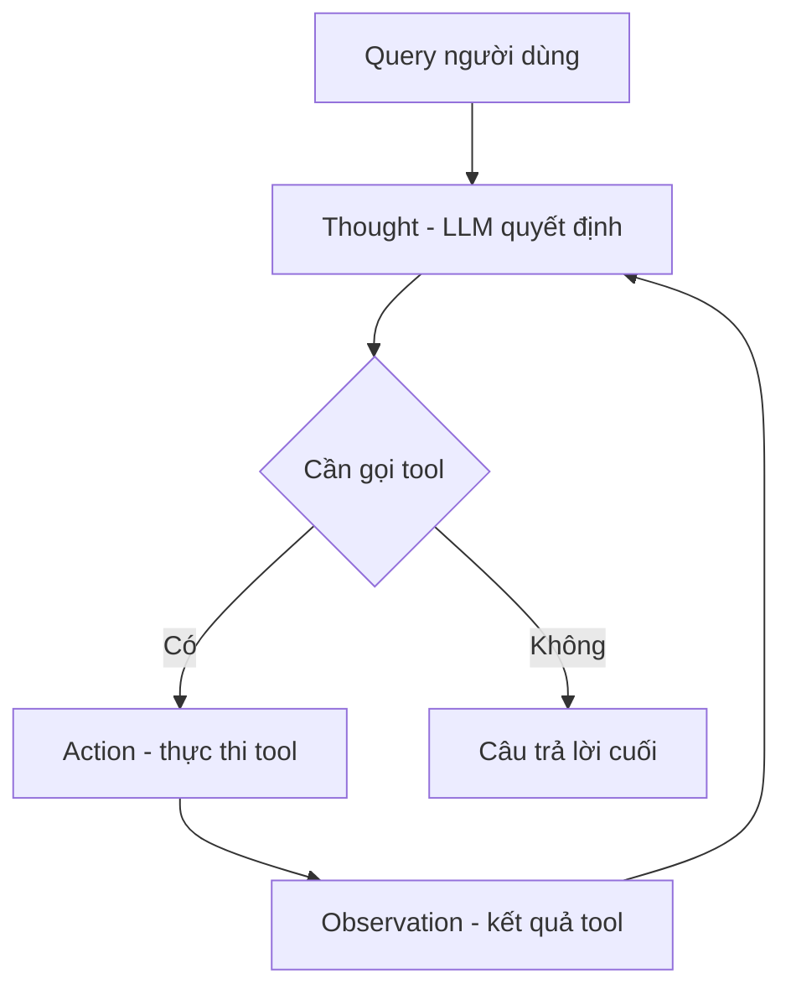

# 🔁 Góc nhìn tổng quan về ReAct: vòng lặp đằng sau mọi autonomous agent

> Nguồn: `025-Theory-The-Gist-of-ReACT.txt` · [Udemy](https://ua.udemy.com/course/langchain/learn/lecture/54896313)

Chào các bạn, Eden đây! Bài này chúng ta sẽ có một **cái nhìn tổng quan về agent loop** — còn gọi là **ReAct loop** hay **thuật toán ReAct**. Mình sẽ dùng các thuật ngữ này thay phiên nhau, các bạn đừng bối rối nhé.

Và tin được không: thuật toán này tuy **đơn giản**, nhưng lại là thứ đang vận hành những agent hiện đại nhất như **Claude Code, Gemini CLI, Codex hay Devin**.

---

### 📜 Một chút lịch sử: bài báo ReAct

Thuật toán này lần đầu xuất hiện trong bài báo nghiên cứu **"ReAct: Synergizing Reasoning and Acting in Language Models"** — công trình chung giữa **Đại học Princeton** và các kỹ sư nghiên cứu của **Google**.

Năm **2023**, bài báo này đã đặt **nền móng cho mọi agent hiện đại** mà chúng ta biết ngày nay. *Ai muốn tìm hiểu sâu hơn thì mình đã phân tích nó trong phần lý thuyết về prompt engineering của khóa học rồi nhé.*

---

### 🧠 Thought: bước suy nghĩ đầu tiên

Mọi thứ bắt đầu bằng **query của người dùng**. Với ví dụ của chúng ta: *"Giá của một chiếc laptop với hạng giảm giá gold là bao nhiêu?"* Kết thúc quá trình xử lý, agent sẽ trả về câu trả lời.

Toàn bộ phần nằm trong "chiếc hộp" đó được gọi là **agent loop**, và bước đầu tiên có tên là **Thought (suy nghĩ)**:

* Agent nhận query của người dùng.
* **Quyết định xem nên gọi tool nào**, hoặc **trả lời luôn** nếu đã có đủ thông tin.
* Việc này dựa trên năng lực suy luận của **LLM** — nghĩa là ta gửi một **prompt** cho LLM.

Prompt đó gồm những gì? Một **system message** chứa thông tin chung về agent, và **phần quan trọng nhất**: **toàn bộ thông tin về các tool** mà LLM có thể dùng. LLM xử lý, rồi trả về **việc cần làm tiếp theo** — gọi một tool, hoặc trả câu trả lời.

*Nhánh trả lời chỉ xảy ra khi LLM thấy mình không cần gọi tool nào nữa.*

Câu hỏi hay: **làm sao LLM biết gọi tool nào?** Nhờ **function calling** — các model ngày nay làm việc này rất cừ. Cách nó hoạt động bên dưới sẽ được mổ xẻ ngay trong section này.

---

### ⚙️ Action và Observation: phần "chân tay" của agent

Sau khi LLM quyết định, ta nhận được **tool nào cần chạy**. Bước này gọi là **Action (hành động)**.

* LLM **chỉ trả về một chuỗi** mô tả gọi hàm nào, tham số nào.
* **Ứng dụng của chúng ta** — chính chúng ta — mới là bên **thật sự thực thi** hàm đó.
* Kết quả của tool chạy xong được gọi là **Observation (quan sát)**.

Rồi ta **đưa tất cả lịch sử trở lại** cho LLM: query của người dùng, quyết định gọi tool, và observation mới. Phần lịch sử này thường được gọi là **scratchpad (bản nháp ghi chú diễn biến)**.

| Bước | Ai thực hiện | Ý nghĩa |
|---|---|---|
| Thought | LLM | Quyết định gọi tool nào hoặc trả lời luôn |
| Action | Ứng dụng của chúng ta | Thực thi hàm/tool mà LLM yêu cầu |
| Observation | Tool | Kết quả trả về, được ghi vào scratchpad |

---

### 🔄 Ví dụ 3 vòng lặp với chiếc laptop hạng gold

**Vòng 1:** Agent quyết định gọi tool **`get_product_price`** với `product=laptop`. Ta thực thi trong ứng dụng → **Observation:** giá của laptop.

**Vòng 2:** Gửi lại query + scratchpad (đã có giá). Giờ đủ thông tin, agent quyết định gọi tool **`apply_discount`** với observation từ vòng trước. Ta thực thi → **Observation:** giá cuối cùng sau giảm.

**Vòng 3:** Gửi cả cuộc hội thoại/scratchpad cho LLM. Lúc này agent đã đủ dữ kiện để **không gọi thêm tool nào** và **trả về câu trả lời cuối**.

Và đó chính là thuật toán agent ở mức tổng quan: một **`while` loop** liên tục prompt LLM, tận dụng khả năng suy luận, nhận về **tool call cần chạy hoặc câu trả lời**, rồi thực thi trong ứng dụng. Vòng lặp chỉ **kết thúc khi LLM quyết định không cần gọi tool nào nữa**.

### 🎯 Tự kiểm tra nhanh

**Câu 1:** Thuật toán ReAct xuất hiện lần đầu ở đâu?

<b>Xem đáp án</b>

**Đáp án:** Trong bài báo "ReAct: Synergizing Reasoning and Acting in Language Models" — công trình chung giữa Đại học Princeton và các kỹ sư nghiên cứu của Google.

Giải thích: Năm 2023, bài báo này đặt nền móng cho mọi agent hiện đại.

Tham chiếu: Mục Một chút lịch sử.

**Câu 2:** Bước Thought dựa trên năng lực gì của LLM?

<b>Xem đáp án</b>

**Đáp án:** Năng lực suy luận — ta gửi prompt gồm system message và toàn bộ thông tin về các tool.

Giải thích: LLM xử lý rồi trả về việc cần làm tiếp theo: gọi một tool hoặc trả câu trả lời.

Tham chiếu: Mục Thought.

**Câu 3:** Trong bước Action, ai thật sự thực thi hàm?

<b>Xem đáp án</b>

**Đáp án:** Ứng dụng của chúng ta — LLM chỉ trả về một chuỗi mô tả gọi hàm nào, tham số nào.

Giải thích: LLM không tự chạy tool; chính chúng ta là bên thực thi.

Tham chiếu: Mục Action và Observation.

**Câu 4:** Observation là gì?

<b>Xem đáp án</b>

**Đáp án:** Kết quả của tool sau khi chạy xong.

Giải thích: Nó được đưa trở lại cùng lịch sử để LLM tiếp tục vòng lặp.

Tham chiếu: Mục Action và Observation.

**Câu 5:** Scratchpad là gì?

<b>Xem đáp án</b>

**Đáp án:** Phần lịch sử gồm query của người dùng, quyết định gọi tool và observation — được gửi trở lại LLM.

Giải thích: Vòng lặp chỉ kết thúc khi LLM quyết định không cần gọi tool nào nữa.

Tham chiếu: Mục Action và Observation.

*Bài này nghe hơi trừu tượng — mình biết!* Nhưng ở bài sau, chúng ta sẽ **code thuật toán này từ số 0, không dùng bất kỳ abstraction nào**, và mọi thứ sẽ trở nên rõ như ban ngày. Hẹn gặp các bạn! 🚀

## Nguồn tham khảo

- [Udemy — Theory - The Gist of ReACT](https://ua.udemy.com/course/langchain/learn/lecture/54896313)
- [ReAct: Synergizing Reasoning and Acting in Language Models](https://arxiv.org/abs/2210.03629)
- [ReAct project page](https://react-lm.github.io/)
