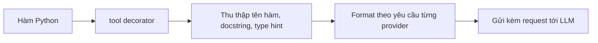

# 🧰 Viết Tool đầu tiên với LangChain: Khởi động Layer 1 — ReAct Loop!

> Nguồn: `027-Writing-Tools.txt` · [Udemy](https://ua.udemy.com/course/langchain/learn/lecture/54882093)

Hôm nay chúng ta chính thức bước vào **Layer 1: The ReAct Loop** — và bài học đầu tiên là viết **tool (công cụ)** cho agent. Mình sẽ cùng các bạn dựng file code đầu tiên, định nghĩa hai tool cho bài toán e-commerce, rồi khoác luôn "áo giám sát" LangSmith cho hành trình phía trước.

*Đừng lo nếu bạn chưa quen với khái niệm tool — mình sẽ đi từng bước thật chậm rãi.*

### 📁 Tạo file mới và những import "xịn" của LangChain

Mình tạo file `1_agent_loop_langchain_tool_calling.py` và bắt đầu với các import quen thuộc:

* **load_dotenv**: nạp biến môi trường từ file `.env`.
* **init_chat_model**: tiện ích cực hay của LangChain — chỉ cần truyền vào một **chuỗi ký tự** như `OpenAI`, `GPT-5.2`... là model chat tương ứng được khởi tạo ngay.
* **tool decorator**: biến hàm Python thường thành **custom tool**.
* **HumanMessage, SystemMessage, ToolMessage**: bộ ba message với một giao diện thống nhất cho mọi model.

Điều kiện duy nhất để `init_chat_model` hoạt động là bạn đã cài **package integration của provider**: OpenAI thì cần `langchain-openai`, Ollama thì cần `langchain-ollama` — cả hai đã được cài trong video setup môi trường.

Điểm mình thích nhất ở đây là khả năng **tự map provider**: viết `GPT o1`, `o3` thì hiểu là OpenAI; `DeepSeek` thì về DeepSeek; `Claude` là Anthropic; còn có cả Amazon Bedrock. Gần như mọi provider lớn đều được hỗ trợ — đổi model dễ như đổi một chuỗi ký tự, và đây chính là một trong những điểm mạnh của LangChain.

---

### 🛠️ Viết hai tool cho agent e-commerce

Mình khai báo `MAX_ITERATIONS = 10` để giới hạn số vòng chạy của agent — chọn 10 chẳng vì lý do gì đặc biệt, chỉ cần là số **lớn hơn 2** và đóng vai trò như một heuristic. Model thì mình gán `qwen3:1.7b` — đúng model đã tải sẵn bằng Ollama; các bạn có thể dùng model bất kỳ, nhưng nếu muốn theo video y hệt thì dùng Qwen.

Tool thứ nhất, **get_product_price**:

1. Nhận vào tên sản phẩm, trả về giá dạng **float**.
2. In ra một dòng log để biết hàm đang được gọi với input nào.
3. Tra cứu trong dictionary giá gồm **laptop, headphones, keyboard** với vài con số ngẫu nhiên.
4. Nếu sản phẩm không có trong danh mục, trả về **0**.

Tool thứ hai, **apply_discount**:

1. Nhận vào giá và hạng giảm giá dạng chuỗi: **bronze, silver, gold**.
2. Trả về float là giá sau giảm.
3. Docstring ghi rõ chức năng và các tier khả dụng.
4. Mức giảm tương ứng: **bronze 5%, silver 12%, gold 23%**, tính theo công thức lấy giá gốc nhân với (1 trừ phần trăm giảm chia 100), rồi **làm tròn 2 chữ số thập phân**.

Lý do mình tách phần tính toán này thành tool riêng rất đơn giản: **LLM vốn không giỏi toán**.

| Tool | Input | Output | Ghi chú |
|---|---|---|---|
| `get_product_price` | Tên sản phẩm | Giá dạng float | Tra dictionary laptop, headphones, keyboard; không có thì trả về 0 |
| `apply_discount` | Giá gốc và hạng giảm giá | Giá sau giảm dạng float | bronze 5%, silver 12%, gold 23%; làm tròn 2 chữ số thập phân |

---

### 💡 Docstring và type hint — "danh thiếp" của tool trước mặt LLM

Đây là phần mình muốn các bạn đặc biệt lưu tâm. Docstring và type hint mà chúng ta viết không chỉ để cho đẹp — chúng chính là thứ được gửi tới LLM khi dùng **function calling**, để model biết mình đang có những hàm nào.

Khi bạn gắn **tool decorator** của LangChain, nó sẽ tự động gom: docstring, tên hàm, các argument nhận vào, kiểu giá trị trả về... và format lại gọn gàng **theo đúng yêu cầu của từng model provider**. Nói cách khác, LangChain tạo ra một giao diện duy nhất để truyền toàn bộ metadata này cho model.

Mình lưu file và chạy thử ngay để chắc chắn không có lỗi — mọi thứ trơn tru.

---

### 🔍 Dựng khung run_agent và gắn LangSmith tracing

Mình định nghĩa hàm **run_agent** nhận câu hỏi từ người dùng (ví dụ: giá một sản phẩm sau khi áp hạng giảm giá), hiện tại để trống phần thân, rồi viết boilerplate chạy file với dòng print `Hello LangChain agent (.bind_tools)!` và gọi thử với câu hỏi: *"What is the price for a laptop after applying the gold discount?"*.

Vì sắp tới chúng ta sẽ **tự tay implement agent loop** chứ không dùng LangChain cho phần loop, mình chủ động thêm **LangSmith tracing** bằng decorator `traceable`, đặt tên scope là **LangChain Agent Loop**. Nhờ vậy, mọi thứ chạy bên trong sẽ được gom dưới **một trace duy nhất** trong project *ReAct Under The Hood*, giúp ta thấy tổng số token tiêu thụ, thời gian chạy và cả chi phí.

Hiện tại trace còn trống vì agent loop chưa được viết — nhưng khi code vào, các bạn sẽ thấy mọi thứ "xếp lớp" dưới một trace rất gọn gàng.

### 🎯 Tự kiểm tra nhanh

**Câu 1:** Điều kiện để `init_chat_model` hoạt động là gì?

<b>Xem đáp án</b>

**Đáp án:** Đã cài package integration của provider, ví dụ `langchain-openai` hoặc `langchain-ollama`.

Giải thích: `init_chat_model` nhận chuỗi như `OpenAI` hay `GPT-5.2` để khởi tạo model tương ứng, nhưng cần package của provider đó.

Tham chiếu: Mục Tạo file mới và những import "xịn".

**Câu 2:** Vì sao tách `apply_discount` thành tool riêng thay vì để model tự tính?

<b>Xem đáp án</b>

**Đáp án:** Vì LLM vốn không giỏi toán.

Giải thích: Đưa phép tính vào hàm Python đảm bảo kết quả chính xác, model chỉ cần chọn tool đúng.

Tham chiếu: Mục Viết hai tool cho agent e-commerce.

**Câu 3:** Docstring và type hint của tool được dùng để làm gì?

<b>Xem đáp án</b>

**Đáp án:** Là metadata được gửi tới LLM qua function calling để model biết có những tool nào và dùng thế nào.

Giải thích: tool decorator tự gom docstring, tên hàm, arguments, kiểu trả về rồi format theo từng provider.

Tham chiếu: Mục Docstring và type hint.

**Câu 4:** Mức giảm giá của hạng gold là bao nhiêu?

<b>Xem đáp án</b>

**Đáp án:** 23%.

Giải thích: bronze 5%, silver 12%, gold 23%; giá sau giảm được làm tròn 2 chữ số thập phân.

Tham chiếu: Mục Viết hai tool cho agent e-commerce.

**Câu 5:** LangSmith tracing được gắn vào `run_agent` bằng cách nào và để làm gì?

<b>Xem đáp án</b>

**Đáp án:** Dùng decorator `traceable`, đặt tên scope "LangChain Agent Loop" để gom mọi bước dưới một trace.

Giải thích: Nhờ đó thấy được token, thời gian chạy và chi phí trong project ReAct Under The Hood.

Tham chiếu: Mục Dựng khung run_agent và gắn LangSmith tracing.

Ở bài tiếp theo, mình sẽ **gắn tool vào model** bằng `bind_tools` và viết phần quan trọng nhất: **defensive prompting** — dạy agent biết "kỷ luật" trước khi ra trận. Hẹn gặp lại các bạn! 🚀

## Nguồn tham khảo

- [Udemy — Writing Tools](https://ua.udemy.com/course/langchain/learn/lecture/54882093)
- [LangChain Docs — Tools](https://docs.langchain.com/oss/python/langchain/tools)
- [LangSmith Docs — Custom instrumentation với traceable](https://docs.langchain.com/langsmith/annotate-code)
