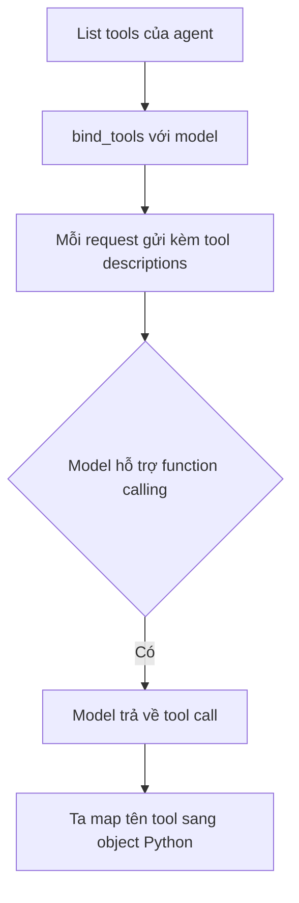

# 🛡️ Tool Binding và Defensive Prompting: Dạy Agent biết "kỷ luật" trước khi ra trận

> Nguồn: `028-Tool-Binding-and-Defensive-Prompting.txt` · [Udemy](https://ua.udemy.com/course/langchain/learn/lecture/54882095)

Tiếp nối bài trước, hôm nay chúng ta sẽ implement hàm **run_agent** — chính là **vòng lặp ReAct** mà mình đã giới thiệu sơ lược khi nói về thuật toán ReAct. Đây là trái tim của Layer 1, nên các bạn theo sát nhé!

### 📦 Gom tool vào list và tạo tool dictionary

Đầu tiên, mình tạo một **list chứa toàn bộ tool** của agent. Sau đó, mình tạo một **dictionary** với:

1. **Key** là tên của tool.
2. **Value** là chính tool đó — tức function Python.

Mình duyệt qua danh sách tools và truy cập thuộc tính `name` của từng tool để lấy key. Mục đích của dictionary này rất quan trọng: khi LLM trả về **tên tool** cần gọi, ta cần map nó sang **object Python** thật để thực thi. Viết code tới lúc dùng, các bạn sẽ thấy rõ hơn.

---

### 🔌 Khởi tạo LLM và bind tool

Mình dùng `init_chat_model` với provider là **ollama** và model **Qwen3 với 1.7 tỷ tham số**. Điểm hay là nếu muốn chuyển sang **OpenAI**, mình chỉ đổi chuỗi provider và tên model — không cần import object chat model của từng vendor.

Tiếp theo là bước quan trọng: **bind tool vào model** bằng hàm `bind_tools`, truyền vào list tools. Điều này có nghĩa là **mỗi lần gửi request tới LLM, tool descriptions cũng được gửi kèm**.

* Lưu ý: cách này chỉ hoạt động với **LLM hỗ trợ function calling**. Khi đó model có thể trả về câu trả lời dưới dạng **tool call** — tức là quyết định xem cần gọi tool nào.
* `bind_tools` hoạt động với **mọi chat model trong LangChain** hỗ trợ function calling. OpenAI hay Anthropic đều hỗ trợ → chỉ cần đổi chuỗi, không đổi code. Lớp abstraction này thực sự rất tiện.



Mình thêm vài dòng print cho dễ quan sát rồi chạy thử — câu hỏi được in ra đúng như mong đợi.

---

### 🧠 "Bộ não" của agent: System prompt và Defensive Prompting

Giờ đến phần thú vị nhất — mình viết **system prompt** cho agent với nội dung khởi đầu: *"You are a helpful shopping assistant. You have access to a product catalog tool and a discount tool."*

Điểm đặc biệt là mình áp dụng **defensive prompting** — đưa ra một loạt quy tắc nghiêm ngặt:

1. **Không bao giờ đoán hay giả định giá sản phẩm** — luôn phải chọn tool để lấy giá thật.
2. **Bắt buộc gọi `get_product_price`** để lấy giá thực tế.
3. **Chỉ gọi `apply_discount` sau khi** đã nhận được giá từ `get_product_price`.
4. **Truyền đúng con số giá vừa nhận được**, tuyệt đối không truyền một con số do model tự bịa ra.
5. **Không tự tính giảm giá bằng toán học** — luôn dùng tool `apply_discount`.
6. **Nếu người dùng chưa nêu hạng giảm giá** (bronze/silver/gold) thì phải hỏi lại, không được tự giả định.

Vì sao mình lại "khắt khe" như vậy? Vì mình đang dùng **open weight model là Qwen3** — khả năng reasoning thấp hơn nhiều so với các **top tier model** hỗ trợ function calling. Các open weight LLM đôi khi **hallucinate giá sản phẩm**, khiến kết quả không còn bám vào dữ liệu thật. Mình đã thêm các quy tắc này **sau vài lần chạy thử** và tận mắt thấy hiện tượng đó xảy ra.

| Tiêu chí | System prompt thường | Defensive prompting |
|---|---|---|
| Nội dung | Vai trò trợ lý mua sắm và danh sách tool | Thêm 6 quy tắc nghiêm ngặt về thứ tự gọi tool |
| Mục đích | Định hình hành vi chung | Chống hallucinate giá, ép model bám dữ liệu thật |
| Phù hợp với | Model mạnh, reasoning tốt | Open weight model reasoning thấp như Qwen3 |

*Một bài tập nhỏ rất hay:* bạn hãy thử **xóa các quy tắc nghiêm ngặt** này và xem điều gì sẽ xảy ra — biết đâu bạn sẽ có phát hiện thú vị!

---

### 💬 Message người dùng và lần chạy thử đầu tiên

Sau system message, mình thêm phần tử thứ hai vào list messages: một **HumanMessage** chứa câu hỏi nhận từ người dùng — trong trường hợp này là câu hỏi về giá sau khi áp hạng giảm giá gold.

*Nếu bạn chưa rõ các loại message, cứ ghé qua phần glossary của khóa học — mình mô tả chi tiết ở đó.*

---

### 💻 Code mẫu đầy đủ — `1_agent_loop_langchain_tool_calling.py`

Toàn bộ code của bài nằm trong file `1_agent_loop_langchain_tool_calling.py` (tham khảo từ repo chính thức của khóa học):

```python
from dotenv import load_dotenv

load_dotenv()

from langchain.chat_models import init_chat_model
from langchain.tools import tool
from langchain_core.messages import HumanMessage, SystemMessage, ToolMessage
from langsmith import traceable

MAX_ITERATIONS = 10
MODEL = "qwen3:1.7b"


# --- Tools (LangChain @tool decorator) ---


@tool
def get_product_price(product: str) -> float:
    """Look up the price of a product in the catalog."""
    print(f"    >> Executing get_product_price(product='{product}')")
    prices = {"laptop": 1299.99, "headphones": 149.95, "keyboard": 89.50}
    return prices.get(product, 0)


@tool
def apply_discount(price: float, discount_tier: str) -> float:
    """Apply a discount tier to a price and return the final price.
    Available tiers: bronze, silver, gold."""
    print(f"    >> Executing apply_discount(price={price}, discount_tier='{discount_tier}')")
    discount_percentages = {"bronze": 5, "silver": 12, "gold": 23}
    discount = discount_percentages.get(discount_tier, 0)
    return round(price * (1 - discount / 100), 2)


# --- Agent Loop ---


@traceable(name="LangChain Agent Loop")
def run_agent(question: str):
    tools = [get_product_price, apply_discount]
    tools_dict = {t.name: t for t in tools}

    llm = init_chat_model(f"ollama:{MODEL}", temperature=0)
    llm_with_tools = llm.bind_tools(tools)

    print(f"Question: {question}")
    print("=" * 60)

    messages = [
        SystemMessage(
            content=(
                "You are a helpful shopping assistant. "
                "You have access to a product catalog tool "
                "and a discount tool.\n\n"
                "STRICT RULES — you must follow these exactly:\n"
                "1. NEVER guess or assume any product price. "
                "You MUST call get_product_price first to get the real price.\n"
                "2. Only call apply_discount AFTER you have received "
                "a price from get_product_price. Pass the exact price "
                "returned by get_product_price — do NOT pass a made-up number.\n"
                "3. NEVER calculate discounts yourself using math. "
                "Always use the apply_discount tool.\n"
                "4. If the user does not specify a discount tier, "
                "ask them which tier to use — do NOT assume one."
            )
        ),
        HumanMessage(content=question),
    ]

    for iteration in range(1, MAX_ITERATIONS + 1):
        print(f"\n--- Iteration {iteration} ---")

        ai_message = llm_with_tools.invoke(messages)

        tool_calls = ai_message.tool_calls

        # If no tool calls, this is the final answer
        if not tool_calls:
            print(f"\nFinal Answer: {ai_message.content}")
            return ai_message.content

        # Process only the FIRST tool call — force one tool per iteration
        tool_call = tool_calls[0]
        tool_name = tool_call.get("name")
        tool_args = tool_call.get("args", {})
        tool_call_id = tool_call.get("id")

        print(f"  [Tool Selected] {tool_name} with args: {tool_args}")

        tool_to_use = tools_dict.get(tool_name)
        if tool_to_use is None:
            raise ValueError(f"Tool '{tool_name}' not found")

        observation = tool_to_use.invoke(tool_args)

        print(f"  [Tool Result] {observation}")

        messages.append(ai_message)
        messages.append(
            ToolMessage(content=str(observation), tool_call_id=tool_call_id)
        )

    print("ERROR: Max iterations reached without a final answer")
    return None


if __name__ == "__main__":
    print("Hello LangChain Agent (.bind_tools)!")
    print()
    result = run_agent("What is the price of a laptop after applying a gold discount?")
```

### 🎯 Tự kiểm tra nhanh

**Câu 1:** Vì sao cần tạo tool dictionary từ list tools?

<details>
<summary><b>Xem đáp án</b></summary>

**Đáp án:** Để map tên tool mà LLM trả về sang object Python thật rồi thực thi.

Giải thích: Key là tên tool, value là chính function; tra cứu lúc runtime.

Tham chiếu: Mục Gom tool vào list và tạo tool dictionary.

</details>

**Câu 2:** `bind_tools` tác động gì lên mỗi request gửi LLM?

<details>
<summary><b>Xem đáp án</b></summary>

**Đáp án:** Tool descriptions được gửi kèm mỗi lần gọi model.

Giải thích: Chỉ dùng được với model hỗ trợ function calling; model có thể trả về tool call.

Tham chiếu: Mục Khởi tạo LLM và bind tool.

</details>

**Câu 3:** Defensive prompting gồm những ràng buộc cốt lõi nào?

<details>
<summary><b>Xem đáp án</b></summary>

**Đáp án:** Không đoán giá, phải gọi `get_product_price` lấy giá thật, chỉ gọi `apply_discount` sau khi có giá, truyền đúng con số nhận được, không tự tính toán, chưa rõ hạng giảm giá thì phải hỏi lại.

Giải thích: 6 quy tắc này ép model đi đúng quy trình thay vì tự bịa.

Tham chiếu: Mục Bộ não của agent.

</details>

**Câu 4:** Vì sao phải siết quy tắc với Qwen3?

<details>
<summary><b>Xem đáp án</b></summary>

**Đáp án:** Vì đây là open weight model có reasoning thấp hơn top tier model, dễ hallucinate giá sản phẩm.

Giải thích: Quy tắc được thêm sau vài lần chạy thử khi tác giả tận mắt thấy hiện tượng đó.

Tham chiếu: Mục Bộ não của agent.

</details>

**Câu 5:** Chuyển từ Ollama sang OpenAI cần thay đổi gì trong code?

<details>
<summary><b>Xem đáp án</b></summary>

**Đáp án:** Chỉ đổi chuỗi provider và tên model trong `init_chat_model`, không cần import class của vendor.

Giải thích: `bind_tools` chạy với mọi chat model hỗ trợ function calling — đây là giá trị của lớp abstraction.

Tham chiếu: Mục Khởi tạo LLM và bind tool.

</details>

Mình lưu lại và chạy thử — mọi thứ hoạt động trơn tru. Ở video tiếp theo, chúng ta sẽ viết phần thân của agent loop: gọi LLM, xử lý tool call, và hoàn thiện vòng lặp ReAct đầu tiên! 🚀

## Nguồn tham khảo

- [Udemy — Tool Binding and Defensive Prompting](https://ua.udemy.com/course/langchain/learn/lecture/54882095)
- [LangChain Docs — Chat models và tool calling](https://docs.langchain.com/oss/python/langchain/models)
- [LangChain Docs — Tools](https://docs.langchain.com/oss/python/langchain/tools)
