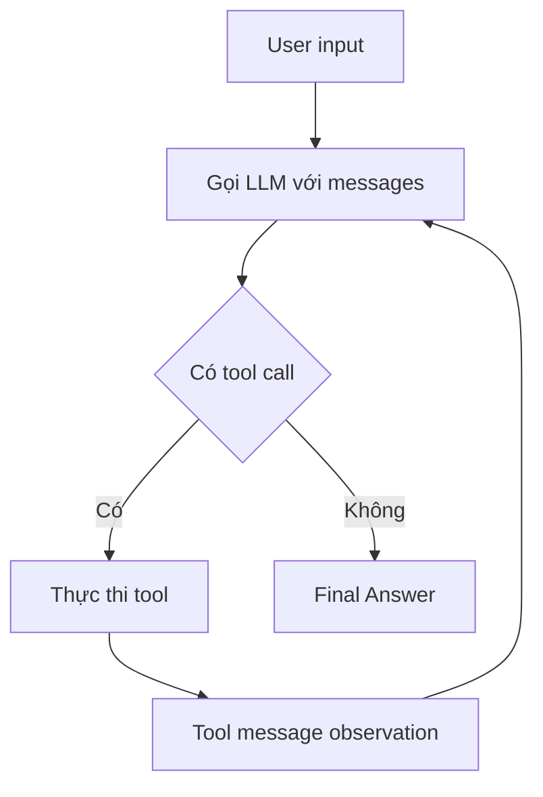

# 🔄 Tự tay viết ReAct Agent Loop trong LangChain: Từ Thought đến Final Answer

> Nguồn: `029-Understanding-the-ReAct-Agent-Loop-in-Langchain.txt` · [Udemy](https://ua.udemy.com/course/langchain/learn/lecture/54882097)

Sau khi đã có tool và biết cách bind tool vào model, hôm nay chúng ta sẽ implement **agent loop** — "trái tim" của mọi AI agent. Mình sẽ chạy debug từng bước để các bạn thấy rõ cách LLM suy nghĩ, chọn tool, thực thi và quay lại vòng lặp như thế nào.

*Đây là bài quan trọng nhất của Layer 1, nên mình sẽ đi thật kỹ nhé!*

### 🔁 Bước Thought: Vòng lặp và quyết định của LLM

Vòng lặp của chúng ta hoạt động như sau: mình sẽ lặp từ **1 đến max_iterations + 1** — đơn giản vì mình không muốn bắt đầu đếm từ 0. Mỗi vòng lặp, ta gửi messages cho LLM; LLM sẽ **suy nghĩ (thought)** và quyết định xem có cần thực thi tool hay không:

1. Nếu cần gọi tool, ta **thực thi tool** đó.
2. Lấy kết quả của tool **gửi ngược lại cho LLM**.
3. LLM tiếp tục các vòng lặp như vậy **cho đến khi không còn tool call nào** — đó cũng là lúc LLM quyết định đã có câu trả lời.
4. Mình in ra số thứ tự của từng vòng lặp để dễ theo dõi.

Toàn bộ vòng lặp gói gọn trong sơ đồ sau:



Tiếp theo là **thought step**: gọi LLM (đã kèm tools) với toàn bộ messages và nhận về một **AI message**. Message này sẽ chứa **quyết định gọi tool** của LLM, hoặc **content** — trong trường hợp model đã có câu trả lời và không muốn gọi tool nữa. Khi phần tool calls rỗng, nghĩa là LLM không cần thực thi tool → mình in ra "final answer", in luôn nội dung AI message và return giá trị này.

Để kiểm chứng, mình đặt breakpoint và chạy debug. Ta đang ở **vòng lặp 1**, với messages gồm **system message** và **user input**. Nhìn vào biến AI message, ta thấy có **content** — chính là quá trình suy nghĩ của model — và đặc biệt là có **tool calls**: LLM đã quyết định gọi **get_product_price** với tham số `product=laptop`. Vì tool calls không rỗng, vòng lặp tiếp tục.

---

### ⚙️ Thực thi tool call và Observation

Đây là lúc mình áp dụng một chút **defensive programming**: ngày nay LLM có thể trả về **nhiều tool call cùng lúc**, nhưng để ví dụ đơn giản và dễ hiểu, mình chỉ truy cập **tool call đầu tiên**. Về lý thuyết, tool_calls là một list có thể chứa nhiều phần tử — nhưng ở đây mình chỉ lấy phần tử đầu.

Mình trích xuất ba thứ từ tool call:

* **Tên tool** cần chạy — ở đây là `get_product_price`.
* **Tool arguments** — dictionary `product=laptop`.
* **Tool call id** — giúp ích khi trace mọi thứ trên LangSmith.

Sau đó, mình dùng **tools dictionary** đã khởi tạo từ trước để lấy hàm Python tương ứng — đây chính là lý do ta cần dictionary này. Biến nhận được là một **LangChain tool**, có thể gọi bằng method `invoke`. Nếu vì lý do gì đó không tìm thấy tool, mình raise lỗi; còn nếu ổn, mình **invoke tool với arguments** và thu được kết quả — gọi là **observation**.

Chạy debug, ta thấy mọi thứ diễn ra đúng như mong đợi: LLM chọn `get_product_price`, hàm chạy thành công, và trong biến observation là **giá thật của laptop**.

---

### 🧠 Ghi nhớ lịch sử — thứ tạo nên "agent"

Đến đây, ta đã dùng LLM như một **reasoning agent**: lấy output của nó, chạy tool cần thiết. Nhưng để agent thực sự "nhớ" mình đã làm gì, mỗi vòng lặp ta cần append vào messages:

* **AI message** — chứa tool call, tức quyết định của LLM.
* **Tool message** — chứa kết quả tool (observation) và **tool call ID** để phục vụ tracing.

| Thành phần | Chứa gì | Vai trò trong loop |
|---|---|---|
| AI message | Tool call + content suy nghĩ | Quyết định của LLM |
| Tool message | Kết quả tool + tool call ID | Observation cho LLM đọc ở vòng sau |
| `tools` dictionary | Tên tool → hàm Python | Tra cứu hàm để `invoke` |

Nhờ vậy, mỗi lần xử lý input, agent đều nhìn thấy **mọi bước nó đã làm trong quá khứ** — chính điều này tạo ra **agent capability**.

Vòng lặp kỳ vọng LLM sẽ kết thúc ở một thời điểm nào đó và không còn tool call, báo hiệu đã có đáp án. Nếu không, số vòng sẽ cứ tăng mãi — nên ta giới hạn 10 lần rồi dừng. Trong trường hợp đó, mình in thông báo lỗi rằng đã **max out số vòng lặp** và return rỗng.

---

### 🔍 Đọc trace và bài tập mapping

Chạy toàn bộ chương trình, ta thu được trace hoàn chỉnh cho câu hỏi *"What is the price of the laptop after applying the gold discount?"*:

1. **Vòng 1:** LLM chọn tool `get_product_price` với `product=laptop` → tool trả kết quả **1299**.
2. **Vòng 2:** LLM (đã thấy kết quả vòng trước) chọn `apply_discount` với hạng **gold** và mức giá nhận được → ra kết quả.
3. **Vòng 3:** Không còn tool call → trả về **final answer**.

Trên LangSmith, trace cho thấy rõ từng bước: gọi Ollama với hai tool `get_product_price` và `apply_discount`, system prompt, input, response chọn tool, rồi tool được thực thi — **tự động được trace** nhờ LangChain tool decorator. Tiếp đó là lần gọi LLM thứ hai với AI message chứa tool call cũ và ToolMessage chứa observation cùng **tool call id** khớp nhau (rất quan trọng khi tracing). Lần gọi thứ ba kết thúc với final answer không kèm tool call. Tổng cộng: **11 giây** và **2.4k token**.

*Bài tập cho các bạn:* hãy lấy **diagram của ReAct loop** và **map từng đoạn code** vào đó — đâu là thought process, đâu là tool invocation, khi nào LLM quyết định có final answer, và mỗi mũi tên trong state machine được implement như thế nào?

---

### 💻 Code mẫu đầy đủ — `1_agent_loop_langchain_tool_calling.py`

Toàn bộ code của bài nằm trong file `1_agent_loop_langchain_tool_calling.py` (tham khảo từ repo chính thức của khóa học):

```python
from dotenv import load_dotenv

load_dotenv()

from langchain.chat_models import init_chat_model
from langchain.tools import tool
from langchain_core.messages import HumanMessage, SystemMessage, ToolMessage
from langsmith import traceable

MAX_ITERATIONS = 10
MODEL = "qwen3:1.7b"


# --- Tools (LangChain @tool decorator) ---


@tool
def get_product_price(product: str) -> float:
    """Look up the price of a product in the catalog."""
    print(f"    >> Executing get_product_price(product='{product}')")
    prices = {"laptop": 1299.99, "headphones": 149.95, "keyboard": 89.50}
    return prices.get(product, 0)


@tool
def apply_discount(price: float, discount_tier: str) -> float:
    """Apply a discount tier to a price and return the final price.
    Available tiers: bronze, silver, gold."""
    print(f"    >> Executing apply_discount(price={price}, discount_tier='{discount_tier}')")
    discount_percentages = {"bronze": 5, "silver": 12, "gold": 23}
    discount = discount_percentages.get(discount_tier, 0)
    return round(price * (1 - discount / 100), 2)


# --- Agent Loop ---


@traceable(name="LangChain Agent Loop")
def run_agent(question: str):
    tools = [get_product_price, apply_discount]
    tools_dict = {t.name: t for t in tools}

    llm = init_chat_model(f"ollama:{MODEL}", temperature=0)
    llm_with_tools = llm.bind_tools(tools)

    print(f"Question: {question}")
    print("=" * 60)

    messages = [
        SystemMessage(
            content=(
                "You are a helpful shopping assistant. "
                "You have access to a product catalog tool "
                "and a discount tool.\n\n"
                "STRICT RULES — you must follow these exactly:\n"
                "1. NEVER guess or assume any product price. "
                "You MUST call get_product_price first to get the real price.\n"
                "2. Only call apply_discount AFTER you have received "
                "a price from get_product_price. Pass the exact price "
                "returned by get_product_price — do NOT pass a made-up number.\n"
                "3. NEVER calculate discounts yourself using math. "
                "Always use the apply_discount tool.\n"
                "4. If the user does not specify a discount tier, "
                "ask them which tier to use — do NOT assume one."
            )
        ),
        HumanMessage(content=question),
    ]

    for iteration in range(1, MAX_ITERATIONS + 1):
        print(f"\n--- Iteration {iteration} ---")

        ai_message = llm_with_tools.invoke(messages)

        tool_calls = ai_message.tool_calls

        # If no tool calls, this is the final answer
        if not tool_calls:
            print(f"\nFinal Answer: {ai_message.content}")
            return ai_message.content

        # Process only the FIRST tool call — force one tool per iteration
        tool_call = tool_calls[0]
        tool_name = tool_call.get("name")
        tool_args = tool_call.get("args", {})
        tool_call_id = tool_call.get("id")

        print(f"  [Tool Selected] {tool_name} with args: {tool_args}")

        tool_to_use = tools_dict.get(tool_name)
        if tool_to_use is None:
            raise ValueError(f"Tool '{tool_name}' not found")

        observation = tool_to_use.invoke(tool_args)

        print(f"  [Tool Result] {observation}")

        messages.append(ai_message)
        messages.append(
            ToolMessage(content=str(observation), tool_call_id=tool_call_id)
        )

    print("ERROR: Max iterations reached without a final answer")
    return None


if __name__ == "__main__":
    print("Hello LangChain Agent (.bind_tools)!")
    print()
    result = run_agent("What is the price of a laptop after applying a gold discount?")
```

### 🎯 Tự kiểm tra nhanh

**Câu 1:** Vòng lặp ReAct kết thúc khi nào?

<details>
<summary><b>Xem đáp án</b></summary>

**Đáp án:** Khi AI message không còn tool call nào.

Giải thích: LLM không gọi tool nữa nghĩa là nó đã có câu trả lời cuối cùng.

Tham chiếu: Mục Bước Thought.

</details>

**Câu 2:** Vì sao vòng lặp bị giới hạn `max_iterations`?

<details>
<summary><b>Xem đáp án</b></summary>

**Đáp án:** Để tránh lặp vô hạn khi LLM cứ gọi tool mãi không dừng.

Giải thích: Chạm trần thì in thông báo max out và trả về rỗng.

Tham chiếu: Mục Ghi nhớ lịch sử.

</details>

**Câu 3:** Tool call ID để làm gì?

<details>
<summary><b>Xem đáp án</b></summary>

**Đáp án:** Khớp ToolMessage với đúng tool call khi tracing/debug.

Giải thích: Trên LangSmith, ID hai bên phải khớp nhau.

Tham chiếu: Mục Thực thi tool call và Observation.

</details>

**Câu 4:** Vì sao phải append cả AI message lẫn Tool message vào lịch sử?

<details>
<summary><b>Xem đáp án</b></summary>

**Đáp án:** Để mỗi vòng LLM thấy được quyết định cũ và kết quả tool — tạo "agent capability".

Giải thích: Thiếu lịch sử thì agent như mất trí nhớ.

Tham chiếu: Mục Ghi nhớ lịch sử.

</details>

**Câu 5:** Đoạn code agent loop này liên quan gì tới `create_agent`?

<details>
<summary><b>Xem đáp án</b></summary>

**Đáp án:** `create_agent` implement logic tương tự — đây chính là lớp abstraction mà nó bọc lại.

Giải thích: Hiểu loop thủ công thì hiểu luôn vì sao LangChain hữu ích.

Tham chiếu: Đoạn kết bài.

</details>

Những gì ta làm hôm nay chính là **lớp đầu tiên của việc bóc tách abstraction của agent**. Hàm `create_agent` của LangChain thực chất implement logic rất giống đoạn code này. Ở video tiếp theo, mình sẽ implement lại **hoàn toàn raw, không dùng LangChain** — khi đó các bạn sẽ thực sự thấy vì sao LangChain hữu ích và những vấn đề nó giải quyết cho chúng ta. Hẹn gặp lại! 🚀

## Nguồn tham khảo

- [Udemy — Understanding the ReAct Agent Loop in Langchain](https://ua.udemy.com/course/langchain/learn/lecture/54882097)
- [LangChain Docs — Agents](https://docs.langchain.com/oss/python/langchain/agents)
