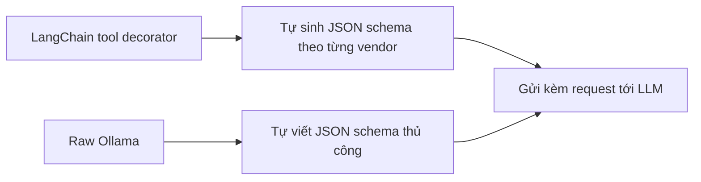

# 📋 Manual JSON Schemas: Tự tay "đóng gói" tool khi rời bỏ LangChain

> Nguồn: `031----------Layer-2-Manual-JSON-Schemas-vs-LangChain-Tool-Abstr.txt` · [Udemy](https://ua.udemy.com/course/langchain/learn/lecture/54882733)

Chào mừng các bạn đến với **Layer 2: Raw Function Calling**! Chúng ta bắt đầu hành trình bóc tách abstraction bằng việc nói lời tạm biệt với các object của LangChain — và ngay lập tức, một công việc "nặng nhọc" mà LangChain vẫn làm thay ta sẽ lộ diện.

### 🧹 Dọn dẹp LangChain khỏi file mới

Mình tạo file `2_agent_loop_raw_function_calling.py` (đang để trống), rồi **copy toàn bộ implementation** từ video trước sang. Sau đó, chúng ta lần lượt **gỡ bỏ mọi object của LangChain**:

* Bỏ **chat model** của LangChain.
* Bỏ **LangChain tools**.
* Bỏ **LangChain messages**.

Thay vào đó, mình import **Ollama** — tức là **Ollama Python SDK**. Thú vị là package này **đã có sẵn trong môi trường ảo**: khi cài `langchain-ollama`, nó được kéo về như một **dependency**.

Vì không còn dùng decorator `tool` của LangChain, mình không thể để nó tự biến hàm Python thành tool nữa. Tuy vậy, mình vẫn muốn trace hai hàm này như những tool riêng biệt, nên mình dùng **LangSmith traceable** và gán **type là tool** — nhờ đó mỗi hàm sẽ có trace riêng trên LangSmith khi chạy.

Vấn đề còn lại: hai hàm vẫn chỉ là **Python functions**, trong khi ta cần chuyển chúng thành **tool mà LLM có thể "tiêu hóa"** và tích hợp vào function calling.

---

### 📄 Tìm hiểu JSON schema trong tài liệu Ollama

Mình mở trang **tool calling** trong tài liệu Ollama. Ở ví dụ cURL, ta thấy phải gửi request tới Ollama server kèm model, message, và trong tham số **tools** — ta cần cung cấp một **JSON scheme** (JSON schema).

Schema này phải mô tả tường minh: **tên tool**, **các argument nó nhận**, và **giá trị trả về**. Trước đây, khi dùng **LangChain tool decorator**, mọi thứ được làm **tự động** cho chúng ta. Giờ thì không — ta phải tự viết tay.

Điều đáng nói: **Ollama không có formal definition** rõ ràng về JSON schema này trong tài liệu. Bạn chỉ thấy **một ví dụ** duy nhất — có thể tìm thêm trong source code — nhưng không có chỗ nào định nghĩa chính thức những gì cần và phải có trong schema.

Điều này khiến developer khá vất vả. Tất nhiên, ta có thể đưa ví dụ cho **Cursor** hoặc **Claude Code** để nó sinh schema giúp, nhưng theo mình, lẽ ra phải có **một nơi định nghĩa rõ ràng** loại JSON schema nào được phép truyền vào.

Theo ví dụ trong tài liệu, schema cần: **type của function**, rồi mô tả **name**, **description**, và **parameters** — ví dụ một tham số `city` kiểu **string**.

---

### 🐍 Python SDK và "cú lừa" mang tên Google-style docstring

Chuyển sang ví dụ **Python SDK**, ta thấy Ollama dùng **Ollama chat object** — nhận **model**, **messages** và **tools**, trong đó tools có thể là **chính các Python function**.

Nghe rất tiện: Ollama có thể **tự chuyển Python function thành tool** dùng được với Ollama. Nhưng có một điều kiện "ẩn": hàm của bạn phải có **docstring theo chuẩn Google style**. Và điều này **không hề được nói rõ trong tài liệu** — mình phải mò vào **source code** của package open source, tìm đến phần implementation của `chat`, mới thấy ghi chú yêu cầu đó.

Trong source code, **tools** có thể là:

1. **JSON scheme dạng dictionary** — đúng thứ ta vừa xem trong tài liệu.
2. **Ollama tool** — object tương tự LangChain tool nhưng là "phiên bản" của Ollama.
3. **Python function** — kèm điều kiện Google-style docstring.

Vậy là có hai lựa chọn: sửa docstring theo chuẩn Google để dùng hàm trực tiếp, hoặc tự viết JSON schema.

| Cách truyền tools | Yêu cầu | Ghi chú |
|---|---|---|
| JSON schema dạng dictionary | Viết tay đúng cấu trúc | Đúng thứ tài liệu cURL mô tả |
| Ollama tool object | Dùng object của Ollama | Tương tự LangChain tool nhưng là phiên bản Ollama |
| Python function | Docstring chuẩn Google style | Ollama tự sinh schema giúp, điều kiện không được nêu rõ trong tài liệu |

Và nhớ nhé — mọi thứ mình vừa trình bày **chỉ đúng với Ollama**. Sang **Anthropic**, cách định nghĩa tool cũng dùng JSON schema nhưng **cấu trúc khác hẳn**. Cursor hay Claude Code có thể sinh giúp, nhưng nếu bạn muốn **chuyển đổi qua lại giữa nhiều vendor**, **chi phí phát triển sẽ rất cao** — tốn thời gian cho từng tích hợp, trong khi dùng **interface của LangChain** thì mọi thứ có sẵn **out of the box**.

---

### 🧰 Viết schema cho get_product_price

Quay lại code, mình tạo một list tên **tools_for_llm** và phần tử đầu tiên là dictionary JSON scheme. Theo tài liệu, schema gồm:

* **type**: `function`.
* **name**: `get_product_price`.
* **description**: "Look up a price of a product in the catalog" — tương tự mô tả hàm ban đầu.
* **parameters**: kiểu `object`, với **properties** là `product` kiểu **string**, mô tả ví dụ như laptop, headphones, keyboard.
* **required**: `product`.

Schema này mình **chuẩn bị trước ở nhà** và là bản phái sinh từ chính tài liệu. Mình cũng khuyên các bạn **copy từ branch GitHub** của khóa học thay vì gõ tay từng dòng — và mình cũng làm điều tương tự cho tool thứ hai.

Tóm lại, các bạn vừa thấy hai sự thật thú vị:

1. Ollama **có thể tự sinh schema** nếu ta truyền thẳng function làm tool — với điều kiện dùng **Google-style docstring**.
2. Nhưng mình cố tình chọn cách **viết JSON schema thủ công** để các bạn thấy rõ **LangChain tool decorator đã làm gì cho chúng ta**: nó tự sinh **JSON schema chuẩn theo từng vendor** — Anthropic một kiểu, Ollama một kiểu, mỗi bên có style, keyword và format khác nhau.



---

### 💻 Code mẫu đầy đủ — `2_agent_loop_raw_function_calling.py`

Toàn bộ code của bài nằm trong file `2_agent_loop_raw_function_calling.py` (tham khảo từ repo chính thức của khóa học):

```python
from dotenv import load_dotenv

load_dotenv()

import ollama
from langsmith import traceable

MAX_ITERATIONS = 10
MODEL = "qwen3:1.7b"


# --- Tools (LangChain @tool decorator) ---


@traceable(run_type="tool")
def get_product_price(product: str) -> float:
    """Look up the price of a product in the catalog."""
    print(f"    >> Executing get_product_price(product='{product}')")
    prices = {"laptop": 1299.99, "headphones": 149.95, "keyboard": 89.50}
    return prices.get(product, 0)


@traceable(run_type="tool")
def apply_discount(price: float, discount_tier: str) -> float:
    """Apply a discount tier to a price and return the final price.
    Available tiers: bronze, silver, gold."""
    print(f"    >> Executing apply_discount(price={price}, discount_tier='{discount_tier}')")
    discount_percentages = {"bronze": 5, "silver": 12, "gold": 23}
    discount = discount_percentages.get(discount_tier, 0)
    return round(price * (1 - discount / 100), 2)

# Difference 2: Without @tool, we must MANUALLY define the JSON schema for each function.
# This is exactly what LangChain's @tool decorator generates automatically
# from the function's type hints and docstring.
tools_for_llm = [
    {
        "type": "function",
        "function": {
            "name": "get_product_price",
            "description": "Look up the price of a product in the catalog.",
            "parameters": {
                "type": "object",
                "properties": {
                    "product": {
                        "type": "string",
                        "description": "The product name, e.g. 'laptop', 'headphones', 'keyboard'",
                    },
                },
                "required": ["product"],
            },
        },
    },
    {
        "type": "function",
        "function": {
            "name": "apply_discount",
            "description": "Apply a discount tier to a price and return the final price. Available tiers: bronze, silver, gold.",
            "parameters": {
                "type": "object",
                "properties": {
                    "price": {"type": "number", "description": "The original price"},
                    "discount_tier": {
                        "type": "string",
                        "description": "The discount tier: 'bronze', 'silver', or 'gold'",
                    },
                },
                "required": ["price", "discount_tier"],
            },
        },
    },
]


# NOTE: Ollama can also auto-generate these schemas if you pass the functions
# directly as tools (similar to LangChain's @tool decorator):
#   tools_for_llm = [get_product_price, apply_discount]
# However, this requires your docstrings to follow the Google docstring format
# so Ollama can parse parameter descriptions from the Args section. For example:
#   def get_product_price(product: str) -> float:
#       """Look up the price of a product in the catalog.
#
#       Args:
#           product: The product name, e.g. 'laptop', 'headphones', 'keyboard'.
#
#       Returns:
#           The price of the product, or 0 if not found.
#       """
# We keep the manual JSON version here so you can see what @tool hides from you.

# --- Helper: traced Ollama call ---
# Difference 3: Without LangChain, we must manually trace LLM calls for LangSmith.


@traceable(name="Ollama Chat", run_type="llm")
def ollama_chat_traced(messages):
    return ollama.chat(model=MODEL, tools=tools_for_llm, messages=messages)

# --- Agent Loop ---


@traceable(name="Ollama Agent Loop")
def run_agent(question: str):
    tools_dict = {
        "get_product_price": get_product_price,
        "apply_discount": apply_discount,
    }


    print(f"Question: {question}")
    print("=" * 60)

    messages = [
        {
            "role": "system",
            "content": (
                "You are a helpful shopping assistant. "
                "You have access to a product catalog tool "
                "and a discount tool.\n\n"
                "STRICT RULES — you must follow these exactly:\n"
                "1. NEVER guess or assume any product price. "
                "You MUST call get_product_price first to get the real price.\n"
                "2. Only call apply_discount AFTER you have received "
                "a price from get_product_price. Pass the exact price "
                "returned by get_product_price — do NOT pass a made-up number.\n"
                "3. NEVER calculate discounts yourself using math. "
                "Always use the apply_discount tool.\n"
                "4. If the user does not specify a discount tier, "
                "ask them which tier to use — do NOT assume one."
            ),
        },
        {"role": "user", "content": question},
    ]

    for iteration in range(1, MAX_ITERATIONS + 1):
        print(f"\n--- Iteration {iteration} ---")

        # Difference 5: ollama.chat() directly instead of llm_with_tools.invoke()
        response = ollama_chat_traced(messages=messages)
        ai_message = response.message

        tool_calls = ai_message.tool_calls

        # If no tool calls, this is the final answer
        if not tool_calls:
            print(f"\nFinal Answer: {ai_message.content}")
            return ai_message.content

        # Process only the FIRST tool call — force one tool per iteration
        tool_call = tool_calls[0]
        # Difference 6: Attribute access (.function.name) instead of dict access (.get("name"))
        tool_name = tool_call.function.name
        tool_args = tool_call.function.arguments

        print(f"  [Tool Selected] {tool_name} with args: {tool_args}")

        tool_to_use = tools_dict.get(tool_name)
        if tool_to_use is None:
            raise ValueError(f"Tool '{tool_name}' not found")

        # Difference 7: Direct function call instead of tool.invoke()
        observation = tool_to_use(**tool_args)


        print(f"  [Tool Result] {observation}")

        messages.append(ai_message)
        messages.append(
            {
                "role": "tool",
                "content": str(observation),
            }
        )

    print("ERROR: Max iterations reached without a final answer")
    return None


if __name__ == "__main__":
    print("Hello LangChain Agent (.bind_tools)!")
    print()
    result = run_agent("What is the price of a laptop after applying a gold discount?")
```

### 🎯 Tự kiểm tra nhanh

**Câu 1:** Khi bỏ LangChain, hai hàm Python còn thiếu gì để LLM dùng được?

<details>
<summary><b>Xem đáp án</b></summary>

**Đáp án:** JSON schema mô tả tường minh tên tool, các argument nhận vào và giá trị trả về.

Giải thích: Không còn decorator tự sinh giúp nên ta phải tự viết tay.

Tham chiếu: Mục Tìm hiểu JSON schema trong tài liệu Ollama.

</details>

**Câu 2:** Ollama có thể tự sinh schema khi nào?

<details>
<summary><b>Xem đáp án</b></summary>

**Đáp án:** Khi ta truyền thẳng Python function làm tool kèm docstring chuẩn Google style.

Giải thích: Điều kiện này không được nêu rõ trong tài liệu, phải mò vào source code mới thấy.

Tham chiếu: Mục Python SDK và "cú lừa" mang tên Google-style docstring.

</details>

**Câu 3:** Vì sao tác giả vẫn chọn viết JSON schema thủ công?

<details>
<summary><b>Xem đáp án</b></summary>

**Đáp án:** Để thấy rõ LangChain tool decorator đã tự sinh JSON schema chuẩn theo từng vendor cho chúng ta như thế nào.

Giải thích: Anthropic một kiểu, Ollama một kiểu — mỗi bên có style, keyword, format khác nhau.

Tham chiếu: Mục Viết schema cho get_product_price.

</details>

**Câu 4:** Vấn đề của tài liệu Ollama là gì?

<details>
<summary><b>Xem đáp án</b></summary>

**Đáp án:** Không có formal definition về JSON schema, chỉ có một ví dụ duy nhất.

Giải thích: Developer phải tự mò hoặc nhờ Cursor, Claude Code sinh schema giúp.

Tham chiếu: Mục Tìm hiểu JSON schema trong tài liệu Ollama.

</details>

**Câu 5:** Vì sao chuyển đổi giữa nhiều vendor tốn kém khi không có LangChain?

<details>
<summary><b>Xem đáp án</b></summary>

**Đáp án:** Mỗi vendor định nghĩa tool bằng cấu trúc JSON schema và convention khác nhau, phải viết lại cho từng tích hợp.

Giải thích: Dùng interface của LangChain thì mọi thứ có sẵn out of the box.

Tham chiếu: Mục Python SDK và "cú lừa" mang tên Google-style docstring.

</details>

Đó chính là **giá trị của LangChain tool abstraction**. Ở video tiếp theo, chúng ta sẽ dùng những schema này để dựng lại agent loop với Ollama SDK thuần. Hẹn gặp lại! 🚀

## Nguồn tham khảo

- [Udemy — Manual JSON Schemas vs LangChain Tool Abstraction](https://ua.udemy.com/course/langchain/learn/lecture/54882733)
- [Ollama Docs — Tool calling](https://docs.ollama.com/capabilities/tool-calling)
- [Ollama Python SDK trên GitHub](https://github.com/ollama/ollama-python)
