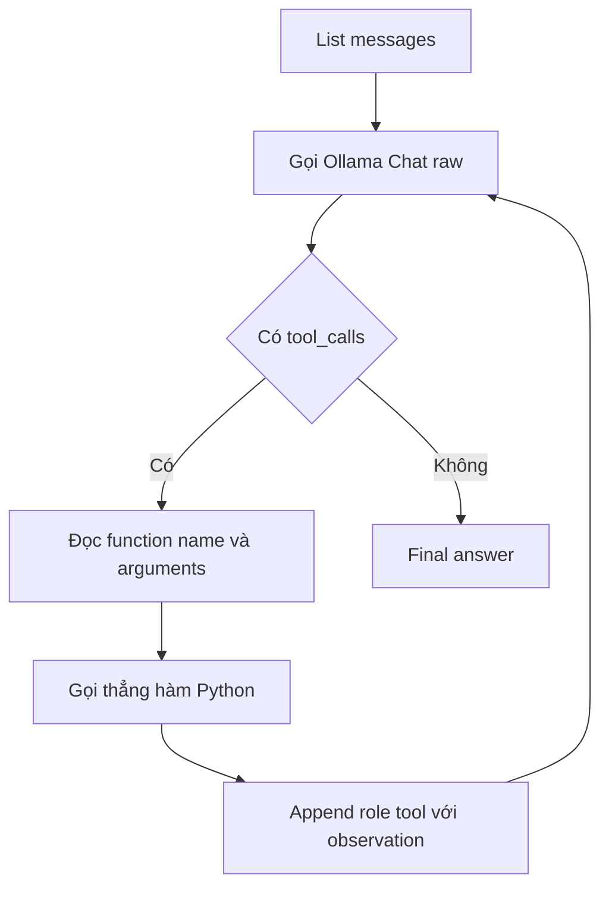

# 🔧 Dựng lại ReAct Agent Loop bằng Raw Ollama SDK: Khi không còn LangChain che chở

> Nguồn: `032-Building-a-ReAct-Agent-Loop-with-the-Raw-Ollama-SDK.txt` · [Udemy](https://ua.udemy.com/course/langchain/learn/lecture/54885511)

Sau khi đã tự tay viết JSON schema cho tool, hôm nay chúng ta tiếp tục bóc lớp abstraction tiếp theo: **chat model**. Mình sẽ dựng lại nguyên vẹn vòng lặp ReAct nhưng chỉ dùng **Ollama SDK thuần**.

*Nghe có vẻ khô khan, nhưng đây chính là lúc bạn thấy rõ LangChain đã "cõng" bao nhiêu việc nặng cho chúng ta.*

### 🔍 Tự trace Ollama Chat — vì không còn LangChain lo giúp

Thay vì dùng `init_chat_model`, chúng ta chuyển sang **Ollama Chat model**. Vì đây **không phải LangChain chat model**, ta cần tự trace nó để vẫn quan sát được đẹp đẽ trên LangSmith.

Cách làm của mình: tạo một **hàm phụ trợ (auxiliary function)**, bọc bằng **traceable** của LangSmith, đặt **run type là `llm`** và tên là **Ollama Chat**. Hàm này:

1. Nhận vào một **list messages**.
2. Gọi **Ollama Chat client** với **model Qwen3**, **tools** (chính là JSON scheme đã chuẩn bị) và **messages** cần cho LLM "tiêu hóa".

*Và đây chính là điểm khác biệt: nếu dùng LangChain, ta được tracing out of the box, không cần hàm phụ trợ này.*

---

### 🗂️ tools_dict viết tay và messages theo chuẩn Ollama

Trước đây, ta tạo **tool dictionary** dựa vào thuộc tính **tool name** của LangChain — giờ với Ollama thì không có. Nên mình **viết tay**: `get_product_price` map sang chính function `get_product_price`, và `apply_discount` map sang function `apply_discount`.

Phần **bind tool vào LLM** không còn cần thiết nữa, vì đã có hàm Ollama Chat traced đảm nhiệm — mình xóa nó.

Với messages, ta phải **format lại toàn bộ** vì không còn `HumanMessage`:

* Thay vì HumanMessage, ta truyền **role là `user`** và content là câu hỏi. Điểm thú vị: Ollama gọi role này là **user**, còn một số vendor khác gọi là **human**. Khi dùng LangChain HumanMessage, nó tự động làm phần chuyển đổi này hộ ta.
* Tương tự, mình thay SystemMessage bằng **role `system`** cùng nội dung prompt như cũ.

| Thành phần | LangChain | Ollama SDK raw |
|---|---|---|
| Chat model | `init_chat_model` | Gọi thẳng `ollama.chat` |
| Tool binding | `bind_tools` | Truyền `tools` list trong lệnh gọi |
| Tool call | Object có `id` | Object ChatOllama, không có id |
| Message kết quả | ToolMessage | Dictionary role `tool` |
| Tracing | Có sẵn out of the box | Tự viết hàm traceable |
| Gọi tool | Qua Runnable interface | Gọi thẳng hàm Python |

Một lần nữa — **mọi thứ ở đây đều đặc thù cho Ollama**. Chuyển sang Anthropic sẽ là convention, cách đặt tên và cách xử lý khác. Đó chính là lý do **chi phí chuyển vendor khi không có LangChain rất cao**.

---

### 🔁 Bước thought: Xử lý tool call theo "phong cách Ollama"

Bước tiếp theo là lấy **tool calls** từ thought step theo kiểu Ollama. Mình gọi hàm `Ollama Chat` (hàm traced ta vừa viết) — lúc này đang **gọi thẳng Ollama SDK**.

Điểm quan trọng: response trả về là **Ollama response**, **không phải AI message object của LangChain**. Cấu trúc của nó như sau:

* Response có field **message** — mình gán vào biến `ai_message`.
* Message này có thuộc tính **`tool_calls`** — mình gán vào biến `tool_calls` để chuẩn hóa theo implementation cũ.

Chạy debug để xem tận mắt: response là **ChatResponse của Ollama**, chứa field **messages**; message có **role là `assistant`** (một số vendor khác gọi là **`AI`**), cùng **content** và **tool_calls**. Bên trong, tool call là một **object ChatOllama tool call** — **cấu trúc khác** với tool call object của LangChain.

Một chi tiết đáng chú ý: **Ollama không có tool call id**. Vì vậy, mình đổi đoạn code trích xuất: truy cập trực tiếp `tool_call.function.name` và `tool_call.function.arguments` — ví dụ tên là `get_product_price`, arguments là dictionary `product=laptop`.

---

### ⚡ Thực thi tool, truyền observation và kiểm tra trace

Phần thực thi cũng "raw" hơn hẳn:

* Vì không có **Runnable interface** của LangChain, ta **gọi thẳng function Python** với dictionary arguments nhận được.
* Kết quả trả về chính là **observation**.
* Để truyền observation ngược lại cho LLM, thay vì append **ToolMessage** của LangChain, ta append một **dictionary với role `tool`** và content là observation.

Chạy lại toàn bộ và xem kết quả — mọi thứ hoạt động chính xác:

1. **Vòng 1:** chọn `get_product_price` với `product=laptop`, thực thi tool.
2. **Vòng 2:** LLM quyết định gọi `apply_discount` với arguments đúng, ta chạy tool.
3. **Vòng 3:** không còn tool call nào — kết thúc.

Mở LangSmith, mình phát hiện trace vẫn mang tên cũ **"LangChain Agent Loop"** — mình quên đổi tên mất! Sau khi sửa thành **"Ollama Agent Loop"** và chạy lại, trace cho thấy rõ đây đang gọi **Ollama Chat** — **raw SDK của Ollama**, không phải chat Ollama của LangChain. **Câu trả lời cuối cùng là 1,099** — chính xác, sau khi chạy đúng `get_product_price` và `apply_discount`.

### 🎯 Tự kiểm tra nhanh

**Câu 1:** Vì sao phải viết hàm phụ trợ traceable cho Ollama Chat?

<b>Xem đáp án</b>

**Đáp án:** Vì Ollama Chat model không phải LangChain chat model nên không được trace tự động.

Giải thích: Hàm bọc bằng `traceable`, run type là `llm`, tên "Ollama Chat", để vẫn quan sát đẹp trên LangSmith.

Tham chiếu: Mục Tự trace Ollama Chat.

**Câu 2:** tools_dict viết tay dùng để làm gì?

<b>Xem đáp án</b>

**Đáp án:** Map tên tool mà LLM trả về sang function Python tương ứng để thực thi.

Giải thích: Trước đây dictionary được dựng từ thuộc tính tool name của LangChain, giờ phải viết tay.

Tham chiếu: Mục tools_dict viết tay và messages theo chuẩn Ollama.

**Câu 3:** Message được format lại khác LangChain như thế nào?

<b>Xem đáp án</b>

**Đáp án:** HumanMessage thay bằng role `user`, SystemMessage thay bằng role `system`.

Giải thích: Ollama gọi vai trò là user trong khi một số vendor khác gọi là human; LangChain tự làm phần chuyển đổi này hộ ta.

Tham chiếu: Mục tools_dict viết tay và messages theo chuẩn Ollama.

**Câu 4:** Tool call của Ollama khác của LangChain ở điểm nào?

<b>Xem đáp án</b>

**Đáp án:** Ollama không có tool call id, phải truy cập trực tiếp `tool_call.function.name` và `tool_call.function.arguments`.

Giải thích: Object ChatOllama tool call cũng có cấu trúc khác tool call object của LangChain.

Tham chiếu: Mục Bước thought: Xử lý tool call theo "phong cách Ollama".

**Câu 5:** Observation được truyền ngược lại cho LLM bằng cách nào?

<b>Xem đáp án</b>

**Đáp án:** Append một dictionary với role `tool` và content là observation, thay cho ToolMessage.

Giải thích: Không còn Runnable interface nên gọi thẳng function Python với dictionary arguments nhận được.

Tham chiếu: Mục Thực thi tool, truyền observation và kiểm tra trace.

Mình sẽ chia sẻ trace này trong phần tài nguyên của video. Hẹn gặp lại các bạn ở video recap để cùng nhìn lại hành trình này! 🚀

## Nguồn tham khảo

- [Udemy — Building a ReAct Agent Loop with the Raw Ollama SDK](https://ua.udemy.com/course/langchain/learn/lecture/54885511)
- [Ollama Docs — Tool calling](https://docs.ollama.com/capabilities/tool-calling)
- [LangSmith Docs — Custom instrumentation với traceable](https://docs.langchain.com/langsmith/annotate-code)
