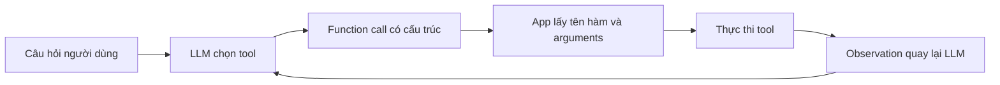

# 🧅 Recap Layer 2: Nhìn lại hành trình bóc tách các lớp abstraction

> Nguồn: `033-Recap.txt` · [Udemy](https://ua.udemy.com/course/langchain/learn/lecture/54885517)

Chúng ta vừa hoàn thành một chặng đường khá "deep" — hôm nay mình muốn cùng các bạn **nhìn lại toàn bộ implementation** và đúc kết ý nghĩa thật sự của nó.

*Bài này không có code mới, nhưng lại là một trong những bài quan trọng nhất để "ngấm" triết lý của cả khóa học.*

### 🎯 Mục tiêu của cả hành trình

Toàn bộ video và implementation này nhằm **bóc dần các lớp abstraction của LangChain**, để bạn thấy rõ:

* LangChain đang **làm gì** cho chúng ta.
* **Vì sao** nó làm như vậy.
* Nó **giải quyết vấn đề gì**.

Mình muốn nhắc lại điều này một lần nữa, vì đây chính là "kim chỉ nam" xuyên suốt các phần tiếp theo: mỗi lần bóc một lớp, ta lại hiểu thêm một tầng về cách AI agent vận hành.

---

### 🧱 Layer 1: Học bằng object của LangChain

Ở **Layer 1**, chúng ta bắt đầu bằng việc hiểu **agent loop là gì**, rồi implement nó với **các object của LangChain** — chat model, tool, các loại message. Sau đó, khi chuyển sang implementation raw, chúng ta thấy tận mắt những object đó đã implement gì **under the hood**, giải quyết vấn đề gì, và vì sao chúng **được sinh ra ngay từ đầu**.

---

### ⚙️ Function calling: Điểm chung của cả hai implementation

Điểm thú vị là cả hai implementation — LangChain lẫn raw — đều dùng **function calling**:

1. Chúng ta **giao trách nhiệm chọn tool cho LLM**.
2. Nhận lại quyết định của LLM qua một **API đẹp đẽ, có cấu trúc**.
3. Chỉ cần lấy **tên function và arguments** để thực thi trong ứng dụng của mình.

Nhưng mình muốn nhấn mạnh một điều: **Function calling không phải là phép thuật.** Nó hoạt động như thế nào bên dưới? Đó là câu hỏi của lớp tiếp theo.

| Tiêu chí | Layer 1 — LangChain | Layer 2 — Raw Ollama |
|---|---|---|
| Chat model | Object LangChain | Ollama SDK thuần |
| Tool | Decorator tự sinh schema | JSON schema viết tay |
| Message | HumanMessage, ToolMessage | Dictionary role user, tool |
| Tracing | Có sẵn out of the box | Tự viết hàm traceable |
| Điểm chung | Function calling | Function calling |

---

### 🕳️ Layer tiếp theo: Lớp sâu nhất về agent

Video tiếp theo sẽ đưa chúng ta tới **lớp sâu nhất trong chủ đề agent**: hiểu **function calling hoạt động thế nào under the hood**.

* Chúng ta sẽ **bóc thêm một lớp abstraction nữa** của function calling.
* Ta sẽ thấy cách **tái tạo hành vi function calling** từ chính LLM để dùng nó như một **reasoning agent**.
* Và tất cả sẽ được làm bằng **prompting thuần túy** — theo mình, đây là phần cực kỳ thú vị.

Đặc biệt, **thời kỳ đầu khi agent mới ra đời**, đây chính là cách mọi thứ được thực hiện — những implementation AI agent đầu tiên. Nắm được tất cả các lớp abstraction này sẽ cho bạn **hiểu biết cực sâu** về những gì xảy ra khi một agent đang chạy.

### 🎯 Tự kiểm tra nhanh

**Câu 1:** Mục tiêu xuyên suốt của hành trình này là gì?

<b>Xem đáp án</b>

**Đáp án:** Bóc dần các lớp abstraction của LangChain để thấy nó làm gì, vì sao làm và giải quyết vấn đề gì.

Giải thích: Mỗi lần bóc một lớp, ta hiểu thêm một tầng về cách AI agent vận hành.

Tham chiếu: Mục Mục tiêu của cả hành trình.

**Câu 2:** Layer 1 được implement bằng gì?

<b>Xem đáp án</b>

**Đáp án:** Các object của LangChain — chat model, tool, các loại message.

Giải thích: Khi chuyển sang bản raw, ta thấy tận mắt những object đó implement gì under the hood.

Tham chiếu: Mục Layer 1: Học bằng object của LangChain.

**Câu 3:** Điểm chung của cả hai implementation là gì?

<b>Xem đáp án</b>

**Đáp án:** Function calling — giao trách nhiệm chọn tool cho LLM, nhận quyết định qua API có cấu trúc, lấy tên function và arguments để thực thi.

Giải thích: Đây là nền tảng chung của cả bản LangChain lẫn bản raw.

Tham chiếu: Mục Function calling: Điểm chung của cả hai implementation.

**Câu 4:** Function calling có phải "phép thuật" không?

<b>Xem đáp án</b>

**Đáp án:** Không — nó có cơ chế hoạt động bên dưới và đó là nội dung của lớp tiếp theo.

Giải thích: Ta sẽ tái tạo hành vi function calling từ chính LLM bằng prompting thuần túy.

Tham chiếu: Mục Layer tiếp theo: Lớp sâu nhất về agent.

**Câu 5:** Vì sao nên hiểu tường tận các lớp abstraction này?

<b>Xem đáp án</b>

**Đáp án:** Để hiểu sâu điều gì xảy ra khi một agent đang chạy.

Giải thích: Thời kỳ đầu khi agent mới ra đời, mọi thứ được thực hiện bằng prompting thuần — đây là cách những implementation AI agent đầu tiên hoạt động.

Tham chiếu: Mục Layer tiếp theo: Lớp sâu nhất về agent.

Hẹn gặp các bạn ở lớp tiếp theo — hãy sẵn sàng cho phần "prompt thuần" đầy thú vị này nhé! 🚀

## Nguồn tham khảo

- [Udemy — Recap Layer 2](https://ua.udemy.com/course/langchain/learn/lecture/54885517)
- [LangChain Docs — Tools](https://docs.langchain.com/oss/python/langchain/tools)
- [Ollama Docs — Tool calling](https://docs.ollama.com/capabilities/tool-calling)
