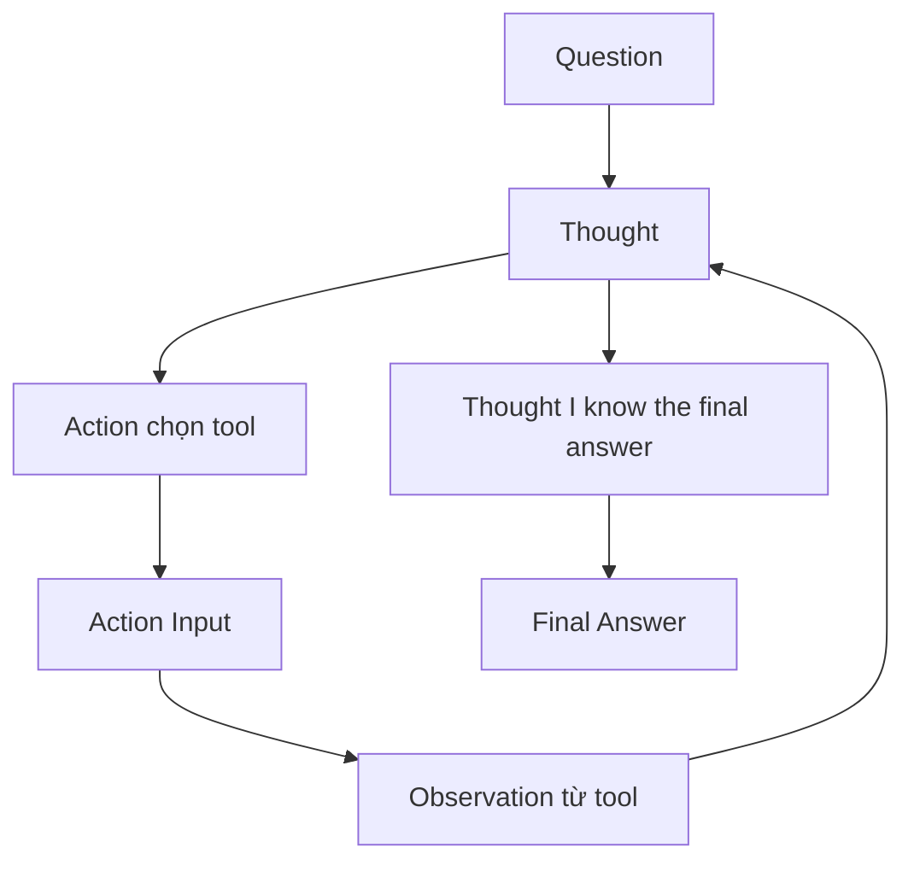

# 🧠 ReAct Prompt: Prompt quan trọng nhất trong AI Engineering (Nền tảng của mọi Agent)

> Nguồn: `034-What-are-we-building-Function-Calling-Yes-we-are-building-Fu.txt` · [Udemy](https://ua.udemy.com/course/langchain/learn/lecture/54977427)

Xin chào, Eden đây! Trong video này, chúng ta sẽ cùng tìm hiểu **ReAct prompt** — theo mình, đây là **prompt quan trọng nhất trong AI Engineering**, và là **nền tảng cho mọi agent** mà bạn thấy ngày nay. Chính prompt này đã giúp LLM hoạt động như một **reasoning engine (cỗ máy lập luận)** — và là thứ đã **khởi đầu cho tất cả**.

*Nếu bạn muốn học sâu về prompt này cùng toàn bộ lý thuyết prompt engineering phía sau, mình rất khuyến khích ghé qua phần Theory của khóa học.*

### 📜 Hành trình tìm về prompt "đã khởi đầu tất cả"

Mình đang ở trang chính của **LangSmith**. Vào mục **Prompts**, ta thấy tùy chọn **"Browse all Public Prompts in the LangChain Hub"** — nơi mọi người chia sẻ và tìm kiếm prompt, một cách rất tiện để khám phá prompt nói chung.

Mình tìm kiếm **`hwchase17/react`** và đây rồi — prompt với **hơn 7 triệu lượt tải**. Và đây là câu chuyện thú vị phía sau nó:

* Người đăng prompt này chính là **Harrison Chase** — **co-founder kiêm CEO của LangChain**.
* Trong **implementation OG của ReAct agent**, đây chính là prompt được dùng để "power" **agent LangChain đầu tiên**.
* Trong toàn bộ hệ sinh thái, mình tin đây là **agent đầu tiên mà mọi người có thể tự xây dựng**.

Trang prompt có hướng dẫn **tải về bằng LangSmith client**, kèm rất nhiều **metadata**. Nếu vào phần **Commit**, ta thấy **version** của prompt — và đây chính là phiên bản chúng ta sẽ dùng để power **raw ReAct agent** của mình.

Điểm quan trọng: chúng ta sẽ **không dùng function calling** nữa. Thay vào đó, chính **prompt này** sẽ đóng vai trò **reasoning engine** cho agent.

---

### 🔍 Giải phẫu "cỗ máy lập luận" ReAct

Cùng điểm qua nhanh nội dung prompt nhé:

1. **"Answer the following questions as best as you can. You have access to the following tools."** — kèm một **placeholder cho tools**, nơi ta sẽ **inject mô tả của từng tool**. Trong use case của chúng ta là hai tool: **get_product_price** và **apply_discount**.
2. **"Use the following format"** — tiếp theo là các phần: **Question** (câu hỏi đầu vào), **Thought** (luôn suy nghĩ về việc mình làm), và **Action** (một trong `[tool_names]`).
3. Lưu ý sự khác biệt: ở **Action** ta chỉ **inject tên tool**; còn ở phần **tools** phía trên là thông tin **đầy đủ hơn nhiều** — gồm **arguments, kiểu argument, giá trị trả về và mô tả khi nào nên dùng tool**. Chính những thông tin này giúp LLM quyết định chọn tool nào.
4. **Action Input** — input cho action.
5. **Observation** — kết quả của action. *Bạn có nhớ thuật ngữ "observation" chúng ta bàn ở các video trước không?* Nó có nguồn gốc chính từ **ReAct prompt và ReAct paper**.
6. Chuỗi **Thought / Action / Action Input / Observation** có thể **lặp lại N lần** — đây chính là vòng lặp agent mà ta sẽ implement.
7. Cuối cùng: **Thought: I know the final answer** và **Final Answer** — câu trả lời cuối cùng cho câu hỏi ban đầu.
8. **Begin** rồi đến **Question** (input người dùng) và **Thought** đi kèm **agent_scratchpad**.

Ở đây ta thấy rõ hàng loạt kỹ thuật prompt engineering như **few-shot prompting** và **chain of thought** đang được dùng để biến LLM thành một **reasoning agent**. Sau khi chạy prompt, LLM sẽ output ra **tool cần chạy** — nền tảng cho toàn bộ **luồng thực thi agent** của chúng ta: ta parse response, thực thi tool, rồi plug kết quả trở lại.

| Vị trí | Được inject gì | Vai trò |
|---|---|---|
| Phần tools đầu prompt | Mô tả đầy đủ: arguments, kiểu argument, giá trị trả về, khi nào nên dùng | Giúp LLM quyết định chọn tool nào |
| Phần Action | Chỉ tên tool trong `[tool_names]` | Chỉ đúng tool sẽ được chạy |

---

### 🗒️ Agent scratchpad — "ma thuật" của agent

Bạn có thể đang thắc mắc: **agent_scratchpad là gì?**

Đây là nơi lưu **toàn bộ lịch sử của agent**:

* Những **tool nào đã được chọn** và **vì sao** agent chọn chúng.
* Các **observation** — tức kết quả sau khi thực thi tool.

Scratchpad được **cập nhật liên tục** với kết quả mới nhất, giúp agent từ **vòng lặp 1 sang vòng lặp 2** giữ được sự tập trung và suy nghĩ bước tiếp theo. Đây chính là **phần "ma thuật"** làm nên sức mạnh của agent này.

### 🎯 Tự kiểm tra nhanh

**Câu 1:** ReAct prompt được tìm thấy ở đâu và ai là người đăng?

<b>Xem đáp án</b>

**Đáp án:** Trên LangChain Hub trong LangSmith, do Harrison Chase — co-founder kiêm CEO của LangChain — đăng với hơn 7 triệu lượt tải.

Giải thích: Đây là prompt đã power agent LangChain đầu tiên trong implementation OG của ReAct agent.

Tham chiếu: Mục Hành trình tìm về prompt "đã khởi đầu tất cả".

**Câu 2:** Vòng lặp trong format của ReAct prompt gồm những phần nào?

<b>Xem đáp án</b>

**Đáp án:** Question, Thought, Action, Action Input, Observation — chuỗi Thought / Action / Action Input / Observation lặp N lần — rồi Thought: I know the final answer và Final Answer.

Giải thích: Begin, Question và Thought cùng agent_scratchpad khép lại prompt.

Tham chiếu: Mục Giải phẫu "cỗ máy lập luận" ReAct.

**Câu 3:** Vì sao phần tools cần mô tả đầy đủ hơn phần Action?

<b>Xem đáp án</b>

**Đáp án:** Vì thông tin arguments, kiểu argument, giá trị trả về và khi nào nên dùng tool mới giúp LLM quyết định chọn tool nào; còn Action chỉ cần đúng tên tool.

Giải thích: `[tool_names]` chỉ inject tên, còn phần tools phía trên chứa mô tả chi tiết.

Tham chiếu: Mục Giải phẫu "cỗ máy lập luận" ReAct.

**Câu 4:** agent_scratchpad là gì?

<b>Xem đáp án</b>

**Đáp án:** Nơi lưu toàn bộ lịch sử của agent: tool nào đã được chọn, vì sao, và các observation sau khi thực thi tool.

Giải thích: Nó được cập nhật liên tục để agent giữ tập trung từ vòng lặp 1 sang vòng lặp 2 — phần "ma thuật" của agent.

Tham chiếu: Mục Agent scratchpad — "ma thuật" của agent.

**Câu 5:** Trong Layer 3 này, cơ chế nào thay thế function calling?

<b>Xem đáp án</b>

**Đáp án:** Chính ReAct prompt đóng vai trò reasoning engine — không dùng function calling nữa.

Giải thích: Các kỹ thuật few-shot prompting và chain of thought biến LLM thành reasoning agent.

Tham chiếu: Mục Hành trình tìm về prompt "đã khởi đầu tất cả".

Mình copy prompt này về để lát nữa sẽ chỉnh sửa một chút. Ở video tiếp theo, chúng ta sẽ implement **agent loop không dùng function calling**, chỉ dựa vào chính prompt này. Hẹn gặp lại các bạn! 🚀

## Nguồn tham khảo

- [Udemy — The ReAct Prompt](https://ua.udemy.com/course/langchain/learn/lecture/54977427)
- [LangChain Hub — hwchase17/react](https://smith.langchain.com/hub/hwchase17/react)
- [arXiv — ReAct: Synergizing Reasoning and Acting in Language Models](https://arxiv.org/abs/2210.03629)
