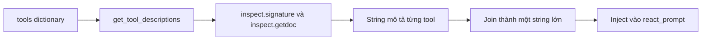

# 🐍 Sinh Tool Descriptions động bằng Python: "Kể chuyện" về tool cho LLM nghe

> Nguồn: `035-Generating-Dynamic-Tool-Descriptions-in-Python.txt` · [Udemy](https://ua.udemy.com/course/langchain/learn/lecture/54977429)

Chúng ta đã có ReAct prompt trong tay. Giờ là lúc bắt tay vào code: mình sẽ tạo file mới, chuẩn bị phần **parse response dạng text** và **tự sinh mô tả tool động** từ chính các hàm Python.

*Phần này khá kỹ thuật, nhưng cực kỳ quan trọng để hiểu chuyện gì thật sự diễn ra under the hood — nên hãy kiên nhẫn theo mình nhé!*

### 📂 File mới và hai import "đặc biệt"

Mình tạo file mới tên **`3_raw_react_prompt`** rồi **copy-paste toàn bộ implementation** từ video trước sang. Hai import mới được thêm vào:

* **regular expressions (`re`)**: dùng để **parse raw response từ LLM** — vốn chỉ là **text thuần**. Lý do rất đơn giản: chúng ta **không còn dựa vào định dạng JSON xinh đẹp của function calling** nữa, mà phải tự "bới" trong text xem cần gọi hàm nào.
* **inspect**: dùng để lấy **metadata của các function** được dùng làm tool, để ta có thể **truyền thông tin đó cho LLM**.

Trong implementation cũ, hàm `ollama_chat_traced` đang dùng **function calling API với tool details** — mình sẽ xóa phần đó, và thay bằng một **dictionary ánh xạ tên tool → hàm tương ứng**. Đơn giản vậy thôi.

Nhưng có một vấn đề: LLM **vốn không biết gì về các hàm của chúng ta**. Ta vẫn phải **gửi mô tả về từng function** để nó có thể dùng chúng như tool. Và đây là lúc hàm mới ra đời.

---

### 🧾 get_tool_descriptions(): Tự động hóa "danh thiếp" của tool

Mình viết một hàm mới tên **`get_tool_descriptions()`**:

1. **Nhận input** là dictionary tools.
2. **Duyệt qua từng tool** bằng phương thức `items()` — key là **tool_name**, value là **function**.
3. Với mỗi function, lấy **metadata**: hàm nhận **arguments gì**, **kiểu dữ liệu** ra sao, **giá trị trả về** là gì, cùng **docstring**.
4. **Format tất cả thành string** để ta có thể **inject vào react_prompt** gửi cho LLM.

Có một **caveat nhỏ**: vì các function đều được **bọc bởi LangSmith traceable**, ta cần truy cập thuộc tính **`__wrapped__`** của mỗi hàm — đây chính là **function gốc** trước khi bị decorator "khoác áo". Nhờ vậy, ta lấy được đúng đoạn code và metadata gốc của hàm.

Để lấy metadata, mình dùng hai tiện ích:

* **`inspect.signature()`** — trả về **chữ ký của hàm**: tên hàm, các argument nhận vào, kiểu dữ liệu của chúng và kiểu giá trị trả về.
* **`inspect.getdoc()`** — lấy **docstring** của hàm, thứ sẽ giúp LLM quyết định **khi nào nên dùng hàm này**.

| Tiện ích | Lấy được gì | Dùng để làm gì |
|---|---|---|
| `inspect.signature()` | Tên hàm, arguments, kiểu dữ liệu, kiểu trả về | Mô tả cách gọi từng tool cho LLM |
| `inspect.getdoc()` | Docstring của hàm | Cho LLM biết khi nào nên dùng tool |

Cuối cùng, mình **append vào list descriptions** một string chứa đầy đủ **tool_name, signature và docstring**, được format gọn gàng. List này cuối cùng sẽ chứa **hai string** — ứng với hai tool — và mình **join tất cả thành một string lớn**, phân tách bằng **dòng mới**. Đây chính là thứ sẽ được inject vào **react_prompt**.



Chạy thử và mở **Debug Console**: ta thấy ngay một **string lớn** chứa toàn bộ chi tiết hàm cùng docstring, kèm các dòng mới được nối vào. Thông tin này sẽ giúp LLM quyết định có nên gọi những tool đó hay không.

Tương tự, mình lấy **tool_names** bằng cách **duyệt qua các key** của dictionary và nối chúng bằng **dấu phẩy**. Biến này cũng cần thiết cho react_prompt.

---

### 🧩 Ghép ReAct prompt hoàn chỉnh

Mình dán **react_prompt** vào, dưới dạng **f-string**. Trong đó:

* Các **strict rules** từ implementation trước vẫn còn nguyên.
* **tool_descriptions** được plug vào vị trí tools.
* **tool_names** được plug vào vị trí action.
* **Question** — câu hỏi người dùng, ví dụ: giá laptop sau khi áp giảm giá gold.
* Các placeholder được **plug at runtime** — đó là lý do prompt cần dùng f-string.

Nhìn kỹ, các bạn sẽ thấy prompt này **giống hệt** prompt thật — chính là **prompt của implementation agent đầu tiên trong LangChain** do **Harrison Chase** tạo ra. Toàn bộ phần "Use the following format..." là **prompt engineering cực kỳ thông minh**: nó biến LLM thành **reasoning engine** biết chọn đúng tool. **Đây chính là thứ đã khởi đầu cho tất cả.**

---

### 🔄 Viết lại ollama_chat_traced: tạm biệt function calling

Hàm `ollama_chat_traced` hiện tại đang **lợi dụng function calling của Ollama** — chúng ta không muốn điều đó nữa. Ta muốn dùng **trí tuệ thuần túy (raw intelligence)** của model để làm việc này.

Vì vậy mình **viết lại** hàm:

* Vẫn giữ tên **`ollama_chat_traced`**.
* Hàm nhận **model** và **messages** — không đổi.
* Nhận thêm **options** — một số cấu hình đặc biệt cho LLM, các bạn sẽ thấy rất sớm thôi.
* Bỏ phần **tool_dict** vì ta đã có tool dictionary sẵn.
* Thay vì **system prompt** như trước, chúng ta sẽ dùng chính **ReAct prompt** làm bộ não cho agent.

---

### 💻 Code mẫu đầy đủ — `3_raw_react_prompt.py`

Toàn bộ code của bài nằm trong file `3_raw_react_prompt.py` (tham khảo từ repo chính thức của khóa học) — hàm `get_tool_descriptions()` và phần ghép `react_prompt` nằm ở giữa file:

```python
# CHANGE 1: Add re + inspect — we'll parse tool calls from raw text instead of structured JSON.
import re
import inspect
from dotenv import load_dotenv

load_dotenv()

import ollama
from langsmith import traceable

MAX_ITERATIONS = 10
MODEL = "qwen3:1.7b"


# --- Tools (LangChain @tool decorator) ---


@traceable(run_type="tool")
def get_product_price(product: str) -> float:
    """Look up the price of a product in the catalog."""
    print(f"    >> Executing get_product_price(product='{product}')")
    prices = {"laptop": 1299.99, "headphones": 149.95, "keyboard": 89.50}
    return prices.get(product, 0)


@traceable(run_type="tool")
def apply_discount(price: float, discount_tier: str) -> float:
    """Apply a discount tier to a price and return the final price.
    Available tiers: bronze, silver, gold."""
    print(f"    >> Executing apply_discount(price={price}, discount_tier='{discount_tier}')")
    price = float(price)
    discount_percentages = {"bronze": 5, "silver": 12, "gold": 23}
    discount = discount_percentages.get(discount_tier, 0)
    return round(price * (1 - discount / 100), 2)

tools = {
    "get_product_price": get_product_price,
    "apply_discount": apply_discount,
}

# CHANGE 3: Delete the JSON schemas. Tools now live inside the prompt as plain text.
# We derive descriptions from the functions themselves using inspect.

def get_tool_descriptions(tools_dict):
    descriptions = []
    for tool_name, tool_function in tools_dict.items():
        # __wrapped__ bypasses decorator wrappers (e.g., @traceable adds *, config=None)
        original_function = getattr(tool_function, "__wrapped__", tool_function)
        signature = inspect.signature(original_function)
        docstring = inspect.getdoc(tool_function) or ""
        descriptions.append(f"{tool_name}{signature} - {docstring}")
    return "\n".join(descriptions)

tool_descriptions = get_tool_descriptions(tools)
tool_names = ", ".join(tools.keys())

react_prompt = f"""
STRICT RULES — you must follow these exactly:
1. NEVER guess or assume any product price. You MUST call get_product_price first to get the real price.
2. Only call apply_discount AFTER you have received a price from get_product_price. Pass the exact price returned by get_product_price — do NOT pass a made-up number.
3. NEVER calculate discounts yourself using math. Always use the apply_discount tool.
4. If the user does not specify a discount tier, ask them which tier to use — do NOT assume one.

Answer the following questions as best you can. You have access to the following tools:

{tool_descriptions}

Use the following format:

Question: the input question you must answer
Thought: you should always think about what to do
Action: the action to take, should be one of [{tool_names}]
Action Input: the input to the action, as comma separated values
Observation: the result of the action
... (this Thought/Action/Action Input/Observation can repeat N times)
Thought: I now know the final answer
Final Answer: the final answer to the original input question

Begin!

Question: {{question}}
Thought:"""


# CHANGE 4: Drop tools= from ollama.chat(). The LLM has no idea it's an agent —
# all agency comes from the prompt above and our regex parsing below.

@traceable(name="Ollama Chat", run_type="llm")
def ollama_chat_traced(model, messages, options):
    return ollama.chat(model=model, messages=messages, options=options)


# --- Agent Loop ---


@traceable(name="Ollama Agent Loop")
def run_agent(question: str):
    print(f"Question: {question}")
    print("=" * 60)


    # CHANGE 5: One prompt string replaces the system/user message split.
    prompt = react_prompt.format(question=question)
    scratchpad = ""

    for iteration in range(1, MAX_ITERATIONS + 1):
        print(f"\n--- Iteration {iteration} ---")
        full_prompt = prompt + scratchpad

        # Stop token prevents the LLM from generating its own Observation —
        # we inject the real tool result instead.
        response = ollama_chat_traced(
            model=MODEL,
            messages=[{"role": "user", "content": full_prompt}],
            options={"stop": ["\nObservation"], "temperature": 0},
        )
        output = response.message.content
        print(f"LLM Output:\n{output}")

        print(f"  [Parsing] Looking for Final Answer in LLM output...")
        final_answer_match = re.search(r"Final Answer:\s*(.+)", output)
        if final_answer_match:
            final_answer = final_answer_match.group(1).strip()
            print(f"  [Parsed] Final Answer: {final_answer}")
            print("\n" + "=" * 60)
            print(f"Final Answer: {final_answer}")
            return final_answer


        # CHANGE 6: Parse tool calls from raw text with regex — fragile if LLM doesn't follow format.
        print(f"  [Parsing] Looking for Action and Action Input in LLM output...")

        action_match = re.search(r"Action:\s*(.+)", output)
        action_input_match = re.search(r"Action Input:\s*(.+)", output)

        if not action_match or not action_input_match:
            print(
                "  [Parsing] ERROR: Could not parse Action/Action Input from LLM output"
            )
            break

        tool_name = action_match.group(1).strip()
        tool_input_raw = action_input_match.group(1).strip()

        print(f"  [Tool Selected] {tool_name} with args: {tool_input_raw}")

        # Split comma-separated args; strip key= prefix if LLM outputs key=value format
        raw_args = [x.strip() for x in tool_input_raw.split(",")]
        args = [x.split("=", 1)[-1].strip().strip("'\"") for x in raw_args]

        print(f"  [Tool Executing] {tool_name}({args})...")
        if tool_name not in tools:
            observation = f"Error: Tool '{tool_name}' not found. Available tools: {list(tools.keys())}"
        else:
            observation = str(tools[tool_name](*args))


        print(f"  [Tool Result] {observation}")

        # CHANGE 7: History is one growing string re-sent every iteration (replaces messages.append).
        scratchpad += f"{output}\nObservation: {observation}\nThought:"


    print("ERROR: Max iterations reached without a final answer")
    return None


if __name__ == "__main__":
    print("Hello LangChain Agent (.bind_tools)!")
    print()
    result = run_agent("What is the price of a laptop after applying a gold discount?")
```

### 🎯 Tự kiểm tra nhanh

**Câu 1:** Vì sao phải import `re` trong file này?

<details>
<summary><b>Xem đáp án</b></summary>

**Đáp án:** Để parse raw response từ LLM — vốn chỉ là text thuần — xem cần gọi hàm nào.

Giải thích: Không còn dựa vào định dạng JSON của function calling nữa nên phải tự "bới" trong text.

Tham chiếu: Mục File mới và hai import "đặc biệt".

</details>

**Câu 2:** Vì sao cần import `inspect`?

<details>
<summary><b>Xem đáp án</b></summary>

**Đáp án:** Để lấy metadata của các function được dùng làm tool và truyền thông tin đó cho LLM.

Giải thích: LLM vốn không biết gì về các hàm của chúng ta, nên phải gửi mô tả về từng function.

Tham chiếu: Mục File mới và hai import "đặc biệt".

</details>

**Câu 3:** Caveat khi hàm được bọc bởi LangSmith traceable là gì?

<details>
<summary><b>Xem đáp án</b></summary>

**Đáp án:** Phải truy cập thuộc tính `__wrapped__` để lấy function gốc trước khi bị decorator "khoác áo".

Giải thích: Nhờ vậy mới lấy được đúng đoạn code và metadata gốc của hàm.

Tham chiếu: Mục get_tool_descriptions.

</details>

**Câu 4:** `get_tool_descriptions()` nhận vào và trả ra gì?

<details>
<summary><b>Xem đáp án</b></summary>

**Đáp án:** Nhận dictionary tools, duyệt từng tool bằng `items()`, rồi append các string mô tả tool_name, signature, docstring và join thành một string lớn phân tách bằng dòng mới.

Giải thích: String lớn này được inject vào react_prompt; tool_names thì lấy bằng cách nối các key bằng dấu phẩy.

Tham chiếu: Mục get_tool_descriptions.

</details>

**Câu 5:** Vì sao phải viết lại hàm `ollama_chat_traced`?

<details>
<summary><b>Xem đáp án</b></summary>

**Đáp án:** Để bỏ function calling của Ollama và chỉ còn nhận model, messages, options — dùng chính ReAct prompt làm bộ não cho agent.

Giải thích: Ta muốn dùng trí tuệ thuần túy (raw intelligence) của model thay vì lợi dụng function calling.

Tham chiếu: Mục Viết lại ollama_chat_traced: tạm biệt function calling.

</details>

Mọi thứ đang dần khớp lại thành bức tranh hoàn chỉnh. Hẹn gặp lại các bạn ở video tiếp theo, nơi chúng ta ráp toàn bộ vòng lặp agent với prompt thuần! 🚀

## Nguồn tham khảo

- [Udemy — Generating Dynamic Tool Descriptions in Python](https://ua.udemy.com/course/langchain/learn/lecture/54977429)
- [LangChain Hub — hwchase17/react](https://smith.langchain.com/hub/hwchase17/react)
- [Ollama Docs — Tool calling](https://docs.ollama.com/capabilities/tool-calling)
