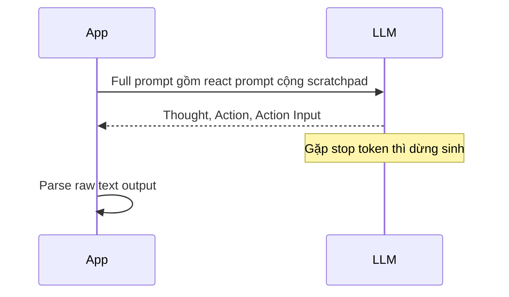

# 🛠️ Manual Tool Calling: Tự tay điều khiển LLM bằng Prompt thuần

> Nguồn: `037-Implementing-Manual-Tool-Calling-for-LLMs.txt` · [Udemy](https://ua.udemy.com/course/langchain/learn/lecture/54990493)

Sau khi đã có ReAct prompt hoàn chỉnh và viết lại hàm gọi Ollama, hôm nay chúng ta sẽ ráp vòng lặp agent thủ công — và khám phá một **"vũ khí bí mật"** giúp LLM biết dừng đúng lúc: **stop token**.

*Nghe có vẻ nhỏ nhặt, nhưng đây là chi tiết quyết định thành bại của cả cơ chế tool calling thủ công đấy!*

### ⏹️ Stop token: Bí quyết để LLM biết "dừng đúng lúc"

Nhìn lại hàm **`ollama_chat_traced`**: trước đây nó nhận **tools**, nhưng giờ chúng ta **không dùng tools nữa**. Tuy vậy, ta vẫn cần gửi cho model một cấu hình quan trọng: **stop argument**.

Cụ thể, hàm sẽ:

1. **Bỏ toàn bộ phần sử dụng tool**.
2. **Nhận model**, **messages**, và **options** — trong đó options sẽ chứa **stop argument** với giá trị là **`\nObservation`**.

Mình truyền thẳng cấu hình này vào lệnh gọi **`ollama.chat`**. Ý nghĩa: LLM sẽ **ngừng sinh văn bản ngay khi tạo ra token `\nObservation`**.

| Cấu hình | Hành vi của LLM | Hệ quả |
|---|---|---|
| Có stop token `\nObservation` | Dừng sinh ngay khi gặp token này | Output sạch, đúng Thought / Action / Action Input |
| Không có stop token | Tiếp tục sinh thêm văn bản | LLM bịa observation (hallucination), output hỏng |

---

### 🧱 Ráp "full prompt": ReAct prompt + scratchpad

Bước vào agent loop, có hai thứ ta **không cần nữa**:

* **tools_dict** — vì đã có tool dictionary từ trước.
* **Các messages cũ** — vì mọi thứ giờ đây đến từ **ReAct prompt**: prompt này đã chứa **cả chỉ dẫn cho agent lẫn input người dùng**. Để ý một điều thú vị: **không còn sự tách biệt giữa system prompt và user prompt** nữa — ta dùng **prompt như một khối thống nhất**.

Thay vào đó, mình làm như sau:

1. **Inject câu hỏi vào ReAct prompt** — câu hỏi đến từ người dùng lúc runtime.
2. **Khởi tạo scratchpad là một list rỗng** — nó sẽ chứa **lịch sử** mọi thứ LLM đã làm: các lựa chọn tool, observations, vân vân.
3. Ở **build time**, **tool descriptions** và **tool names** được plug vào prompt (như ta đã chuẩn bị ở video trước).
4. Ở **runtime**, **question** được plug vào một cách động, đến từ người dùng.
5. **Append scratchpad vào ReAct prompt gốc** → tạo thành **full prompt** — một **khối text lớn** duy nhất gửi tới LLM.

Mình chạy debug, copy giá trị full prompt ra file mới để xem: câu hỏi *"what is the price of laptop after applying the gold discount?"* đã được plug vào đúng chỗ, và phần kết thúc là **Thought:** — chính là **output indicator** để LLM bắt đầu làm việc. Mình cũng đảo thứ tự code một chút: **in câu hỏi trước, rồi mới format prompt**.

*Đừng lo nếu bạn thấy prompt dài và rối — cứ nhìn vào các placeholder, mọi thứ sẽ rõ ràng ngay.*

---

### 🧠 Gọi LLM và đọc "raw output"

Giờ là lúc gọi `ollama_chat_traced` với:

* Model **Qwen3**.
* **Một message duy nhất** mỗi lần gọi — chứa toàn bộ chỉ dẫn cho LLM cộng với câu hỏi người dùng.
* **Options**: stop argument là **`\nObservation`**, cùng **temperature = 0** để prompt cho kết quả **nhất quán hơn**.

Chạy debug vào **vòng lặp 1**, ta xem response nhận về:

* Response có **message**, trong message có **content** — đây là **raw response** của LLM dạng text thuần, được mình format lại cho dễ đọc.
* Trên **LangSmith**, trace cho thấy **toàn bộ input**: strict rules, ReAct prompt với tool descriptions được plug vào, danh sách tools, và câu hỏi của người dùng.
* Response có **phần suy nghĩ (thinking)**, rồi trả lời đúng **định dạng Thought / Action / Action Input**.
* Đặc biệt: nó **không sinh thêm gì sau Action Input** — vì ngay sau đó, nó sẽ output **`\nObservation`** và **dừng sinh văn bản hoàn toàn**. Trong response vì vậy **không hề có `\nObservation`**.

Để chứng minh "không nói suông", mình cố tình **thêm một typo (xóa stop argument)** rồi chạy lại: LLM lập tức tiếp tục sinh ra **observation bịa đặt (hallucination)** cùng mọi thứ khác. Mình khôi phục stop token — mọi thứ lại gọn gàng.

Và một chi tiết quan trọng: response này **không phải AI message object** — nó chỉ là **text thuần**. Nên mình đổi tên biến thành **`output`** cho đúng bản chất.

---

### 🎯 Hai mũi tên còn thiếu của vòng lặp ReAct

Chúng ta đã có prompt hoàn chỉnh, cách gọi LLM và raw output. Ở video tiếp theo, mình sẽ implement hai **mũi tên** còn lại của vòng lặp:

1. **Mũi tên từ Thought đến Final Answer** — khi LLM thông báo đã có câu trả lời cuối cùng.
2. **Mũi tên từ Thought đến Tool** — parse câu trả lời của LLM, rồi **thực thi tool tương ứng**.

### 🎯 Tự kiểm tra nhanh

**Câu 1:** Stop argument có giá trị gì và tác dụng ra sao?

<b>Xem đáp án</b>

**Đáp án:** Giá trị là `\nObservation`; LLM sẽ ngừng sinh văn bản ngay khi tạo ra token này.

Giải thích: Nhờ đó response chỉ dừng ở Action Input và không tự bịa observation.

Tham chiếu: Mục Stop token: Bí quyết để LLM biết "dừng đúng lúc".

**Câu 2:** Vì sao không cần dùng lại các messages cũ?

<b>Xem đáp án</b>

**Đáp án:** Vì mọi thứ đến từ ReAct prompt — prompt đã chứa cả chỉ dẫn cho agent lẫn input người dùng.

Giải thích: Không còn sự tách biệt giữa system prompt và user prompt; ta dùng prompt như một khối thống nhất.

Tham chiếu: Mục Ráp "full prompt".

**Câu 3:** Full prompt được ráp như thế nào?

<b>Xem đáp án</b>

**Đáp án:** Inject câu hỏi vào ReAct prompt, khởi tạo scratchpad là list rỗng, rồi append scratchpad vào prompt gốc thành một khối text lớn duy nhất.

Giải thích: Tool descriptions và tool names plug ở build time, question plug ở runtime; phần kết thúc là Thought — output indicator.

Tham chiếu: Mục Ráp "full prompt".

**Câu 4:** Điều gì xảy ra khi cố tình xóa stop token?

<b>Xem đáp án</b>

**Đáp án:** LLM lập tức tiếp tục sinh ra observation bịa đặt (hallucination) cùng mọi thứ khác.

Giải thích: Đây là minh chứng cho vai trò quyết định của stop token trong tool calling thủ công.

Tham chiếu: Mục Gọi LLM và đọc "raw output".

**Câu 5:** Vì sao biến response được đổi tên thành `output`?

<b>Xem đáp án</b>

**Đáp án:** Vì response chỉ là text thuần, không phải AI message object.

Giải thích: Ta đang làm việc với raw output của LLM thay vì object có cấu trúc.

Tham chiếu: Mục Gọi LLM và đọc "raw output".

Hai mũi tên này sẽ hoàn thiện vòng lặp ReAct thủ công của chúng ta. Hẹn gặp lại ở video tiếp theo! 🚀

## Nguồn tham khảo

- [Udemy — Implementing Manual Tool Calling for LLMs](https://ua.udemy.com/course/langchain/learn/lecture/54990493)
- [Ollama Docs — API chat](https://docs.ollama.com/api/chat)
- [LangChain Hub — hwchase17/react](https://smith.langchain.com/hub/hwchase17/react)
