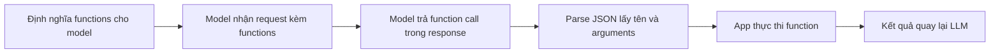

# 🚀 Function Calling: Bước tiến hóa tất yếu từ ReAct Prompt

> Nguồn: `039-Intro.txt` · [Udemy](https://ua.udemy.com/course/langchain/learn/lecture/52589395)

Xin chào, Eden đây! Hy vọng các bạn đang tận hưởng khóa học. Trong section này, chúng ta sẽ **đào sâu vào function calling** — hay còn gọi là **tool calling** (mình sẽ dùng hai thuật ngữ này thay thế cho nhau xuyên suốt).

*Nếu bạn vừa hoàn thành Layer 3 với "prompt thuần", thì đây chính là mảnh ghép tiếp theo của bức tranh lớn.*

### 🔍 Nhìn lại ReAct prompt: Hay nhưng chưa đủ "chắc"

Đến giờ, các bạn đã quen với **ReAct prompt** và thấy vòng lặp **reasoning rồi acting** này thú vị thế nào — từ đó ta xây được những ứng dụng rất tiên tiến.

Nhưng chắc hẳn bạn cũng nhận ra: **ReAct prompt không thực sự đáng tin cậy**. Chỉ cần LLM sinh **một token sai**, toàn bộ response có thể hỏng — vì **LangChain phải parse nó bằng regular expressions**. Đây là nền tảng của hành vi agentic và AI agent, nhưng chưa đủ độ ổn định để đưa vào production.

*Chính sự kém ổn định này là lý do các nhà cung cấp model phải "ra tay" — và đó là toàn bộ nội dung của section này.*

| Tiêu chí | ReAct prompt | Function calling |
|---|---|---|
| Cách lấy tool | LLM sinh text theo format rồi parse | Model trả JSON ở vị trí đặc biệt trong response |
| Độ tin cậy | Dễ vỡ nếu sinh sai một token | Đáng tin cậy hơn hẳn |
| Cách parse | Regular expressions | Truy cập field JSON |
| Ai gánh phần khó | Ứng dụng tự lo | Nhà cung cấp model |

---

### ⚙️ Function Calling: Để nhà cung cấp model "gánh" phần khó

Bước tiến hóa tự nhiên của ReAct prompt thành một giải pháp **production-grade, đáng tin cậy** chính là khả năng **function calling / tool calling** của LLM. Ý tưởng cốt lõi rất đơn giản:

1. Thay vì phụ thuộc vào ReAct prompt, ta **dựa vào nhà cung cấp model** — Anthropic, Google, OpenAI...
2. Model sẽ trả về **function call** ở một **vị trí đặc biệt trong response**.
3. Đó là một **JSON đẹp đẽ** chứa **tên function** và **arguments**.
4. Chúng ta (hoặc LangChain) chỉ cần **parse JSON** — **không cần regular expressions**, chỉ cần truy cập các field là xong.
5. Sau đó, tiếp tục thuật toán AI agent như bình thường.

Kết quả nhận được với function calling **đáng tin cậy hơn hẳn** so với ReAct prompt. Nhờ vậy, ta có thể tự tin xây dựng những agent phức tạp mà không phải "nín thở" mỗi lần parse output.

---

### 🎯 Chúng ta sẽ làm gì trong section này?

Trong các video tiếp theo, mình sẽ cùng các bạn:

* **Demo function calling** trực tiếp trên code để bạn thấy tận mắt cách model trả về function call.
* **Chứng minh độ đáng tin cậy** của function calling so với ReAct prompt.
* Chỉ ra vì sao ngày nay, **best practice khi xây dựng AI agent chính là dùng function calling**.

*Đừng lo nếu bạn chưa thấy quen ngay — cứ đi qua từng video, mọi thứ sẽ khớp lại thành một bức tranh rõ ràng.*

### 🎯 Tự kiểm tra nhanh

**Câu 1:** Vì sao ReAct prompt không thực sự đáng tin cậy?

<b>Xem đáp án</b>

**Đáp án:** Chỉ cần LLM sinh một token sai là toàn bộ response có thể hỏng, vì LangChain phải parse bằng regular expressions.

Giải thích: Đây là nền tảng của hành vi agentic nhưng chưa đủ ổn định để đưa vào production.

Tham chiếu: Mục Nhìn lại ReAct prompt.

**Câu 2:** Function calling thay đổi cách lấy tool như thế nào?

<b>Xem đáp án</b>

**Đáp án:** Thay vì phụ thuộc ReAct prompt, ta dựa vào nhà cung cấp model — model trả function call ở một vị trí đặc biệt trong response.

Giải thích: Đó là JSON chứa tên function và arguments, parse bằng cách truy cập field thay vì regex.

Tham chiếu: Mục Function Calling: Để nhà cung cấp model "gánh" phần khó.

**Câu 3:** Vì sao function calling đáng tin cậy hơn hẳn?

<b>Xem đáp án</b>

**Đáp án:** Vì output có cấu trúc JSON ổn định, chỉ cần parse JSON thay vì mò mẫm trong text.

Giải thích: Nhờ vậy có thể xây agent phức tạp mà không phải "nín thở" mỗi lần parse output.

Tham chiếu: Mục Function Calling: Để nhà cung cấp model "gánh" phần khó.

**Câu 4:** Section này sẽ demo những gì?

<b>Xem đáp án</b>

**Đáp án:** Demo function calling trực tiếp trên code, chứng minh độ đáng tin cậy so với ReAct prompt, và chỉ ra best practice khi xây AI agent.

Giải thích: Tất cả nằm trong các video tiếp theo của section.

Tham chiếu: Mục Chúng ta sẽ làm gì trong section này.

**Câu 5:** Đâu là điểm mấu chốt khiến function calling trở thành lựa chọn production?

<b>Xem đáp án</b>

**Đáp án:** Sự đáng tin cậy: lỗi parse gần như biến mất vì model trả về JSON có cấu trúc đúng schema.

Giải thích: ReAct prompt thuần vẫn hữu ích để hiểu nền tảng, nhưng không đủ chắc cho ứng dụng thật.

Tham chiếu: Toàn bài.

Hãy cùng mình đi sâu vào chủ đề này nhé — hẹn gặp lại các bạn ở video tiếp theo! 🚀

## Nguồn tham khảo

- [Udemy — Function Calling Intro](https://ua.udemy.com/course/langchain/learn/lecture/52589395)
- [OpenAI Docs — Function calling](https://platform.openai.com/docs/guides/function-calling)
- [arXiv — ReAct: Synergizing Reasoning and Acting in Language Models](https://arxiv.org/abs/2210.03629)
