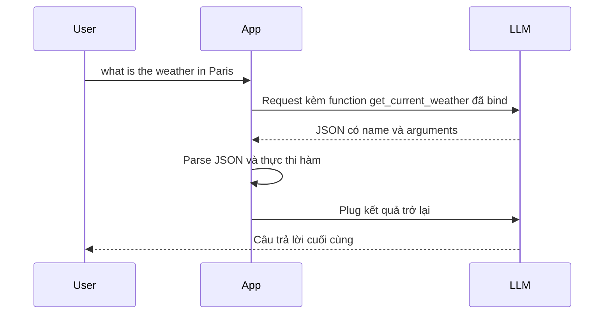

# 📚 Hiểu tường tận Function Calling cho LLM: Từ JSON đẹp đến "hộp đen" reasoning

> Nguồn: `040-Theory-Understanding-Function-Calling-for-LLMs.txt` · [Udemy](https://ua.udemy.com/course/langchain/learn/lecture/52587633)

Xin chào, Eden đây! Video này thuần **lý thuyết** — mình giới thiệu khái niệm **function calling** (hay **tool calling**). Chúng ta sẽ hands-on rất sớm thôi, nên đây là lúc nắm thật chắc nền tảng.

### 🧩 Function calling chính xác là gì?

**Function calling** là khả năng của model **sinh ra một lời gọi hàm có cấu trúc** tới một **external function** kèm theo các arguments của nó. Thay vì chỉ sinh **plain text** như thường lệ, model tạo ra câu trả lời **có cấu trúc, rất dễ parse**, và nó xuất hiện ở **một vị trí đặc biệt trong response** — không phải trong phần nội dung sinh ra.

Một số điểm quan trọng:

* Đây là **năng lực của một số LLM nhất định**, không phải model nào cũng có.
* Ngày nay, đây gần như là **tiêu chuẩn** của các **state-of-the-art model** — có thể yên tâm rằng các vendor lớn như OpenAI, Anthropic, Google khi ra mắt model mới đều hỗ trợ.
* Function calling được **OpenAI giới thiệu từ năm 2023**.
* Developer chỉ cần cung cấp cho model **danh sách function definitions**: **tên**, **tham số**, và **mô tả** của từng function.
* Model có thể chọn trả lời bằng một **JSON object** ghi rõ **gọi function nào, với arguments nào** nếu cần.

Under the hood, đây là model đã được **fine-tune để phát hiện khi nào cần gọi function** dựa trên yêu cầu người dùng, rồi format câu trả lời thành **JSON hợp lệ theo đúng schema** của function.

---

### 🌤️ Ví dụ: Hỏi thời tiết ở Paris

Hãy tưởng tượng người dùng hỏi model: *"what's the weather in Paris?"* — và ta đã **bind function `get_weather`** vào model. Model sẽ trả về JSON với:

* **name**: `get_current_weather`.
* **arguments**: **location = Paris**, cùng **unit** là Fahrenheit hoặc Celsius.

Ứng dụng của chúng ta sau đó **parse JSON này và thực thi** hàm `get_current_weather` — vốn tồn tại trong app. Ta lấy response của hàm, **plug ngược trở lại LLM** và tiếp tục như vậy.

---

### 💡 Vì sao các vendor lại tạo ra function calling?

Động lực chính... lại là **ReAct prompt** mà chúng ta đã gặp! Vì ReAct prompt **không thực sự đáng tin cậy**:

* Đôi khi output ra kết quả xấu, **khó parse**.
* Chương trình của ta **fail**, gây ra nhiều vấn đề — dù ý tưởng của prompt này rất hay.

Function calling thì **đáng tin cậy hơn và mang tính deterministic hơn**: **LLM vendor làm hết phần việc nặng**, và thứ ta nhận về là một **JSON object dễ parse, dễ làm việc**.

*Mình sẽ so sánh sâu hơn giữa function calling và ReAct prompt trong các video sau — các bạn nhớ đón xem nhé!*

Bên cạnh việc kết nối LLM với **external tools**, function calling còn mang lại **khả năng thứ hai cực kỳ giá trị**: lấy **structured output (đầu ra có cấu trúc)** từ LLM. Model tận dụng khả năng reasoning để **trích xuất thông tin vào các field nhất định** và trả về **JSON có tổ chức**, đúng như ta muốn. Ta có thể chuyển nó thành **Pydantic object** rồi đưa xuống **application downstream** — rất đáng tin cậy. Chủ đề này mình cũng đã cover trong khóa học.

---

### ⚖️ Ưu điểm và điểm trừ

**Ưu điểm thứ nhất — tích hợp có cấu trúc và đáng tin cậy:**

* Output là **JSON machine-readable** với function name và arguments rõ ràng → dễ parse, **ít bị hiểu sai** so với ReAct prompt.
* Model được **fine-tune để tuân thủ nghiêm ngặt function schema** → giảm **lỗi format ngẫu nhiên** mà ta từng gặp.
* Cách tiếp cận này **sạch sẽ, hiệu quả**, mở ra khả năng dùng tool **mạnh mẽ và đáng tin cậy**.

**Ưu điểm thứ hai — tiết kiệm token:**

* Function calling **không cần output toàn bộ chain of thought** như trước.
* Không cần **high reasoning intensive prompting**.
* Model có thể **bỏ qua các giải thích dài dòng** và **chỉ trả về function call**.

**Điểm trừ duy nhất — quy trình reasoning trở nên "mờ đục" (opaque reasoning process):**

* Khi model quyết định gọi function, nó thường **không phơi bày chain of thought**; reasoning **ở lại bên trong LLM**.
* Developer chỉ thấy **tên function và arguments cuối cùng**, không thấy **lý do (justification)**.
* Function calling trở thành quyết định kiểu **hộp đen**, không có **intermediate rationale** → **debugging và auditing khó hơn**, vì ta không biết vì sao model chọn function đó với đúng arguments đó.

| Ưu điểm | Điểm trừ |
|---|---|
| Output JSON machine-readable, tên function và arguments rõ ràng, ít bị hiểu sai | Reasoning trở thành hộp đen, ở lại bên trong LLM |
| Model fine-tune tuân thủ nghiêm schema, giảm lỗi format ngẫu nhiên | Không thấy chain of thought hay justification của quyết định |
| Tiết kiệm token, không cần output toàn bộ chain of thought | Debugging và auditing khó hơn |

### 🎯 Tự kiểm tra nhanh

**Câu 1:** Function calling chính xác là gì?

<b>Xem đáp án</b>

**Đáp án:** Là khả năng của model sinh ra một lời gọi hàm có cấu trúc tới external function kèm các arguments, ở một vị trí đặc biệt trong response.

Giải thích: Thay vì chỉ sinh plain text, model tạo câu trả lời có cấu trúc rất dễ parse.

Tham chiếu: Mục Function calling chính xác là gì.

**Câu 2:** Developer cần cung cấp gì cho model?

<b>Xem đáp án</b>

**Đáp án:** Danh sách function definitions gồm tên, tham số và mô tả của từng function.

Giải thích: Model có thể chọn trả về JSON object ghi rõ gọi function nào với arguments nào.

Tham chiếu: Mục Function calling chính xác là gì.

**Câu 3:** Vì sao các vendor tạo ra function calling?

<b>Xem đáp án</b>

**Đáp án:** Vì ReAct prompt không thực sự đáng tin cậy — output đôi khi khó parse khiến chương trình fail.

Giải thích: Function calling đáng tin cậy và mang tính deterministic hơn, vendor làm hết phần việc nặng.

Tham chiếu: Mục Vì sao các vendor lại tạo ra function calling.

**Câu 4:** Ngoài kết nối external tools, function calling còn mở ra khả năng gì?

<b>Xem đáp án</b>

**Đáp án:** Lấy structured output từ LLM — trích xuất thông tin vào các field nhất định và trả về JSON có tổ chức.

Giải thích: Ta có thể chuyển nó thành Pydantic object rồi đưa xuống application downstream.

Tham chiếu: Mục Vì sao các vendor lại tạo ra function calling.

**Câu 5:** Điểm trừ duy nhất của function calling là gì?

<b>Xem đáp án</b>

**Đáp án:** Quy trình reasoning trở nên mờ đục — developer chỉ thấy tên function và arguments cuối cùng, không thấy lý do đằng sau.

Giải thích: Điều này khiến debugging và auditing khó hơn.

Tham chiếu: Mục Ưu điểm và điểm trừ.

*Tuy vậy, đánh đổi này hoàn toàn xứng đáng.* Function calling hiện đã là **de facto standard**: gần như không ai còn dùng ReAct prompt thô nữa, mà dùng tính năng function calling của LLM. Các vendor như OpenAI, Google, Anthropic đã **hoàn thiện function calling**, cho ta câu trả lời đáng tin cậy hơn hẳn — mở đường cho những **AI agent và AI application robust hơn**. Hẹn gặp lại các bạn trong các video hands-on! 🚀

## Nguồn tham khảo

- [Udemy — Understanding Function Calling for LLMs](https://ua.udemy.com/course/langchain/learn/lecture/52587633)
- [OpenAI Docs — Function calling](https://platform.openai.com/docs/guides/function-calling)
- [arXiv — ReAct: Synergizing Reasoning and Acting in Language Models](https://arxiv.org/abs/2210.03629)
