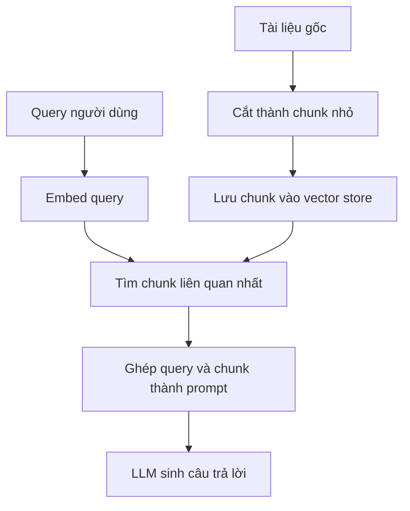

# 🧠 RAG là gì? Giải mã bài toán "hỏi đáp trên tài liệu khổng lồ" (Đừng bỏ qua phần motivation này nhé!)

> Nguồn: `041-Introduction-to-Retrieval-Augmentation-Generation-RAG.txt` · [Udemy](https://ua.udemy.com/course/langchain/learn/lecture/53461849)

Chào các bạn, mình là Eden đây! 👋 Trong section mới này, chúng ta sẽ cùng nhau khám phá một kỹ thuật cực kỳ quan trọng mang tên **Retrieval Augmented Generation**, hay còn gọi ngắn gọn là **RAG**.

Nhưng trước khi lao vào phần implementation kỹ thuật, mình muốn dành thời gian nói về **động lực (motivation)** đằng sau kỹ thuật này: nó giúp chúng ta đạt được điều gì, và đang giải quyết vấn đề gì.

### 🎯 Bài toán: khi tài liệu quá lớn và quá riêng tư

Hãy tưởng tượng các bạn có một tài liệu với vô số thông tin bên trong — có thể lên tới **hàng trăm trang**. Trong ví dụ của mình, đó là cuốn **Harry Potter và Hòn đá Phù thủy**, một cuốn sách khá dài.

Giả sử chúng ta muốn hỏi LLM những câu hỏi về cuốn sách này, tập trung vào những khu vực, cảnh hoặc đoạn văn cụ thể — ví dụ câu hỏi *"làm thế nào để pha một loại thuốc độc nhất định"*, khi mà câu trả lời chỉ nằm trong **một đoạn văn rất cụ thể**. Bài toán này không chỉ đúng với Harry Potter, mà còn đúng với mọi lĩnh vực khác: một **tài liệu tài chính khổng lồ** cần tìm một **điều khoản (clause)** nào đó cũng rơi vào tình huống y hệt.

Điều này càng quan trọng khi làm việc với **dữ liệu riêng tư (private data)**. Lý do rất đơn giản: các mô hình ngôn ngữ lớn **không được huấn luyện trên dữ liệu riêng tư của bạn**, nên chúng hoàn toàn không biết gì về tài liệu tài chính ấy cả. Vậy nên chúng ta cần tìm cách để LLM có thể hỏi đáp hiệu quả trên chính tài liệu đó.

---

### ⚠️ Cách giải "ngây thơ": nhồi cả cuốn sách vào prompt

Giải pháp đầu tiên — và ngây thơ nhất — là lấy toàn bộ cuốn sách (giả sử là file PDF) và **nhồi hết vào prompt** gửi cho LLM. Chúng ta sẽ có một placeholder cho câu hỏi của người dùng, và một placeholder khác để nhét trọn cuốn Harry Potter vào.

Cách này đôi khi có thể chạy được, nhưng nó **không hề scale** và có rất nhiều vấn đề:

1. **Giới hạn cứng về lượng text:** LLM chỉ nhận được một lượng text nhất định. Nếu tài liệu quá dài, chúng ta sẽ vượt qua **token limit** của model.
2. **Bài toán "needle in a haystack":** ngay cả khi có những model với giới hạn **1 triệu hay 2 triệu token** (khá phổ biến hiện nay), LLM vẫn **kém hiệu quả hơn hẳn khi prompt và context quá dài**. Điều này đã được chứng minh trong nghiên cứu — ví dụ như nghiên cứu *needle in the haystack*.
3. **Chi phí (cost):** prompt càng lớn thì càng tốn tiền.
4. **Độ trễ (latency):** prompt càng lớn thì thời gian xử lý càng lâu.

Tóm lại, chúng ta có đúng **4 vấn đề**: giới hạn cứng, needle in the haystack, cost, và latency. *Đừng lo, vì giải pháp thứ hai sẽ xử lý gọn cả bốn!*

---

### 🔍 Giải pháp thứ hai: cắt nhỏ tài liệu và chỉ gửi phần thực sự liên quan

Giải pháp này yêu cầu thêm một bước **tiền xử lý (pre-processing)**: lấy tài liệu gốc, dù dài đến đâu, và **cắt nó thành những chunk nhỏ hơn**. Quá trình chunking này có thể ngây thơ hoặc phức tạp — có rất nhiều cách làm khác nhau và chúng ta sẽ bàn sâu trong khóa học.

Giả sử đã có các chunk. Lúc này, thay vì nhồi cả cuốn sách, chúng ta thêm một bước: lấy **query của người dùng**, tìm ra **chunk liên quan nhất** với query đó, rồi chỉ gửi đúng chunk ấy vào LLM call. Nhờ vậy, chúng ta **neo (ground)** câu trả lời của LLM vào đúng mảnh dữ liệu liên quan, và model sẽ trả lời dễ dàng hơn rất nhiều.

Cách này giải quyết trọn vẹn mọi vấn đề ở trên:

* Không vượt qua **giới hạn token** vì context gửi đi nhỏ hơn rất nhiều.
* Không còn **needle in the haystack** vì chỉ gửi những mẩu text cực kỳ cụ thể và liên quan nhất.
* **Chi phí thấp hơn** vì gửi ít token hơn.
* **Xử lý nhanh hơn** vì LLM phải xử lý ít token hơn.

| Vấn đề | Nhồi cả cuốn sách | Chunk và retrieval |
|---|---|---|
| Token limit | Dễ vượt giới hạn cứng | Context nhỏ nên an toàn |
| Needle in a haystack | Model kém hiệu quả khi context dài | Chỉ gửi đoạn liên quan nhất |
| Chi phí | Tốn tiền vì prompt lớn | Ít token hơn, rẻ hơn |
| Độ trễ | LLM xử lý chậm | Nhanh hơn nhiều |

Kỹ thuật này có thể **scale tới những tài liệu khổng lồ**, thậm chí hoạt động với **nhiều tài liệu cùng lúc**. Tất nhiên, nó vẫn có những **hạn chế**:

* Phải thêm bước pre-processing để chunk tài liệu — và chunking có rất nhiều chiều sâu: chunk như thế nào? Chia tài liệu dựa trên token nào? Làm sao đảm bảo mỗi chunk đều chứa dữ liệu liên quan?
* Nếu tài liệu không phải văn bản thường mà là một **code repository** thì cần **chiến lược chunking khác**. Hoặc khi chúng ta không biết trước nội dung tài liệu và nhận nó **động (dynamically)** từ người dùng thì sao?
* Chúng ta cần một **cơ chế tìm kiếm (searching mechanism)** để tìm ra các chunk liên quan. Và lỡ những chunk đó không thực sự liên quan, cần thêm context bổ sung thì sao?

Tất cả những thách thức này sẽ được mình giải đáp ngay trong section này.

---

### 💡 Vậy RAG thực chất là gì?

Bật mí: **giải pháp số 2 mà chúng ta vừa bàn chính là RAG — Retrieval Augmented Generation**, và những gì các bạn thấy chỉ mới là phần nhìn tổng quan thôi. Hãy tách tên gọi ra cho dễ nhớ:

* **Retrieval (truy hồi):** tìm ra những chunk liên quan.
* **Augmentation (tăng cường):** lấy prompt của chúng ta và "tô điểm" nó bằng những chunk liên quan đó.
* **Generation (sinh):** gửi prompt đã tăng cường ấy cho LLM và dùng nó để trả lời query.

### 🎯 Tự kiểm tra nhanh

**Câu 1:** Vì sao cách nhồi toàn bộ cuốn sách vào prompt không "scale"?

<b>Xem đáp án</b>

**Đáp án:** Vì vấp cả 4 vấn đề: token limit, needle in a haystack, chi phí cao và độ trễ lớn.

Giải thích: Tài liệu càng dài thì prompt càng lớn — vượt giới hạn cứng, model dùng context kém hiệu quả hơn, tốn tiền và chậm hơn.

Tham chiếu: Mục Cách giải "ngây thơ".

**Câu 2:** Ba chữ R-A-G lần lượt nghĩa là gì?

<b>Xem đáp án</b>

**Đáp án:** Retrieval — tìm chunk liên quan; Augmentation — tô điểm prompt bằng chunk; Generation — LLM sinh câu trả lời.

Giải thích: Đúng thứ tự pipeline: tìm trước, ghép vào prompt, rồi mới sinh câu trả lời.

Tham chiếu: Mục Vậy RAG thực chất là gì?

**Câu 3:** Vì sao dữ liệu riêng tư lại cần RAG?

<b>Xem đáp án</b>

**Đáp án:** Vì LLM không được huấn luyện trên dữ liệu riêng tư của bạn nên hoàn toàn không biết gì về tài liệu đó.

Giải thích: Muốn hỏi đáp trên tài liệu riêng, ta phải đưa chính tài liệu vào context.

Tham chiếu: Mục Bài toán.

**Câu 4:** Giải pháp chunk + retrieval có hạn chế gì?

<b>Xem đáp án</b>

**Đáp án:** Phải thêm bước pre-processing để chunk, tài liệu đặc biệt như code repo cần chiến lược khác, và cần cơ chế tìm kiếm đủ tốt.

Giải thích: Chunking có nhiều chiều sâu và cần xử lý cả trường hợp chunk chưa thực sự liên quan.

Tham chiếu: Mục Giải pháp thứ hai.

**Câu 5:** Grounding trong RAG nghĩa là gì?

<b>Xem đáp án</b>

**Đáp án:** Neo câu trả lời của LLM vào đúng mảnh dữ liệu liên quan thay vì để model tự bịa.

Giải thích: Nhờ grounding, câu trả lời bám sát tài liệu và dễ kiểm chứng hơn.

Tham chiếu: Mục Giải pháp thứ hai.

Bài học này chính là **motivation và trực giác (intuition)** đằng sau RAG. Còn bây giờ, hãy cùng nhau đi vào phần **implementation** và học cách hiện thực hóa kỹ thuật này trong thực tế nhé! 🚀

## Nguồn tham khảo

- [Udemy — Introduction to Retrieval Augmentation Generation (RAG)](https://ua.udemy.com/course/langchain/learn/lecture/53461849)
- [Lost in the Middle: How Language Models Use Long Contexts (arXiv)](https://arxiv.org/abs/2307.03172)
- [LangChain Docs — Retrieval](https://docs.langchain.com/oss/python/langchain/retrieval)
