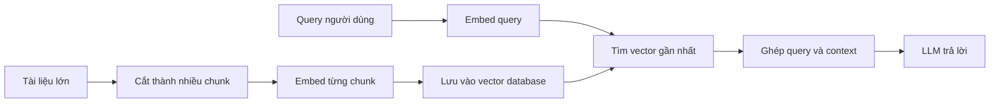

# 🔍 Embeddings, Vector Database & RAG: Toàn cảnh lý thuyết trước khi bắt tay vào code

> Nguồn: `042-Introduction-to-RAG-Implementation.txt` · [Udemy](https://ua.udemy.com/course/langchain/learn/lecture/52242139)

Chào các bạn, mình là Eden đây! 👋 Hôm nay chúng ta sẽ cùng nhau làm quen với một loạt chủ đề cực kỳ thú vị: **vector databases, embeddings, text splitters** và còn nhiều thứ hay ho khác nữa. Đây là phần giới thiệu những khái niệm sẽ theo chúng ta suốt chặng đường xây dựng ứng dụng LLM.

### 🗺️ Những chủ đề mới chúng ta sắp chạm mặt

Trong khóa học này, mình sẽ giới thiệu với các bạn:

* **Embeddings (vector biểu diễn ngữ nghĩa)** và **vector stores (kho lưu vector)**.
* **Pinecone** — vector database chúng ta sẽ đồng hành xuyên suốt.
* **Retrieval QA chain** — mảnh ghép đưa RAG vào thực chiến.
* Các class quan trọng của LangChain như **document loader** và **text splitter**.

Nghe có vẻ nhiều, nhưng đây đều là những chủ đề **cực kỳ quan trọng** khi phát triển một ứng dụng được trợ lực bởi LLM. Trong phần còn lại của khóa học, các bạn sẽ thấy vì sao chúng quan trọng đến vậy.

---

### 📄 Document loaders: cách LangChain "tiêu hóa" mọi loại dữ liệu

Ở video Introduction, chúng ta đã nói LangChain rất mạnh vì giúp chúng ta kết nối với vô số third party: bạn có thể kết nối **Google Drive** và đọc tài liệu từ đó, kết nối **Notion** và đọc notebook của mình, hay thậm chí là đọc từ **file system** của máy.

Điều LangChain thực hiện chính là tạo ra **rất nhiều wrapper** quanh những third party đó, giúp việc kết nối và lấy dữ liệu trở nên dễ dàng đến mức đáng ngạc nhiên. Dữ liệu này quay về dưới dạng **documents** — đó là thuật ngữ trong LangChain. Một **document** đơn giản là thứ chứa text: một file PowerPoint, một file text, một tấm ảnh hay một file PDF — tất cả đều được biểu diễn dưới dạng text.

Và class **document loader** chính là abstraction giúp chúng ta sử dụng dữ liệu text này: chúng ta load dữ liệu vào các document, làm việc với chúng và gửi cho LLM.

*Nghe có vẻ trừu tượng, nhưng đừng lo — chúng ta sẽ đi thẳng vào implementation và hiểu chính xác nó là gì. Mình hứa đấy!*

---

### ✂️ Text splitters: hóa giải "ân oán" token limit

Các bạn còn nhớ lỗi khó chịu về **giới hạn số token** của LLM chứ? Đây là chuyện rất phổ biến, và có vài cách để xử lý. Trong section này mình sẽ chỉ một chiến lược, còn những chiến lược khác mình đào sâu trong phần **Theory**.

Đó là lý do **text splitters** ra đời. Khi gặp những đoạn text dài chứa vô số token, chúng ta cần chia nhỏ chúng thành các **chunk**. Nghe đơn giản, nhưng có rất nhiều sự phức tạp đằng sau: có vô số loại file khác nhau, vô số cách tiếp cận khác nhau, và chúng ta muốn **giữ mọi thứ liên quan với nhau về mặt ngữ nghĩa**. Text splitter sẽ giúp chia text thành chunk, và nếu muốn **ghép lại (reassemble)** sau này thì nó cũng hỗ trợ chúng ta luôn.

Nói cách khác, đây là chìa khóa để vừa **vượt qua token limit**, vừa vẫn xử lý được khối dữ liệu khổng lồ mà chúng ta mong muốn.

---

### 🧠 Embeddings, vector database và cách RAG vận hành

Giờ hãy nói về **RAG (Retrieval Augmented Generation)** — giải pháp cực kỳ thanh lịch cho bài toán trên. Ý tưởng cốt lõi: lấy prompt gốc và **tăng cường (augment) nó bằng context phù hợp**, để LLM có đủ thông tin trả lời query ban đầu.

Hãy tưởng tượng chúng ta có file vài gigabyte — một cuốn sách chẳng hạn — và muốn hỏi LLM về nó. Đương nhiên ta sẽ đụng **token limit**, vì một cuốn sách chứa **hơn 4K token** rất nhiều lần. Nếu cắt sách thành thật nhiều chunk rồi gửi từng 1-2-3 chunk làm context, ta sẽ tạo ra **vô số API call dư thừa** — và nếu có tới **1 triệu chunk** thì số tiền bỏ ra sẽ không hề nhỏ.

Vậy nếu có một cách "thần kỳ" để chỉ lấy ra **những chunk có khả năng cao chứa câu trả lời**, rồi chỉ gửi đúng chúng cho LLM thì sao? Chúng ta chỉ cần vài API call, thậm chí một lần, tiết kiệm tiền, tốc độ nhanh hơn và không làm việc dư thừa. Cách đó tồn tại, và nó tên là **Retrieval Augmentation**.

**Embeddings (vector biểu diễn ngữ nghĩa)** là kỹ thuật kinh điển, khá lâu đời nhưng cực kỳ hữu ích trong xử lý ngôn ngữ tự nhiên. Ý tưởng: tạo ra một **vector space (không gian vector)** từ text, sao cho **khoảng cách giữa các vector mang ý nghĩa ngữ nghĩa**.

* **Vector** đơn giản là một dãy số, nhưng có thể biểu diễn những đối tượng phức tạp như từ, câu, ảnh, file âm thanh trong một không gian liên tục nhiều chiều gọi là **embedding**.
* **Embedding model** giống như một **hộp đen**: text đi vào, vector đi ra. Bạn không cần quan tâm bên trong nó làm gì.
* Ở những model tốt, những câu có **ngữ nghĩa tương tự** sẽ cho ra các vector **rất gần nhau** trong vector space. Ví dụ ba câu *"I want to order an extra large coffee"*, *"I'll have a tall coffee"* và *"quiero pedir cafe extra grande"* sẽ nằm sát nhau — dù khác ngôn ngữ, ý nghĩa của chúng gần như đồng nhất.

Việc tính khoảng cách giữa các vector là toán học cơ bản nhưng khá nhàm chán — *may mắn là đã có những người rất thông minh tối ưu hóa nó cho chúng ta, và nó diễn ra cực nhanh*.

Một ví dụ khác: câu hỏi *"how tall is the Burj Khalifa?"* và đoạn mở đầu mô tả Burj Khalifa trên Wikipedia, khi embed, sẽ **rất gần nhau** trong vector space. Kể cả khi LLM chưa từng được huấn luyện về Burj Khalifa và không biết gì về nó, chúng ta vẫn có thể tìm ra chunk liên quan bằng cách **tìm vector tương tự với query**, rồi nói với LLM: *"Đây là thông tin sẽ giúp bạn trả lời câu hỏi — hãy dùng nó và trả lời mình nhé"*.

**Vector database** là nơi lưu những embeddings ấy và có khả năng trả về **những vector gần nhất với vector chúng ta muốn** trong chớp mắt. Nó được sinh ra để **lưu trữ lâu dài (persist)** và giúp chúng ta tái sử dụng embeddings dễ dàng.

| Khái niệm | Là gì | Vai trò trong RAG |
|---|---|---|
| Embeddings | Dãy số biểu diễn ngữ nghĩa của text | Đo độ tương đồng giữa query và chunk |
| Vector database | Kho lưu embeddings kèm khả năng tìm kiếm | Persist vector và trả về vector gần nhất |

Ghép tất cả lại, pipeline của chúng ta sẽ là:

1. Cắt file khổng lồ thành **hàng nghìn hoặc hàng triệu chunk** — LangChain giúp việc này rất dễ dàng.
2. **Embed từng chunk** thành vector bằng embedding model.
3. Lưu các embeddings vào **vector database** như Pinecone.
4. Khi có câu hỏi, **embed query** và đặt nó vào vector space.
5. Tìm những vector gần nhất — chúng chính là các chunk liên quan.
6. Gửi **query + context** trong prompt cho LLM và nhận câu trả lời.

*Hít một hơi thật sâu nhé — đây là rất nhiều thông tin, và hoàn toàn bình thường nếu bạn chưa nắm hết. Mình gợi ý các bạn xem lại video này thêm một lần, và đừng lo, vì chúng ta sẽ implement toàn bộ những gì vừa bàn.*

*Nghe có vẻ đáng sợ, nhưng sự thật là nó khá đơn giản — và khi nhìn vào code, bạn sẽ thấy LangChain đang làm phần việc nặng nhọc cho chúng ta. Đó là lý do LangChain tuyệt vời đến vậy!*

### 🎯 Tự kiểm tra nhanh

**Câu 1:** Document loader giúp ích gì cho chúng ta?

<b>Xem đáp án</b>

**Đáp án:** Nó là abstraction load dữ liệu từ nhiều nguồn (Google Drive, Notion, file system...) về cùng một dạng Document thống nhất.

Giải thích: Nhờ interface chung, ta chỉ cần đổi loader chứ không đổi cách làm việc với dữ liệu.

Tham chiếu: Mục Document loaders.

**Câu 2:** Text splitter giải quyết vấn đề gì?

<b>Xem đáp án</b>

**Đáp án:** Chia text dài thành các chunk nhỏ để không vượt token limit, đồng thời cố giữ các phần liên quan về mặt ngữ nghĩa.

Giải thích: Splitter cũng hỗ trợ ghép lại (reassemble) khi cần.

Tham chiếu: Mục Text splitters.

**Câu 3:** Embedding model hoạt động như thế nào?

<b>Xem đáp án</b>

**Đáp án:** Nó như một hộp đen: text đi vào, vector đi ra; câu có ngữ nghĩa tương tự sẽ cho vector rất gần nhau.

Giải thích: Khoảng cách giữa các vector mang ý nghĩa ngữ nghĩa.

Tham chiếu: Mục Embeddings, vector database và cách RAG vận hành.

**Câu 4:** Vì sao cần vector database thay vì tự lưu vector?

<b>Xem đáp án</b>

**Đáp án:** Vì nó lưu trữ lâu dài và trả về những vector gần nhất với vector truy vấn trong chớp mắt.

Giải thích: Pinecone là ví dụ vector database có free tier mà khóa học dùng.

Tham chiếu: Mục Embeddings, vector database và cách RAG vận hành.

**Câu 5:** Pipeline RAG gồm những bước nào?

<b>Xem đáp án</b>

**Đáp án:** Cắt tài liệu thành chunk, embed từng chunk, lưu vào vector database, embed query, tìm vector gần nhất, rồi gửi query kèm context cho LLM.

Giải thích: Đây là toàn bộ luồng ingestion và retrieval mà ta sẽ implement end-to-end.

Tham chiếu: Mục Embeddings, vector database và cách RAG vận hành.

Trong các video tiếp theo, chúng ta sẽ cùng nhau **hiện thực hóa toàn bộ pipeline RAG end-to-end**. Hẹn gặp lại các bạn ở video implementation nhé! 🚀

## Nguồn tham khảo

- [Udemy — Introduction to RAG Implementation](https://ua.udemy.com/course/langchain/learn/lecture/52242139)
- [LangChain Docs — Retrieval](https://docs.langchain.com/oss/python/langchain/retrieval)
- [OpenAI — Vector embeddings](https://platform.openai.com/docs/guides/embeddings)
