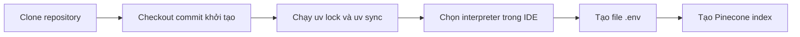

# 🛠️ Medium Analyzer: Boilerplate Setup — Chuẩn bị "bệ phóng" cho cả pipeline RAG

> Nguồn: `043-Medium-Analyzer--Boilerplate-Project-Setup.txt` · [Udemy](https://ua.udemy.com/course/langchain/learn/lecture/53949869)

Chào các bạn, mình là Eden đây! 👋 Trong video này, chúng ta sẽ cùng nhau làm phần **boilerplate setup** — thiết lập môi trường cho project mà ở đó mình sẽ trình diễn **toàn bộ pipeline RAG từ ingestion đến retrieval**. Nghe có vẻ nhàm chán, nhưng đây là bước đệm không thể thiếu, nên hãy cùng làm cho thật gọn gàng nhé!

### ⚙️ Bắt đầu từ repository và commit khởi tạo

Mình đang ở trong **repository của khóa LangChain**, và branch chúng ta sẽ làm việc trong section này có tên là **`project/rag-gist`**. Đây là nơi chứa toàn bộ code của project — và mình cũng hy vọng sẽ sớm bổ sung một **file README** thật chỉn chu để giải thích mọi thứ diễn ra ở đây.

Điều thú vị là nếu mở **danh sách commit**, các bạn sẽ thấy **mỗi bài học là một commit riêng biệt**. Chúng ta sẽ bắt đầu từ **commit đầu tiên** — nơi mình đã thêm một loạt file làm điểm xuất phát. Các bước chuẩn bị như sau:

1. **Clone repository** về máy: mở terminal, đi tới Desktop và chạy `git clone` với URL của repository.
2. **Đi vào thư mục repo** vừa clone bằng lệnh `cd`.
3. **Tạo branch mới từ đúng commit khởi tạo:** chạy `git checkout -b project/rag-gist` kèm theo **hash của commit** mà chúng ta muốn bắt đầu.

Sau đó, mình mở **Cursor** — lúc này đang dùng cấu hình mặc định — và mở sidebar để xem toàn bộ file. Mở tab Git, các bạn sẽ thấy chúng ta đang đứng đúng ở commit *initial commit*. *Chính xác là nơi chúng ta muốn!*

---

### 📂 "Điểm danh" các file trong project

Hãy cùng xem qua những gì có trong project:

* **File `.gitignore`:** liệt kê những file chúng ta không muốn commit và theo dõi trên GitHub repo. Các bạn hãy để ý đảm bảo có `.env` trong đó nhé.
* **File khai báo phiên bản Python** mà mình đang sử dụng.
* **`ingestion.py`:** hiện chỉ là boilerplate, và các bạn sẽ thấy báo lỗi ngay đây thôi — nguyên nhân là **Cursor IDE chưa được cấu hình tới virtual environment** chứa các package đã cài. Chúng ta sẽ xử lý ngay sau đây.
* **Bài blog Medium:** mình chỉ đơn giản lên Google tìm *"what is a vector db medium"*, mở bài blog và **copy toàn bộ text** dán vào một file TXT. Link gốc mình sẽ để trong phần **Resources** của video. Đây chính là "nguyên liệu" của project: một bài viết về vector databases ở định dạng text.

Và đây là phần quan trọng — file **`pyproject.toml`** với danh sách dependencies:

* **`black`** và **`isort`** để format code.
* **`langchain`** — *đừng lo về phiên bản ghi trong file*, chúng ta sẽ cài một phiên bản mới hơn rất nhiều, hiện tại là **version 1.2** tại thời điểm quay video. Mình cam kết giữ code **up-to-date** và quay lại (refill) video khi cần — video này thực chất đã là một bản refill rồi!
* **`langchain-community`** cho code do cộng đồng đóng góp — mình cần nó cho một **document loader** cụ thể.
* **`langchain-openai`** — vendor mình dùng cho **embeddings model** và **LLM**. Tất nhiên các bạn có thể chọn bất kỳ LLM nào mình muốn.
* **`langchain-pinecone`** — integration cho **Pinecone managed vector store** mà chúng ta sẽ dùng trong section này.
* **`langchain-hub`** — thật ra không cần lắm, đừng bận tâm nhé.
* **`python-dotenv`** — giúp load các **environment variables**.

---

### 🔧 Đồng bộ dependencies với `uv` và cấu hình IDE

File `uv.lock` chứa **đúng phiên bản langchain** mà mình đã cài khi ghi hình. Mình sẽ xóa nó đi và tạo lại để có phiên bản mới nhất:

1. Chạy `uv lock` — lệnh này đọc file TOML và tạo **lock file mới** với toàn bộ package, dependency cần thiết. Kiểm tra một chút, các bạn sẽ thấy **langchain 1.2.0** — phiên bản mới nhất ở thời điểm này (15/12/2025).
2. Chạy `uv sync` — cài toàn bộ dependencies từ `uv.lock` vào máy. Một thư mục **`.venv`** sẽ được tạo ra và không bị Git theo dõi nhờ `.gitignore`. Mở một terminal mới trong Cursor, **virtual environment mới sẽ được tự động load**.

Vậy còn lỗi trong `ingestion.py` thì sao? Nó vẫn còn, vì **IDE chưa được trỏ về virtual environment**. Cách sửa:

* Trong virtual environment, chạy `which Python3` để lấy **đường dẫn tới interpreter** đã cài đủ dependencies, rồi copy lại.
* Nhấn **Command+Shift+P**, gõ *select interpreter*, chọn nhập đường dẫn interpreter và dán đường dẫn vừa copy (hoặc chọn interpreter được gợi ý sẵn).

Lỗi biến mất ngay! Sau đó mình chạy thử như một **sanity check** và thấy chương trình in ra chữ *ingestion* — mọi thứ hoạt động trơn tru.

---

### ☁️ Cấu hình biến môi trường và Pinecone vector store

Giờ là lúc tạo file **`.env`** để lưu toàn bộ environment variables và API keys:

* **OpenAI API key** — như các phần trước. *Đừng lo lắng về API key của mình, tất nhiên mình sẽ thu hồi (revoke) mọi key xuất hiện trong video sau khi quay xong!*
* Bộ biến **LangSmith**: `LANGSMITH_API_KEY` cho việc **tracing (theo dõi luồng chạy)**, `LANGSMITH_PROJECT` đặt là *RAG GIST* để nhìn thấy project trong **LangSmith UI**, và `LANGSMITH_TRACING=true`.

Tiếp theo là **vector store** — chúng ta dùng **Pinecone**, một **managed vector store chạy trên cloud**. Pinecone có **free tier**, quá đủ cho khóa học này, và ở các video sau chúng ta cũng sẽ tìm hiểu cả những **lựa chọn mã nguồn mở** khác. Các bước trên Pinecone:

1. Đăng nhập vào **pinecone.io**, vào mục **indexes** (bạn mới thì sẽ thấy trống) và tạo một **index mới**.
2. Trong phần cấu hình, mình chọn **Custom settings** để tự nhập **dimension** — chính là **độ dài của các vector** được lưu. Về **vector type**, có **Dense** và **Sparse**, chúng ta chọn **Dense**. Về **metric** — thước đo độ tương đồng giữa các vector — có **COSINE** (mặc định), **Euclidean** và **dotproduct**; mình sẽ giải thích kỹ hơn ở phần sau của khóa.
3. Chọn **embeddings model** đang dùng: **`text-embedding-3-small` của OpenAI**. Cấu hình mặc định có dimension là **512**, nhưng mình đổi thành **1536** để chứa được nhiều thông tin hơn — *quy tắc chung là vector càng dài thì càng giữ được nhiều thông tin và ngữ nghĩa*.
4. **Capacity mode:** chọn **serverless** (ngoài ra còn tùy chọn **dedicated read nodes**, mình sẽ đào sâu ở các section sau).
5. **Cloud provider và region:** với tutorial này mình không quan tâm lắm, nhưng các doanh nghiệp có ràng buộc về **compliance và privacy** thường muốn chạy trên một cloud provider nhất định — và Pinecone hỗ trợ cả **ba nhà cung cấp lớn**. Về region, hãy nhớ một nguyên tắc khi đưa ứng dụng lên **production**: **đặt vector store cùng region với RAG application**, vì ứng dụng sẽ liên tục gọi request tới vector store — khác region sẽ phát sinh **chi phí egress (truyền dữ liệu ra ngoài)**.
6. Tạo index, copy tên index vào biến môi trường, và tạo một **API key** mới đặt tên **`PINECONE_API_KEY`**. *Tên biến này rất quan trọng* — vì đó chính là cái tên mà **LangChain Pinecone integration tìm kiếm** khi khởi tạo.

| Cấu hình index | Lựa chọn của mình | Ghi chú |
|---|---|---|
| Vector type | Dense | Còn có Sparse, hợp cho lexical search |
| Metric | COSINE | Ngoài ra có Euclidean và dotproduct |
| Dimension | 1536 | Mặc định 512, mình tăng để giữ nhiều thông tin hơn |
| Capacity mode | Serverless | Còn tùy chọn dedicated read nodes |
| Region | Cùng region với app | Tránh chi phí egress khi production |

Cuối cùng, mình thêm một dòng `print` truy cập `os.environ['PINECONE_API_KEY']` để kiểm tra: lần đầu chạy gặp lỗi vì **quên lưu file `.env`**, lưu lại và chạy tiếp — *boom*, giá trị key được in ra thành công!

### 🎯 Tự kiểm tra nhanh

**Câu 1:** Vì sao dùng `uv lock` và `uv sync` thay vì cài package thủ công?

<b>Xem đáp án</b>

**Đáp án:** `uv lock` tạo lock file với đúng phiên bản mới nhất của mọi dependency, còn `uv sync` cài toàn bộ dependencies từ lock file vào môi trường `.venv`.

Giải thích: `.venv` không bị Git theo dõi nhờ `.gitignore`, và terminal mới trong Cursor sẽ tự load môi trường này.

Tham chiếu: Mục Đồng bộ dependencies với uv.

**Câu 2:** Vì sao `ingestion.py` báo lỗi dù đã cài đủ package?

<b>Xem đáp án</b>

**Đáp án:** Vì IDE chưa được trỏ về virtual environment chứa các package.

Giải thích: Chạy `which Python3` để lấy đường dẫn interpreter rồi chọn interpreter đó qua Command+Shift+P.

Tham chiếu: Mục Đồng bộ dependencies với uv.

**Câu 3:** Vì sao file `.env` phải nằm trong `.gitignore`?

<b>Xem đáp án</b>

**Đáp án:** Để API key không bị commit lên GitHub.

Giải thích: `.gitignore` liệt kê những file không commit và không theo dõi trên repo.

Tham chiếu: Mục Điểm danh các file trong project.

**Câu 4:** Mình cấu hình index Pinecone như thế nào?

<b>Xem đáp án</b>

**Đáp án:** Dimension 1536, vector type Dense, metric COSINE, capacity mode serverless.

Giải thích: Model `text-embedding-3-small` mặc định 512 chiều, mình đổi thành 1536 để giữ nhiều thông tin hơn.

Tham chiếu: Mục Cấu hình biến môi trường và Pinecone vector store.

**Câu 5:** Vì sao nên đặt vector store cùng region với ứng dụng RAG?

<b>Xem đáp án</b>

**Đáp án:** Vì ứng dụng liên tục gọi request tới vector store; khác region sẽ phát sinh chi phí egress truyền dữ liệu ra ngoài.

Giải thích: Đây là nguyên tắc cần nhớ khi đưa ứng dụng lên production.

Tham chiếu: Mục Cấu hình biến môi trường và Pinecone vector store.

Vậy là môi trường đã sẵn sàng. Đây là phần nhàm chán nhất của khóa học, và từ video sau chúng ta sẽ **ingest bài blog**: chạy ingestion pipeline để **cắt blog thành các mảnh text nhỏ**, **embed từng mảnh thành vector**, rồi **lưu toàn bộ vector vào Pinecone vector store**. Hẹn gặp lại các bạn! 🚀

## Nguồn tham khảo

- [Udemy — Medium Analyzer: Boilerplate Project Setup](https://ua.udemy.com/course/langchain/learn/lecture/53949869)
- [Pinecone Docs — Create a serverless index](https://docs.pinecone.io/guides/indexes/create-an-index)
- [uv Docs — Locking and syncing](https://docs.astral.sh/uv/concepts/projects/sync)
- [LangChain — Pinecone vector store integration](https://docs.langchain.com/oss/python/integrations/vectorstores/pinecone)
