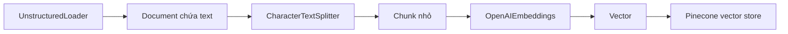

# 🧩 Medium Analyzer: "Mổ xẻ" Loaders, Text Splitter, Embeddings & Pinecone trước khi vào code

> Nguồn: `044-Medium-Analyzer--Class-Review-LoadersTextSplitterOpenAIEmbed.txt` · [Udemy](https://ua.udemy.com/course/langchain/learn/lecture/57090761)

Chào các bạn, mình là Eden đây! 👋 Trong phần này, chúng ta sẽ viết **code LangChain để ingest bài blog Medium vào vector store**. Nghe có vẻ dài: load dữ liệu vào **document object**, chia nhỏ bằng **text splitter**, **embed** các chunk thành vector, rồi lưu tất cả vào **Pinecone**. Nhưng sự thật là trong LangChain, việc này chỉ tốn **vài dòng code** — đó chính là điều tuyệt vời của LangChain: nó tiết kiệm cho chúng ta vô số **boilerplate code**.

Video này sẽ đi qua phần **imports và các LangChain object** chúng ta sẽ làm việc, còn video sau mới là phần **implementation của ingestion**.

### 📄 Document loaders: nhìn tận mắt source code của LangChain

Khi nói chuyện với LLM, chúng ta gửi cho chúng dữ liệu — và dữ liệu đó là **text**. Text có thể là thứ chúng ta viết vào prompt, nhưng cũng có thể đến từ những nguồn khác: tin nhắn **WhatsApp**, file **PDF**, hay một **Notion notebook**. Tất cả đều là text, nhưng khác nhau về **định dạng** và **ý nghĩa ngữ nghĩa**.

**Document loaders** chính là những class implementation giúp load và xử lý dữ liệu đó để LLM có thể "tiêu hóa" được. Vì mọi thứ khá dễ hiểu, mình không ngại "xắn tay áo" và đi thẳng vào **source code** của repo LangChain Python — một repository **public trên GitHub**, các bạn có thể tìm thấy online (mình cũng để link trong Resources của khóa học).

Trong thư mục **document loaders**:

* File **`text.py`** chứa toàn bộ implementation của **text document loader**. Cách nó hoạt động rất đơn giản: nhận **file path**, mở file như cách chúng ta vẫn mở file trong Python, gắn thêm **metadata** giữ **source** chính là đường dẫn file, bọc tất cả trong một **list** rồi trả về. Không có gì mới lạ — chỉ là một wrapper dễ dùng giúp **abstract hóa** mọi thứ, để sau này mọi loại document đều có **cùng một interface**.
* **WhatsApp chat loader** cũng tương tự: mở file text đại diện cho đoạn chat, dùng **regular expression** để tách ra **tên người gửi, người nhận, nội dung và ngày gửi**, rồi nối từng dòng lại với nhau và trả về.

Tất cả chỉ để biến dữ liệu trở nên **dễ ingest hơn** cho LLM. Và LangChain có vô số implementation cho đủ loại file: WhatsApp, Google Drive, Notion, PDF — bất cứ thứ gì bạn cần, LangChain đều giúp LLM "tiêu hóa" theo cách tốt nhất có thể.

---

### 🔄 "Chuyện dở khóc dở cười" của LangChain Community: bài học về open source

*Mình chen ngang một chút đây!* Đoạn code ban đầu import **text loader từ `langchain-community`**, nhưng tính đến **năm 2026, package này đã chính thức bị sunset và deprecated**. Đây là một khoảnh khắc cực kỳ giáo dục về cách **open source tiến hóa**, nên mình muốn dành thời gian phân tích.

Lý do đằng sau việc khai tử này xoay quanh **stability (ổn định), maintainability (khả năng bảo trì) và security (bảo mật)**. `langchain-community` từng là một **catch-all package** — ai cũng có thể đóng góp, và nó bắt đầu chứa đầy nội dung không liên quan đến nhau. Thời gian qua, LangChain đã chuyển sang cấu trúc mới: mọi integration được đặt trong một **partner package riêng biệt**, ví dụ **LangChain OpenAI**, **LangChain ChromaDB**, **LangChain Anthropic**.

Sự thay đổi này mang lại rất nhiều lợi ích:

1. **Versioning và stability tốt hơn:** mỗi partner package có **semantic versioning** và **release cadence** riêng; quan trọng hơn, **business logic được khoanh vùng** — một integration không thể làm hỏng integration khác (điều từng xảy ra khá nhiều lần với Community vì mọi thứ đan xen vào nhau).
2. **Dễ quản lý hơn cho đội ngũ LangChain:** mỗi vendor package có thể do những thành viên khác nhau phụ trách, chuyên tâm vào một đối tác cụ thể — từ đó việc quản lý dependency, sửa bug, thêm feature trở nên dễ dàng hơn, kèm theo **trách nhiệm rõ ràng** và quan hệ chặt chẽ hơn với các vendor.
3. **Bảo mật tốt hơn:** những partner package phổ biến được **chính đội ngũ LangChain duy trì trực tiếp**, chịu các tiêu chuẩn cao hơn về **testing, giám sát bảo mật và hỗ trợ** — khác hẳn với các package cộng đồng, vốn **kém phù hợp cho những ứng dụng production quan trọng**.
4. **Kích thước package nhỏ hơn:** người dùng chỉ cài đúng integration mình cần, không phải tải về toàn bộ package community khổng lồ.

Vậy thay thế là gì? Chúng ta dùng partner package **LangChain Unstructured** và import **`UnstructuredLoader`** — loader giúp load **nhiều loại text phi cấu trúc** khác nhau. *Các bạn cứ yên tâm "quên" luôn loader của Community nhé, link tài liệu mình để trong Resources.*

---

### ✂️ Character Text Splitter: chunk size và chunk overlap

Tiếp theo, mình import **character text splitter**. Hãy đảm bảo các bạn đã cài package **`langchain-text-splitters`** — đây cũng là "chủ đề" quen thuộc của LangChain: tách logic như text splitting ra thành **sub-package** riêng.

**Text splitters** giúp chúng ta xử lý những đoạn text dài chứa vô số token. Nếu gửi thẳng cho LLM, request sẽ thất bại vì **vượt quá token limitation** của model — ví dụ **GPT-3.5 có giới hạn 4K token**. Text splitter cho phép ta chia text lớn thành các **chunk** nhỏ.

Bên trong text splitter có rất nhiều logic vì tồn tại vô số **chiến lược chia** và những cách tính **chunk size** thông minh. Và chunk size **không hề tầm thường** — nó thay đổi tùy vào mục tiêu, tùy LLM và tùy hệ thống embeddings mà chúng ta chọn; *chủ đề này sẽ được bàn kỹ sau trong khóa học*.

Khi đọc documentation của character text splitter, các bạn sẽ thấy các tham số:

* **Separator:** ký tự mà chúng ta muốn dùng để tách.
* **Chunk size:** kích thước mỗi chunk — ở đây là **1000 token**.
* **Chunk overlap:** lượng **chồng lấn** giữa các chunk khi tách text — cực kỳ hữu ích để đảm bảo text không bị cắt theo cách **phá vỡ context hoặc ý nghĩa**.
* **Length function:** thường là `len`, giúp LangChain xác định chunk size. Nếu muốn tính theo token, chúng ta có thể viết những hàm đặc biệt để đếm số token trong chunk.

| Tham số | Ý nghĩa |
|---|---|
| Separator | Ký tự dùng để tách text |
| Chunk size | Kích thước tối đa mỗi chunk, ví dụ 1000 token |
| Chunk overlap | Độ chồng lấn giữa các chunk để giữ ngữ cảnh |
| Length function | Hàm đo độ dài, mặc định là len; có thể tự viết hàm đếm token |

---

### 🧠 OpenAI Embeddings và Pinecone: cặp đôi lưu trữ vector

Giờ đến **embeddings object** — chúng ta dùng **OpenAI embeddings**. Nhắc lại một chút: **embedding model (hay encoder)** đơn giản là một **hộp đen** nhận **text đầu vào** và trả về **vector trong không gian embeddings**.

Vậy làm sao để embed một đoạn text? Rất nhiều nhà cung cấp embeddings cho chúng ta một **API `/embed`**: gửi text vào, nhận vector về. Có rất nhiều model cố gắng tạo ra embedding tốt và thông minh; của OpenAI, phiên bản **`text-embedding-ada-002`** là một model rất tốt — và trong embedding, **giá cả có ý nghĩa cực lớn**, vì có khi bạn phải embed cả một database. Về cơ bản, `text-embedding-ada-002` **rẻ hơn đến 98%** so với người tiền nhiệm của nó.

Toàn bộ ý tưởng của text embedding model trong LangChain là tạo ra một **interface thống nhất** để truy cập embeddings từ nhiều nhà cung cấp khác nhau. Dù bạn dùng **Cohere, HuggingFace hay OpenAI**, giao diện vẫn như nhau — chuyển đổi qua lại chỉ đơn giản là **đổi một tham số**.

Cuối cùng là **Pinecone**. Chúng ta cần nơi **lưu trữ lâu dài (persistent storage)** cho các vector, cần khả năng **tìm kiếm những vector gần nhất** trong vector space, và cần thêm vector mới vào bất cứ lúc nào — tất cả đều do **vector database** lo liệu. **Pinecone** là một vector database tuyệt vời "nổi lên như cồn" gần đây, có **free tier** nên *các bạn đừng lo chuyện tốn nhiều tiền nhé*.



---

### 💻 Code mẫu đầy đủ — `ingestion.py`

Toàn bộ code của bài nằm trong file `ingestion.py` (tham khảo từ repo chính thức của khóa học) — nhớ đổi `file_path` cho khớp với máy bạn:

```python
import os

from dotenv import load_dotenv
from langchain_unstructured import UnstructuredLoader
from langchain_openai import OpenAIEmbeddings
from langchain_pinecone import PineconeVectorStore
from langchain_text_splitters import CharacterTextSplitter

load_dotenv()

if __name__ == "__main__":
    print("Ingesting...")
    loader = UnstructuredLoader(file_path="mediumblog1.txt", chunking_strategy="basic", max_characters=1000000)
    document = loader.load()

    print("splitting...")
    text_splitter = CharacterTextSplitter(chunk_size=1000, chunk_overlap=0)
    texts = text_splitter.split_documents(document)
    print(f"created {len(texts)} chunks")

    embeddings = OpenAIEmbeddings(openai_api_key=os.environ.get("OPENAI_API_KEY"))

    print("ingesting...")
    PineconeVectorStore.from_documents(
        texts, embeddings, index_name=os.environ["INDEX_NAME"]
    )
    print("finish")
```

### 🎯 Tự kiểm tra nhanh

**Câu 1:** Bên trong text document loader, chuyện gì thực sự diễn ra?

<details>
<summary><b>Xem đáp án</b></summary>

**Đáp án:** Nó nhận file path, mở file như Python thông thường, gắn metadata source là đường dẫn file, bọc trong list rồi trả về.

Giải thích: Loader chỉ là wrapper dễ dùng giúp mọi loại document có cùng một interface.

Tham chiếu: Mục Document loaders.

</details>

**Câu 2:** Vì sao `langchain-community` bị sunset và deprecated?

<details>
<summary><b>Xem đáp án</b></summary>

**Đáp án:** Vì các vấn đề về stability, maintainability và security — package catch-all chứa đầy nội dung không liên quan, mọi thứ đan xen nhau.

Giải thích: LangChain chuyển sang mỗi integration một partner package riêng.

Tham chiếu: Mục Chuyện dở khóc dở cười của LangChain Community.

</details>

**Câu 3:** Partner package mang lại lợi ích gì?

<details>
<summary><b>Xem đáp án</b></summary>

**Đáp án:** Versioning và stability tốt hơn, dễ quản lý hơn, bảo mật tốt hơn, kích thước package nhỏ hơn.

Giải thích: Business logic được khoanh vùng nên một integration không thể làm hỏng integration khác.

Tham chiếu: Mục Chuyện dở khóc dở cười của LangChain Community.

</details>

**Câu 4:** Chunk overlap để làm gì?

<details>
<summary><b>Xem đáp án</b></summary>

**Đáp án:** Tạo phần chồng lấn giữa các chunk để text không bị cắt theo cách phá vỡ context hoặc ý nghĩa.

Giải thích: Overlap giữ mạch ngữ cảnh nối giữa các chunk liền kề.

Tham chiếu: Mục Character Text Splitter.

</details>

**Câu 5:** Vì sao nói embeddings model trong LangChain có interface thống nhất?

<details>
<summary><b>Xem đáp án</b></summary>

**Đáp án:** Vì dù dùng Cohere, HuggingFace hay OpenAI, cách dùng vẫn như nhau — chuyển đổi chỉ là đổi một tham số.

Giải thích: Nhờ vậy ta linh hoạt thay nhà cung cấp embeddings cho ứng dụng.

Tham chiếu: Mục OpenAI Embeddings và Pinecone.

</details>

Vậy là xong phần imports! Ở video tiếp theo, chúng ta sẽ cùng nhau **implement phần ingestion** để đưa bài blog vào vector store. Hẹn gặp lại các bạn! 🚀

## Nguồn tham khảo

- [Udemy — Medium Analyzer: Class Review Loaders, TextSplitter, OpenAIEmbeddings, Pinecone](https://ua.udemy.com/course/langchain/learn/lecture/57090761)
- [LangChain — Unstructured integration](https://docs.langchain.com/oss/python/integrations/document_loaders/unstructured_file)
- [LangChain — Text splitter integrations](https://docs.langchain.com/oss/python/integrations/splitters)
- [OpenAI — Vector embeddings](https://platform.openai.com/docs/guides/embeddings)
