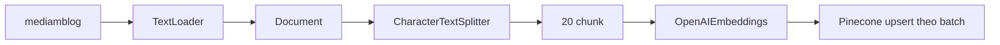

# 🗂️ Ingestion Implementation: Nạp trọn bộ Medium Blog vào Vector Database

> Nguồn: `045-Medium-Analyzer--Ingestion-Implementation.txt` · [Udemy](https://ua.udemy.com/course/langchain/learn/lecture/57091191)

Chào các bạn, Eden đây! Chúng ta đã nắm đủ lý thuyết về **embeddings (vector biểu diễn ngữ nghĩa)** và vector store, giờ là lúc **viết code thật** cho phần **ingestion (nạp dữ liệu)** của dự án Medium Analyzer.

Trong bài này, mình sẽ cùng các bạn load file blog Medium, chia nhỏ thành các chunk, tạo embedding và đẩy toàn bộ vào Pinecone. Nghe dài vậy thôi chứ mọi thứ diễn ra khá gọn gàng nhờ các abstraction của LangChain.

### 🎬 Một lời nhắn nhỏ trước khi bắt đầu

Video này được ghi từ phiên bản cũ của khóa học, nên các bạn sẽ thấy mình dùng **PyCharm**, cùng file `.pf` và `pepfile.log` trong project. Mình đã ghi lại gần như toàn bộ các video để bám sát phiên bản LangChain mới nhất, riêng bài này code thay đổi không đáng kể nên mình chỉ **patch lại** thay vì quay mới.

*Nếu điều này thực sự làm bạn khó chịu, cứ để lại comment hoặc nhắn tin cho mình nhé.* Video này nằm trong danh sách sẽ quay lại, nhưng mình đang ưu tiên những nội dung thực sự ảnh hưởng đến việc học của các bạn.

Đầu tiên, chúng ta xem qua file cần ingest — `mediamblog`. Mình khởi tạo một **TextLoader** và truyền vào đường dẫn file; các bạn nhớ đổi đường dẫn cho khớp với máy của mình. Sau đó mình dùng **chunking strategy** cơ bản nhất với `max_characters` thật lớn, cỡ **1 triệu ký tự**, để nạp nguyên file thành một document duy nhất. Tất cả chỉ cần gọi `loader.load`.

Điều mình thích ở abstraction này: nếu mai sau các bạn muốn load **WhatsApp messages**, **Notion** hay **Google Drive**, giao diện vẫn y hệt — chỉ cần tạo loader riêng cho dịch vụ đó rồi gọi `load`. Trong tài liệu LangChain, mục document loader có sẵn loader cho các định dạng phổ thông như **CSV, HTML, JSON, PDF**; còn phần **integrations** thuộc LangChain community, nơi cộng đồng đóng góp loader cho đủ loại dịch vụ — **YouTube transcripts**, **Slack messages**... tất cả đều dùng chung một cú pháp.

---

### 🔍 Bên trong một LangChain Document (và lỗi unicode)

Trước khi chia nhỏ, mình chạy debug để soi các object. Một lưu ý nhỏ: tùy hệ điều hành và bộ encoder, các bạn có thể gặp lỗi **unicode error — codec can't decode bytes**. Cách sửa rất đơn giản: thêm flag `encoding="UTF-8"`, và nếu vẫn chưa được thì dùng `autodetect_encoding=True`. *Với đa số mọi người, mọi thứ vẫn chạy êm mà không cần flag nào cả.*

Sau khi gọi `loader.load`, mình nhận về một **list các LangChain Document**. Mỗi document có hai thuộc tính quan trọng:

* **`page_content`:** toàn bộ nội dung đã nạp.
* **`metadata`:** mặc định lưu **source** — chính là đường dẫn file.

| Thuộc tính | Chứa gì | Vai trò trong RAG |
|---|---|---|
| page_content | Toàn bộ nội dung text đã nạp | Nguyên liệu để chunk và embed |
| metadata | Mặc định là source — đường dẫn file | Grounding và filter, tách dữ liệu về sau |

Trường metadata này cực kỳ quan trọng với RAG: nó cho ta biết **thông tin đến từ đâu**, LLM đã được "neo" (ground) vào nguồn nào. Các bạn cũng có thể thêm bất kỳ cặp key-value nào vào metadata để **filter** hoặc **tách dữ liệu** về sau — rất hữu ích khi triển khai production và xây dựng các hệ RAG nâng cao.

---

### ✂️ Chunking: vì sao mình chọn 1.000 ký tự?

Mình tạo một **CharacterTextSplitter**. Class này có thể rất phức tạp — hỗ trợ **regular expressions**, hàm đếm độ dài tùy biến để tính token, vô vàn tùy chỉnh — nhưng ở ví dụ này mình chỉ điền hai tham số:

1. **`chunk_size = 1,000`:** giới hạn mỗi chunk tối đa 1.000 ký tự.
2. **`chunk_overlap = 0`:** các chunk không chồng lấn dữ liệu.

Vì sao lại là 1.000? Đây là một **heuristic (quy tắc ngón tay cái)**. Chunk phải đủ nhỏ để nhét vừa **context window**, vì ta sẽ retrieve vài chunk một lúc; nhưng cũng phải đủ lớn để khi đọc lên, con người hiểu được ý nghĩa của nó. *Chunk quá nhỏ thì chẳng ai hiểu gì, và LLM cũng không thể trả lời đúng.* Còn **overlap** hữu ích khi ta muốn giữ ngữ cảnh nối giữa các chunk — riêng ví dụ này mình để 0 cho đơn giản.

Nhiều bạn sẽ hỏi: thời điểm model như **Gemini** nuốt được cả triệu token, sao vẫn phải chia nhỏ? Vì LLM có một quy luật cực hay: **garbage in, garbage out**. Gửi càng nhiều thông tin không liên quan thì:

* Càng **tốn tiền** — càng nhiều token, chi phí càng cao.
* Và đã được chứng minh là cho **kết quả tệ hơn**.

Chỉ dùng đúng context, đúng chunk liên quan, ta sẽ nhận được câu trả lời tốt hơn.

Mình gọi `split_documents` (nhận vào list document) rồi chạy lại. Chunk vẫn là **Document**, chỉ nhỏ hơn — khoảng 1.000 ký tự một chunk, vẫn giữ metadata source. LangChain có in một thông báo rằng vài chunk vượt quá 1.000 ký tự, đơn giản vì việc cắt theo separator không phải là khoa học chính xác. *Những con số này khá nhỏ, và với context window ngày nay (32K, 100K, cả triệu token), chuyện này không còn nghiêm trọng như trước.* Kết quả: **20 chunk** được tạo ra.

---

### 🧠 Đưa tất cả vào Pinecone: sức mạnh của một interface duy nhất

Giờ đến phần ingest. Mình khởi tạo **OpenAIEmbeddings** với API key lấy từ **environment variable**. Embeddings mặc định của OpenAI là **ADA002**, có thể đổi sang **multimodal embeddings** nếu muốn. Bên dưới lớp vỏ, object này tự tạo một **OpenAI client** và gọi API để embed tài liệu.

Để nạp dữ liệu, mình dùng `PineconeVectorStore.from_documents` — và không chỉ Pinecone, **mọi vector store trong LangChain** đều có method này. Nó nhận vào **list documents**, **embeddings object** và **index name** (cũng lấy từ biến môi trường). LangChain lần lượt đi qua từng chunk, embed và lưu vào vector store.

Tự viết logic này có được không? Hoàn toàn được, vì nó không hề phức tạp. Nhưng LangChain cho ta **một interface duy nhất** để linh hoạt đổi embeddings model hay thậm chí đổi cả vector store khi cần tìm cái phù hợp nhất. Quan trọng hơn, họ đã cài sẵn **threading**, **Async IO** để chạy song song và xử lý **rate limit** — đúng kiểu boilerplate mà ta cần cho production. Nhìn vào source code, các bạn sẽ thấy vòng lặp tạo embedding rồi **upsert** vào vector store theo **batch**, chạy bất đồng bộ được, và tất cả vector store đều hỗ trợ.

Chạy thử: trước đó index đang trống, sau khi chạy file ingestion và refresh Pinecone, các bạn sẽ thấy **20 vector** đã được nạp. Cấu trúc dữ liệu lưu trong Pinecone gồm:

* **text:** `page_content` của Document — chính là nội dung chunk.
* **source:** đường dẫn của chunk — bằng chứng cho việc grounding.
* **vector:** danh sách các con số biểu diễn ngữ nghĩa.

### 🎯 Tự kiểm tra nhanh

**Câu 1:** Vì sao lúc load mình đặt `max_characters` tới 1 triệu ký tự?

<b>Xem đáp án</b>

**Đáp án:** Để nạp nguyên file thành một document duy nhất trước khi chia nhỏ.

Giải thích: Sau đó mới dùng splitter để cắt thành các chunk phù hợp.

Tham chiếu: Mục Một lời nhắn nhỏ trước khi bắt đầu.

**Câu 2:** Metadata source quan trọng thế nào với RAG?

<b>Xem đáp án</b>

**Đáp án:** Nó cho biết thông tin đến từ đâu — bằng chứng cho việc grounding, và có thể dùng để filter hoặc tách dữ liệu.

Giải thích: Bạn cũng có thể thêm bất kỳ cặp key-value nào vào metadata cho mục đích này.

Tham chiếu: Mục Bên trong một LangChain Document.

**Câu 3:** Vì sao mình chọn `chunk_size = 1.000` và `chunk_overlap = 0`?

<b>Xem đáp án</b>

**Đáp án:** 1.000 là heuristic — đủ nhỏ để nhét vừa context window, đủ lớn để con người hiểu được; overlap để 0 cho đơn giản.

Giải thích: Chunk quá nhỏ thì LLM không trả lời đúng; overlap hữu ích khi muốn giữ ngữ cảnh nối giữa các chunk.

Tham chiếu: Mục Chunking.

**Câu 4:** Vì sao vẫn phải chunk dù model hiện nay nuốt được cả triệu token?

<b>Xem đáp án</b>

**Đáp án:** Vì garbage in, garbage out — gửi nhiều thông tin không liên quan thì càng tốn tiền và cho kết quả tệ hơn.

Giải thích: Chỉ dùng đúng context, đúng chunk liên quan sẽ cho câu trả lời tốt hơn.

Tham chiếu: Mục Chunking.

**Câu 5:** `PineconeVectorStore.from_documents` lưu những gì cho mỗi chunk?

<b>Xem đáp án</b>

**Đáp án:** text là page_content của Document, source là đường dẫn chunk, và vector là dãy số biểu diễn ngữ nghĩa.

Giải thích: `from_documents` nhận list documents, embeddings object và index name; có ở mọi vector store của LangChain.

Tham chiếu: Mục Đưa tất cả vào Pinecone.

Vậy là xong phần **ingestion** — phần đầu tiên của RAG, dùng LangChain để **load → split → embed → store** vào vector database. Phần thứ hai chính là **retrieval**: lấy câu hỏi của người dùng, embed thành vector, tìm các vector liên quan nhất trong vector store, augment câu hỏi gốc với các chunk đó rồi gửi cho LLM để có câu trả lời được grounding. Hẹn gặp các bạn ở bài tiếp theo — chúng ta bắt đầu truy hồi thôi! 🚀

## Nguồn tham khảo

- [Udemy — Medium Analyzer: Ingestion Implementation](https://ua.udemy.com/course/langchain/learn/lecture/57091191)
- [LangChain — Document loader integrations](https://docs.langchain.com/oss/python/integrations/document_loaders)
- [Pinecone Docs — Create a serverless index](https://docs.pinecone.io/guides/indexes/create-an-index)
- [OpenAI — Vector embeddings](https://platform.openai.com/docs/guides/embeddings)
