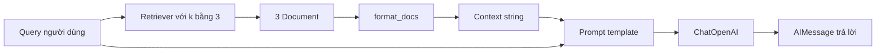

# 🔍 Naive Retrieval Implementation: Tự tay dựng RAG pipeline từ A đến Z

> Nguồn: `047-Medium-Analyzer--Naive-Retrieval-Implementation-Implementati.txt` · [Udemy](https://ua.udemy.com/course/langchain/learn/lecture/53903915)

Chào các bạn! Ingestion đã xong, vector database đã đầy dữ liệu, và giờ là thời điểm chúng ta hiện thực phần **retrieval** của dự án Medium Analyzer. Trong bài này, mình sẽ viết **cách implement "ngây thơ" nhất** — làm mọi thứ thủ công — để các bạn thấy rõ luồng chạy thực sự bên dưới, trước khi chúng ta "nâng cấp" lên **LCEL** ở bài sau.

### 🧰 Khởi tạo các thành phần: imports, embeddings và vector store

Mình bắt đầu bằng file `main.py` — đây sẽ là phần retrieval của project. Các import gồm:

* **`os`:** truy cập **environment variables**.
* **`load_dotenv`:** nạp toàn bộ biến môi trường từ file `.env`.
* **`ChatPromptTemplate`** và **`HumanMessage`:** tạo prompt và gọi pipeline.
* **`ChatOpenAI`** và **`OpenAIEmbeddings`:** LLM và embeddings model.
* **`PineconeVectorStore`:** vector store đã học ở phần trước.

Mình nạp biến môi trường, in ra dòng "initializing components" và chạy thử như một **sanity check** — mọi thứ ổn. Sau đó mình khởi tạo **embeddings**, **LLM** (dùng mặc định của LangChain OpenAI) và **vector store** — cần truyền **index name** đã tạo từ trước cùng **embeddings model**.

Các bạn để ý: ở phần ingestion ta dùng `from_documents`, còn ở đây ta cần **khả năng tìm kiếm**. Mình gọi method `as_retriever()` trên vector store — nó trả về object **VectorStoreRetriever** với khả năng search do chính **vendor** (Pinecone) hiện thực bên dưới. Khi khởi tạo, mình đặt `search_kwargs` với **`k = 3`**: mỗi lần tìm kiếm, mình chỉ lấy **3 document liên quan nhất**. Nếu có đến 10 document liên quan, retriever sẽ xếp hạng theo độ liên quan rồi cắt lấy top 3.

---

### 📝 Prompt, format_docs và luồng pipeline thủ công

Prompt mình dùng rất đơn giản nhưng mạnh: **"Answer the question based only on the following context..."**, kèm chỗ trống cho **context** và **câu hỏi gốc của người dùng**, yêu cầu trả lời chi tiết. Context chính là phần **augmentation** — chữ A trong RAG.

Mình viết thêm một hàm phụ **`format_docs`**: nhận list **LangChain Document** đã retrieve, lặp qua từng document, lấy `page_content` (chuỗi văn bản) và nối lại thành **một string duy nhất**, ngăn cách bằng newline. String này chính là thứ được đưa vào `context`.

Chạy thử — không lỗi. Giờ đến phần runner với câu hỏi: **"What is Pinecone in machine learning?"**

Đầu tiên, mình gọi LLM **không dùng RAG**: gửi thẳng câu hỏi trong một `HumanMessage`. Với **GPT-3.5 Turbo**, câu trả lời nhận được là *"a pinecone algorithm is a method to search for the best configuration hyperparameters"* — **hoàn toàn không phải thứ mình muốn**, vì Pinecone ở đây là **vector store**. Model đã **hallucinate (bịa)**.

Mình thử đổi sang **GPT-5.2** và nhận câu trả lời chuẩn xác hơn: *"Pinecone is a managed vector store database using machine learning to store index."* Lý do rất thú vị: GPT-5.2 được huấn luyện năm **2025**, khi Pinecone đã rất phổ biến với vô số tài liệu và dữ liệu huấn luyện. GPT-3.5 thì không có lợi thế đó — và đây chính là **một trong những động lực sử dụng RAG**.

Với RAG, câu trả lời mình nhận được: *"Pinecone is a fully managed cloud-based vector database specifically designed for businesses and organizations looking to build and deploy large-scale machine learning applications"* — đúng **context** mình muốn, và được grounding đầy đủ.

| Cách hỏi | Câu trả lời nhận được | Nhận xét |
|---|---|---|
| GPT-3.5, không RAG | Pinecone là thuật toán tìm hyperparameter | Hallucinate, sai hoàn toàn ngữ cảnh |
| GPT-5.2, không RAG | Pinecone là managed vector store | Đúng nhờ dữ liệu huấn luyện năm 2025 |
| RAG có context | Pinecone là vector database cloud cho ML | Đúng context của chính tài liệu mình |

Pipeline thủ công trong hàm `retrieval_chain_without_lcel` diễn ra như sau:

1. Gọi `retriever.invoke(query)` — retriever là một **Runnable**, nên có method `invoke`. Bên dưới, vendor hiện thực hàm **`get_relevant_documents`** (Pinecone dùng SDK riêng, Chroma lại có cách riêng; thậm chí có cả bản **async**).
2. Nhận về list **3 LangChain Document**.
3. Gọi `format_docs` để có string **context**.
4. Dùng `format_messages` để nhét `context` và `question` vào prompt template — nhận về list messages.
5. Gọi LLM và trả về nội dung câu trả lời.

---

### 🐞 Debug từng bước và soi LangSmith Trace

Mình đặt breakpoint và chạy debug để các bạn thấy dòng chảy dữ liệu: biến `query` → biến `documents` (3 document, mỗi cái có `page_content`) → `context` (một string rất dài gộp từ 3 document) → `messages` (một message chứa đầy đủ prompt + context + câu hỏi) → response là **AIMessage** chứa câu trả lời.

Sang **LangSmith**, các bạn sẽ thấy điểm yếu ngay: vì ta không dùng một **chain** nào, cũng không dùng **LCEL**, mà chỉ gọi từng component riêng lẻ, nên các trace **không được tổ chức dưới một component duy nhất** — *rất bất tiện để theo dõi*.

* Bước **vector store retrieval** vẫn hiện rõ: input là câu hỏi, output là 3 document, kèm cả `text` và `source` — chính là **similarity search** mà Pinecone chạy bên dưới.
* Nhưng bước **format docs** và **populate prompt template** thì gần như "tàng hình", vì chúng không nằm trong chain nào.
* Chỉ có lần gọi LLM cuối cùng là hiện lên với đầy đủ augmented prompt và câu trả lời.

---

### ⚠️ Vì sao cách này chưa đủ tốt?

Mình implement mọi thứ **rất ngây thơ** — thật ra nó chỉ là một chuỗi lời gọi hàm, chứ chưa phải một "chain" đúng nghĩa. Điều này dẫn tới hàng loạt hạn chế:

* Mọi thứ phải **gọi thủ công**.
* **Không có streaming**, **không có async**.
* **Khó compose** vào các chain khác.
* **Dễ phát sinh lỗi** và **khó bảo trì**.
* Quan trọng nhất: **cực kỳ khó trace và debug**.

### 🎯 Tự kiểm tra nhanh

**Câu 1:** `as_retriever()` trả về gì và `k = 3` nghĩa là gì?

<b>Xem đáp án</b>

**Đáp án:** Nó trả về VectorStoreRetriever; `k = 3` nghĩa là mỗi lần tìm chỉ lấy 3 document liên quan nhất.

Giải thích: Nếu có 10 document liên quan, retriever xếp hạng theo độ liên quan rồi cắt lấy top 3.

Tham chiếu: Mục Khởi tạo các thành phần.

**Câu 2:** Hàm `format_docs` làm gì?

<b>Xem đáp án</b>

**Đáp án:** Nhận list Document đã retrieve, lấy `page_content` của từng document và nối thành một string duy nhất, ngăn cách bằng newline.

Giải thích: String này chính là `context` — phần augmentation của RAG.

Tham chiếu: Mục Prompt, format_docs và luồng pipeline thủ công.

**Câu 3:** Vì sao GPT-3.5 trả lời sai về Pinecone?

<b>Xem đáp án</b>

**Đáp án:** Vì nó không có Pinecone vector store trong dữ liệu huấn luyện nên đã hallucinate.

Giải thích: GPT-5.2 huấn luyện năm 2025 khi Pinecone đã phổ biến nên trả lời đúng — đây cũng là động lực dùng RAG.

Tham chiếu: Mục Prompt, format_docs và luồng pipeline thủ công.

**Câu 4:** Vì sao trace của bản naive rời rạc trên LangSmith?

<b>Xem đáp án</b>

**Đáp án:** Vì không dùng chain hay LCEL, chỉ gọi từng component riêng lẻ nên các trace không nằm dưới một component duy nhất.

Giải thích: Bước format docs và populate prompt gần như "tàng hình"; chỉ lần gọi LLM cuối là hiện đầy đủ.

Tham chiếu: Mục Debug từng bước và soi LangSmith Trace.

**Câu 5:** Hạn chế chính của naive implementation là gì?

<b>Xem đáp án</b>

**Đáp án:** Phải gọi thủ công, không streaming, không async, khó compose, dễ lỗi, khó bảo trì và cực kỳ khó trace/debug.

Giải thích: Đó là lý do video sau mình gói tất cả vào một chain LCEL.

Tham chiếu: Mục Vì sao cách này chưa đủ tốt?

Trong video tiếp theo, mình sẽ implement lại đúng chức năng này nhưng **gói tất cả vào một LangChain chain bằng LCEL (LangChain Expression Language)** — giải quyết trọn vẹn từng hạn chế trên. Hẹn gặp các bạn ở đó, phần thú vị nhất sắp bắt đầu! 🚀

## Nguồn tham khảo

- [Udemy — Medium Analyzer: Naive Retrieval Implementation](https://ua.udemy.com/course/langchain/learn/lecture/53903915)
- [LangSmith Docs — Trace LangChain applications](https://docs.langchain.com/langsmith/trace-with-langchain)
- [LangChain — Pinecone vector store integration](https://docs.langchain.com/oss/python/integrations/vectorstores/pinecone)
