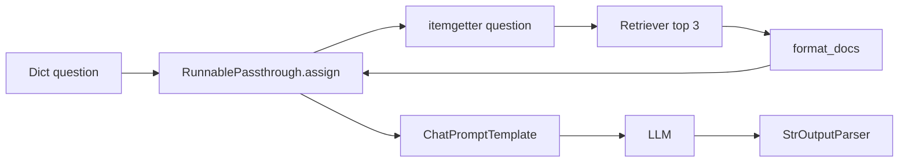

# 🧪 2-Step RAG với LCEL: Gói trọn pipeline vào một Runnable Chain

> Nguồn: `048-Medium-Analyzer--2-Step-RAG.txt` · [Udemy](https://ua.udemy.com/course/langchain/learn/lecture/53903093)

Chào các bạn, Eden đây! Ở bài trước chúng ta đã có bản **naive implementation** — chạy đúng nhưng khó trace, khó mở rộng. Hôm nay mình sẽ làm lại đúng chức năng đó bằng **LCEL (LangChain Expression Language)** để các bạn thấy vì sao đây mới là cách viết "chuẩn bài".

Trước khi bắt đầu, mình tag lại solution cũ với nhãn **"solution without LangChain Expression Language"** — cách tiếp cận đơn giản dựa trên hàm.

### 🧩 Chuẩn bị: StrOutputParser, RunnablePassthrough và itemgetter

Mình thêm vài import mới:

* **`StrOutputParser`:** đã gặp ở các phần trước, dùng để lấy nội dung text từ response của LLM.
* **`RunnablePassthrough`:** đúng như tên gọi, đây là một **Runnable** cho phép input đi xuyên qua mà không bị thay đổi. Nhìn vào source code của LangChain, nó hành xử gần như một **identity function** — chỉ khác là có thể cấu hình để **thêm key mới vào output** khi input là dictionary. Điều này sẽ cực kỳ hữu ích ở phần sau.
* **`itemgetter`:** tiện ích Python từ module **operator**, tạo ra một callable để lấy phần tử theo **indexing**. Có thể dùng **lambda** thay thế, nhưng `itemgetter` tiện hơn.

---

### 🛠️ Hàm create_retrieval_chain_with_lcel: trả về một chain thay vì chạy

Điểm thú vị: hàm này **không nhận tham số nào** — vì nó sẽ **trả về một LangChain chain**. Chain đó là một **Runnable**, nên ta gọi `invoke` trên kết quả trả về, còn input sẽ được truyền vào chính hàm `invoke` như mọi khi.

Vì sao LCEL đáng dùng? Mình liệt kê các ưu điểm:

1. **Declarative và composable hơn hẳn** — có thể đem ghép vào các component khác của LangChain.
2. Nhờ **Runnable interface**: có **streaming**, **async**, **batch processing** và **type safety**.
3. Quan trọng nhất: **observability với LangSmith tốt hơn rất nhiều** khi mọi thứ được bind trong một chain.

| Tiêu chí | Bản naive | Bản LCEL |
|---|---|---|
| Cách nối bước | Gọi hàm thủ công | Pipe bằng dấu gạch đứng |
| Streaming và async | Không có | Có sẵn nhờ Runnable interface |
| Observability LangSmith | Rời rạc, khó theo dõi | Gói gọn trong một trace |
| Khả năng compose | Khó | Ghép vào chain khác dễ dàng |

Mình bắt đầu bằng ba đoạn **piping**: `prompt template | LLM | StrOutputParser`. Ba phần này tương ứng với các bước 3, 4, 5 của bản naive: prompt nhận **câu hỏi + context**, đưa vào LLM, rồi `StrOutputParser` đơn giản chỉ lấy key `.content` của response.

Nhưng làm sao để "bơm" `context` và `question` vào prompt template, giống các bước 1–2–3 của bản cũ? Ta cần invoke **retriever**, pipe kết quả vào **`format_docs`**, rồi pipe tiếp vào prompt template.

---

### ⚠️ Hai "nút thắt" và cách LCEL hóa giải

**Nút thắt thứ nhất:** `format_docs` chỉ là **một hàm Python thường**, không phải Runnable, không có method `invoke`. *Đừng lo nếu các bạn thử invoke và gặp lỗi* — vì khi dùng hàm Python trong chain LCEL, LangChain sẽ **tự động chuyển nó thành runnable lambda**, tuân thủ Runnable interface: có thể invoke, stream, batch process. Vấn đề được giải quyết.

**Nút thắt thứ hai:** prompt template cần **hai** đối số — `question` và `context` — nhưng output hiện tại không tự gán nhãn cho context. Giải pháp: bọc đoạn đó trong **`RunnablePassthrough`** và dùng method **`assign`**.

`RunnablePassthrough.assign` tạo ra một **dictionary mới**, kết hợp **input gốc** với **field mới được tính toán**. Cụ thể:

* Input của chain là dict có key `question` (chứa câu hỏi người dùng).
* Vì dùng RunnablePassthrough, input **không bị thay đổi**.
* `assign` thêm vào một key mới: **`context`** — giá trị là sub-chain gồm `itemgetter("question")` → **retriever** → **format_docs**.

*Nói cách khác, `itemgetter("question")` lấy ra đúng chuỗi câu hỏi, pipe vào retriever, rồi pipe kết quả vào format docs.* Output cuối của bước này là dict có **cả `question` lẫn `context`** — và đây là thứ được pipe vào prompt template.

Mình biết phần này khá **nhiều "syntactic sugar"** và theo kinh nghiệm cá nhân của mình, phải mất một lúc mới thấm. *Nếu lần đầu xem mà chưa hiểu hết, các bạn đừng "hoảng" nhé!* Hãy tạm nghỉ, **đi pha một ly cà phê**, rồi quay lại xem video thêm lần nữa — mọi thứ sẽ rõ hơn nhiều khi chính tay các bạn viết code và chạy thử.

---

### 🔬 Chạy thử và cảm nhận sức mạnh của Observability

Mình gọi `create_retrieval_chain_with_lcel()`, nhận về chain và invoke với input là dict `{"question": ...}`. Kết quả **tương tự bản naive** — nội dung câu trả lời như nhau, chỉ khác cách triển khai.

Và đây là phần thú vị nhất: mở **LangSmith** lên, các bạn sẽ thấy **toàn bộ các mảnh ghép của RAG retrieval pipeline nằm gọn trong một trace duy nhất**, dưới một **LangChain RunnableSequence**:

* Thấy được **câu hỏi gốc** và **output cuối cùng** của chain.
* Thấy được **thời gian chạy của từng bước**, và đâu là **bottleneck** tốn thời gian nhất.
* Thấy rõ phần **`RunnablePassthrough.assign`**: input là dict với key `question`, output là dict có thêm key `context` chứa ngữ cảnh liên quan.
* Bên trong nó có **3 bước**: `itemgetter` (chạy dưới dạng runnable lambda, lấy ra câu hỏi) → **retriever** (nhận query người dùng, trả về tối đa **3 document**) → **format_docs**.
* Sau đó dict `context + question` được pipe vào **ChatPromptTemplate** → **LLM** → **parser** để ra câu trả lời cuối cùng.

### 🎯 Tự kiểm tra nhanh

**Câu 1:** `RunnablePassthrough` hoạt động như thế nào?

<b>Xem đáp án</b>

**Đáp án:** Nó gần như là identity function — cho input đi xuyên qua không đổi, nhưng có thể cấu hình để thêm key mới khi input là dict.

Giải thích: Method `assign` là công cụ thêm key mới, cực kỳ hữu ích để tạo `context` cho prompt.

Tham chiếu: Mục Chuẩn bị: StrOutputParser, RunnablePassthrough và itemgetter.

**Câu 2:** Vì sao một hàm Python thường như `format_docs` lại dùng được trong chain LCEL?

<b>Xem đáp án</b>

**Đáp án:** Vì LangChain tự động chuyển nó thành runnable lambda, tuân thủ Runnable interface.

Giải thích: Nhờ vậy hàm thường có thể invoke, stream, batch process trong chain.

Tham chiếu: Mục Hai "nút thắt" và cách LCEL hóa giải.

**Câu 3:** Hai "nút thắt" khi xây chain là gì?

<b>Xem đáp án</b>

**Đáp án:** Một là `format_docs` không phải Runnable; hai là prompt cần cả `question` lẫn `context` mà output chưa tự gán nhãn cho context.

Giải thích: Nút thắt một được giải quyết tự động; nút thắt hai xử lý bằng `RunnablePassthrough.assign`.

Tham chiếu: Mục Hai "nút thắt" và cách LCEL hóa giải.

**Câu 4:** `RunnablePassthrough.assign` tạo ra kết quả gì?

<b>Xem đáp án</b>

**Đáp án:** Một dictionary mới, kết hợp input gốc với field mới được tính toán — ở đây là `context`.

Giải thích: Sub-chain gồm `itemgetter("question")` → retriever → `format_docs` tạo ra giá trị cho field đó.

Tham chiếu: Mục Hai "nút thắt" và cách LCEL hóa giải.

**Câu 5:** Trên LangSmith, chain LCEL cho ta thấy những gì?

<b>Xem đáp án</b>

**Đáp án:** Toàn bộ pipeline nằm gọn trong một trace dưới một RunnableSequence: câu hỏi gốc, output cuối, thời gian từng bước và đâu là bottleneck.

Giải thích: Thấy rõ `RunnablePassthrough.assign` với 3 bước itemgetter, retriever, format_docs bên trong.

Tham chiếu: Mục Chạy thử và cảm nhận sức mạnh của Observability.

Toàn bộ code của bài nằm trong repository ở branch **`project/rag-gist`**, commit **"add LCEL based retrieval chain"** — các bạn cứ vào đó lấy về nhé. Vậy là từ một pipeline rối rắm, chúng ta đã có một chain gọn gàng, dễ trace và dễ compose. Hẹn gặp lại các bạn ở bài tiếp theo! 🚀

## Nguồn tham khảo

- [Udemy — Medium Analyzer: 2 Step RAG](https://ua.udemy.com/course/langchain/learn/lecture/53903093)
- [LangChain Reference — RunnablePassthrough](https://reference.langchain.com/python/langchain-core/runnables/passthrough/RunnablePassthrough)
- [LangChain Reference — RunnableSequence](https://reference.langchain.com/python/langchain-core/runnables/base/RunnableSequence)
- [LangSmith Docs — Trace LangChain applications](https://docs.langchain.com/langsmith/trace-with-langchain)
