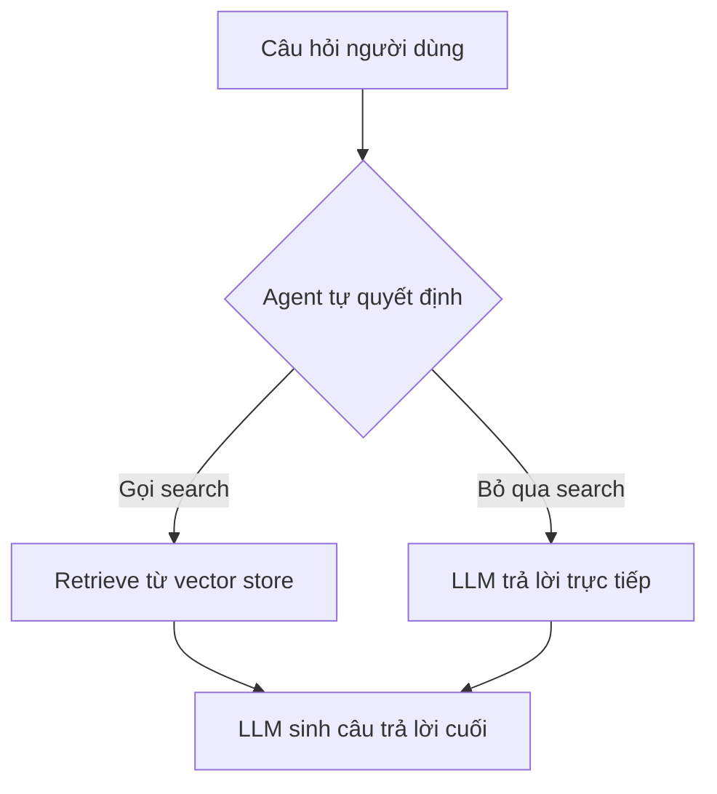

# 🧐 Đọc tài liệu RAG của LangChain: Yêu thích nhưng vẫn phải... phê bình!

> Nguồn: `049-LangChain-RAG-Documentation.txt` · [Udemy](https://ua.udemy.com/course/langchain/learn/lecture/53910903)

Chào các bạn, Eden đây! Mong là các bạn đang tận hưởng section về **RAG (Retrieval-Augmented Generation)** này. Trong bài này, mình muốn cùng các bạn mở **tài liệu chính thức của LangChain** và soi kỹ phần RAG — bởi vì mình có vài ý kiến khá thẳng thắn về nó.

Mình nói trước cho rõ: **mình yêu LangChain**, yêu cả hệ sinh thái và **LangGraph**. Nhưng tài liệu của họ thì xứng đáng nhận vài lời phê bình.

### 📖 Mình đã đồng hành với LangChain từ những ngày đầu

Mình theo LangChain từ những ngày sớm nhất, chứng kiến mọi phiên bản, mọi lần thay đổi của bộ tài liệu. Điều đáng nói là **sau phiên bản 1.0**, họ đã **xóa đi rất nhiều tài liệu** — trong đó có những thứ mình cho là cực kỳ quan trọng, vẫn còn tồn tại trong **source code** và **không hề có kế hoạch deprecate**.

Không chỉ vậy, cách họ tiếp cận phần **tài liệu RAG** (mà mình sắp chỉ ra) theo mình là **chưa đúng**, chưa phải **best practice**. Đó là lý do những gì mình dạy trong section này **khác với tài liệu** — và mình muốn chỉ cho các bạn thấy vì sao.

---

### 🔎 Bên trong mục Tutorials: Semantic Search và RAG Agent

Nếu vào phần **Tutorials**, các bạn sẽ thấy hướng dẫn xây **semantic search engine** với LangChain. Ở đây có đầy đủ các khái niệm chúng ta đã học: **documents, text, feature embeddings, vector stores, retrievers**. Ví dụ thì có: load **PDF document**, in `page_content`, **splitting**, **embedding**, giải thích output của embedding, và cách thêm document vào vector store bằng **`add_documents`**.

Nhưng vấn đề là: **toàn bộ chỉ là snippet rời rạc, không có một ứng dụng hoàn chỉnh**. Trong một ví dụ, họ lấy một hàm retrieval dùng **vector store similarity search** rồi bọc nó thành chain — *một cú pháp mình chưa từng thấy bao giờ, khá đáng ngạc nhiên*. Chỗ khác thì họ dùng **retriever** rồi gọi **batch invoke**.

Rồi chuyển sang mục **build a RAG application**, và từ đó dẫn tới **build a RAG agent**: đầu tiên là xây một **ReAct agent** với một **searching tool** để thực hiện **similarity search**.

---

### ⚠️ Góc phê bình: Đừng giao quyền quyết định cho Agent!

Ở phần **two-step RAG**, tài liệu có cách làm **rất giống với khóa học của chúng ta** — nhưng có một **caveat**. Họ viết một hàm tên `retrieve_context` nhận **query**, thực hiện retrieve rồi trả về **retrieved docs**. Sau đó họ **bọc hàm này thành một tool** với **structured output**, tạo **danh sách tool**, rồi tạo agent với đúng một tool đó. Prompt viết đại ý: *"Bạn có quyền truy cập một tool để lấy context từ blog post. Hãy dùng tool này để trả lời câu hỏi của người dùng."*

Và đây là chỗ mình **không thích chút nào**: cách làm này **giao quyền quyết định có gọi tool hay không cho agent**. Mình đã làm việc với **hàng trăm khách hàng** và **chưa từng thấy ai làm vậy trong production** — vì chúng ta **không muốn đặt niềm tin vào LLM** ở điểm này.

Lý do rất rõ ràng:

* `create_agent` ở đây là một **ReAct agent**, hoạt động **khá tự chủ** — nó có toàn quyền làm những gì nó muốn.
* Với một ứng dụng như **customer support**, ta **không hề muốn agent trả lời bất cứ thứ gì ngoài business logic** của mình.

*Hậu quả là có rất nhiều "khe cửa" để sai sót*, và agent có thể bị **manipulate (thao túng)** để làm những chuyện vô nghĩa — chưa kể **tool calling ở đây còn dư thừa, tốn token và tăng latency**. Nếu agent đã biết rõ business logic, ta đâu cần để nó "cân nhắc" có nên truy vấn knowledge base hay không — câu trả lời luôn là **có**, và truy vấn thẳng vào **vector store** sẽ nhanh, rẻ và an toàn hơn.

---

### ⚖️ Điểm sáng: Trade-off được viết rõ ràng trong tài liệu

Điều mình **thích** ở tài liệu này là họ **thẳng thắn bàn về trade-off**. Họ liệt kê cả lợi ích lẫn hạn chế của **Agentic RAG** — nơi LLM được tự do quyết định — và đây là những gì họ nêu:

1. **Giảm khả năng kiểm soát (reduced control):** LLM có thể **bỏ qua tìm kiếm khi cần thiết**, hoặc **tìm kiếm thừa khi không cần**. Đây là vấn đề lớn, và khi search được thực hiện thì tốn **hai inference call**: một để sinh query, một để tạo câu trả lời cuối — cộng thêm latency.
2. **Chỉ tìm kiếm khi cần thiết:** LLM xử lý được **greetings, follow-ups, câu hỏi đơn giản** mà không kích hoạt tìm kiếm. Điều này đúng, nhưng nó cũng có thể trả lời những thứ **không liên quan** và gây rắc rối cho công ty — nhất là khi ai đó muốn **jailbreak agent**.
3. **Contextual search:** xem search như một tool có input query cho phép LLM **tự chế query** dựa trên **conversational context**. Điều này **đúng một nửa**: đây thực sự là lợi thế vì dùng **function calling** bên dưới, query đem đi embed và tìm kiếm thay đổi liên tục theo input và **conversation history** — một nước đi thông minh. Nhưng chúng ta **hoàn toàn có thể làm điều này với expression language (LCEL)** và khiến nó **deterministic (xác định)**.
4. **Cho phép nhiều lần tìm kiếm:** LLM có thể chạy nhiều search cho một câu hỏi. Về điểm này, mình sẽ bàn sâu về **Agentic RAG thực thụ dựa trên LangGraph** — xây theo **các research paper**, làm được những điều tốt hơn hẳn và **deterministic hơn nhiều**.

| Tiêu chí | Agentic RAG | Two-step RAG |
|---|---|---|
| Ai quyết định retrieve | Agent tự quyết định | Luôn retrieve trước |
| Khả năng kiểm soát | Thấp, dễ bị thao túng | Cao, deterministic |
| Số inference call | Hai lần khi có search | Một lần cho mỗi query |
| Độ trễ | Cao hơn khi search | Thấp và dễ đoán |
| Phù hợp với | Research assistant nhiều tool | FAQ, chatbot nghiệp vụ |

Về **two-step chain** — cách tiếp cận luôn chạy search với **raw user query** rồi ghép kết quả làm context cho **một** lượt sinh duy nhất: đây chính xác là cách chúng ta làm trong khóa. Nó chỉ tốn **một inference call cho mỗi query**, **giảm latency** nhưng đánh đổi bằng **tính linh hoạt**, vì mọi thứ cố định: luôn retrieve rồi luôn gọi LLM, không có vòng lặp.

Điều mình không thích là tài liệu hiện thực nó bằng `create_agent` **không có tool nào**, rồi **inject** phần similarity search vào **middleware**. Vấn đề: `create_agent` **thực chất vẫn chạy trong một vòng lặp**, và ta **không biết bên dưới đang làm gì**. Có thể đào vào **source code** để hiểu, nhưng mọi thứ **liên tục thay đổi** — chỉ cần update package là application có thể **đột ngột hỏng**. Quá **trừu tượng**, không **explicit**. Muốn xây thứ gì đó **robust và production-ready**, bạn cần **kiểm soát mọi thứ**.

May mắn là tài liệu có mục **custom RAG agent under LangGraph** — và tutorial này **xuất sắc**. Kiến trúc này dựa trên **các paper**, đã được chứng minh hoạt động tốt, có cả bước **kiểm tra hallucination** và **kiểm tra câu trả lời có liên quan đến câu hỏi hay không**. Mình sẽ trình bày kiến trúc này **rất chi tiết trong phần graph** của khóa học.

### 🎯 Tự kiểm tra nhanh

**Câu 1:** Vì sao mình phản đối việc để agent tự quyết định có gọi tool retrieve?

<b>Xem đáp án</b>

**Đáp án:** Vì ta không muốn đặt niềm tin vào LLM ở điểm này — agent tự chủ, dễ bị manipulate, còn tool calling thì dư thừa, tốn token và tăng latency.

Giải thích: Trong customer support, agent không được trả lời ngoài business logic; nếu đã biết chắc cần truy vấn thì cứ truy vấn thẳng.

Tham chiếu: Mục Góc phê bình: Đừng giao quyền quyết định cho Agent!

**Câu 2:** Tài liệu nêu lợi ích gì của Agentic RAG?

<b>Xem đáp án</b>

**Đáp án:** Chỉ tìm kiếm khi cần thiết — xử lý greetings, follow-ups, câu hỏi đơn giản; và contextual search cho phép LLM tự chế query theo conversation history.

Giải thích: Mình đồng ý contextual search là lợi thế, nhưng hoàn toàn có thể làm deterministic bằng LCEL.

Tham chiếu: Mục Điểm sáng: Trade-off được viết rõ ràng trong tài liệu.

**Câu 3:** Trade-off của two-step RAG là gì?

<b>Xem đáp án</b>

**Đáp án:** Chỉ tốn một inference call mỗi query và giảm latency, nhưng đánh đổi bằng tính linh hoạt vì mọi thứ cố định: luôn retrieve rồi luôn gọi LLM, không có vòng lặp.

Giải thích: Đây chính xác là cách khóa học của chúng ta làm.

Tham chiếu: Mục Điểm sáng: Trade-off được viết rõ ràng trong tài liệu.

**Câu 4:** Vì sao cách `create_agent` không tool rồi inject similarity search vào middleware bị chê?

<b>Xem đáp án</b>

**Đáp án:** Vì `create_agent` thực chất vẫn chạy trong một vòng lặp mà ta không biết bên dưới làm gì; quá trừu tượng, không explicit, update package có thể làm ứng dụng đột ngột hỏng.

Giải thích: Muốn robust và production-ready thì cần kiểm soát mọi thứ.

Tham chiếu: Mục Điểm sáng: Trade-off được viết rõ ràng trong tài liệu.

**Câu 5:** Vì sao tutorial custom RAG agent under LangGraph được khen?

<b>Xem đáp án</b>

**Đáp án:** Vì kiến trúc dựa trên các research paper, đã được chứng minh hoạt động tốt, có kiểm tra hallucination và kiểm tra câu trả lời có liên quan đến câu hỏi hay không.

Giải thích: Mình sẽ trình bày kiến trúc này rất chi tiết trong phần graph của khóa học.

Tham chiếu: Mục Điểm sáng: Trade-off được viết rõ ràng trong tài liệu.

Hẹn gặp các bạn ở đó — và nếu có ý kiến gì về cách mình "mổ xẻ" tài liệu, mình rất muốn nghe phản hồi của các bạn! 🚀

## Nguồn tham khảo

- [Udemy — LangChain RAG Documentation](https://ua.udemy.com/course/langchain/learn/lecture/53910903)
- [LangChain Docs — Retrieval, so sánh 2-Step và Agentic RAG](https://docs.langchain.com/oss/python/langchain/retrieval)
- [LangGraph Docs — Build a custom RAG agent](https://docs.langchain.com/oss/python/langgraph/agentic-rag)
