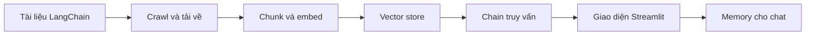

# 🚀 Chúng ta sẽ xây gì? Trợ lý tra cứu tài liệu "phiên bản Cursor thu nhỏ" (RAG)

> Nguồn: `050-What-are-we-building-A-lightweight-Cursor-Feature-Feature-RA.txt` · [Udemy](https://ua.udemy.com/course/langchain/learn/lecture/37622346)

Chào các bạn, Eden đây! 👋 Hôm nay chúng ta bước vào một phần cực kỳ thú vị của khóa học: xây dựng một **documentation helper (trợ lý tra cứu tài liệu)**.

Ý tưởng rất đơn giản: mình "cắm" tài liệu của một package vào hệ thống, rồi dùng LLM để hỏi đáp về chính tài liệu đó — cách sử dụng, ví dụ, và vô vàn thứ hay ho khác. Đặc biệt, chúng ta thậm chí sẽ dùng nó để hỗ trợ xây dựng chính công cụ này. Nghe hơi lạ đúng không? Các bạn sẽ thấy nó "cool" như thế nào ngay sau đây!

### 🎯 Một sản phẩm end-to-end, không chỉ là vài dòng code

Mình sẽ làm **end-to-end (từ đầu đến cuối)**, nghĩa là:
* Chạy được **chain** cho ra kết quả.
* Viết luôn **front end (giao diện người dùng)** để tương tác một cách thanh lịch và tiện lợi.

Trong hành trình này, chúng ta sẽ đi qua rất nhiều chủ đề hấp dẫn:
* **Vector database** và **retrieval (truy hồi)**.
* **Similarity search (tìm kiếm tương đồng)** và **memory (bộ nhớ)** cho chat.
* **Streamlit** — công cụ xây front end cực kỳ dễ dùng.
* Và mình sẽ cùng các bạn **mở mã nguồn LangChain** để hiểu chuyện gì đang diễn ra "bên dưới lớp vỏ" (under the hood).

Tất cả những chủ đề đó phục vụ một mục tiêu duy nhất: giúp các bạn xây được một ứng dụng RAG hoàn chỉnh, từ khâu lấy dữ liệu cho đến lúc trò chuyện với người dùng.

---

### 🗺️ Bản đồ dự án: 4 chặng đường phía trước

**1. Thu thập và vector hóa tài liệu:** Đầu tiên mình cần tìm tài liệu — và mình lấy tài liệu của chính **LangChain** làm ví dụ. Mình tải nó về, rồi biến nó thành vector: lấy từng trang trong tài liệu, **chunk (chia nhỏ)** nó ra, **embed** và biến thành vector, rồi lưu vào **vector store**.

**2. Viết chain truy vấn:** Mình viết một chain sử dụng vector database để tìm đúng những đoạn văn bản (chunks) cần thiết nhằm trả lời câu hỏi của các bạn.

**3. Xây giao diện:** Mình dùng package **Streamlit** để dựng **user interface** — rất, rất dễ dùng.

**4. Tích hợp bộ nhớ:** Cuối cùng, mình **tích hợp memory vào chat**, để chatbot có khả năng "nhớ" và tham chiếu đến những gì các bạn đã hỏi trước đó.

Toàn bộ hành trình gói gọn trong sơ đồ sau:

Nghe thì nhiều bước, nhưng mình sẽ đi cùng các bạn từng bước một, và các bạn sẽ thấy mọi mảnh ghép khớp lại với nhau như thế nào.

---

### 🎯 Tự kiểm tra nhanh

**Câu 1:** Trọng tâm của dự án lần này là gì?

<b>Xem đáp án</b>

**Đáp án:** Xây một documentation helper — hỏi đáp trên tài liệu của một package, và dùng chính nó để hỗ trợ xây công cụ.

Giải thích: Tài liệu của chính LangChain được dùng làm ví dụ xuyên suốt dự án.

Tham chiếu: Đoạn mở đầu.

**Câu 2:** "End-to-end" trong dự án này nghĩa là gì?

<b>Xem đáp án</b>

**Đáp án:** Không chỉ có chain chạy ra kết quả mà còn có cả front end để người dùng tương tác.

Giải thích: Mình muốn một sản phẩm hoàn chỉnh, không phải vài dòng code demo.

Tham chiếu: Mục Một sản phẩm end-to-end.

**Câu 3:** Bốn chặng đường của dự án gồm những gì?

<b>Xem đáp án</b>

**Đáp án:** Thu thập và vector hóa tài liệu; viết chain truy vấn; xây giao diện Streamlit; tích hợp memory vào chat.

Giải thích: Các chặng đi từ dữ liệu đến người dùng, rồi bổ sung bộ nhớ.

Tham chiếu: Mục Bản đồ dự án.

**Câu 4:** Ở chặng đầu tiên, tài liệu được xử lý theo trình tự nào?

<b>Xem đáp án</b>

**Đáp án:** Lấy từng trang tài liệu, chunk ra, embed thành vector rồi lưu vào vector store.

Giải thích: Đây là phần nạp dữ liệu mà các chặng sau tái sử dụng.

Tham chiếu: Mục Bản đồ dự án.

**Câu 5:** Vì sao cuối dự án mới tích hợp memory?

<b>Xem đáp án</b>

**Đáp án:** Để chatbot nhớ và tham chiếu được những gì người dùng đã hỏi trước đó.

Giải thích: Memory nằm ở chặng 4, sau khi chain và giao diện đã hoạt động.

Tham chiếu: Mục Bản đồ dự án.

---

### 💬 Một lời nhắn nhỏ trước khi gõ code

*Nếu các bạn thấy hào hứng với dự án này, hãy dành chút thời gian để lại đánh giá (review) trên Udemy nhé.* Điều đó thực sự tiếp thêm động lực cho mình — với vai trò một người sáng tạo nội dung — để tiếp tục lớn lên cùng khóa học này, và cũng giúp các học viên khác biết liệu khóa học có phù hợp với họ hay không. Mình trân trọng điều đó vô cùng!

Rồi, phần giới thiệu đã xong. Các bạn đã nắm được bức tranh tổng thể rồi chứ? Giờ thì **bắt tay vào viết code thôi nào!** 🚀

## Nguồn tham khảo

- [Udemy — What are we building? A lightweight Cursor Feature (RAG)](https://ua.udemy.com/course/langchain/learn/lecture/37622346)
- [LangChain Docs — Retrieval](https://docs.langchain.com/oss/python/langchain/retrieval)
