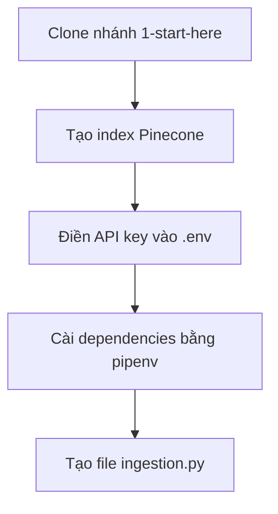

# ⚙️ Chuẩn bị "chiến trường": Clone repo, tạo index Pinecone và cài đặt môi trường

> Nguồn: `051-Environment-Setup.txt` · [Udemy](https://ua.udemy.com/course/langchain/learn/lecture/44651779)

Chào các bạn, Eden đây! Trước khi bắt tay vào xây trợ lý tra cứu tài liệu, chúng ta cần **thiết lập môi trường (environment setup)** thật gọn gàng.

Trong bài này, mình sẽ clone nhánh khởi đầu với toàn bộ **boilerplate code (code khung)** cần thiết, tạo file `.env` chứa các **biến môi trường (environment variables)** cho **OpenAI API key** và **Pinecone API key**, rồi cài đặt đầy đủ các package. Nào, bắt đầu!

### 📦 Clone nhánh khởi đầu

Trong repository, mình cần clone nhánh **`1-start-here`**. Ở terminal, mình chạy `git clone <URL> -b 1-start-here` là xong — repository sẽ được clone ở nhánh khởi đầu.

Sau đó mình liệt kê thư mục làm việc hiện tại của dự án để nắm cấu trúc. Đây là điểm xuất phát chung của chúng ta, nên các bạn cứ yên tâm làm theo từng bước nhé!

Để các bạn hình dung trọn vẹn các bước chuẩn bị, đây là luồng setup của chúng ta:

---

### 🧠 Tạo index trên Pinecone

Giờ là lúc đăng nhập vào **Pinecone** và tạo một **index** để lưu embedding của tài liệu LangChain:

* Đặt tên index thật dễ hiểu: mình gọi nó là **`langchain-doc-index`**.
* Chọn **embedding model**: `text-embedding-3-small` của OpenAI.
* **Dimension (kích thước vector)**: **1536**.
* Chọn **cosine similarity** để đo khoảng cách giữa các vector.
* Chọn option **serverless**.

Lưu ý là Pinecone vừa có giao diện mới (new UI) — thao tác tương tự, chỉ khác cách hiển thị, và nhớ chọn đúng **1536** ở phần embeddings dimension nhé.

Một chi tiết rất đáng chú ý: index của mình được deploy trên **AWS cloud**, và mình có thể chọn cả **Google Cloud** nếu muốn. Điều này quan trọng vì:
* Khách hàng của AWS thường muốn index đặt trên AWS, khách hàng GCP muốn đặt trên Google Cloud — giúp giảm **latency (độ trễ)** và thuận tiện cho các **thỏa thuận thương mại** với nhà cung cấp cloud.
* **Region (khu vực)** còn quan trọng cho việc **tuân thủ GDPR** — chẳng hạn vector store chỉ được deploy tại **data center ở châu Âu**.

---

### 🔑 Điền API key vào file .env

Để LangChain gửi request lên Pinecone thay mặt chúng ta, mình cần lấy **API key** và đưa vào file **`.env`**:

1. Copy **Pinecone API key** và dán vào file `.env`.
2. Thêm **OpenAI API key** — hoặc bất kỳ nhà cung cấp LLM nào khác mà các bạn đang dùng.

Mình mở dự án bằng **PyCharm** và tạo file `.env` — dĩ nhiên file này **không được commit lên repository**, vì mình không muốn đẩy **secrets (thông tin bí mật)** lên đó. Các bạn nhớ giữ nguyên tắc này nhé!

---

### 📚 Pipfile, logger.py và file ingestion.py

Mình tắt **virtual environment (môi trường ảo)** tự động, rồi mở **Pipfile** — nơi đã chuẩn bị sẵn mọi package cần thiết, ví dụ **LangChain** và **langchain-pinecone**. Trong **Pipfile.lock** có phiên bản chính xác của từng package — hiện tại là **LangChain 0.26**.

*Lưu ý nhỏ:* tùy thời điểm bạn học, phiên bản có thể khác. Mình sẽ liên tục cập nhật khóa học và repository theo phiên bản mới nhất, và nếu có **breaking changes (thay đổi phá vỡ tương thích)** thì mình sẽ cập nhật cả code lẫn video.

Một vài thứ cần biết trong repo:
* Mình vừa thêm file **`logger.py`** — dùng cho các video sau, các bạn sẽ thấy nó ở cột bên trái.
* Thư mục **`backend`**: cứ bỏ qua, sẽ tạo ở các video sau.
* Thư mục **`docs`**: cũng bỏ qua, sẽ tải tài liệu LangChain về trong vài video tới.

Giờ thì chạy `pipenv install` để cài toàn bộ dependencies đúng phiên bản — bạn sẽ có y hệt phiên bản package như mình đang dùng.

---

### 🎯 Tự kiểm tra nhanh

**Câu 1:** Vì sao phải clone đúng nhánh `1-start-here`?

<b>Xem đáp án</b>

**Đáp án:** Để lấy bộ boilerplate code khởi đầu thống nhất cho toàn khóa học.

Giải thích: Đây là điểm xuất phát chung để mọi học viên đi cùng một đường.

Tham chiếu: Mục Clone nhánh khởi đầu.

**Câu 2:** Index `langchain-doc-index` trên Pinecone được cấu hình những gì?

<b>Xem đáp án</b>

**Đáp án:** Embedding model `text-embedding-3-small`, dimension **1536**, cosine similarity và option **serverless**.

Giải thích: Dimension phải khớp với kích thước vector của embedding model.

Tham chiếu: Mục Tạo index trên Pinecone.

**Câu 3:** Vì sao file `.env` không được commit lên repository?

<b>Xem đáp án</b>

**Đáp án:** Vì file chứa **secrets (API key)**, đẩy lên repository là làm lộ thông tin bí mật.

Giải thích: Đây là nguyên tắc bảo mật mình luôn nhắc học viên giữ đúng.

Tham chiếu: Mục Điền API key vào file .env.

**Câu 4:** Cloud provider và region của index quan trọng vì những lý do gì?

<b>Xem đáp án</b>

**Đáp án:** Giảm **latency**, thuận tiện cho các thỏa thuận thương mại với nhà cung cấp cloud, và tuân thủ **GDPR** khi phải đặt data center ở châu Âu.

Giải thích: Khách hàng AWS muốn index trên AWS, khách hàng GCP muốn trên Google Cloud.

Tham chiếu: Mục Tạo index trên Pinecone.

**Câu 5:** Pipfile và Pipfile.lock khác nhau thế nào?

<b>Xem đáp án</b>

**Đáp án:** Pipfile khai báo các package cần thiết, còn Pipfile.lock ghim **phiên bản chính xác** của từng package — ví dụ LangChain 0.26.

Giải thích: Nhờ đó bạn có y hệt phiên bản package như giảng viên đang dùng.

Tham chiếu: Mục Pipfile, logger.py và file ingestion.py.

---

Cuối cùng, mình tạo file mới tên là **`ingestion.py`** — đây sẽ là "nhà" của toàn bộ phần **ingestion (nạp dữ liệu)**: embed tài liệu LangChain thành vector rồi lưu vào vector store Pinecone. Vậy là môi trường đã sẵn sàng, hẹn gặp các bạn ở bài tiếp theo! 🚀

## Nguồn tham khảo

- [Udemy — Environment Setup](https://ua.udemy.com/course/langchain/learn/lecture/44651779)
- [LangChain Docs — Pinecone integration](https://docs.langchain.com/oss/python/integrations/vectorstores/pinecone)
- [Pinecone Docs — LangChain integration](https://docs.pinecone.io/integrations/langchain)
