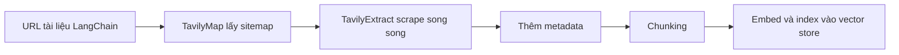

# 🗺️ Tổng quan Ingestion Pipeline: Chặng "nạp dữ liệu" của RAG

> Nguồn: `052-Ingestion-Pipeline-Intro.txt` · [Udemy](https://ua.udemy.com/course/langchain/learn/lecture/51314281)

Chào các bạn, Eden đây! Chúng ta đã có môi trường sẵn sàng, giờ là lúc bước vào phần đầu tiên của **RAG pipeline**: **ingestion (nạp tài liệu vào hệ thống)**.

Mục tiêu của chúng ta là lấy **tài liệu LangChain mới nhất**, rồi nạp và đánh index (đánh chỉ mục) toàn bộ vào **vector store**. Nghe có vẻ nhiều việc, nhưng các bạn sẽ thấy nó nhẹ nhàng hơn xưa rất nhiều.

### ⏰ Chuyện "ngày xưa" và chuyện "bây giờ"

Khi mình làm khóa học này hồi đầu năm 2022, mình phải làm quá trình này **thủ công**, viết rất nhiều script. Nó thực sự **cồng kềnh, dễ vỡ và đầy rắc rối**.

Nhưng đến năm **2025**, mọi thứ đã thay đổi rất nhiều: chúng ta có những công cụ như **Tavily (crawl)** giúp hoàn thành công việc chỉ với vài **API call**.

Trước đây mình từng dùng **Firecrawl** cho khả năng crawling, nhưng mình nhận thấy package này **không được maintain tốt trong hệ sinh thái LangChain** và có vấn đề về **scaling (mở rộng quy mô)**. Đó là lý do mình chuyển sang **Tavily**.

| Tiêu chí | Firecrawl | Tavily |
|---|---|---|
| Vai trò | Crawling mình từng dùng | Lựa chọn hiện tại |
| Maintain trong hệ sinh thái LangChain | Không tốt | Được maintain tốt |
| Scaling | Có vấn đề | Xử lý tốt hơn |

*Điều mình thích ở cách làm mới:* thay vì tự viết script, chúng ta chỉ cần gọi API — ít lỗi hơn, nhanh hơn và dễ bảo trì hơn hẳn.

---

### 🧰 Tavily lo crawling, LangChain lo phần còn lại

Trong vài video tới, chúng ta sẽ:

1. Làm quen với **Tavily API** qua hướng dẫn dùng **TavilyMap** và **TavilyExtract** để crawl tài liệu.
2. Tích hợp vào **RAG ingestion pipeline**: lấy tài liệu mới nhất, **map toàn bộ URL**, **scrape đồng thời (concurrently)** các URL đó, thêm **metadata** rồi index mọi thứ vào **vector store**.

Toàn bộ quy trình nghe có vẻ đồ sộ, nhưng thật ra **không tốn nhiều code**. Mọi phần "nặng" đều được chia nhau:

* **Tavily** chịu trách nhiệm **crawling (thu thập nội dung web)** và **scraping** tài liệu.
* **LangChain** chịu trách nhiệm **chunking (chia nhỏ văn bản)**, cập nhật **metadata** và index mọi thứ một cách liền mạch.

Dòng chảy của pipeline trông như thế này:

Nói cách khác: các bạn không phải tự xây crawler — chúng ta dành thời gian cho phần thú vị nhất là ghép mọi thứ thành một pipeline hoàn chỉnh.

---

### 💰 Chuyện giá cả: đừng lo!

*Nếu các bạn đang băn khoăn về chi phí thì hãy yên tâm.* Tavily có **free tier (gói miễn phí) khá hào phóng** — quá đủ cho khóa học và cho tác vụ này của chúng ta.

Vậy nên các bạn cứ thoải mái thử nghiệm mà không phải lo "cháy ví" nhé.

---

### 🎯 Tự kiểm tra nhanh

**Câu 1:** Ingestion pipeline trong dự án này làm gì?

<b>Xem đáp án</b>

**Đáp án:** Lấy tài liệu LangChain mới nhất, nạp và đánh index toàn bộ vào vector store.

Giải thích: Đây là chặng đầu tiên của RAG pipeline, trước khi truy vấn.

Tham chiếu: Đoạn mở đầu.

**Câu 2:** Vì sao mình chuyển từ Firecrawl sang Tavily?

<b>Xem đáp án</b>

**Đáp án:** Vì Firecrawl không được maintain tốt trong hệ sinh thái LangChain và có vấn đề về scaling.

Giải thích: Integration lâu ngày không cập nhật thì dễ vỡ khi API thay đổi.

Tham chiếu: Mục Chuyện ngày xưa và chuyện bây giờ.

**Câu 3:** Cách làm crawling "ngày xưa" và "bây giờ" khác nhau thế nào?

<b>Xem đáp án</b>

**Đáp án:** Ngày xưa phải tự viết script thủ công, cồng kềnh và dễ vỡ; bây giờ chỉ cần vài API call với Tavily.

Giải thích: Cách mới ít lỗi hơn, nhanh hơn và dễ bảo trì hơn hẳn.

Tham chiếu: Mục Chuyện ngày xưa và chuyện bây giờ.

**Câu 4:** Tavily và LangChain chia nhau những phần việc nào?

<b>Xem đáp án</b>

**Đáp án:** Tavily lo crawling và scraping; LangChain lo chunking, cập nhật metadata và index vào vector store.

Giải thích: Mỗi bên làm phần mình giỏi nhất, mình chỉ ghép pipeline.

Tham chiếu: Mục Tavily lo crawling, LangChain lo phần còn lại.

**Câu 5:** Chi phí dùng Tavily cho khóa học thế nào?

<b>Xem đáp án</b>

**Đáp án:** Tavily có free tier khá hào phóng, quá đủ cho khóa học và tác vụ này.

Giải thích: Các bạn cứ thoải mái thử nghiệm mà không lo "cháy ví".

Tham chiếu: Mục Chuyện giá cả.

---

Vậy là các bạn đã nắm được bức tranh tổng thể của ingestion pipeline. Ở bài tiếp theo, mình bắt đầu viết những dòng import đầu tiên — cùng "khởi động" project thôi nào! 🚀

## Nguồn tham khảo

- [Udemy — Ingestion Pipeline Intro](https://ua.udemy.com/course/langchain/learn/lecture/51314281)
- [Tavily Docs — Crawl API](https://docs.tavily.com/documentation/api-reference/endpoint/crawl)
- [GitHub — langchain-tavily](https://github.com/tavily-ai/langchain-tavily)
