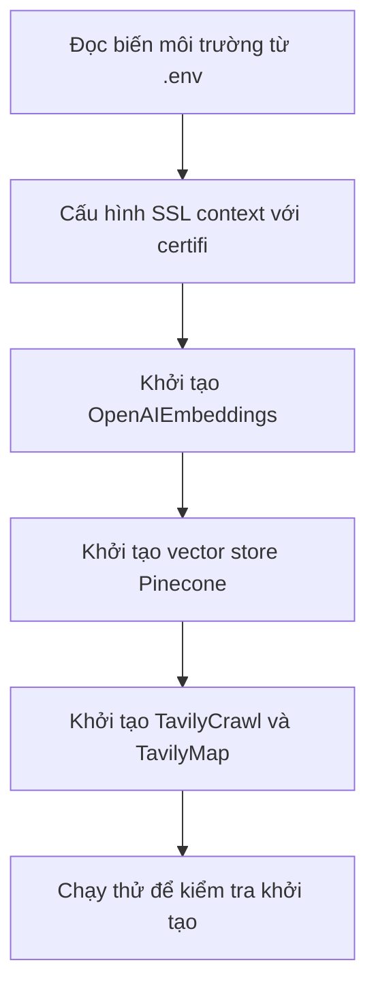

# 🧩 Imports & Khởi tạo: "Nạp đạn" cho Ingestion Pipeline

> Nguồn: `053-Imports.txt` · [Udemy](https://ua.udemy.com/course/langchain/learn/lecture/51344527)

Chào các bạn, Eden đây! Trong bài này, mình sẽ đi qua **các import và những class chính** dùng trong giai đoạn ingestion của RAG pipeline.

Chúng ta sẽ khai báo **biến môi trường (environment variables)** — toàn bộ API key và cấu hình cần thiết — rồi khởi tạo **TavilyMap**, **TavilyExtract**, **OpenAI embeddings** và **Pinecone vector store**. Nào, mở code ra và bắt đầu!

### 🖥️ Chạy thử boilerplate & làm quen logger.py

Code khung hiện tại đang import **asyncio** và chạy hàm `main` của chúng ta. Mình bấm nút play ở góc trên bên phải để chạy thử như một **sanity check (kiểm tra nhanh)** — mọi thứ chạy tốt!

Sau đó mình mở file **`logger.py`** đã chuẩn bị sẵn: ở đây mình định nghĩa vài **màu sắc** và các hàm in log xinh xắn để nhìn log dễ đọc hơn. Chúng ta có:
* `log_info`, `log_success`, `log_error`, `log_warning`, `log_header`.

File này sẽ được import vào `ingestion.py` để ghi lại từng bước của pipeline.

---

### 📥 Import: từ chuẩn Python đến LangChain

Đầu tiên là các import nền tảng:
* **`os`** — để đọc và dùng biến môi trường.
* **`ssl`** — tạo **SSL context** và các object type hinting.
* **`certifi`** — lấy **certificate hợp lệ** để gắn vào các HTTP request chúng ta gửi đi.
* **`dotenv`** — load biến môi trường từ file `.env`.

Tiếp theo là "đồ nghề" LangChain:
* **`RecursiveCharacterTextSplitter`** — helper class giúp chia nhỏ tài liệu (mình có hẳn một video riêng giải thích cách text splitter này hoạt động, các bạn xem khi rảnh nhé).
* **`Chroma`** (từ `langchain_chroma`) — vector store local, dùng nếu các bạn muốn index ngay trên máy.
* **Pinecone vector store** (từ `langchain_pinecone`) — vector store trên cloud, đây là cái mình sẽ dùng trong các video.
* **`Document`** — class đại diện cho một văn bản kèm metadata, là **abstraction cốt lõi** của LangChain để xử lý text: có thể được process, split, embed hoặc index.
* **`OpenAIEmbeddings`** — model embedding mình dùng, *(mình có học viên dùng embedding open-source và vẫn chạy tốt!)*.
* **`TavilyCrawl`** — "tài xế chính" giúp lấy tài liệu; kèm **TavilyExtract** và **TavilyMap** cho video optional phía sau.

Điểm hay của LangChain: **một interface duy nhất cho mọi vector store và mọi embedding model**, nên code gần như giống nhau — bạn có thể thay bằng **ChromaDB** hay bất kỳ vector store nào khác.

Cuối cùng, mình import các hàm logging từ `logger.py` của chúng ta.

---

### 🔐 Biến môi trường & SSL context

File `.env` của mình chứa:
* **OpenAI API key** — cho embeddings.
* **Pinecone API key** — cho vector store.
* **LangChain API key** kèm **`LANGCHAIN_TRACING_V2=true`** và **`LANGCHAIN_PROJECT=documentation helper`** — bộ ba này để **LangSmith** trace pipeline của chúng ta.
* **Tavily API key** — để dùng TavilyMap và TavilyExtract.

*Nhắc lại như mọi khi: tuyệt đối không chia sẻ API key của bạn. Mình sẽ thu hồi (revoke) toàn bộ key này ngay khi quay xong video!*

Sau đó mình cấu hình **SSL context** với certificate hợp lệ qua package **`certifi`** — vì chúng ta sẽ gửi **rất nhiều request** lên API, không muốn đụng phải lỗi SSL certificate kỳ lạ. Đây là kiểu **defensive programming (lập trình phòng ngừa)**.

*Mẹo nhỏ:* nếu bạn dùng máy công ty có **VPN** đang chạy mà vẫn gặp lỗi certificate, hãy thử **tắt VPN** để gửi request thành công nhé.

Thứ tự khởi tạo trong `ingestion.py` diễn ra như sau:



---

### ⚙️ Khởi tạo các class: chunk_size, retry và rate limiting

Mình khởi tạo **OpenAI embeddings** với model **`text-embedding-3-small`** và bật cờ **`show_progress_bar`** để có thanh tiến trình dễ thương khi index *(...cờ này mặc định bị tắt, mình viết ra cho các bạn biết nó tồn tại thôi!)*.

Hai tham số cực kỳ quan trọng:

**1. `chunk_size = 50`** — giới hạn số **text object / document** được embed trong **mỗi request** gửi lên OpenAI.
* Nếu để quá lớn (ví dụ **1000**): tùy **customer tier** của bạn, nhà cung cấp nào cũng có **token per limit / rate limit**, và bạn sẽ bị chặn.
* Nếu để quá nhỏ (ví dụ **1**): mọi thứ chạy chậm hơn rất nhiều.
* Đây là cách **rate limiting (giới hạn tốc độ request)** ở phía chúng ta: vừa đủ nhanh, vừa không bị "đá" ra.

**2. `retry_min_seconds`** — sau một lần batch thất bại, chờ bao lâu trước khi thử lại. Mình để **10 giây**; nếu để **60 giây** thì sau mỗi lỗi phải chờ ít nhất một phút.

Mình có show một lỗi thật từ lần chạy trước: khi chạy nhiều batch request đồng thời, một số batch bị rate limit và trả về mã **429** — kèm thông báo cho biết cần chờ bao lâu để rate limit reset (ví dụ **194 milliseconds**, **500 milliseconds**...). Đặt `retry_min_seconds` hợp lý là một **heuristic** giúp request "lọt qua" sau khi chờ đủ. Tất nhiên đây là **đánh đổi (trade-off)**: chờ lâu quá thì tổng thời gian xử lý cũng dài ra.

Rate limiting là chuyện **rất thường gặp khi đưa ứng dụng lên production và xử lý scale** — với mọi bên thứ ba chạy trên cloud. Mỗi vendor tính rate limit một kiểu, có **token bucket**, **leaky bucket** và vô số thuật toán khác. Chúng ta không đi sâu, nhưng trong ứng dụng Generative AI thì **buộc phải biết xử lý rate limiting**.

---

### 🗄️ Vector store: Chroma local hay Pinecone cloud?

Trong phần code bị comment out là khởi tạo **ChromaDB** local: **`persist_directory` = `chroma_db`** — nghĩa là DB sẽ được lưu ngay trong thư mục làm việc hiện tại của dự án, và mình truyền vào **embedding function** từ object embeddings đã tạo. Tùy bạn chọn, còn mình dùng **Pinecone** trên cloud.

| Tiêu chí | ChromaDB | Pinecone |
|---|---|---|
| Nơi lưu trữ | Local, trong thư mục dự án | Cloud |
| Cấu hình | `persist_directory` = `chroma_db` | Index `langchain-docs-2025`, dimension 1536, serverless |
| Đối tượng | Muốn index ngay trên máy | Mặc định của khóa học |

Với Pinecone, mình khởi tạo vector store với tên index `langchain-index-2025`, rồi vào Pinecone tạo index mới — gọi là **`langchain-docs-2025`**:
* Embedding model: **OpenAI text-embedding-3-small**, dimension **1536** (khớp với embedding size của model).
* Chọn option **serverless** để không phải tự lo scaling.
* Cloud provider mặc định: **AWS**, region mặc định.

Index lên sóng ngay sau đó! Và mình cũng khởi tạo luôn object **TavilyCrawl** (nhận URL và lấy tài liệu về), cùng **TavilyExtract** & **TavilyMap** cho cách scraping thủ công hơn — sẽ để dành cho video optional.

---

### 💻 Code mẫu đầy đủ — `ingestion.py`

Toàn bộ code của bài nằm trong file `ingestion.py` (tham khảo từ repo chính thức của khóa học), kèm helper `logger.py` mà bài nhắc tới:

**`ingestion.py`**

```python
import asyncio
import os
import ssl
from typing import Any, Dict, List

import certifi
from dotenv import load_dotenv
from langchain_chroma import Chroma
from langchain_classic.text_splitter import RecursiveCharacterTextSplitter
from langchain_core.documents import Document
from langchain_openai import OpenAIEmbeddings
from langchain_pinecone import PineconeVectorStore
from langchain_tavily import TavilyCrawl, TavilyExtract, TavilyMap

from logger import (Colors, log_error, log_header, log_info, log_success,
                    log_warning)

load_dotenv()

# Configure SSL context to use certifi certificates
ssl_context = ssl.create_default_context(cafile=certifi.where())
os.environ["SSL_CERT_FILE"] = certifi.where()
os.environ["REQUESTS_CA_BUNDLE"] = certifi.where()


embeddings = OpenAIEmbeddings(
    model="text-embedding-3-small",
    show_progress_bar=False,
    chunk_size=50,
    retry_min_seconds=10,
)
vectorstore = Chroma(persist_directory="chroma_db", embedding_function=embeddings)
# vectorstore = PineconeVectorStore(
#     index_name="langchain-docs-2025", embedding=embeddings
# )
tavily_extract = TavilyExtract()
tavily_map = TavilyMap(max_depth=5, max_breadth=20, max_pages=1000)
tavily_crawl = TavilyCrawl()


async def index_documents_async(documents: List[Document], batch_size: int = 50):
    """Process documents in batches asynchronously."""
    log_header("VECTOR STORAGE PHASE")
    log_info(
        f"📚 VectorStore Indexing: Preparing to add {len(documents)} documents to vector store",
        Colors.DARKCYAN,
    )

    # Create batches
    batches = [
        documents[i : i + batch_size] for i in range(0, len(documents), batch_size)
    ]

    log_info(
        f"📦 VectorStore Indexing: Split into {len(batches)} batches of {batch_size} documents each"
    )

    # Process all batches concurrently
    async def add_batch(batch: List[Document], batch_num: int):
        try:
            await vectorstore.aadd_documents(batch)
            log_success(
                f"VectorStore Indexing: Successfully added batch {batch_num}/{len(batches)} ({len(batch)} documents)"
            )
        except Exception as e:
            log_error(f"VectorStore Indexing: Failed to add batch {batch_num} - {e}")
            return False
        return True

    # Process batches concurrently
    tasks = [add_batch(batch, i + 1) for i, batch in enumerate(batches)]
    results = await asyncio.gather(*tasks, return_exceptions=True)

    # Count successful batches
    successful = sum(1 for result in results if result is True)

    if successful == len(batches):
        log_success(
            f"VectorStore Indexing: All batches processed successfully! ({successful}/{len(batches)})"
        )
    else:
        log_warning(
            f"VectorStore Indexing: Processed {successful}/{len(batches)} batches successfully"
        )


async def main():
    """Main async function to orchestrate the entire process."""
    log_header("DOCUMENTATION INGESTION PIPELINE")

    log_info(
        "🗺️  TavilyCrawl: Starting to crawl the documentation site",
        Colors.PURPLE,
    )
    # Crawl the documentation site

    res = tavily_crawl.invoke(
        {
            "url": "https://python.langchain.com/",
            "max_depth": 2,
            "extract_depth": "advanced",
        }
    )

    # Convert Tavily crawl results to LangChain Document objects
    all_docs = []
    for tavily_crawl_result_item in res["results"]:
        log_info(
            f"TavilyCrawl: Successfully crawled {tavily_crawl_result_item['url']} from documentation site"
        )
        all_docs.append(
            Document(
                page_content=tavily_crawl_result_item["raw_content"],
                metadata={"source": tavily_crawl_result_item["url"]},
            )
        )

    # Split documents into chunks
    log_header("DOCUMENT CHUNKING PHASE")
    log_info(
        f"✂️  Text Splitter: Processing {len(all_docs)} documents with 4000 chunk size and 200 overlap",
        Colors.YELLOW,
    )
    text_splitter = RecursiveCharacterTextSplitter(chunk_size=4000, chunk_overlap=200)
    splitted_docs = text_splitter.split_documents(all_docs)
    log_success(
        f"Text Splitter: Created {len(splitted_docs)} chunks from {len(all_docs)} documents"
    )

    # Process documents asynchronously
    await index_documents_async(splitted_docs, batch_size=500)

    log_header("PIPELINE COMPLETE")
    log_success("🎉 Documentation ingestion pipeline finished successfully!")
    log_info("📊 Summary:", Colors.BOLD)
    log_info(f"   • Documents extracted: {len(all_docs)}")
    log_info(f"   • Chunks created: {len(splitted_docs)}")


if __name__ == "__main__":
    asyncio.run(main())
```

**`logger.py`**

```python
# Color codes for better logging
class Colors:
    PURPLE = "\033[95m"
    CYAN = "\033[96m"
    DARKCYAN = "\033[36m"
    BLUE = "\033[94m"
    GREEN = "\033[92m"
    YELLOW = "\033[93m"
    RED = "\033[91m"
    BOLD = "\033[1m"
    UNDERLINE = "\033[4m"
    END = "\033[0m"


def log_info(message: str, color: str = Colors.CYAN):
    """Log info message with color"""
    print(f"{color}ℹ️  {message}{Colors.END}")


def log_success(message: str):
    """Log success message in green"""
    print(f"{Colors.GREEN}✅ {message}{Colors.END}")


def log_error(message: str):
    """Log error message in red"""
    print(f"{Colors.RED}❌ {message}{Colors.END}")


def log_warning(message: str):
    """Log warning message in yellow"""
    print(f"{Colors.YELLOW}⚠️  {message}{Colors.END}")


def log_header(message: str):
    """Log header message with emphasis"""
    print(f"\n{Colors.BOLD}{Colors.PURPLE}{'='*60}{Colors.END}")
    print(f"{Colors.BOLD}{Colors.PURPLE}🚀 {message}{Colors.END}")
    print(f"{Colors.BOLD}{Colors.PURPLE}{'='*60}{Colors.END}\n")
```

### 🎯 Tự kiểm tra nhanh

**Câu 1:** `chunk_size = 50` quy định điều gì?

<details>
<summary><b>Xem đáp án</b></summary>

**Đáp án:** Giới hạn số text object/document được embed trong mỗi request gửi lên OpenAI.

Giải thích: Đây là cách rate limiting ở phía chúng ta — vừa đủ nhanh, vừa không bị chặn.

Tham chiếu: Mục Khởi tạo các class.

</details>

**Câu 2:** Điều gì xảy ra nếu để `chunk_size` quá lớn hoặc quá nhỏ?

<details>
<summary><b>Xem đáp án</b></summary>

**Đáp án:** Quá lớn (ví dụ 1000) thì dễ vượt rate limit và bị chặn; quá nhỏ (ví dụ 1) thì mọi thứ chạy chậm hơn rất nhiều.

Giải thích: Mỗi nhà cung cấp đều có token per limit/rate limit tùy customer tier.

Tham chiếu: Mục Khởi tạo các class.

</details>

**Câu 3:** `retry_min_seconds` dùng để làm gì?

<details>
<summary><b>Xem đáp án</b></summary>

**Đáp án:** Quy định thời gian chờ tối thiểu sau một batch thất bại trước khi thử lại.

Giải thích: Mình để 10 giây; đặt hợp lý là một heuristic giúp request "lọt qua" sau khi rate limit reset.

Tham chiếu: Mục Khởi tạo các class.

</details>

**Câu 4:** Vì sao phải cấu hình SSL context bằng `certifi`?

<details>
<summary><b>Xem đáp án</b></summary>

**Đáp án:** Để gắn certificate hợp lệ cho rất nhiều request gửi lên API, tránh lỗi SSL certificate kỳ lạ.

Giải thích: Đây là kiểu defensive programming (lập trình phòng ngừa).

Tham chiếu: Mục Biến môi trường & SSL context.

</details>

**Câu 5:** Điểm hay của việc LangChain có "một interface duy nhất" là gì?

<details>
<summary><b>Xem đáp án</b></summary>

**Đáp án:** Code gần như giống nhau cho mọi vector store và embedding model, nên có thể thay bằng ChromaDB hay bất kỳ store nào khác dễ dàng.

Giải thích: `Document` là abstraction cốt lõi có thể process, split, embed hoặc index.

Tham chiếu: Mục Import.

</details>

---

*Video này khá dài rồi!* Cuối cùng, mình chạy toàn bộ code để chắc chắn mọi thứ **compile** và không có lỗi khởi tạo. Kết quả: chạy thành công, không lỗi. Tuyệt vời! Hẹn các bạn ở bài tiếp theo với Tavily Crawling nhé! 🚀

## Nguồn tham khảo

- [Udemy — Imports](https://ua.udemy.com/course/langchain/learn/lecture/51344527)
- [LangChain Docs — Recursive text splitter](https://docs.langchain.com/oss/python/integrations/splitters/recursive_text_splitter)
- [OpenAI Docs — Embeddings](https://developers.openai.com/api/docs/guides/embeddings)
