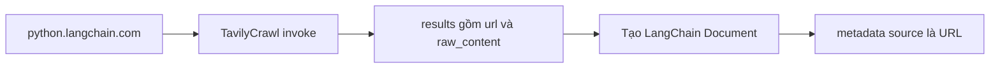

# 🕷️ Tavily Crawling: Kéo toàn bộ tài liệu LangChain về trong vài giây

> Nguồn: `054-Tavily-Crawling.txt` · [Udemy](https://ua.udemy.com/course/langchain/learn/lecture/51504071)

Chào các bạn, Eden đây! Hôm nay chúng ta sẽ dùng **TavilyCrawl** để crawl tài liệu LangChain và kéo toàn bộ nội dung về.

Trước tiên, hãy nói rõ **web crawling (thu thập nội dung web)** là gì: đó là quá trình tự động **duyệt website bằng cách đi theo các hyperlink**, click từ trang này sang trang khác và khám phá ngày càng nhiều nội dung liên quan. Với agent và autonomous agent, crawling là một **năng lực then chốt** — đặc biệt khi ta muốn chạm tới những tầng sâu của web mà tìm kiếm thông thường không với tới.

### 🔧 Viết log và gọi TavilyCrawl

Code khung hiện tại có `if __name__ == "__main__"` gọi `asyncio.run(main())` — tức là chạy **coroutine** `main`. Mình thêm vài dòng log trước tiên: log rằng **ingestion đã bắt đầu**, và log rằng mình đang dùng **TavilyCrawl** để crawl tài liệu tại **python.langchain.com** (`log_header` và `log_info` nằm trong `logger.py`).

Mình chạy thử để chắc chắn log in ra đúng — các client được khởi tạo, mọi thứ ổn định và sẵn sàng.

Giờ là phần crawl thật sự: mình dùng object **TavilyCrawl** — vốn là một **LangChain tool** — và gọi `invoke` với URL **python.langchain.com**. Hai tham số quan trọng:

* **`max_depth`** — quy định crawler được khám phá xa đến đâu tính từ URL gốc. Mặc định là **1**, phải là số nguyên, và **tối đa hiện tại là 5**.
* **`extract_depth = "advanced"`** — advanced extraction lấy được nhiều dữ liệu hơn, bao gồm **bảng biểu và nội dung nhúng (embedded content)**, với tỷ lệ thành công cao hơn, nhưng có thể **tăng latency (độ trễ)**.

---

### 🧠 Bài học về max_depth: hãy bắt đầu từ nhỏ

`max_depth` là tham số cực kỳ quan trọng, và mình muốn nói kỹ một chút vì **best practices cho crawling** nhắc đến "excessive depth problem":

* Đặt `max_depth` càng cao → **runtime càng dài**. Chuyện đương nhiên!
* Với một số **cấu trúc website nhất định**, thời gian thậm chí có thể tăng **theo cấp số nhân**.
* Vì vậy hãy **bắt đầu với depth 1 hoặc 2**, xem kết quả trước rồi mới tăng lên khi cần độ sâu hơn.

Cách làm này rất "khôn": vừa **lặp nhanh hơn** (runtime ngắn hơn), vừa **tiết kiệm hơn** (tốn ít tài nguyên hơn). Con số **5** mà mình dùng là kết quả sau **nhiều lần thử nghiệm**, giúp lấy được nhiều tài liệu nhất từ documentation của LangChain.

Khi gọi crawler, các bạn đang gọi một công cụ duyệt web có khả năng **khám phá hàng trăm đường dẫn song song**, kèm **extraction tích hợp** và **intelligent discovery** — chúng ta sắp thấy nó hoạt động.

---

### 📊 Thực nghiệm: depth 1 → 2 → 5

Mình thử nhanh với **`max_depth = 1`**: kết quả trả về **gần như tức thì, dưới 1 giây**, với **18 kết quả**.

Cấu trúc kết quả gồm:
* **base URL** — nơi bắt đầu crawl.
* Key **`results`** — danh sách tất cả các trang đã crawl.
* Mỗi trang có **`url`** (địa chỉ trang) và **`raw_content`** (nội dung thô đã được scrape).

Mình thực sự rất hào hứng vì **crawling vốn là một việc cực kỳ khó chịu**: cồng kềnh, dễ phát sinh lỗi, vô số thứ có thể "tèo" — rate limiting, bot protection, trang render động (dynamically rendered pages)... Ở các phiên bản khóa học trước, mình từng làm thủ công và đó thật sự là "ác mộng": nhiều học viên gặp lỗi, chạy mỗi máy một kiểu, có bạn không lấy được đúng trang. Vì thế mình rất mừng khi dùng TavilyCrawl ở đây.

Nói thêm với góc nhìn kỹ sư phần mềm: *nếu crawling không phải là business logic chính của mình, mình luôn muốn "khoán" nó cho bên thứ ba làm tốt hơn mình.* Mình không muốn mất thời gian debug việc này.

Rồi mình tăng `max_depth = 2` → **75 trang** được scrape. Cuối cùng, thử mức tối đa **`max_depth = 5`** → mất **26 giây** và thu về **251 kết quả**.

| `max_depth` | Số trang crawl được | Thời gian |
|---|---|---|
| 1 | 18 | dưới 1 giây |
| 2 | 75 | — |
| 5 | 251 | 26 giây |

---

### 🎯 Vũ khí bí mật: tham số instructions

Đây là phần mình thấy "cool" nhất: tham số **`instructions`** cho phép truyền **ngôn ngữ tự nhiên** để crawler dùng trong quá trình **mapping** — quyết định trang nào nên scrape và trang nào không.

Ví dụ, mình yêu cầu tìm nội dung về **AI agents**: kết quả trả về **23 trang** (mất khoảng **30 giây**), và nhìn vào **slug của URL** là thấy ngay toàn bộ đều là tài liệu về AI agents, không lẫn nội dung khác. *(Ngồi ở section RAG nhưng mình mách nhỏ: khả năng này cực kỳ hữu ích khi các bạn làm AI agent đấy!)*

Một lưu ý quan trọng: **instructions rất "nhạy"** — đưa instructions dở thì nhận kết quả dở. Tavily dùng tham số này để **filter URL: crawl hay không crawl**. Vì vậy **đừng đặt câu hỏi** ở đây, mà hãy đặt **chỉ dẫn giúp Tavily quyết định có nên crawl trang đó hay không**. Nếu muốn khai thác sâu hơn, mình gợi ý đọc trang **best practices for crawling** mà mình đã để link.

Và nhớ lại chuyện `max_depth` nhé: khi đã có **instructions** giúp bỏ qua các trang không liên quan, chúng ta **có thể tăng max_depth cao hơn**.

---

### 📄 Từ kết quả crawl đến LangChain Document

Toàn bộ đường đi từ URL đến Document:

Bước cuối trong video này: biến từng kết quả crawl thành **LangChain Document**. Mình lặp qua danh sách trong key `results`, tạo **Document** với:
* **`page_content`** — chính là `raw_content` của trang.
* **`metadata`** — một dictionary với key **`source`** chứa **URL** của trang.

Metadata này sẽ được dùng khi **retrieval (truy hồi)**, để biết chính xác nội dung đến từ đâu. Điều này rất quan trọng cho **user explainability (khả năng giải thích cho người dùng)**: giải thích vì sao ứng dụng RAG trả lời như vậy, từ đó **tạo dựng niềm tin vào hệ thống**.

Mình đổi `max_depth` về **1** cho vòng lặp nhanh — scrape ít trang hơn, tiết kiệm **credits** và cải thiện **latency**. Trong debug, mình thấy các **LangChain Document** đã có `page_content` và metadata `source` là URL.

---

### 🎯 Tự kiểm tra nhanh

**Câu 1:** Web crawling là gì?

<b>Xem đáp án</b>

**Đáp án:** Là quá trình tự động duyệt website bằng cách đi theo các hyperlink để khám phá ngày càng nhiều nội dung liên quan.

Giải thích: Với agent và autonomous agent, đây là một năng lực then chốt.

Tham chiếu: Đoạn mở đầu.

**Câu 2:** Tham số `max_depth` quy định gì và có giới hạn ra sao?

<b>Xem đáp án</b>

**Đáp án:** Quy định crawler được khám phá xa đến đâu tính từ URL gốc; phải là số nguyên, mặc định **1** và tối đa hiện tại là **5**.

Giải thích: Đặt càng cao thì runtime càng dài, có cấu trúc website còn tăng theo cấp số nhân.

Tham chiếu: Mục Viết log và gọi TavilyCrawl, Mục Bài học về max_depth.

**Câu 3:** Vì sao nên bắt đầu với depth nhỏ (1 hoặc 2)?

<b>Xem đáp án</b>

**Đáp án:** Để lặp nhanh hơn và tiết kiệm hơn, rồi mới tăng depth khi thực sự cần độ sâu.

Giải thích: Con số 5 trong bài là kết quả sau nhiều lần thử nghiệm với documentation LangChain.

Tham chiếu: Mục Bài học về max_depth.

**Câu 4:** Dùng tham số `instructions` thế nào cho đúng?

<b>Xem đáp án</b>

**Đáp án:** Truyền chỉ dẫn ngôn ngữ tự nhiên giúp Tavily quyết định crawl hay không crawl một URL — đừng đặt câu hỏi ở đây.

Giải thích: Instructions rất "nhạy": đưa chỉ dẫn dở thì nhận kết quả dở; khi đã lọc tốt thì có thể tăng max_depth cao hơn.

Tham chiếu: Mục Vũ khí bí mật.

**Câu 5:** Metadata `source` trong Document có vai trò gì?

<b>Xem đáp án</b>

**Đáp án:** Giúp retrieval biết chính xác nội dung đến từ đâu và hỗ trợ user explainability — tạo dựng niềm tin vào hệ thống.

Giải thích: Mỗi Document lấy `raw_content` làm `page_content` và URL làm metadata.

Tham chiếu: Mục Từ kết quả crawl đến LangChain Document.

---

**Tóm tắt pipeline đến giờ:** lấy tài liệu bằng **TavilyCrawl** → nạp tài liệu LangChain thành **LangChain Documents**. Bước tiếp theo là **text splitting** — chia mỗi document thành những mảnh nhỏ hơn để index vào vector store. À, và video kế tiếp sẽ là bản **optional** giới thiệu **TavilyMap + TavilyExtract** nếu các bạn muốn kiểm soát chi tiết hơn. Hẹn gặp lại! 🚀

## Nguồn tham khảo

- [Udemy — Tavily Crawling](https://ua.udemy.com/course/langchain/learn/lecture/51504071)
- [Tavily Docs — Crawl API](https://docs.tavily.com/documentation/api-reference/endpoint/crawl)
- [LangChain Docs — Tavily integrations](https://docs.langchain.com/oss/python/integrations/providers/tavily)
