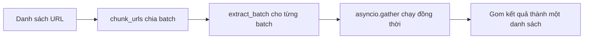

# 🧪 [Optional] TavilyMap & TavilyExtract: Tự tay điều khiển từng bước crawl

> Nguồn: `055-Optional-TavilyMap-TavilyExtract-for-High-customizability.txt` · [Udemy](https://ua.udemy.com/course/langchain/learn/lecture/51313845)

Chào các bạn, Eden đây! Trước khi ingest tài liệu, dĩ nhiên chúng ta phải tải nó về trước. Và trong bài optional này, mình sẽ cho các bạn thấy một cách linh hoạt hơn: dùng **TavilyMap** và **TavilyExtract** để tự kiểm soát từng bước.

*Đây là video tùy chọn — không xem cũng không sao*, nhưng nó sẽ giúp các bạn hiểu sâu hơn về crawling, và biết đâu lại cần khi bạn muốn tùy biến quy trình của riêng mình.

### 🗺️ TavilyMap: vẽ bản đồ website

**TavilyMap** sẽ **khám phá và vẽ ra sitemap** của documentation LangChain — tức là toàn bộ URL mà chúng ta muốn scrape và lấy thông tin. Còn **TavilyExtract** sẽ lấy dữ liệu từ những trang đó.

| Tool | Nhiệm vụ | Nhận vào | Trả về |
|---|---|---|---|
| TavilyMap | Vẽ sitemap website | Một URL gốc | Danh sách URL |
| TavilyExtract | Scrape nội dung trang | Danh sách URL | Document gồm URL và raw_content |

Mình mở notebook trên **Google Colab**, chọn **runtime Python 3**, rồi cài các dependency:
* **LangChain integration** (`langchain-tavily`) — bản này được **maintain rất tốt**. Điều này quan trọng vì nếu tích hợp của bên thứ ba với LangChain không được maintain tốt, API của họ thay đổi là **tích hợp sẽ vỡ** — nhất là khi lên production.
* **certifi** — gọi API với certificate hợp lệ, kiểu **defensive programming** để gửi thật nhiều request.
* **rich** — in log cho đẹp.

*(Còn `pandas` thì không dùng đến — nó "lọt" vào vì mình viết code từ trước thôi!)*

Cells tiếp theo: import `asyncio` (để gọi request đồng thời), `os`, `ssl` cùng `typing` và `certifi`, rồi import **`TavilyMap`** và **`TavilyExtract`**. Mình cấu hình **SSL context** một lần để mọi request đến Tavily đều "danh chính ngôn thuận", không bị chặn.

Lấy **API key**: bấm nút dấu cộng, đặt tên, tạo key và copy giá trị. *Đừng lo cho key của mình — nó sẽ được thu hồi (revoke) ngay khi mình quay xong video!*

---

### 🕸️ Map website thành danh sách URL

Mình khởi tạo object **TavilyMap**. API này nhận **một URL** đầu vào, duyệt website **như một đồ thị (graph)**, khám phá mọi đường đi để **thông minh phát hiện và tạo ra sitemap toàn diện** — đầu ra là **danh sách URL**. Từng URL trong danh sách đó sẽ được đưa vào RAG pipeline để scrape và extract.

Các tham số quan trọng:

1. **`max_depth`** — crawler được khám phá xa bao nhiêu tính từ URL gốc.
2. **`max_breadth`** — số link tối đa đi theo ở mỗi tầng của cây (mỗi trang).
3. **`limit = 500`** — không muốn lấy quá **500 URL**.

Mình gọi API bằng phương thức **`invoke`** với URL bắt đầu là **python.langchain.com/docs/introduction**. Lý do gọi được `invoke` là vì **TavilyMap là một LangChain tool**: package `langchain-tavily` đã "bọc" SDK của Tavily thành tool LangChain. Các bạn có thể dùng SDK thuần, nhưng mình muốn cho các bạn thấy bản tích hợp LangChain.

Kết quả: một sitemap "nóng hổi" của tài liệu LangChain. *Lưu ý rằng kết quả có thể khác tùy thời điểm các bạn xem video*, vì LangChain chắc chắn sẽ thay đổi tài liệu theo thời gian — nhưng các bạn sẽ luôn nhận được sitemap **up to date**. Notebook hiển thị **50 URL đầu tiên**; mình thử click một URL ngẫu nhiên và thấy đó là một trang tài liệu hợp lệ.

---

### 📥 TavilyExtract: scrape một trang thành Markdown

Giờ mình khởi tạo object **TavilyExtract** (không cần tham số gì thêm) — nó sẽ lo phần scrape và trả về **file markdown** của nội dung trang.

Mình chọn một danh sách URL mẫu (hiện tại chỉ gồm **1 URL** — phần tử thứ **21** trong danh sách sitemap). Điểm quan trọng: mình dùng hàm bất đồng bộ **`ainvoke`** và **`await`** nó, **bởi vì** ở bước ingestion chúng ta sẽ muốn extract **đồng thời (concurrently)** nhiều trang một lúc.

Input là dictionary với key **`urls`** — danh sách URL cần scrape. Kết quả trả về dictionary có key **`results`**: một danh sách các document, mỗi document gồm **URL gốc** và **`raw_content`** — nội dung của trang đó. Mình chạy cell và hiển thị nội dung scrape được thật đẹp mắt.

---

### ⚡ Batch processing: extract hàng loạt, chạy song song

Khi tài liệu nhiều lên, chạy tuần tự sẽ "mất cả buổi". Vì vậy mình xử lý theo **batch (lô)** chạy đồng thời — đây là **bắt buộc khi xử lý scale**:

1. **`chunk_urls`** — nhận danh sách URL gốc cùng **`chunk_size`** (mặc định **3**), trả về danh sách các "batch" URL nhỏ hơn.
2. **`extract_batch`** — một **coroutine** nhận **một batch** và **số thứ tự batch** (để log). Nó gọi `extract.ainvoke` như trước nhưng trên cả batch, rồi trả kết quả về.
3. **Chạy song song** — mình chọn **9 URL**, chia thành **3 batch**, tạo các **task (coroutine)** rồi dùng **`asyncio.gather`** để chạy đồng thời và chờ tất cả hoàn thành. Xong xuôi, gom mọi kết quả về **một danh sách duy nhất**.



Mình chạy thử và kết quả cho thấy rõ tính **bất đồng bộ**: log in ra theo thứ tự batch 1, 2, 3, nhưng **thứ tự hoàn thành lại khác** — batch 2 xong trước, rồi batch 1, cuối cùng là batch 3. Trong ingestion thật với nhiều batch hơn, các bạn sẽ thấy điều này còn rõ hơn nữa.

---

### 💻 Code mẫu đầy đủ — `Tavily Demo Tutorial.ipynb`

Toàn bộ code của bài nằm trong notebook `Tavily Demo Tutorial.ipynb` (tham khảo từ repo chính thức của khóa học):

```python
# !pip install langchain-tavily certifi rich

import asyncio
import os
import ssl
from typing import Any, Dict, List

import certifi
from langchain_tavily import TavilyExtract, TavilyMap
from rich.console import Console
from rich.panel import Panel

# Configure SSL context
ssl_context = ssl.create_default_context(cafile=certifi.where())
os.environ["SSL_CERT_FILE"] = certifi.where()
os.environ["REQUESTS_CA_BUNDLE"] = certifi.where()

# Initialize rich console for pretty printing
console = Console()


print("✅ All imports successful!")


# Set directly (uncomment and add your key)
# os.environ["TAVILY_API_KEY"] = "your_tavily_api_key_here"


# Initialize TavilyMap with custom settings
tavily_map = TavilyMap(
    max_depth=3,        # Crawl up to 3 levels deep
    max_breadth=15,     # Follow up to 15 links per page
    max_pages=50        # Limit to 50 total pages for demo
)

print("✅ TavilyMap initialized successfully!")


# Example website to map
demo_url = "https://python.langchain.com/docs/introduction/"

console.print(f"🔍 Mapping website structure for: {demo_url}", style="bold blue")
console.print("This may take a moment...")

# Map the website structure
site_map = tavily_map.invoke(demo_url)

# Display results
urls = site_map.get('results', [])
console.print(f"\n✅ Successfully mapped {len(urls)} URLs!", style="bold green")

# Show first 10 URLs as examples
console.print("\n📋 First 50 discovered URLs:", style="bold yellow")
for i, url in enumerate(urls[:50], 1):
    console.print(f"  {i:2d}. {url}")

if len(urls) > 10:
    console.print(f"  ... and {len(urls) - 50} more URLs")


# Initialize TavilyExtract
tavily_extract = TavilyExtract()

print("✅ TavilyExtract initialized successfully!")


# Select a few interesting URLs for extraction
sample_urls = [urls[15]]  # Take first 5 URLs
console.print(f"📚 Extracting content from {len(sample_urls)} URLs...", style="bold blue")

# Extract content
extraction_result = await tavily_extract.ainvoke(input={"urls": sample_urls})

# Display results
extracted_docs = extraction_result.get('results', [])
console.print(f"\n✅ Successfully extracted {len(extracted_docs)} documents!", style="bold green")

# Show summary of each extracted document
for i, doc in enumerate(extracted_docs, 1):
    url = doc.get('url', 'Unknown')
    content = doc.get('raw_content', '')

    # Create a panel for each document
    panel_content = f"""URL: {url}
Content Length: {len(content):,} characters
Preview: {content}..."""

    console.print(Panel(panel_content, title=f"Document {i}", border_style="blue"))
    print()  # Add spacing


def chunk_urls(urls: List[str], chunk_size: int = 3) -> List[List[str]]:
    """Split URLs into chunks of specified size."""
    chunks = []
    for i in range(0, len(urls), chunk_size):
        chunk = urls[i:i + chunk_size]
        chunks.append(chunk)
    return chunks

async def extract_batch(urls: List[str], batch_num: int) -> List[Dict[str, Any]]:
    """Extract documents from a batch of URLs."""
    try:
        console.print(f"🔄 Processing batch {batch_num} with {len(urls)} URLs", style="blue")
        docs = await tavily_extract.ainvoke(input={"urls": urls})
        results = docs.get('results', [])
        console.print(f"✅ Batch {batch_num} completed - extracted {len(results)} documents", style="green")
        return results
    except Exception as e:
        console.print(f"❌ Batch {batch_num} failed: {e}", style="red")
        return []

# Process a larger set of URLs in batches
url_batches = chunk_urls(urls[:9], chunk_size=3) # Take first 9 URLs for batch demo, split to batches of 3

console.print(f"📦 Processing 9 URLs in {len(url_batches)} batches", style="bold yellow")

# Process batches concurrently
tasks = [extract_batch(batch, i + 1) for i, batch in enumerate(url_batches)]
batch_results = await asyncio.gather(*tasks)

# Flatten results
all_extracted = []
for batch_result in batch_results:
    all_extracted.extend(batch_result)

console.print(f"\n🎉 Batch processing complete! Total documents extracted: {len(all_extracted)}", style="bold green")
```

### 🎯 Tự kiểm tra nhanh

**Câu 1:** TavilyMap khác TavilyExtract ở điểm nào?

<details>
<summary><b>Xem đáp án</b></summary>

**Đáp án:** TavilyMap chỉ khám phá và trả về danh sách URL (sitemap); TavilyExtract mới lấy nội dung của từng trang.

Giải thích: Map duyệt website như một đồ thị để phát hiện đường đi; Extract lấy `raw_content`.

Tham chiếu: Mục TavilyMap, Mục TavilyExtract.

</details>

**Câu 2:** Vì sao ở bước Extract mình dùng `ainvoke` và `await`?

<details>
<summary><b>Xem đáp án</b></summary>

**Đáp án:** Để có thể extract đồng thời nhiều trang một lúc ở bước ingestion.

Giải thích: Đây là hàm bất đồng bộ, phù hợp với tác vụ I/O bound.

Tham chiếu: Mục TavilyExtract.

</details>

**Câu 3:** Ba tham số quan trọng khi khởi tạo TavilyMap là gì?

<details>
<summary><b>Xem đáp án</b></summary>

**Đáp án:** `max_depth` (độ sâu), `max_breadth` (số link mỗi tầng) và `limit = 500` (số URL tối đa).

Giải thích: Mình gọi `invoke` với URL bắt đầu là python.langchain.com/docs/introduction.

Tham chiếu: Mục Map website thành danh sách URL.

</details>

**Câu 4:** Batch processing trong bài gồm những bước nào?

<details>
<summary><b>Xem đáp án</b></summary>

**Đáp án:** `chunk_urls` chia URL thành các batch, `extract_batch` xử lý từng batch, rồi dùng `asyncio.gather` chạy song song và gom kết quả.

Giải thích: Chunk size mặc định là 3; ví dụ 9 URL chia thành 3 batch.

Tham chiếu: Mục Batch processing.

</details>

**Câu 5:** Vì sao phải chọn integration được maintain tốt?

<details>
<summary><b>Xem đáp án</b></summary>

**Đáp án:** Vì API của bên thứ ba thay đổi là tích hợp sẽ vỡ — nhất là khi lên production.

Giải thích: `langchain-tavily` được maintain rất tốt; package này bọc SDK Tavily thành LangChain tool.

Tham chiếu: Đoạn mở đầu.

</details>

---

Và đó chính là nền tảng để chúng ta tải tài liệu LangChain về **một cách đồng thời**. Ở bài tiếp theo, mình sẽ áp dụng tất cả vào project thật — hẹn gặp các bạn! 🚀

## Nguồn tham khảo

- [Udemy — [Optional] TavilyMap, TavilyExtract for High customizability](https://ua.udemy.com/course/langchain/learn/lecture/51313845)
- [Tavily Docs — Map API](https://docs.tavily.com/documentation/api-reference/endpoint/map)
- [Tavily Docs — Extract API](https://docs.tavily.com/documentation/api-reference/endpoint/extract)
- [GitHub — langchain-tavily](https://github.com/tavily-ai/langchain-tavily)
