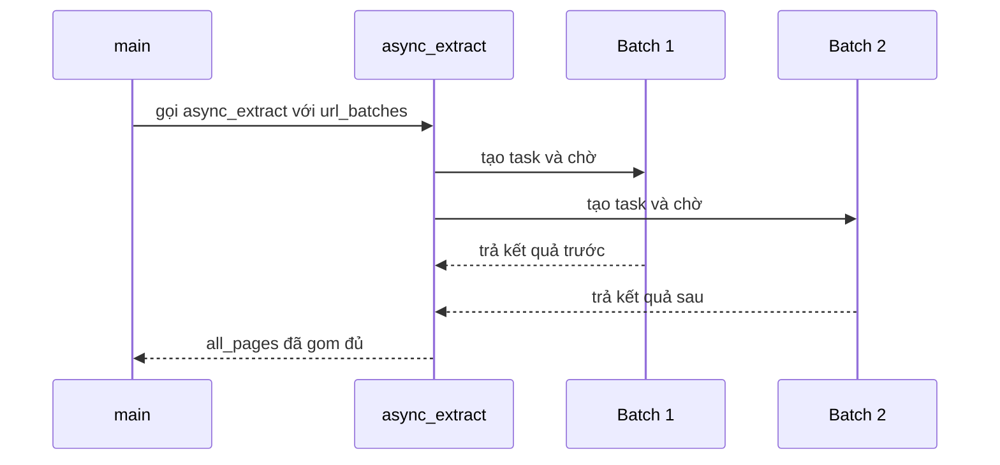

# 🕵️ [Optional] Crawling Deep Dive: Map + Extract, batch processing và xử lý rate limit

> Nguồn: `056-Optional-Crawling-Deep-Dive.txt` · [Udemy](https://ua.udemy.com/course/langchain/learn/lecture/51359991)

Chào các bạn, Eden đây! Đây là video **optional (tùy chọn)**, dành cho những ai muốn đi sâu hơn vào crawling và scraping.

Như mình đã chỉ trong bài trước, **TavilyCrawl** là lựa chọn khuyên dùng cho hầu hết trường hợp: đưa nó một URL, nó tự map toàn bộ site, scrape mọi thứ trong sitemap và cho phép lọc chính xác thứ bạn cần bằng **ngôn ngữ tự nhiên** — ví dụ "chỉ lấy cho tôi mọi thứ về agents". Tuy nhiên, đôi khi ta muốn **kiểm soát từng bước**, tùy biến quy trình, hoặc đi **thật sâu** vào một phần nào đó của website. Khi đó hãy dùng **TavilyMap + TavilyExtract**.

Video này hơi "nâng cao" một chút, và **hoàn toàn không bắt buộc**. Nội dung gồm: map sitemap để lấy toàn bộ URL, scrape từng URL bằng TavilyExtract, chạy **đồng thời**, cùng các chiến lược **batch processing** và **xử lý rate limiting**.

*Mẹo học:* vì video khá dài, mình khuyên các bạn **xem trước một lượt**, rồi hãy tự làm. Và không cần gõ lại từ đầu — cứ **copy snippet từ repository** mà mình để trong phần tài nguyên nhé!

### 🪵 Bắt đầu với log và TavilyMap

Đầu tiên là vài dòng log cho đẹp: `log_header("Documentation ingestion pipeline")` và `log_info("Starting to map documentation structure from", <URL tài liệu LangChain>)` — chữ màu tím cho nổi.

Mình gọi **TavilyMap** bằng `invoke` (đây là **wrapper biến API của Tavily thành LangChain tool**). Kết quả lưu vào biến **`sitemap`** — một dictionary, trong đó danh sách URL nằm ở key **`results`**. Mình đặt breakpoint chạy **debug mode** để "mổ xẻ" object: log header hiện ra, chờ vài giây, rồi `sitemap` cho thấy **500 URL** tài liệu — mình log lại con số này.

---

### 🧺 Batch processing: hai tầng song song

Với tài liệu, mình không muốn gọi API từng URL một. **TavilyExtract** hỗ trợ **nhận cả danh sách URL trong một API call**, nên chiến lược là:

1. Từ danh sách URL lớn, cắt thành **các batch URL**.
2. Mỗi batch = **một request extract**.
3. Các batch được **bắn đồng thời**.

Vậy là ta có **hai tầng xử lý song song**:
* **Tầng API**: Tavily hỗ trợ xử lý song song phía họ — mình chỉ cần gửi đúng lượng URL theo tài liệu của họ, điều khiển qua **batch size**.
* **Tầng phía chúng ta**: tự bắn các request **bất đồng bộ** — đây là ví dụ kinh điển của **I/O bound operations (tác vụ chờ I/O)**, ngồi chờ API trả về.

| Tầng | Ai xử lý | Điều khiển bằng |
|---|---|---|
| Tầng API | Tavily | batch size |
| Tầng phía chúng ta | Client Python | request bất đồng bộ |

Kỹ thuật này giúp lấy tài liệu **"trong nháy mắt"**. Tin mình đi: hồi trước, khi tải thủ công và **không chạy đồng thời**, mình mất **cả mấy giờ đồng hồ**.

Hàm **`chunk_urls`** nhận danh sách URL và `chunk_size`, trả về danh sách mà mỗi phần tử là một batch URL — code Python khá cơ bản, mình đã giới thiệu trong notebook bài trước. Mình gọi nó với **chunk_size = 20** và nhận về **25 batch**. *Nhớ đừng để chunk_size quá lớn*, nếu không API sẽ từ chối vì bạn gửi quá nhiều URL một lúc!

---

### 🧵 extract_batch, async_extract và asyncio.gather

Mình viết **coroutine `extract_batch`** nhận vào một batch URL và **số thứ tự batch** — cần số này cho **observability (khả năng quan sát)** qua log:

* Log bắt đầu xử lý batch số mấy, với bao nhiêu URL.
* `await` phương thức **`ainvoke`** của TavilyExtract — thao tác **non-blocking**, chạy đồng thời, I/O bound.
* Input gửi đi là dictionary có field **`urls`** — đúng format Tavily mong đợi.
* Nếu không có ngoại lệ: log thành công, log số URL đã extract và trả kết quả.

Tiếp đó là **coroutine `async_extract`** — "nhạc trưởng" chạy tất cả batch đồng thời:

1. Log khởi động.
2. **`enumerate`** qua các batch, tạo coroutine cho mỗi batch và lưu vào biến **`tasks`**. *Lưu ý:* lúc này chúng **chưa thực sự chạy** — vì mình chưa `await` các expression đó.
3. Gọi **`asyncio.gather`** để `await` mọi coroutine trong danh sách — tất cả chạy **bất đồng bộ**, và mình chờ đến khi **tất cả** hoàn thành. Toàn bộ tài liệu nằm trong biến **`results`**.



Sau đó mình duyệt từng phần tử trong `results` — mỗi phần tử hoặc là một **dictionary** chứa nội dung đã extract (URL + `raw_content`), hoặc là một **exception (lỗi)** báo batch thất bại:

* Nếu là exception: **log error** và tăng biến đếm **`failed_batches`**.
* Nếu hợp lệ: với mỗi phần tử trong batch, tạo một **LangChain Document** với nội dung trang, và **metadata** chứa key **`source`** là **URL gốc** — để luôn biết nội dung nào đến từ trang nào.

Kết thúc, mình log thành công/thất bại rồi **return `all_pages`** — danh sách **LangChain Document** chứa toàn bộ tài liệu LangChain.

*Mình biết nhìn code suông thì hơi khó hình dung*, nên lúc chạy debug mình sẽ "mổ" từng object cho các bạn xem.

---

### 🐞 Chạy debug: 25 batch và "first come first go"

Trong hàm `main`, mình `await async_extract(url_batches)` và lưu kết quả vào **`all_docs`** (danh sách đã được làm phẳng). Breakpoint đặt sẵn, chạy debug:

* Log cho thấy **25 batch** được "khai hỏa".
* Kết quả **stream về liên tục** và **không theo thứ tự** — **"first come first go"**, batch nào xong trước trả trước, đúng chất bất đồng bộ.
* Chạy xong, soi biến **`all_docs`**: mỗi **LangChain Document** gồm `source` (URL gốc) và nội dung trang.

Một phát hiện thú vị: có document ghi **"Page not found"** — nghĩa là mình lấy nhầm URL, hoặc URL đó **không còn tồn tại**. Một document khác là trang tài liệu **LangChain Expression Language** — trông ổn áp! Và đến đây thì chúng ta đã sẵn sàng cho bước tiếp theo: **chunking** và index vào **vector store**.

---

### 💻 Code mẫu đầy đủ — `ingestion.py`

Toàn bộ code của bài nằm trong file `ingestion.py` (tham khảo từ repo chính thức của khóa học) — các hàm `chunk_urls`, `extract_batch` và `async_extract` chính là phần batch processing của bài:

```python
import asyncio
import os
import ssl
from typing import Any, Dict, List

import certifi
from dotenv import load_dotenv
from langchain.text_splitter import RecursiveCharacterTextSplitter
from langchain_chroma import Chroma
from langchain_core.documents import Document
from langchain_openai import OpenAIEmbeddings
from langchain_pinecone import PineconeVectorStore
from langchain_tavily import TavilyCrawl, TavilyExtract, TavilyMap

from logger import Colors, log_error, log_header, log_info, log_success, log_warning

load_dotenv()

# Configure SSL context to use certifi certificates
ssl_context = ssl.create_default_context(cafile=certifi.where())
os.environ["SSL_CERT_FILE"] = certifi.where()
os.environ["REQUESTS_CA_BUNDLE"] = certifi.where()


embeddings = OpenAIEmbeddings(
    model="text-embedding-3-small",
    show_progress_bar=False,
    chunk_size=50,
    retry_min_seconds=10,
)
chroma = Chroma(persist_directory="chroma_db", embedding_function=embeddings)
vectorstore = PineconeVectorStore(
    index_name="langchain-docs-2025", embedding=embeddings
)
tavily_extract = TavilyExtract()
tavily_map = TavilyMap(max_depth=5, max_breadth=20, max_pages=1000)


def chunk_urls(urls: List[str], chunk_size: int = 20) -> List[List[str]]:
    """Split URLs into chunks of specified size."""
    chunks = []
    for i in range(0, len(urls), chunk_size):
        chunk = urls[i : i + chunk_size]
        chunks.append(chunk)
    return chunks


async def extract_batch(urls: List[str], batch_num: int) -> List[Dict[str, Any]]:
    """Extract documents from a batch of URLs."""
    try:
        log_info(
            f"🔄 TavilyExtract: Processing batch {batch_num} with {len(urls)} URLs.",
            Colors.BLUE,
        )
        docs = await tavily_extract.ainvoke(
            input={"urls": urls, "extract_depth": "advanced"}
        )
        extracted_docs_count = len(docs.get("results", []))
        if extracted_docs_count > 0:
            log_success(
                f"TavilyExtract: Completed batch {batch_num} - extracted {extracted_docs_count} documents"
            )
        else:
            log_error(
                f"TavilyExtract: Batch {batch_num} failed to extract any documents, {docs}"
            )
        return docs
    except Exception as e:
        log_error(f"TavilyExtract: Failed to extract batch {batch_num} - {e}")
        return []


async def async_extract(url_batches: List[List[str]]):
    log_header("DOCUMENT EXTRACTION PHASE")
    log_info(
        f"🔧 TavilyExtract: Starting concurrent extraction of {len(url_batches)} batches",
        Colors.DARKCYAN,
    )

    tasks = [extract_batch(batch, i + 1) for i, batch in enumerate(url_batches)]

    results = await asyncio.gather(*tasks, return_exceptions=True)

    # Filter out exceptions and flatten results
    all_pages = []
    failed_batches = 0
    for result in results:
        if isinstance(result, Exception):
            log_error(f"TavilyExtract: Batch failed with exception - {result}")
            failed_batches += 1
        else:
            for extracted_page in result["results"]:  # type: ignore
                document = Document(
                    page_content=extracted_page["raw_content"],
                    metadata={"source": extracted_page["url"]},
                )
                all_pages.append(document)

    log_success(
        f"TavilyExtract: Extraction complete! Total pages extracted: {len(all_pages)}"
    )
    if failed_batches > 0:
        log_warning(f"TavilyExtract: {failed_batches} batches failed during extraction")

    return all_pages


async def index_documents_async(documents: List[Document], batch_size: int = 50):
    """Process documents in batches asynchronously."""
    log_header("VECTOR STORAGE PHASE")
    log_info(
        f"📚 VectorStore Indexing: Preparing to add {len(documents)} documents to vector store",
        Colors.DARKCYAN,
    )

    # Create batches
    batches = [
        documents[i : i + batch_size] for i in range(0, len(documents), batch_size)
    ]

    log_info(
        f"📦 VectorStore Indexing: Split into {len(batches)} batches of {batch_size} documents each"
    )

    # Process all batches concurrently
    async def add_batch(batch: List[Document], batch_num: int):
        try:
            await vectorstore.aadd_documents(batch)
            log_success(
                f"VectorStore Indexing: Successfully added batch {batch_num}/{len(batches)} ({len(batch)} documents)"
            )
        except Exception as e:
            log_error(f"VectorStore Indexing: Failed to add batch {batch_num} - {e}")
            return False
        return True

    # Process batches concurrently
    tasks = [add_batch(batch, i + 1) for i, batch in enumerate(batches)]
    results = await asyncio.gather(*tasks, return_exceptions=True)

    # Count successful batches
    successful = sum(1 for result in results if result is True)

    if successful == len(batches):
        log_success(
            f"VectorStore Indexing: All batches processed successfully! ({successful}/{len(batches)})"
        )
    else:
        log_warning(
            f"VectorStore Indexing: Processed {successful}/{len(batches)} batches successfully"
        )


async def main():
    """Main async function to orchestrate the entire process."""
    log_header("DOCUMENTATION INGESTION PIPELINE")

    log_info(
        "🗺️  TavilyMap: Starting to map documentation structure from https://python.langchain.com/",
        Colors.PURPLE,
    )
    site_map = tavily_map.invoke("https://python.langchain.com/")
    log_success(
        f"TavilyMap: Successfully mapped {len(site_map['results'])} URLs from documentation site"
    )

    # Split URLs into batches of 20
    url_batches = chunk_urls(list(site_map["results"]), chunk_size=20)
    log_info(
        f"📋 URL Processing: Split {len(site_map['results'])} URLs into {len(url_batches)} batches",
        Colors.BLUE,
    )

    # Extract documents from URLs
    all_docs = await async_extract(url_batches)

    # Split documents into chunks
    log_header("DOCUMENT CHUNKING PHASE")
    log_info(
        f"✂️  Text Splitter: Processing {len(all_docs)} documents with 4000 chunk size and 200 overlap",
        Colors.YELLOW,
    )
    text_splitter = RecursiveCharacterTextSplitter(chunk_size=4000, chunk_overlap=200)
    splitted_docs = text_splitter.split_documents(all_docs)
    log_success(
        f"Text Splitter: Created {len(splitted_docs)} chunks from {len(all_docs)} documents"
    )

    # Process documents asynchronously
    await index_documents_async(splitted_docs, batch_size=500)

    log_header("PIPELINE COMPLETE")
    log_success("🎉 Documentation ingestion pipeline finished successfully!")
    log_info("📊 Summary:", Colors.BOLD)
    log_info(f"   • URLs mapped: {len(site_map['results'])}")
    log_info(f"   • Documents extracted: {len(all_docs)}")
    log_info(f"   • Chunks created: {len(splitted_docs)}")


if __name__ == "__main__":
    asyncio.run(main())
```

### 🎯 Tự kiểm tra nhanh

**Câu 1:** Khi nào nên dùng TavilyMap + TavilyExtract thay vì TavilyCrawl?

<details>
<summary><b>Xem đáp án</b></summary>

**Đáp án:** Khi muốn kiểm soát từng bước, tùy biến quy trình, hoặc đi thật sâu vào một phần nào đó của website.

Giải thích: TavilyCrawl vẫn là lựa chọn khuyên dùng cho hầu hết trường hợp.

Tham chiếu: Đoạn mở đầu.

</details>

**Câu 2:** "Hai tầng xử lý song song" trong bài là gì?

<details>
<summary><b>Xem đáp án</b></summary>

**Đáp án:** Tầng API do Tavily xử lý song song (điều khiển qua batch size) và tầng phía chúng ta tự bắn request bất đồng bộ.

Giải thích: Đây là ví dụ kinh điển của I/O bound — ngồi chờ API trả về.

Tham chiếu: Mục Batch processing.

</details>

**Câu 3:** Với 500 URL và `chunk_size = 20`, ta được bao nhiêu batch và cần lưu ý gì?

<details>
<summary><b>Xem đáp án</b></summary>

**Đáp án:** 25 batch; đừng để chunk_size quá lớn vì API sẽ từ chối khi nhận quá nhiều URL một lúc.

Giải thích: Mỗi batch tương ứng một request extract.

Tham chiếu: Mục Batch processing.

</details>

**Câu 4:** `asyncio.gather` làm gì trong `async_extract`?

<details>
<summary><b>Xem đáp án</b></summary>

**Đáp án:** `await` mọi coroutine trong danh sách `tasks` để tất cả chạy bất đồng bộ và chờ đến khi tất cả hoàn thành.

Giải thích: Coroutine được tạo qua `enumerate` chưa thực sự chạy cho tới khi được await.

Tham chiếu: Mục extract_batch, async_extract và asyncio.gather.

</details>

**Câu 5:** Mỗi phần tử trong `results` có thể là gì và xử lý ra sao?

<details>
<summary><b>Xem đáp án</b></summary>

**Đáp án:** Hoặc là dictionary chứa nội dung đã extract, hoặc là exception báo batch thất bại — khi đó log error và tăng `failed_batches`.

Giải thích: Phần hợp lệ được tạo thành LangChain Document với metadata `source` là URL gốc.

Tham chiếu: Mục extract_batch, async_extract và asyncio.gather.

</details>

---

Nào, cùng đi tiếp hành trình RAG nhé! 🚀

## Nguồn tham khảo

- [Udemy — [Optional] Crawling Deep Dive](https://ua.udemy.com/course/langchain/learn/lecture/51359991)
- [Tavily Docs — Extract API](https://docs.tavily.com/documentation/api-reference/endpoint/extract)
- [Python Docs — Coroutines and Tasks](https://docs.python.org/3/library/asyncio-task.html)
