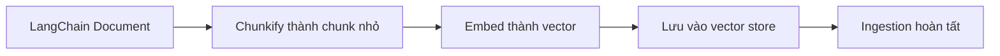

# 🛑 Quick Recap: Dừng lại một nhịp và nhìn lại RAG Ingestion Pipeline

> Nguồn: `057-Quick-Recap.txt` · [Udemy](https://ua.udemy.com/course/langchain/learn/lecture/57013531)

Chào các bạn, Eden đây! Mình nghĩ đây là **thời điểm tuyệt vời để tạm dừng**, nhìn lại xem chúng ta đã làm gì và còn gì phía trước trong **RAG ingestion pipeline**.

Và tin vui: **chúng ta đã đi qua phần khó nhất rồi!** Điều này rất "đặc sản" của các ứng dụng **RAG chuẩn production (production-grade)**: phần khó nhất thường chỉ là **đưa được dữ liệu vào hệ thống**.

### 📍 Chúng ta đang ở đâu?

Đến giờ, chúng ta đã lấy **nguồn dữ liệu** — tài liệu LangChain — và **nạp (load)** nó thành các **LangChain Document**. Toàn bộ quá trình này dùng **API bên ngoài**: **TavilyMap**, **TavilyExtract**, và chúng ta đã chạy mọi thứ **đồng thời (concurrently)** — có rất nhiều thứ để tối ưu trong đoạn này.

Bước tiếp theo: chuẩn bị mọi thứ để **index vào vector store**:

1. **Chunkify (chia nhỏ) và transform** các document gốc thành những **chunk nhỏ hơn**.
2. **Chuyển từng chunk thành vector** (embed).
3. Lưu **embedding vector** đó vào **vector store**.

Xong 3 bước này là **RAG ingestion pipeline hoàn tất**!

---

### 🧮 Chunking và bài toán token của LLM

Đây là lúc thảo luận về **chunking**, **chunk size** và những điều cần lưu tâm — có vài **rule of thumb (quy tắc ngón tay cái)** giúp cuộc sống dễ thở hơn khi làm việc với LLM.

Đầu tiên, cần rõ cách LLM tính **token và quota**:

* Số token LLM nhận trong **prompt (input)**, cộng với số token LLM **trả về trong kết quả** — tổng hai con số này là tổng token của một **API call**.
* Bạn cũng cần biết **giới hạn token** của model mình dùng. Ví dụ, khi mình làm dự án này lần đầu, mình dùng **GPT-3.5 Turbo** với giới hạn **4K tokens** — trong tương lai con số này chắc chắn sẽ tăng lên.

Điểm mấu chốt: **câu query gửi cho LLM không chỉ là câu hỏi thuần**. Ví dụ bạn hỏi "LangChain chain là gì?" — model **chưa từng được train** trên dữ liệu này, nó không biết LangChain là gì. Vì vậy ta phải lấy dữ liệu từ **vector database** bên ngoài: trong prompt sẽ gồm **query + context bổ sung** (những chunk văn bản lấy từ vector store).

Và phần context này cũng cần được **đếm token**. Để đơn giản, giả sử ta dành khoảng **2,000 tokens cho context**; nếu gửi **4 context**, thì **2,000 chia 4 = khoảng 500 tokens mỗi context** — đó chính là **chunk size** mà chúng ta hướng tới.

*Tất nhiên con số này thay đổi theo từng bài toán:* nếu cần câu trả lời **ngắn gọn súc tích**, ta sẽ có thêm token để "chơi" trong context và query. Nhưng đây là **rule of thumb** phổ biến để tính chunk size.

---

### ⚠️ Đừng bao giờ chia nhỏ quá mức!

Rule of thumb cuối cùng, và cũng quan trọng không kém: **đừng để chunk size quá nhỏ**.

Nếu chunk quá bé, chúng sẽ **không còn ý nghĩa ngữ nghĩa (semantic meaning)** — mà chính **semantic meaning** mới là thứ giúp **similarity search (tìm kiếm tương đồng)** trong vector database hoạt động hiệu quả.

---

### 🎯 Tự kiểm tra nhanh

**Câu 1:** Phần khó nhất của một ứng dụng RAG chuẩn production thường là gì?

<b>Xem đáp án</b>

**Đáp án:** Đưa được dữ liệu vào hệ thống — chính là giai đoạn ingestion mà chúng ta vừa đi qua.

Giải thích: Đây là "đặc sản" của RAG production-grade: khó nhất ở khâu nạp liệu.

Tham chiếu: Đoạn mở đầu.

**Câu 2:** Ba bước còn lại để hoàn tất ingestion pipeline là gì?

<b>Xem đáp án</b>

**Đáp án:** Chunkify và transform document thành chunk nhỏ hơn; embed từng chunk thành vector; lưu embedding vào vector store.

Giải thích: Xong 3 bước này là ingestion hoàn tất.

Tham chiếu: Mục Chúng ta đang ở đâu.

**Câu 3:** Token của một API call LLM được tính như thế nào?

<b>Xem đáp án</b>

**Đáp án:** Tổng số token LLM nhận trong prompt (input) cộng với số token LLM trả về trong kết quả (output).

Giải thích: Context lấy từ vector store cũng phải được đếm token.

Tham chiếu: Mục Chunking và bài toán token của LLM.

**Câu 4:** Rule of thumb tính chunk size trong bài là gì?

<b>Xem đáp án</b>

**Đáp án:** Ví dụ dành khoảng 2.000 token cho context; gửi 4 context thì 2.000 chia 4 ≈ 500 token mỗi chunk — đó là chunk size hướng tới.

Giải thích: Con số thay đổi theo bài toán, tùy câu trả lời cần ngắn gọn hay dài.

Tham chiếu: Mục Chunking và bài toán token của LLM.

**Câu 5:** Vì sao không được chia chunk quá nhỏ?

<b>Xem đáp án</b>

**Đáp án:** Chunk quá bé sẽ mất ý nghĩa ngữ nghĩa, khiến similarity search trong vector database kém hiệu quả.

Giải thích: Semantic meaning là thứ giúp tìm kiếm tương đồng hoạt động tốt.

Tham chiếu: Mục Đừng bao giờ chia nhỏ quá mức.

---

Vậy là lý thuyết đã đủ! Bước tiếp theo: **chunkify** các LangChain Document và **index** toàn bộ vào vector store. Cùng đi tiếp nhé, phần thú vị nhất đang ở ngay trước mắt! 🚀

## Nguồn tham khảo

- [Udemy — Quick Recap](https://ua.udemy.com/course/langchain/learn/lecture/57013531)
- [LangChain Docs — Retrieval](https://docs.langchain.com/oss/python/langchain/retrieval)
- [LangChain Docs — Recursive text splitter](https://docs.langchain.com/oss/python/integrations/splitters/recursive_text_splitter)
