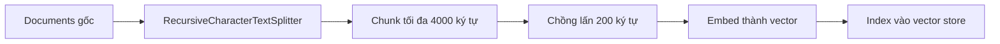

# ✂️ Chunking: Chia nhỏ tài liệu LangChain để RAG "nhẹ gánh" hơn

> Nguồn: `058-Chunking-Text-Splitting.txt` · [Udemy](https://ua.udemy.com/course/langchain/learn/lecture/51360029)

Trong vài video tới, mình và các bạn sẽ cùng **chunking (chia nhỏ)** toàn bộ tài liệu LangChain thành những đoạn nhỏ hơn, để có thể cung cấp chúng làm context cho LLM. Bước tiếp theo là **embed** — biến các chunk thành vector — rồi **đánh index (index)** vào vector store.

Nghe qua thì nhiều công đoạn, nhưng đây là một trong những bước dễ triển khai nhất của cả pipeline đấy!

### 🧩 Chia nhỏ tài liệu với RecursiveCharacterTextSplitter

Toàn bộ quá trình chunking được thực hiện bằng **RecursiveCharacterTextSplitter** của LangChain. Mình cấu hình cho nó hai tham số quan trọng:

* **`chunk_size = 4000`** — giới hạn mỗi chunk tối đa 4000 ký tự.
* **`chunk_overlap = 200`** — 200 ký tự chồng lấn giữa các chunk liền kề.

Toàn bộ pipeline ingestion mà chúng ta đang đi qua trông như sau:



Cách hoạt động của splitter này là **chia một cách có ngữ nghĩa (semantically)**: đầu tiên nó thử tách theo **đoạn văn (paragraph)**, rồi mới đến **dòng mới (new line)**, cứ thế đệ quy cho tới khi thỏa mãn kích thước mong muốn. Nếu muốn đào sâu hơn về RecursiveCharacterTextSplitter, các bạn có thể xem lại video chuyên đề mà mình đã làm riêng cho nó.

Sau khi có object text splitter, chúng ta chỉ cần gọi method có sẵn là **`split_documents`**, truyền vào danh sách LangChain documents. Kết quả nhận về là một danh sách documents **dài hơn hẳn** — vì mỗi document gốc đã bị chia thành nhiều chunk. Sau đó mình log lại mọi thứ để tiện theo dõi. Đúng là LangChain làm hết phần việc nặng nhọc cho chúng ta!

---

### 🎯 Đừng tìm "viên đạn bạc": chunking là một chủ đề sâu

Điều đầu tiên mình muốn lưu ý: **đây không phải là phương pháp chunking vạn năng**. Chunking là một chủ đề rất sâu, với rất nhiều chiến lược khác nhau để các bạn khám phá, chẳng hạn:

* **Small-to-big** — chunk nhỏ để tìm kiếm, nhưng trả về ngữ cảnh lớn hơn.
* **Semantic chunking** — tách dựa trên ngữ nghĩa thay vì ký tự.
* Và còn rất nhiều kỹ thuật tối ưu thú vị khác cho giai đoạn này.

---

### 💡 "RAG đã chết" vì context window khổng lồ? Không hề!

Các LLM ngày nay sở hữu **token limit** ngày càng lớn: đến năm 2025, Anthropic đã đạt **1 triệu token**, còn **Gemini 2.5** lên tới **2 triệu input token**. Vì thế, nhiều người nói rằng **RAG đã chết**.

Mình khẳng định rõ: **RAG không chết, nó đang tiến hóa.** Ngay cả khi context window khổng lồ xuất hiện, kỹ thuật chunking vẫn quan trọng, và đây là lý do:

1. **Hiệu quả chi phí (cost efficiency):** Nhét cả một tài liệu triệu token vào LLM sẽ **chậm hơn đáng kể** và **đắt hơn nhiều lần** so với việc chỉ retrieve đúng đoạn snippet liên quan bằng RAG.
2. **Độ chính xác và giảm nhiễu (precision & noise reduction):** RAG lọc ra **chỉ những chunk liên quan nhất**, từ đó giảm mạnh **hallucination (ảo giác)** và **positional bias (thiên lệch vị trí)** thường gặp ở phương pháp long context. Kết hợp thêm **retrieval with intelligent reordering (truy hồi và sắp xếp lại thông minh)** sẽ nâng chất lượng câu trả lời mà vẫn dùng ít token hơn so với nạp toàn bộ ngữ cảnh — điều này đã được chứng minh.
3. **Tính năng hướng người dùng:** RAG cho phép hiển thị **nguồn của từng mảnh thông tin** trong câu trả lời. Người dùng có thể truy vết câu trả lời về tận gốc — điều cực kỳ quan trọng để tạo **niềm tin** vào hệ thống AI, và đặc biệt thiết yếu trong các **môi trường bị quản lý chặt (regulated environments)**.

| Tiêu chí | Long context | RAG |
|---|---|---|
| Chi phí & tốc độ | Nạp cả tài liệu triệu token — chậm hơn đáng kể, đắt hơn nhiều lần | Retrieve đúng snippet liên quan — nhanh và rẻ hơn |
| Độ chính xác | Dễ nhiễu, có **positional bias** | Lọc chunk liên quan nhất, giảm mạnh **hallucination** |
| Truy vết nguồn | Khó chỉ ra nguồn của từng thông tin | Hiển thị nguồn rõ ràng, tăng niềm tin, hợp môi trường bị quản lý chặt |

Nói ngắn gọn: các mô hình long context **bổ trợ** cho RAG, giúp RAG xử lý những prompt và chuỗi ngữ cảnh phong phú hơn một cách hiệu quả. **Larger context windows don't kill RAG — they amplify it and magnify the strings!**

---

### 💻 Code mẫu đầy đủ — `ingestion.py`

Toàn bộ code của bài nằm trong file `ingestion.py` (tham khảo từ repo chính thức của khóa học) — phần `RecursiveCharacterTextSplitter` chính là nội dung chunking của bài (file còn import helper `logger.py` của project):

```python
import asyncio
import os
import ssl
from typing import Any, Dict, List

import certifi
from dotenv import load_dotenv
from langchain_chroma import Chroma
from langchain_classic.text_splitter import RecursiveCharacterTextSplitter
from langchain_core.documents import Document
from langchain_openai import OpenAIEmbeddings
from langchain_pinecone import PineconeVectorStore
from langchain_tavily import TavilyCrawl, TavilyExtract, TavilyMap

from logger import (Colors, log_error, log_header, log_info, log_success,
                    log_warning)

load_dotenv()

# Configure SSL context to use certifi certificates
ssl_context = ssl.create_default_context(cafile=certifi.where())
os.environ["SSL_CERT_FILE"] = certifi.where()
os.environ["REQUESTS_CA_BUNDLE"] = certifi.where()


embeddings = OpenAIEmbeddings(
    model="text-embedding-3-small",
    show_progress_bar=False,
    chunk_size=50,
    retry_min_seconds=10,
)
vectorstore = Chroma(persist_directory="chroma_db", embedding_function=embeddings)
# vectorstore = PineconeVectorStore(
#     index_name="langchain-docs-2025", embedding=embeddings
# )
tavily_extract = TavilyExtract()
tavily_map = TavilyMap(max_depth=5, max_breadth=20, max_pages=1000)
tavily_crawl = TavilyCrawl()


async def index_documents_async(documents: List[Document], batch_size: int = 50):
    """Process documents in batches asynchronously."""
    log_header("VECTOR STORAGE PHASE")
    log_info(
        f"📚 VectorStore Indexing: Preparing to add {len(documents)} documents to vector store",
        Colors.DARKCYAN,
    )

    # Create batches
    batches = [
        documents[i : i + batch_size] for i in range(0, len(documents), batch_size)
    ]

    log_info(
        f"📦 VectorStore Indexing: Split into {len(batches)} batches of {batch_size} documents each"
    )

    # Process all batches concurrently
    async def add_batch(batch: List[Document], batch_num: int):
        try:
            await vectorstore.aadd_documents(batch)
            log_success(
                f"VectorStore Indexing: Successfully added batch {batch_num}/{len(batches)} ({len(batch)} documents)"
            )
        except Exception as e:
            log_error(f"VectorStore Indexing: Failed to add batch {batch_num} - {e}")
            return False
        return True

    # Process batches concurrently
    tasks = [add_batch(batch, i + 1) for i, batch in enumerate(batches)]
    results = await asyncio.gather(*tasks, return_exceptions=True)

    # Count successful batches
    successful = sum(1 for result in results if result is True)

    if successful == len(batches):
        log_success(
            f"VectorStore Indexing: All batches processed successfully! ({successful}/{len(batches)})"
        )
    else:
        log_warning(
            f"VectorStore Indexing: Processed {successful}/{len(batches)} batches successfully"
        )


async def main():
    """Main async function to orchestrate the entire process."""
    log_header("DOCUMENTATION INGESTION PIPELINE")

    log_info(
        "🗺️  TavilyCrawl: Starting to crawl the documentation site",
        Colors.PURPLE,
    )
    # Crawl the documentation site

    res = tavily_crawl.invoke(
        {
            "url": "https://python.langchain.com/",
            "max_depth": 2,
            "extract_depth": "advanced",
        }
    )

    # Convert Tavily crawl results to LangChain Document objects
    all_docs = []
    for tavily_crawl_result_item in res["results"]:
        log_info(
            f"TavilyCrawl: Successfully crawled {tavily_crawl_result_item['url']} from documentation site"
        )
        all_docs.append(
            Document(
                page_content=tavily_crawl_result_item["raw_content"],
                metadata={"source": tavily_crawl_result_item["url"]},
            )
        )

    # Split documents into chunks
    log_header("DOCUMENT CHUNKING PHASE")
    log_info(
        f"✂️  Text Splitter: Processing {len(all_docs)} documents with 4000 chunk size and 200 overlap",
        Colors.YELLOW,
    )
    text_splitter = RecursiveCharacterTextSplitter(chunk_size=4000, chunk_overlap=200)
    splitted_docs = text_splitter.split_documents(all_docs)
    log_success(
        f"Text Splitter: Created {len(splitted_docs)} chunks from {len(all_docs)} documents"
    )

    # Process documents asynchronously
    await index_documents_async(splitted_docs, batch_size=500)

    log_header("PIPELINE COMPLETE")
    log_success("🎉 Documentation ingestion pipeline finished successfully!")
    log_info("📊 Summary:", Colors.BOLD)
    log_info(f"   • Documents extracted: {len(all_docs)}")
    log_info(f"   • Chunks created: {len(splitted_docs)}")


if __name__ == "__main__":
    asyncio.run(main())
```

### 🎯 Tự kiểm tra nhanh

**Câu 1:** Hai tham số quan trọng của `RecursiveCharacterTextSplitter` trong bài là gì?

<details>
<summary><b>Xem đáp án</b></summary>

**Đáp án:** `chunk_size = 4000` (ký tự) và `chunk_overlap = 200` (ký tự).

Giải thích: Chunk tối đa 4000 ký tự, chồng lấn 200 ký tự giữa các chunk liền kề.

Tham chiếu: Mục Chia nhỏ tài liệu.

</details>

**Câu 2:** Splitter tách tài liệu theo thứ tự ngữ nghĩa như thế nào?

<details>
<summary><b>Xem đáp án</b></summary>

**Đáp án:** Thử tách theo đoạn văn trước, rồi đến dòng mới, cứ thế đệ quy cho tới khi thỏa kích thước.

Giải thích: Đó là lý do nó được gọi là "recursive" — luôn ưu tiên đơn vị ngữ nghĩa lớn hơn.

Tham chiếu: Mục Chia nhỏ tài liệu.

</details>

**Câu 3:** Vì sao nói "RAG đã chết" là chưa đúng?

<details>
<summary><b>Xem đáp án</b></summary>

**Đáp án:** Vì long context **bổ trợ** cho RAG, không thay thế nó.

Giải thích: Context window lớn giúp RAG xử lý prompt phong phú hơn — "amplify it".

Tham chiếu: Mục "RAG đã chết".

</details>

**Câu 4:** Lợi ích cost efficiency của RAG so với nạp cả tài liệu là gì?

<details>
<summary><b>Xem đáp án</b></summary>

**Đáp án:** Chỉ retrieve snippet liên quan — nhanh hơn và rẻ hơn nhiều lần.

Giải thích: Nhét tài liệu triệu token vào LLM chậm hơn đáng kể và tốn kém hơn.

Tham chiếu: Mục "RAG đã chết".

</details>

**Câu 5:** Vì sao khả năng hiển thị nguồn của RAG đặc biệt quan trọng trong regulated environments?

<details>
<summary><b>Xem đáp án</b></summary>

**Đáp án:** Vì cần truy vết câu trả lời về tận gốc để tạo niềm tin và tuân thủ quản lý.

Giải thích: Người dùng bấm thẳng vào nguồn của từng mảnh thông tin.

Tham chiếu: Mục "RAG đã chết".

</details>

Còn bây giờ, hãy lấy toàn bộ số chunk vừa tạo, biến chúng thành vector và đánh index vào vector store thôi. Hẹn gặp các bạn ở bài tiếp theo! 🚀

## Nguồn tham khảo

- [Udemy — Chunking (Text Splitting)](https://ua.udemy.com/course/langchain/learn/lecture/51360029)
- [LangChain Docs — Splitting recursively](https://docs.langchain.com/oss/python/integrations/splitters/recursive_text_splitter)
- [LangChain Docs — Retrieval overview](https://docs.langchain.com/oss/python/langchain/retrieval)
