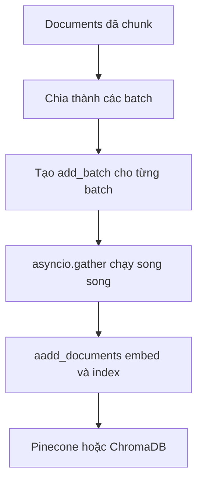

# 🚀 Batch Indexing: Đưa tài liệu vào Vector Store theo lô

> Nguồn: `059-Batch-Indexing.txt` · [Udemy](https://ua.udemy.com/course/langchain/learn/lecture/51360037)

Sau khi đã chia nhỏ toàn bộ tài liệu LangChain ở bài trước, chúng ta sẽ bước sang giai đoạn **vector storage (lưu trữ vector)**. Đây là lúc các chunk được embed và đánh index vào vector store — nhưng thay vì đẩy từng tài liệu một, mình sẽ chỉ cho các bạn cách **batch indexing (đánh index theo lô)** để chạy nhanh hơn gấp nhiều lần.

### ⚙️ Viết coroutine index_documents_async

Mình tạo một coroutine tên là **`index_documents_async`**, nhận vào hai thứ:

* **`documents`** — danh sách các LangChain documents.
* **`batch_size`** — số nguyên quy định kích thước mỗi lô.

Coroutine này log ra thông báo "đây là giai đoạn vector storage" kèm số lượng tài liệu sắp được đánh index. Sau đó nó tạo biến **`batches`** — một danh sách chứa các danh sách con — bằng cách **chia nhỏ danh sách documents theo batch_size**, rồi log xem tổng cộng có bao nhiêu batch.

Bên trong, mình viết thêm một coroutine con tên là **`add_batch`**, nhận vào **một batch** và **số thứ tự batch**. Số thứ tự này phục vụ cho việc logging: nếu một batch thất bại, mình sẽ biết chính xác batch nào hỏng và vì lý do gì — có thể là do chứa tài liệu không hợp lệ, hoặc bất kỳ nguyên nhân nào khác.

Trong `add_batch`, mình gọi method **`aadd_documents`** của vector store (ở đây mình dùng **Pinecone**). Method này được LangChain triển khai sẵn: nó nhận toàn bộ documents, dùng **embeddings model** để biến từng tài liệu thành vector, rồi đánh index vào vector store. Nếu thành công, hàm log success và trả về `True`; nếu gặp exception, hàm log lỗi và trả về `False`.

---

### 🏃 Xử lý song song với asyncio.gather

Điểm hay nhất ở đây là các batch được xử lý **đồng thời (concurrently)**. Mình tạo biến **`tasks`**, dùng `enumerate` đi qua danh sách batches để lấy cả batch lẫn số thứ tự, và tạo ra một coroutine `add_batch` cho từng batch. Lúc này `tasks` nắm giữ danh sách các coroutine cần chạy.

Tiếp đó, chỉ cần gọi **`asyncio.gather(tasks)`** và `await` nó — tất cả coroutine sẽ được kích hoạt cùng lúc, chạy độc lập và đánh index toàn bộ tài liệu vào vector store. Cách này **tối ưu đáng kể thời gian chạy (runtime)**.

Biến **`results`** sẽ giữ danh sách các giá trị boolean — hy vọng tất cả đều là `True`. Mình đếm số batch thành công và so sánh với tổng số batch: khớp thì log success, lệch thì log warning.

Ở hàm `main`, mình gọi `await index_documents_async(...)` với toàn bộ documents đã split, **batch size = 500**.

**Lưu ý quan trọng:** batch size không phải con số thần kỳ và cần điều chỉnh tùy vector store. Các bạn phải tìm **"điểm ngọt" (sweet spot)** — đủ lớn để nhanh, nhưng không quá lớn để tránh bị **rate limit (giới hạn tốc độ)**:

* **Embeddings model** là giới hạn chính, với **tokens per minute** hoặc **tokens per second** mà bạn không nên vượt qua.
* **Vector store** trên cloud cũng có giới hạn xử lý mỗi phút/giây, nhưng thường ít khi chạm tới.

Cuối cùng, mình thêm loạt log thống kê sau khi pipeline hoàn tất: **đã scrape bao nhiêu tài liệu, bao nhiêu URL, và bao nhiêu chunk đã được index**.

---

### 👀 Nhìn dữ liệu "chảy" vào Pinecone theo thời gian thực

Mình chạy toàn bộ code và mở luôn dashboard Pinecone để xem trực tiếp. Ban đầu vector store trống trơn. Sau khi lấy tài liệu (chạy qua **TavilyMap** và **TavilyExtract** thủ công — chính là code trong video optional), chunking xong thì các batch bắt đầu được index. Refresh vài lần, mình thấy các vector đã vào: **content, source, vector ID**, và đặc biệt là **văn bản gốc (original text)**.

Vì sao phải lưu cả text gốc? Vì **hàm embeddings không có hàm nghịch đảo**: không có cách nào đi ngược từ vector về văn bản mà nó đại diện. Nhớ lại kiến thức toán đại học một chút — embeddings là **hàm một chiều (one-way function)**. Lưu text gốc cũng có nghĩa khi truy vấn, chúng ta nhận về cả **văn bản** chứ không chỉ vector. Đây là điểm cực kỳ quan trọng!

Kết quả: **6506 documents** được index, và số này phải khớp với con số hiển thị trong Pinecone. Nếu lệch, khả năng cao là một vài batch đã thất bại, hoặc bạn cần đợi thêm vài giây để Pinecone đồng bộ xong.

---

### ⚠️ "Phá" cấu hình một chút: rate limit và ChromaDB

Mình có một thí nghiệm nhỏ muốn cho các bạn thấy. Nhớ cơ chế **retry (thử lại)** với tham số `retry_min_seconds` mà mình từng nhắc chứ? Mình xóa các tham số đó khỏi embeddings object của LangChain rồi chạy lại với toàn bộ tài liệu. Kết quả: lỗi **429 — rate limit error** từ `text-embedding-3-small`, kèm số thứ tự batch bị lỗi. Điểm hay là mỗi error code đều cho biết phải chờ thêm bao lâu. Vì khi không cấu hình, cơ chế retry mặc định có giá trị thấp hơn, nên dễ bị chặn.

Sau đó mình đổi sang **ChromaDB**: chỉ cần đổi tên biến thành `vector_store`, mọi thứ chạy y hệt. Chương trình tự tạo thư mục **`chroma_db`** và dữ liệu được lưu **bền vững (persistent)** ở đó — Chroma dùng cả **SQLite DB** bên dưới. Dù vẫn bị rate limit do chưa chờ đủ thời gian giữa hai lần chạy, phần dữ liệu vẫn được index đầy đủ vào ChromaDB.

| Tiêu chí | Pinecone | ChromaDB |
|---|---|---|
| Nơi lưu dữ liệu | Cloud managed | Thư mục `chroma_db` cục bộ |
| Bền vững | Có | Có, nhờ SQLite DB bên dưới |
| Thay đổi code | Index tên `langchain-docs-2025` | Chỉ đổi tên biến thành `vector_store` |

Một thông tin nho nhỏ: toàn bộ video trong section này đều là bài mới. Ở phần này mình dùng index Pinecone tên **`langchain-docs-2025`**, còn các video sau sẽ dùng index khác nhé.

### 🎯 Tự kiểm tra nhanh

**Câu 1:** Vì sao batch indexing nhanh hơn đẩy từng tài liệu một?

<b>Xem đáp án</b>

**Đáp án:** Các batch được xử lý đồng thời nhờ `asyncio.gather`.

Giải thích: Nhiều coroutine `add_batch` chạy song song, tối ưu đáng kể runtime.

Tham chiếu: Mục Xử lý song song.

**Câu 2:** Batch number dùng để làm gì?

<b>Xem đáp án</b>

**Đáp án:** Để biết chính xác batch nào thất bại và vì lý do gì khi logging.

Giải thích: Một batch có thể hỏng do tài liệu không hợp lệ hoặc nguyên nhân khác.

Tham chiếu: Mục Viết coroutine index_documents_async.

**Câu 3:** Vì sao phải lưu cả văn bản gốc bên cạnh vector?

<b>Xem đáp án</b>

**Đáp án:** Vì embeddings là **hàm một chiều** — không có hàm nghịch đảo từ vector về văn bản.

Giải thích: Khi truy vấn, ta cần nhận lại text chứ không chỉ vector.

Tham chiếu: Mục Nhìn dữ liệu chảy vào Pinecone.

**Câu 4:** Batch size có phải con số cố định không?

<b>Xem đáp án</b>

**Đáp án:** Không — cần tìm "điểm ngọt" tùy vector store và embeddings model.

Giải thích: Quá lớn dễ chạm rate limit tokens per minute/giây; giới hạn chính là embeddings model.

Tham chiếu: Mục Xử lý song song.

**Câu 5:** Khi bỏ tham số retry, lỗi gì xuất hiện và vì sao?

<b>Xem đáp án</b>

**Đáp án:** Lỗi **429 — rate limit** từ `text-embedding-3-small`.

Giải thích: Retry mặc định có giá trị thấp hơn nên dễ bị chặn; mỗi error code cho biết cần chờ bao lâu.

Tham chiếu: Mục "Phá" cấu hình một chút.

Rất vui vì các bạn đã đồng hành hết **ingestion pipeline**! Bước tiếp theo là **retrieval (truy hồi)** — nơi câu chuyện RAG thực sự bắt đầu. Hẹn gặp lại! 🚀

## Nguồn tham khảo

- [Udemy — Batch Indexing](https://ua.udemy.com/course/langchain/learn/lecture/51360037)
- [Python Docs — Coroutines and Tasks, asyncio.gather](https://docs.python.org/3/library/asyncio-task.html#asyncio.gather)
- [LangChain Docs — Pinecone integration](https://docs.langchain.com/oss/python/integrations/vectorstores/pinecone)
