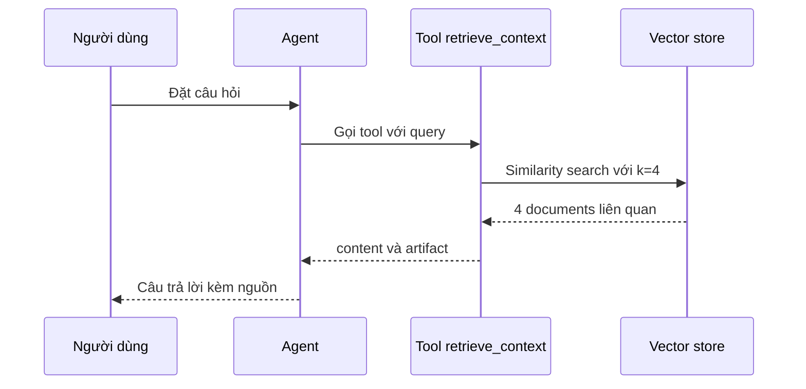

# 🔍 Retrieval Agent: Chắp cánh cho Documentation Helper

> Nguồn: `060-Retrieval-Agent-Implementation.txt` · [Udemy](https://ua.udemy.com/course/langchain/learn/lecture/54055321)

Chào các bạn, lại là Eden đây! Sau khi đã có dữ liệu nằm gọn trong vector store, hôm nay chúng ta sẽ **implement phần retrieval (truy hồi)** — linh hồn của toàn bộ RAG pipeline. Mình sẽ xây dựng một **retrieval agent**: một agent được trang bị đúng một công cụ truy hồi tài liệu, và tự quyết định khi nào cần dùng nó.

Cả pipeline sẽ nằm gọn trong `backend/core.py` với một package backend chỉn chu. Bắt tay vào code thôi!

### 📦 Chuẩn bị package và các import

Đầu tiên, trong thư mục `backend`, mình tạo file **`__init__.py`** để biến nó thành một **package**, rồi tạo file **`core.py`** — nơi triển khai phần retrieval.

Các import cần thiết:

* **`os`** — xử lý environment variables.
* **`Any`, `Dict`** từ `typing` — type hints cho khai báo hàm.
* **`load_dotenv`** — nạp environment variables (chúng ta đã gặp ở các phần trước).
* **`create_agent`** — hàm tạo agent như đã học.
* **`init_chat_model`** — "nhân vật mới" cực kỳ tiện lợi, giúp khởi tạo nhanh một chat client để gọi LLM. Hàm tổng quát này nhận vào một **chuỗi (string)** và trả về đúng **chat model** tương ứng.
* **`ToolMessage`** — vì toàn bộ pipeline retrieval sẽ được đánh dấu là kết quả của một **tool message** (loại message chứa kết quả thực thi công cụ).
* **`tool`** — decorator để tạo công cụ truy hồi.
* **`PineconeVectorStore`** — vector store cho retrieval (các bạn có thể dùng **Chroma** nếu muốn).
* Và tất nhiên không thể thiếu **embeddings model**, vì ta cần embed câu query thành vector trước khi tìm ngữ cảnh liên quan.

---

### ⚙️ Khởi tạo embeddings, vector store và chat model

Nạp environment variables xong, mình khởi tạo **embeddings model** với **`text-embedding-3-small`**. Nhớ kỹ nguyên tắc quan trọng: embedding model phải **trùng khớp** với kích thước vector mà bạn đã dùng khi khởi tạo vector store trên Pinecone — hãy luôn dùng cùng một embedding model.

Tiếp theo, mình khởi tạo vector store với **tên index** là **`langchain-docs-2026`** (video này mình quay lại, nên index đổi tên), và truyền vào một **embeddings object** để Pinecone biết cách embed văn bản.

Rồi đến phần thú vị nhất — khởi tạo chat model bằng **`init_chat_model`**. Dễ đến bất ngờ: mình chỉ cần khai báo **model provider là OpenAI** và chọn **GPT-5.2**. Trong phần implementation của hàm có liệt kê sẵn toàn bộ các chuỗi hỗ trợ — không phải mọi model đều được hỗ trợ, nhưng các model chính đều có mặt. Muốn đổi sang **Gemini**, các bạn chỉ cần thay chuỗi sang **Google GenAI** và ghi đúng phiên bản Gemini mong muốn.

---

### 🔧 Tool retrieve_context: similarity search với k=4 và content_and_artifact

Giờ đến trái tim của bài học. Mình định nghĩa hàm **`retrieve_context`**, nhận vào **query** — chính là câu hỏi của người dùng — và trang bị cho nó decorator **`@tool`**.

Mình đặt **`response_format = "content_and_artifact"`**. Đây là chi tiết đáng chú ý: response format có thể là `content` (mặc định — tool chỉ trả về **một** giá trị) hoặc `content_and_artifact` (tool trả về **hai** giá trị). Lựa chọn thứ hai cho phép chúng ta đính kèm thêm thông tin phục vụ **downstream application (ứng dụng phía sau)** mà **không gửi cho LLM**. *Nghe hơi khó hiểu, nhưng cứ tin mình — khi vào chế độ debug, các bạn sẽ thấy khác biệt ngay!*

| Response format | Giá trị trả về | Gửi tới LLM | Mục đích |
|---|---|---|---|
| `content` | 1 giá trị | Toàn bộ | Tool đơn giản, mặc định |
| `content_and_artifact` | 2 giá trị | Chỉ phần `content` | Artifact giữ ở application để render/debug |

Mô tả (description) của tool như sau:

> "Retrieve relevant documentation to help answer user queries about LangChain"

Mô tả này giúp agent quyết định **có nên dùng tool hay không**. Chú ý là mình không hề nhắc tới giá trị trả về, vì chúng được suy ra từ `content_and_artifact`.

Phần thân hàm diễn ra đúng theo luồng retrieval kinh điển:

1. Lấy **vector store**, gọi **`as_retriever()`** (như đã làm ở section trước).
2. Gọi **`invoke()`** — với retriever, method này thực hiện **similarity search (tìm kiếm tương đồng)**. Ta truyền vào **query string** để embed, kèm tham số **`k=4`** quy định tối đa **4 tài liệu** trả về.
3. **Serialize** kết quả: lặp qua từng document, lấy **content** và **source**, ghép thành một **chuỗi lớn** để gắn vào prompt — đây chính là **prompt augmentation (tăng cường prompt)**.
4. Trả về **hai giá trị**: chuỗi đã serialize (phần **content** — sẽ đi tới LLM) và danh sách documents gốc dạng LangChain Document (phần **artifact** — **chỉ ở lại trong application**, không gửi cho LLM, nhưng hiển thị đầy đủ trong trace khi debug).



Vì sao phải tách hai phần như vậy? Vì nếu chỉ trả về chuỗi văn bản, mình sẽ **không còn document object** để thao tác ở tầng ứng dụng nữa. Giữ lại artifact giúp ta có một **object Python "chuẩn bài"** để xử lý tiếp.

---

### 🤖 Agent run_llm: system prompt chống ảo giác và trả về context

Cuối cùng, mình viết hàm wrapper **`run_llm`** — nhận vào **query** và trả về **dictionary** gồm:

* **`answer`** — câu trả lời do LLM sinh ra.
* **`context`** — danh sách documents đã retrieve (lấy từ `retrieved_docs`).

Hàm này khởi tạo agent với **một retrieval tool** và một **system prompt** như sau:

> "You are a helpful AI assistant that answers questions about LangChain documentation. You have access to a tool that retrieves relevant documentation. Use the tool to find relevant information before answering questions. Always cite the sources you use in your answers. If you cannot find the answer in the retrieved documentation, say so."

Câu cuối **cực kỳ quan trọng**: nếu Documentation Helper không tìm thấy câu trả lời, chúng ta **không muốn nó bịa ra (hallucinate)**.

Mình gọi **`create_agent`** với model, tools là `retrieve_context` và system prompt trên — như đã nhắc, hàm này chạy **LangGraph "under the hood"**. Sau đó, chỉ cần **build message list** với role `user` và content là câu query, rồi **invoke graph** bằng dictionary có key **`messages`**.

Vì agent chạy nhiều **tool call** và sinh ra nhiều **tool message** nằm trong trace, mình lấy **message cuối cùng** trong lịch sử để truy cập nội dung trả lời.

Bước kế tiếp là "món quà" cho người dùng: **trả về cả những tài liệu đã giúp agent trả lời**. Tính năng **hiển thị nguồn (citations)** tạo dựng **niềm tin** với người dùng khi họ có thể bấm thẳng vào link gốc — một phần cực kỳ quan trọng của **agentic user experience**.

Cách lấy documents từ artifact: mình khởi tạo một **list rỗng**, lặp qua toàn bộ messages, tìm những message có **type là `ToolMessage`** và **có attribute `artifact`** không rỗng — dấu hiệu của kết quả thực thi tool. Khi tìm thấy, mình **append toàn bộ list** trong artifact vào kết quả (vì giá trị của artifact là một list).

Khép lại hàm bằng việc trả về **answer** và **context** — danh sách documents lấy từ artifact. Cuối cùng, mình tạo ví dụ chạy thử trong **`if __name__ == '__main__':`** với câu hỏi **"what are deep agents?"** và in kết quả ra, sẵn sàng cho màn debug.

---

### 💻 Code mẫu đầy đủ — `backend/core.py`

Toàn bộ code của bài nằm trong file `backend/core.py` (tham khảo từ repo chính thức của khóa học):

```python
import os
from typing import Any, Dict

from dotenv import load_dotenv
from langchain.agents import create_agent
from langchain.chat_models import init_chat_model
from langchain.messages import ToolMessage
from langchain.tools import tool
from langchain_pinecone import PineconeVectorStore
from langchain_openai import OpenAIEmbeddings

load_dotenv()

# Initialize embeddings (same as ingestion.py)
embeddings = OpenAIEmbeddings(model="text-embedding-3-small")

#Initialize vector store
vectorstore = PineconeVectorStore(
    index_name="langchain-docs-2026", embedding=embeddings
)
# Initialize chat model
model = init_chat_model("gpt-5.2", model_provider="openai")


@tool(response_format="content_and_artifact")
def retrieve_context(query: str):
    """Retrieve relevant documentation to help answer user queries about LangChain."""
    # Retrieve top 4 most similar documents
    retrieved_docs = vectorstore.as_retriever().invoke(query, k=4)

    # Serialize documents for the model
    serialized = "\n\n".join(
        (f"Source: {doc.metadata.get('source', 'Unknown')}\n\nContent: {doc.page_content}")
        for doc in retrieved_docs
    )

    # Return both serialized content and raw documents
    return serialized, retrieved_docs


def run_llm(query: str) -> Dict[str, Any]:
    """
    Run the RAG pipeline to answer a query using retrieved documentation.

    Args:
        query: The user's question

    Returns:
        Dictionary containing:
            - answer: The generated answer
            - context: List of retrieved documents
    """
    # Create the agent with retrieval tool
    system_prompt = (
        "You are a helpful AI assistant that answers questions about LangChain documentation. "
        "You have access to a tool that retrieves relevant documentation. "
        "Use the tool to find relevant information before answering questions. "
        "Always cite the sources you use in your answers. "
        "If you cannot find the answer in the retrieved documentation, say so."
    )

    agent = create_agent(model, tools=[retrieve_context], system_prompt=system_prompt)

    # Build messages list
    messages = [{"role": "user", "content": query}]

    # Invoke the agent
    response = agent.invoke({"messages": messages})

    # Extract the answer from the last AI message
    answer = response["messages"][-1].content

    # Extract context documents from ToolMessage artifacts
    context_docs = []
    for message in response["messages"]:
        # Check if this is a ToolMessage with artifact
        if isinstance(message, ToolMessage) and hasattr(message, "artifact"):
            # The artifact should contain the list of Document objects
            if isinstance(message.artifact, list):
                context_docs.extend(message.artifact)

    return {
        "answer": answer,
        "context": context_docs
    }

if __name__ == '__main__':
    result = run_llm(query="what are deep agents?")
    print(result)
```

### 🎯 Tự kiểm tra nhanh

**Câu 1:** Vì sao embedding model khi retrieval phải trùng với lúc indexing?

<details>
<summary><b>Xem đáp án</b></summary>

**Đáp án:** Vì kích thước vector phải khớp với vector store đã khởi tạo trên Pinecone.

Giải thích: Luôn dùng cùng một embedding model — ở đây là `text-embedding-3-small`.

Tham chiếu: Mục Khởi tạo embeddings.

</details>

**Câu 2:** `init_chat_model` có gì tiện lợi?

<details>
<summary><b>Xem đáp án</b></summary>

**Đáp án:** Nhận vào một chuỗi và trả về đúng chat model tương ứng.

Giải thích: Chỉ cần khai báo provider OpenAI và model mong muốn; đổi sang Gemini chỉ cần đổi chuỗi.

Tham chiếu: Mục Khởi tạo chat model.

</details>

**Câu 3:** Tham số `k=4` trong retriever nghĩa là gì?

<details>
<summary><b>Xem đáp án</b></summary>

**Đáp án:** Trả về tối đa 4 tài liệu liên quan nhất từ similarity search.

Giải thích: `invoke()` trên retriever thực hiện similarity search với query string.

Tham chiếu: Mục Tool retrieve_context.

</details>

**Câu 4:** Vì sao cần tách content và artifact thay vì chỉ trả chuỗi văn bản?

<details>
<summary><b>Xem đáp án</b></summary>

**Đáp án:** Để giữ **document object** cho tầng ứng dụng xử lý tiếp, không gửi cho LLM.

Giải thích: Artifact là object Python "chuẩn bài" phục vụ render/debug; content mới đi tới LLM.

Tham chiếu: Mục Tool retrieve_context.

</details>

**Câu 5:** Câu cuối trong system prompt có vai trò gì?

<details>
<summary><b>Xem đáp án</b></summary>

**Đáp án:** Yêu cầu agent nói thẳng nếu không tìm thấy câu trả lời — chống hallucination.

Giải thích: "If you cannot find the answer..., say so" là lá chắn quan trọng của Documentation Helper.

Tham chiếu: Mục Agent run_llm.

</details>

*Đừng lo nếu phần artifact còn hơi trừu tượng — sang bài sau, mình sẽ debug từng bước và mọi thứ sẽ sáng tỏ ngay!* Hẹn gặp các bạn ở màn chạy thực tế! 🚀

## Nguồn tham khảo

- [Udemy — Retrieval Agent Implementation](https://ua.udemy.com/course/langchain/learn/lecture/54055321)
- [LangChain Docs — Agents, create_agent](https://docs.langchain.com/oss/python/langchain/agents)
- [LangChain Reference — init_chat_model](https://reference.langchain.com/python/langchain/chat_models/init_chat_model)
