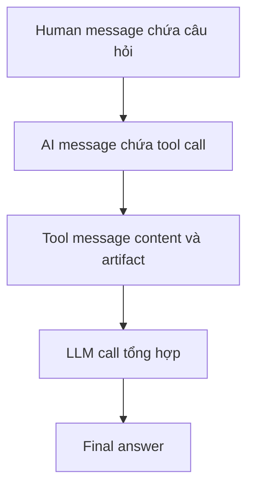

# 🐞 Chạy, Debug và Trace RAG Agent: Mổ xẻ từng message trong LangSmith

> Nguồn: `061-Run-Debug-Trace-RAG-Agent.txt` · [Udemy](https://ua.udemy.com/course/langchain/learn/lecture/54055323)

Code đã sẵn sàng, giờ là lúc chạy thử và "soi" xem bên trong agent thực sự diễn ra điều gì. Đây là bài học mình yêu thích nhất của cả section, vì chúng ta sẽ **debug từng bước** để thấy rõ dòng chảy của dữ liệu — từ câu hỏi của người dùng đến câu trả lời cuối cùng.

Chuẩn bị tinh thần nhé, chúng ta sẽ lật tung "nắp capo" của RAG agent!

### 📬 Kết quả chạy: answer và context

Kết quả trả về gồm hai phần rõ ràng:

* **`answer`** — câu trả lời của agent.
* **`context`** — danh sách các documents đã retrieve, hiển thị kèm **ID**, **source** và metadata. Đây chính là những tài liệu đã giúp tạo nên câu trả lời.

### 🔍 Debug: response object chứa những gì?

Mình đặt **breakpoint** ngay sau khi agent được invoke và chạy ở **debug mode**. Biến **`response`** nắm giữ toàn bộ thông tin cần thiết — một **danh sách messages** theo đúng trình tự:

1. **Human message** — câu hỏi đầu vào *"What are deep agents?"*. LangChain tự động chuyển chuỗi thành **human message object** cho chúng ta.
2. **AI message** — chứa **tool call** muốn gọi **`retrieve_context`**, kèm query gửi đi và cả ID.
3. **Tool message** — kết quả sau khi LangChain thực thi tool call.

Vì dùng **`content_and_artifact`**, tool message trả về **hai giá trị**:

* **`content`** — chuỗi đã serialize: bắt đầu bằng **source**, tiếp đến danh sách nguồn, rồi đến nội dung các trang. Đây là phần **được gửi tới LLM**.
* **`artifact`** — danh sách các **Document object** (ví dụ trang nội dung về deep agents). Phần này **hoàn toàn không gửi tới LLM**.

Vì sao không gửi artifact? Vì chúng ta đã có đủ nguồn và nội dung trong `content` rồi — gửi thêm chỉ **làm nhiễu context (pollute the context)**. Nhưng ở tầng ứng dụng, artifact lại cực kỳ quý giá: đây là **object Python** để lát nữa ta render đẹp mắt trên frontend. Nói cách khác: **một phần dành cho LLM, một phần để dành cho application.**

---

### 🧭 LangSmith trace: câu chuyện được kể lại rõ ràng

Mở **LangSmith**, bức tranh trở nên dễ đọc hơn hẳn:

* Trace chạy **under LangGraph** — vì `create_agent` thực chất tạo ra một **LangGraph graph**.
* Đầu tiên là human input *"What are deep agents?"*, tiếp đó là **system message**, rồi đến **model**.
* Model quyết định gọi tool, và đây là điểm thú vị: nó **diễn giải lại câu hỏi** thành query *"LangChain's deep agent's definition"* — tìm bằng "deep agent definition" thay vì nguyên văn câu hỏi. Một hành vi rất đáng học hỏi!
* Sau đó LangChain chạy **retrieve_context**: ta thấy rõ **retriever** được dùng, các tài liệu liên quan được tìm thấy, kèm **document content** và **source** đã được lưu hợp lệ từ bước indexing.
* Cuối cùng là **LLM call** tổng hợp: prompt gốc + lịch sử dùng tool + kết quả thực thi → sinh ra câu trả lời cuối.

À, và các bạn có thể bấm xem **LangGraph state under the hood** ngay trong trace. *Chưa học LangGraph cũng đừng lo — khóa học sẽ đề cập ở phần sau!*

Một chi tiết đáng chú ý về kỹ thuật: trong tài liệu **LangChain RAG agent**, họ dùng **vector store trực tiếp với raw similarity search**. Mình chọn **`as_retriever`** bởi vì nó **hiển thị đẹp và rõ ràng hơn nhiều trong LangSmith trace** — nếu dùng similarity search thuần, trace sẽ không được đánh index đẹp như vậy. *Các bạn cứ thử cả hai để tự mình kiểm chứng nhé!*

| Cách tiếp cận | Trace trên LangSmith | Ai dùng |
|---|---|---|
| `as_retriever` | Được đánh index đẹp, rõ ràng | Mình chọn trong bài này |
| Raw similarity search | Trace không đẹp bằng | Tài liệu LangChain RAG agent |

---

### 📝 Kết quả và commit

Câu trả lời in ra:

> Deep agent is a term LangChain coined for agents that can handle a complex open-ended tasks over longer time horizons.

Đây cũng là chủ đề **blog về deep agents** mà chúng ta sẽ bàn sâu hơn trong khóa học. Sau đó, mình commit với message **"updated retrieval to latest LangChain code"** và push lên repo. Toàn bộ code của bài này nằm ở branch **`2-retrieval-qa-finish`**, file **`backend/core.py`** — các bạn có thể vào xem lại bất cứ lúc nào.

### 🎯 Tự kiểm tra nhanh

**Câu 1:** `response` object sau khi invoke agent chứa gì?

<b>Xem đáp án</b>

**Đáp án:** Danh sách messages theo đúng trình tự: human, AI, tool.

Giải thích: Human message được LangChain tự chuyển từ chuỗi câu hỏi.

Tham chiếu: Mục Debug.

**Câu 2:** Artifact khác content ở điểm nào?

<b>Xem đáp án</b>

**Đáp án:** Content gửi tới LLM; artifact là Document object chỉ ở lại application.

Giải thích: Gửi artifact cho LLM chỉ làm nhiễu context, nhưng ở tầng app nó để render đẹp.

Tham chiếu: Mục Debug.

**Câu 3:** Model đã làm gì đáng chú ý với câu hỏi trước khi retrieve?

<b>Xem đáp án</b>

**Đáp án:** Diễn giải lại *"What are deep agents?"* thành query *"LangChain's deep agent's definition"*.

Giải thích: Tìm bằng "deep agent definition" thay vì nguyên văn câu hỏi — hành vi rất đáng học hỏi.

Tham chiếu: Mục LangSmith trace.

**Câu 4:** Vì sao trace chạy "under LangGraph"?

<b>Xem đáp án</b>

**Đáp án:** Vì `create_agent` thực chất tạo ra một LangGraph graph.

Giải thích: Có thể bấm xem LangGraph state ngay trong trace.

Tham chiếu: Mục LangSmith trace.

**Câu 5:** Vì sao mình chọn `as_retriever` thay vì similarity search trực tiếp?

<b>Xem đáp án</b>

**Đáp án:** Để trace hiển thị đẹp và rõ ràng hơn trong LangSmith.

Giải thích: Similarity search thuần không được đánh index đẹp như vậy trong trace.

Tham chiếu: Mục LangSmith trace.

Vậy là RAG agent của chúng ta đã chạy trơn tru và có thể trace được từng bước! Bài tiếp theo, mình sẽ dựng một **giao diện người dùng** để chúng ta thoải mái test và QA pipeline này. Hẹn gặp lại! 🚀

## Nguồn tham khảo

- [Udemy — Run, Debug, Trace RAG Agent](https://ua.udemy.com/course/langchain/learn/lecture/54055323)
- [LangSmith Docs — Trace LangChain applications](https://docs.langchain.com/langsmith/trace-with-langchain)
- [LangChain Docs — Retrieval overview](https://docs.langchain.com/oss/python/langchain/retrieval)
