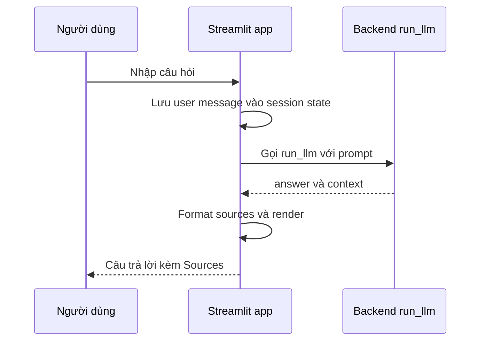

# 🖥️ Frontend với Streamlit: Giao diện "chớp nhoáng" cho RAG Agent

> Nguồn: `062-Frontend-with-Streamlit-UI.txt` · [Udemy](https://ua.udemy.com/course/langchain/learn/lecture/37610242)

Chào các bạn, Eden đây! RAG agent đã chạy ngon lành, nhưng hiện tại chúng ta vẫn phải gọi nó qua code. Hôm nay, mình và các bạn sẽ dựng một **giao diện người dùng đơn giản** để **test và QA trực quan** toàn bộ pipeline — và tất cả chỉ với **Python**, không cần một dòng JavaScript nào.

Công cụ chúng ta dùng là **Streamlit** — một package mã nguồn mở cực kỳ phổ biến, giúp tạo giao diện người dùng trực quan và đơn giản bằng Python. Kết quả sẽ giống hệt những chat app mà các bạn thấy trong phần **playground** của Streamlit.

### 🎨 Streamlit là gì và khi nào nên dùng?

Streamlit khởi đầu là công cụ để **các nhà khoa học dữ liệu trực quan hóa dữ liệu** — vẽ biểu đồ từ dữ liệu chỉ với vài dòng Python, cực kỳ trực quan. Và các bạn thấy đấy, để dựng một chat application tương tự playground, chúng ta cũng chỉ cần vài dòng code.

**Một disclaimer quan trọng:** Streamlit **không dành cho production**. Mình không khuyến khích dùng nó nếu bạn muốn **expose (công khai)** một chat application thực tế. Cho mục đích đó, mình sẽ làm một video riêng về **generative UI** với **TypeScript và Next.js**.

| Tiêu chí | Streamlit | Generative UI production |
|---|---|---|
| Ngôn ngữ | Python thuần | TypeScript, Next.js |
| Mục đích | Prototype, test và QA | Expose cho người dùng thật |
| Trạng thái agent | Không phản ánh | Hiển thị agent đang làm gì |

---

### 🔗 Helper function _format_sources và khởi động app

Mình tạo file **`main.py`** và bắt đầu với hai import:

* **`streamlit as st`** — object ứng dụng Streamlit chính.
* **`run_llm`** từ **`backend.core`** — hàm chúng ta đã viết ở bài trước.

Đầu tiên là helper function **`_format_sources`**, nhận vào **`context_docs`** (danh sách LangChain documents) và trả về **danh sách URL**. Mục đích: hiển thị đẹp mắt nguồn mà câu trả lời được "neo" vào (grounded), theo từng response.

Cách hoạt động: lặp qua các `context_docs`, kiểm tra xem document có **metadata** không (vì ta đã thêm metadata khi indexing), rồi **trích xuất URL (source)** từ metadata. Nếu không có source, ghi **"Unknown"**. Cuối cùng ép mọi thứ về **string** — đây là một chút **defensive programming (lập trình phòng thủ)** cho chắc chắn.

Sang phần Streamlit: mình gọi **`st.set_page_config`** để cấu hình các thiết lập cơ bản như **page title** và **layout**. Rồi mở terminal chạy `pipenv run streamlit run main.py` — lệnh này khởi động ứng dụng Streamlit với file `main.py` làm nguồn. Mọi thứ chạy trong **pipenv** — môi trường ảo chúng ta đã tạo. Nếu dùng **uv**, cách làm tương tự: vào virtual environment và chạy `streamlit run main.py`.

Một browser nhỏ bật lên cùng ứng dụng trống trơn. Bấm **Ctrl+L**, các bạn sẽ thấy tiêu đề trang **"LangChain Documentation Helper"** — đến từ `set_page_config`. Giờ mình thêm **`st.title`** với đúng tiêu đề đó. Refresh và... tiêu đề xuất hiện! Một điểm hay: app đang chạy ở **debug mode mặc định**, nên mình **không cần dừng rồi chạy lại** mỗi khi sửa code.

---

### 🗂️ Sidebar, session state và nút "Clear chat"

Mình tạo **sidebar** bằng **context manager `st.sidebar`** — mọi thứ thụt lề bên trong đều thuộc sidebar. Trong đó có **`st.subheader`** hiển thị chữ "Session".

Việc đầu tiên cần làm: một nút **"Clear chat"** để reset cuộc trò chuyện, giúp debug dễ dàng. Mình dùng `st.button` với **`use_container_width=True`** để nút rộng bằng container (chính là sidebar). Hàm này trả về **boolean** cho biết nút có được bấm ở lần chạy gần nhất hay không.

Giờ đến khái niệm then chốt: **session state**. Khi khởi động một Streamlit app, bạn có sẵn một **dictionary** để lưu **kết quả trung gian** và **dữ liệu từ các tương tác trước đó**. Toàn bộ tin nhắn qua lại giữa người dùng và LLM sẽ được lưu tại đây. Vậy nên khi ai đó bấm "Clear chat", mình chỉ cần:

1. Truy cập **`session_state`** — thực chất là một dictionary.
2. Dùng method **`.pop()`** để xóa key **`"messages"`**.
3. **Rerun** ứng dụng để bắt đầu lại từ trang giấy trắng.

*Nghe thì đơn giản, nhưng đây chính là "trái tim" giữ cho cuộc hội thoại không biến mất đấy!*

---

### 💬 Hiển thị tin nhắn và sources

Khi app vừa khởi động, chưa có message nào. Mình thêm một **message chào mừng** vào key `messages` của session state với:

* **role**: `assistant`
* **content**: *"Ask me anything about LangChain docs. I'll retrieve relevant context and cite sources."*
* **sources**: danh sách rỗng

Sau đó, lặp qua toàn bộ messages trong session state và hiển thị bằng **`st.chat_message`**. Container này nhận **name** có thể là `user`, `assistant`, `ai`, `human` hoặc một string bất kỳ — mỗi role sẽ có **theme và avatar riêng** (assistant sẽ hiện avatar robot).

Với mỗi message, mình in nội dung bằng **Markdown**. Với **sources**, mình dùng **`st.expander`** — container có thể **mở/đóng (expand/collapse)** — đặt tiêu đề "Sources" rồi in từng link dạng danh sách Markdown (dấu gạch đầu dòng `-` sẽ render thành list item). Thử đổi role sang `user` và các bạn sẽ thấy avatar đổi ngay lập tức.

---

### ⌨️ Nhận câu hỏi và gọi RAG agent

Cuối cùng, mình tạo ô nhập liệu với **`st.chat_input`**, placeholder *"Ask a question about LangChain."*. Khi người dùng submit, nội dung được lưu vào biến **`prompt`**. Mình xử lý theo trình tự:

1. Nếu có `prompt`: **append** tin nhắn của người dùng vào session state để lưu lịch sử.
2. Hiển thị ngay tin nhắn đó bằng `st.chat_message` (role `user`) dạng Markdown.
3. Tạo khối **assistant message** để chứa câu trả lời của agent.



Vì RAG agent có thể thất bại, mình bọc trong **try/except**: dùng **`st.error`** và **`st.exception`** để hiển thị lỗi — *mục tiêu là app không bao giờ "sập" trước mặt người dùng*. Trong lúc chờ, một **`st.spinner`** hiện dòng chữ *"Retrieving docs and generating answer."* báo hiệu hệ thống đang làm việc.

Sau khi `run_llm` trả về:

* Lấy **`answer`**; nếu vì lý do nào đó không có, hiển thị **"No answer returned."**
* Gọi **`_format_sources`** với key **`context`** để có danh sách URL đã grounding câu trả lời.
* Hiển thị answer, rồi đến expander **Sources**.

Thử nghiệm thực tế:

* Hỏi *"Hello"* — không có tài liệu nào vì câu hỏi chẳng liên quan gì đến LangChain.
* Hỏi *"What are deep agents?"* — mất thời gian lâu hơn một chút, nhưng ta có câu trả lời kèm đầy đủ sources. Có một **source bị lặp** — chuyện này thỉnh thoảng vẫn xảy ra, không phải vấn đề nghiêm trọng, và có thể xử lý bằng **set object** trong Python sau này.

---

### 🐛 Một bug nhỏ "đáng yêu" và cách sửa

Gửi thêm một message, các bạn sẽ thấy **câu trả lời cũ biến mất**. Nguyên nhân: mình **quên lưu** nó vào session state! Cách sửa rất đơn giản — append message mới với **role `assistant`**, **content** là answer, và **source** là danh sách đã format.

Sau khi thêm, lịch sử hội thoại được giữ nguyên qua nhiều lượt, và nút **Clear chat** cũng hoạt động: mọi thứ quay về trạng thái ban đầu.

Toàn bộ code nằm ở branch **`3-frontend-finish`** (mình chạy `git add main`, commit với message **"added frontend"** rồi push). Các bạn có thể vào repo, chọn branch và xem file **`main.py`**.

---

### 💻 Code mẫu đầy đủ — `main.py`

Toàn bộ code của bài nằm trong file `main.py` (tham khảo từ repo chính thức của khóa học):

```python
from typing import Any, Dict, List

import streamlit as st

from backend.core import run_llm


def _format_sources(context_docs: List[Any]) -> List[str]:
    return [
        str((meta.get("source") or "Unknown"))
        for doc in (context_docs or [])
        if (meta := (getattr(doc, "metadata", None) or {})) is not None
    ]


st.set_page_config(page_title="LangChain Documentation Helper", layout="centered")
st.title("LangChain Documentation Helper")

with st.sidebar:
    st.subheader("Session")
    if st.button("Clear chat", use_container_width=True):
        st.session_state.pop("messages", None)
        st.rerun()

if "messages" not in st.session_state:
    st.session_state.messages = [
        {
            "role": "assistant",
            "content": "Ask me anything about LangChain docs. I’ll retrieve relevant context and cite sources.",
            "sources": [],
        }
    ]

for msg in st.session_state.messages:
    with st.chat_message(msg["role"]):
        st.markdown(msg["content"])
        if msg.get("sources"):
            with st.expander("Sources"):
                for s in msg["sources"]:
                    st.markdown(f"- {s}")

prompt = st.chat_input("Ask a question about LangChain…")
if prompt:
    st.session_state.messages.append({"role": "user", "content": prompt, "sources": []})
    with st.chat_message("user"):
        st.markdown(prompt)

    with st.chat_message("assistant"):
        try:
            with st.spinner("Retrieving docs and generating answer…"):
                result: Dict[str, Any] = run_llm(prompt)
                answer = str(result.get("answer", "")).strip() or "(No answer returned.)"
                sources = _format_sources(result.get("context", []))

            st.markdown(answer)
            if sources:
                with st.expander("Sources"):
                    for s in sources:
                        st.markdown(f"- {s}")

            st.session_state.messages.append(
                {"role": "assistant", "content": answer, "sources": sources}
            )
        except Exception as e:
            st.error("Failed to generate a response.")
            st.exception(e)
```

### 🎯 Tự kiểm tra nhanh

**Câu 1:** `session_state` trong Streamlit là gì?

<details>
<summary><b>Xem đáp án</b></summary>

**Đáp án:** Một dictionary lưu kết quả trung gian và dữ liệu từ các tương tác trước đó.

Giải thích: Toàn bộ tin nhắn qua lại giữa người dùng và LLM được lưu ở đây.

Tham chiếu: Mục Sidebar và session state.

</details>

**Câu 2:** Nút "Clear chat" xóa lịch sử bằng cách nào?

<details>
<summary><b>Xem đáp án</b></summary>

**Đáp án:** Gọi `.pop("messages")` trên `session_state` rồi rerun ứng dụng.

Giải thích: Ứng dụng quay về trạng thái ban đầu từ trang giấy trắng.

Tham chiếu: Mục Sidebar và session state.

</details>

**Câu 3:** Vì sao cần `st.error` và `st.exception` trong try/except?

<details>
<summary><b>Xem đáp án</b></summary>

**Đáp án:** Để hiển thị lỗi khi RAG agent thất bại — app không bao giờ "sập" trước mặt người dùng.

Giải thích: `st.spinner` báo hiệu hệ thống đang làm việc trong lúc chờ.

Tham chiếu: Mục Nhận câu hỏi và gọi RAG agent.

</details>

**Câu 4:** Bug "câu trả lời cũ biến mất" nguyên nhân là gì?

<details>
<summary><b>Xem đáp án</b></summary>

**Đáp án:** Quên append message mới vào session state.

Giải thích: Sửa bằng cách append role `assistant`, content là answer, source là danh sách đã format.

Tham chiếu: Mục Một bug nhỏ đáng yêu.

</details>

**Câu 5:** Vì sao Streamlit không dành cho production?

<details>
<summary><b>Xem đáp án</b></summary>

**Đáp án:** Vì nó không truyền đạt được trạng thái agent cho người dùng.

Giải thích: Generative UI với TypeScript và Next.js mới là hướng production.

Tham chiếu: Mục Streamlit là gì và khi nào nên dùng.

</details>

Giao diện này rất tiện để chạy thử RAG agent — nhưng như đã nói, nó **chưa phải production grade**. Điểm yếu lớn nhất: nó **không phản ánh cho người dùng biết agent đang làm gì**. Khi xây dựng AI agent, việc **truyền đạt trạng thái cho người dùng** cực kỳ quan trọng: agent đang chạy bước nào, tool nào đang hoạt động, kết quả của tool ra sao — tất cả để người dùng **tin tưởng** vào output. Chủ đề này gọi là **generative UI**, và trong video tiếp theo, mình sẽ giới thiệu một cách làm phức tạp hơn nhưng "kể chuyện" được toàn bộ những gì agent đang làm! 🚀

## Nguồn tham khảo

- [Udemy — "Frontend" with Streamlit (UI)](https://ua.udemy.com/course/langchain/learn/lecture/37610242)
- [Streamlit Docs — Chat elements](https://docs.streamlit.io/develop/api-reference/chat)
- [Streamlit Docs — Build a basic LLM chat app](https://docs.streamlit.io/develop/tutorials/chat-and-llm-apps/build-conversational-apps)
