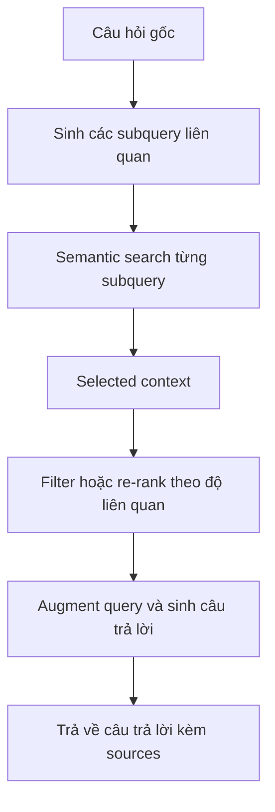

# 🏭 Documentation Helper trong Production: Học từ Chat LangChain

> Nguồn: `063-Documentation-Helper-In-Production.txt` · [Udemy](https://ua.udemy.com/course/langchain/learn/lecture/47301559)

Prototype của chúng ta đã chạy được, nhưng chặng đường từ một bản **demo** đến một hệ thống **production-ready** vẫn còn nhiều điều để học. Trong bài này, mình muốn đưa các bạn xem một ví dụ thực tế của chính đội ngũ LangChain: **Chat LangChain** — dự án đưa ý tưởng Documentation Helper lên một tầm cao hoàn toàn mới.

Nếu Documentation Helper của chúng ta là "cấp 1", thì đây là "cấp cuối" của cùng một bài toán!

### 💬 Chat LangChain: cùng bài toán, tầm nhìn lớn hơn

Giống như Documentation Helper, dự án này cho phép người dùng **chat với tài liệu LangChain**: ingest docs rồi xây hệ thống RAG lên trên. Nhưng LangChain đã nâng cấp nó thành một **kiến trúc RAG rất tiên tiến**, triển khai paradigm mang tên **Agentic RAG** — được xây dựng bằng **LangChain** và **LangGraph**, với hệ thống tinh chỉnh truy vấn và tạo output tối ưu, rất dễ dùng.

| Tiêu chí | Documentation Helper | Chat LangChain |
|---|---|---|
| Mục đích | Prototype học tập | Production-ready |
| Kiến trúc | RAG agent với một retrieval tool | Agentic RAG, multi-agent system |
| Truy vấn | Một truy vấn duy nhất | Sinh nhiều subquery rồi hợp nhất |
| Stack | LangChain | LangChain, LangGraph, Next.js |
| Mã nguồn | Trong khóa học | Mã nguồn mở, deploy được cho use case riêng |

Điểm mình thích ở đây là **UI và trải nghiệm người dùng**. Và điều tuyệt vời nhất: dự án **mã nguồn mở** — LangChain công khai code, cho phép bạn **deploy vào use case của riêng mình**.

---

### 🔍 Xem hệ thống "suy nghĩ" như thế nào

Mình thử hỏi **"what is LangChain?"** và quan sát:

1. Hệ thống **sinh ra một loạt câu hỏi liên quan** đến câu hỏi gốc. Câu đầu tiên: *"review the documentation and gather comprehensive definition of LangChain"* — rồi **retrieve documents** cho truy vấn đó.
2. Tương tự với **hai truy vấn phụ (subqueries)** nữa. Mục tiêu là một **heuristic** giúp retrieve được tài liệu **tốt hơn, liên quan hơn**.
3. Với mỗi subquery, hệ thống **semantic search** và gom tài liệu giúp trả lời câu hỏi — đó là **selected context**.
4. Tập tài liệu này **có thể được filter hoặc re-rank theo độ liên quan (re-rank by relevance)**.
5. Cuối cùng, hệ thống **augment query**, sinh câu trả lời, và **xuất kèm nguồn (sources)**.

Ở bất kỳ thời điểm nào trong lượt chạy, người dùng có thể mở **relevant context** để xem các tài liệu đã retrieve. UI rất tự nhiên, giúp ta hiểu hệ thống đang làm gì — và quan trọng hơn: **không có phép thuật nào ở đây cả**. Chính sự minh bạch này **tạo dựng niềm tin** giữa người dùng và hệ thống — điều tối quan trọng với ứng dụng Generative AI.

Lĩnh vực này có tên gọi: **Generative UI** — nghệ thuật tạo ra giao diện và trải nghiệm mượt mà cho các ứng dụng generative. Mình có bàn sâu trong **production section của khóa học**.

---

### 🧠 Coreference resolution: hiểu người dùng đang nói về cái gì

Mình kiểm tra khả năng **coreference resolution (phân giải đại từ hồi chỉ)** bằng câu hỏi ngắn gọn: **"who created it?"**.

Hệ thống sinh ra các subquery **hiểu rằng "it" chính là LangChain** — dù câu hỏi trước đó mới nhắc đến LangChain. Ứng dụng này còn có khả năng **tìm kiếm online**, nhưng với truy vấn dạng này thì không cần. Kết quả trả về: **LangChain được tạo bởi Harrison Chase**, kèm link tài liệu tham chiếu. Coreference resolution hoạt động hoàn hảo!

---

### 📂 Bên trong mã nguồn: prompts, router và multi-agent

Tìm **"chat LangChain GitHub"** trên Google, bạn sẽ thấy repository này — xây dựng trên stack **LangChain, LangGraph** và **Next.js** cho frontend.

Vào backend, mục **retrieval graph**, ta xem các **prompts** cấu thành ứng dụng. Đây là một **multi-agent system**:

* File **`Prompt.py`** tải về một loạt prompts từ link — giống cách chúng ta từng làm.
* **Router prompt** — khái niệm router mình đã giải thích trong khóa học.
* **Generate queries prompt** — sinh các subquery từ câu hỏi gốc của người dùng.
* Còn nhiều prompt khác nữa — mình **rất khuyến khích** các bạn xem qua, vì đây là những ví dụ **prompt engineering** chất lượng cao.

Trong **`graph.py`** là phần sử dụng thực tế của các prompts — một ví dụ về **multi-agent system triển khai bằng LangGraph**. *Đừng lo nếu bạn chưa biết LangGraph hay multi-agent: khóa học này đã có phần giới thiệu, còn để học sâu thì mình có hẳn một khóa LangGraph xây tiếp trên nền khóa này.*

### 🎯 Tự kiểm tra nhanh

**Câu 1:** Chat LangChain triển khai paradigm nào?

<b>Xem đáp án</b>

**Đáp án:** **Agentic RAG**, xây bằng LangChain và LangGraph.

Giải thích: Hệ thống tinh chỉnh truy vấn và tạo output tối ưu, rất dễ dùng.

Tham chiếu: Mục Chat LangChain.

**Câu 2:** Vì sao hệ thống sinh ra nhiều subquery?

<b>Xem đáp án</b>

**Đáp án:** Như một heuristic giúp retrieve tài liệu tốt hơn, liên quan hơn.

Giải thích: Mỗi subquery được semantic search, gom thành selected context.

Tham chiếu: Mục Xem hệ thống suy nghĩ.

**Câu 3:** Coreference resolution được kiểm chứng bằng câu hỏi nào?

<b>Xem đáp án</b>

**Đáp án:** *"who created it?"* — hệ thống hiểu "it" chính là LangChain.

Giải thích: Kết quả trả về: LangChain được tạo bởi Harrison Chase.

Tham chiếu: Mục Coreference resolution.

**Câu 4:** Trong retrieval graph của Chat LangChain có những prompt nào?

<b>Xem đáp án</b>

**Đáp án:** Router prompt, generate queries prompt, và nhiều prompt khác trong `Prompt.py`.

Giải thích: Đây là ví dụ prompt engineering chất lượng cao, phần sử dụng nằm ở `graph.py`.

Tham chiếu: Mục Bên trong mã nguồn.

**Câu 5:** Vì sao giao diện của Chat LangChain tạo được niềm tin?

<b>Xem đáp án</b>

**Đáp án:** Vì người dùng xem được relevant context đã retrieve — "không có phép thuật nào ở đây cả".

Giải thích: Sự minh bạch là điều tối quan trọng với ứng dụng Generative AI.

Tham chiếu: Mục Xem hệ thống suy nghĩ.

Điều mình muốn các bạn thấy: đây chính là cách đội ngũ LangChain **nâng cấp ý tưởng Documentation Helper thành một hệ thống production-ready**, tạo ra kết quả chất lượng cao. Còn Documentation Helper của chúng ta vẫn là nền móng tuyệt vời để hiểu mọi thứ từ gốc! 🚀

## Nguồn tham khảo

- [Udemy — Documentation Helper In Production](https://ua.udemy.com/course/langchain/learn/lecture/47301559)
- [GitHub — langchain-ai/chat-langchain](https://github.com/langchain-ai/chat-langchain)
- [LangChain Docs — Retrieval overview và các kiến trúc RAG](https://docs.langchain.com/oss/python/langchain/retrieval)
