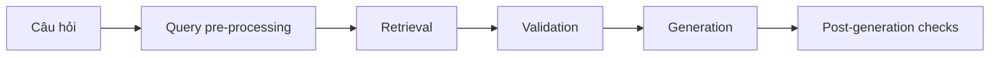

# 🧭 RAG Architecture: Two-step, RAG Agent hay Hybrid?

> Nguồn: `064-RAG-Architecture.txt` · [Udemy](https://ua.udemy.com/course/langchain/learn/lecture/54176973)

Đến thời điểm này, chúng ta đã đi qua **hai cách triển khai RAG** trong khóa học. Nhưng câu hỏi lớn vẫn còn treo lơ lửng: **cách nào tốt nhất?** Trong bài này, mình sẽ đặt hai kiến trúc lên bàn cân, phân tích ưu nhược điểm, rồi giới thiệu kiến trúc mà mình tin là "chân ái" cho môi trường production.

### 🔁 Kiến trúc 1: Two-step RAG

Cách đầu tiên là **two-step RAG**, triển khai bằng **LangChain Expression Language (LCEL)**. Đặc điểm dễ nhận thấy nhất: **retrieval luôn diễn ra trước, rồi mới đến generation** — đơn giản và **có thể dự đoán trước (predictable)**.

* **Ưu điểm:** Chúng ta kiểm soát rất tốt thời điểm retrieval; hệ thống **cực kỳ nhanh** vì không cần LLM "quyết định" có cần retrieve hay không.
* **Hạn chế:** Kém linh hoạt vì **luôn luôn** phải retrieve tài liệu, bất kể câu hỏi có cần hay không.

---

### 🤖 Kiến trúc 2: RAG Agent

Cách thứ hai mà LangChain gọi là **agentic RAG**, còn mình gọi ngắn gọn là **RAG agent**. Chúng ta lấy **ReAct agent** và trang bị thêm **retrieval tool** — để **LLM tự quyết định khi nào và bằng cách nào** truy hồi trong quá trình reasoning.

* **Ưu điểm:** Cực kỳ linh hoạt vì LLM chủ động quyết định.
* **Hạn chế:** Chúng ta ít kiểm soát hơn; **latency chậm hơn** two-step RAG do có thêm một LLM call trước khi retrieval — thậm chí vài LLM call tùy trường hợp.

---

### ⚖️ Kiến trúc 3: Hybrid RAG — "best of both worlds"

Và đây là câu trả lời mình muốn dành cho các bạn: **hybrid architecture**, kết hợp các yếu tố của cả **agentic RAG** và **two-step RAG**. Mình sẽ demo cách triển khai bằng **LangGraph** trong phần LangGraph của khóa học.

Vậy approach nào tốt hơn? Câu trả lời trung thực là: **tùy vào use case của bạn**. Tuy nhiên, theo kinh nghiệm làm việc với **production systems** và khách hàng **doanh nghiệp**, kiến trúc hybrid thường **giành chiến thắng và được dùng phổ biến nhất** — ít nhất là ở thời điểm hiện tại.

| Kiến trúc | Cách chạy | Kiểm soát | Linh hoạt | Latency |
|---|---|---|---|---|
| Two-step RAG | Retrieval luôn trước generation | Cao | Thấp | Nhanh |
| RAG Agent | LLM tự quyết định khi nào retrieve | Thấp | Cao | Chậm hơn |
| Hybrid RAG | Kết hợp cả hai, thêm bước validation | Trung bình | Trung bình | Trung bình |

Hybrid RAG bổ sung các **bước trung gian (intermediate steps)** như:

1. **Query pre-processing** — tiền xử lý truy vấn.
2. **Retrieval** — truy hồi tài liệu.
3. **Validation** — kiểm chứng tài liệu.
4. **Post-generation checks** — hậu kiểm sau khi sinh câu trả lời.

Kiến trúc này **linh hoạt hơn pipeline cố định**, nhưng vẫn **duy trì kiểm soát** ở mức cần thiết. Ba lợi ích cụ thể:

* **Query enhancement (tăng cường truy vấn):** Lấy câu hỏi gốc và **cải thiện nó** để retrieval hiệu quả hơn.
* **Document validation:** Xem lại tài liệu đã retrieve, kiểm tra xem chúng có **thực sự ý nghĩa** và có thể trả lời câu hỏi hay không.
* **Answer validation:** Kiểm tra câu trả lời **không bịa đặt (hallucination)** và thực sự giải đáp đúng câu hỏi.

Chúng ta sẽ đi **rất sâu và triển khai từ đầu (from the ground up)** kiến trúc này ở phần sau khóa học, nên hôm nay các bạn chỉ cần nắm bức tranh tổng thể.

---

### 🏭 Dùng RAG khi nào — và khi nào agent là "overkill"?

Vậy mình khuyên các bạn nên dùng gì trong thực tế? **Hybrid RAG** — đây là kiến trúc đang được dùng trong các hệ thống production của doanh nghiệp hiện nay. RAG agent **quá linh hoạt**: nó trao toàn bộ quyền tự do cho LLM, điều mà **rất nhiều ứng dụng production không hề mong muốn**.

Còn về **use case của RAG**: thông thường chúng ta dùng RAG cho **hỏi đáp trên tài liệu** — tài liệu nội bộ, documentation, hay knowledge base — những nơi ta muốn "neo" câu trả lời vào dữ liệu tin cậy. Với những bài toán đó, **một agent là quá mức cần thiết (overkill)**.

### 🎯 Tự kiểm tra nhanh

**Câu 1:** Two-step RAG có ưu điểm gì?

<b>Xem đáp án</b>

**Đáp án:** Kiểm soát tốt thời điểm retrieval và cực kỳ nhanh.

Giải thích: Không cần LLM "quyết định" có retrieve hay không — nhưng kém linh hoạt vì luôn retrieve.

Tham chiếu: Mục Kiến trúc 1.

**Câu 2:** Vì sao RAG agent chậm hơn two-step RAG?

<b>Xem đáp án</b>

**Đáp án:** Vì có thêm một hoặc vài LLM call trước khi retrieval.

Giải thích: LLM phải reasoning để quyết định khi nào và bằng cách nào truy hồi.

Tham chiếu: Mục Kiến trúc 2.

**Câu 3:** Ba lợi ích của Hybrid RAG là gì?

<b>Xem đáp án</b>

**Đáp án:** Query enhancement, document validation, answer validation.

Giải thích: Tăng cường truy vấn, kiểm chứng tài liệu và kiểm tra câu trả lời không bịa đặt.

Tham chiếu: Mục Kiến trúc 3.

**Câu 4:** Vì sao agent là "overkill" cho hỏi đáp trên tài liệu?

<b>Xem đáp án</b>

**Đáp án:** Vì use case này chỉ cần "neo" câu trả lời vào dữ liệu tin cậy — không cần quá nhiều tự do.

Giải thích: RAG agent trao toàn bộ quyền tự do cho LLM, điều nhiều ứng dụng production không mong muốn.

Tham chiếu: Mục Dùng RAG khi nào.

**Câu 5:** Kiến trúc nào mình khuyên dùng cho production?

<b>Xem đáp án</b>

**Đáp án:** **Hybrid RAG** — đang được dùng trong các hệ thống production của doanh nghiệp.

Giải thích: Linh hoạt hơn pipeline cố định nhưng vẫn duy trì kiểm soát; sẽ được triển khai từ đầu ở phần LangGraph.

Tham chiếu: Mục Dùng RAG khi nào.

Tóm lại: RAG agent mà chúng ta vừa triển khai **không phải giải pháp tốt nhất**, và mình **nhất định không dùng nó trong production**. Còn đâu là lộ trình mình đề xuất? Hãy học tốt **hybrid RAG** — và phần LangGraph sắp tới sẽ trang bị cho các bạn đầy đủ công cụ để hiện thực hóa nó. Hẹn gặp lại! 🚀

## Nguồn tham khảo

- [Udemy — RAG Architecture](https://ua.udemy.com/course/langchain/learn/lecture/54176973)
- [LangChain Docs — Retrieval overview: 2-Step, Agentic và Hybrid RAG](https://docs.langchain.com/oss/python/langchain/retrieval)
- [LangChain Docs — Build a custom RAG agent with LangGraph](https://docs.langchain.com/oss/python/langgraph/agentic-rag)
