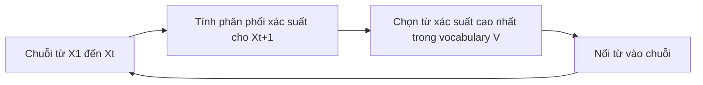

# 🧠 Hiểu tận gốc LLM: Mô hình ngôn ngữ thực chất đang "đoán chữ" như thế nào?

> Nguồn: `065-The-GIST-of-LLMs.txt` · [Udemy](https://ua.udemy.com/course/langchain/learn/lecture/37735894)

Chào các bạn, mình là Eden đây! Trước khi bước vào thế giới **Prompt Engineering (kỹ thuật viết prompt)**, mình muốn chúng ta cùng dựng lại nền móng vững chắc nhất: **Language Modeling (mô hình hóa ngôn ngữ)** là gì.

Và vì sao một **LLM (Large Language Model — mô hình ngôn ngữ lớn)** lại có thể trả lời câu hỏi của bạn?

Nghe có vẻ hàn lâm, nhưng mình hứa khái niệm này cực kỳ trực quan — hiểu nó sẽ giúp các bạn viết prompt giỏi hơn rất nhiều về sau.

---

### 📖 Language Modeling: định nghĩa "đao to búa lớn" nhưng cực dễ hiểu

Theo định nghĩa chính thức từ Wikipedia, language modeling nói về **phân phối xác suất (probability distribution)** trên một chuỗi các từ.

Còn nếu diễn giải theo cách gần gũi nhất: **language modeling chính là bài toán dự đoán từ nào sẽ xuất hiện tiếp theo**.

Các bạn cứ nghĩ về nó như một chiếc **autocomplete (tự động hoàn thành) siêu siêu thông minh**.

Ví dụ với câu: *"the dog wigged its ..."* — model sẽ gán cho mỗi từ trong danh sách một xác suất.

Và thứ nó trả về cho bạn là từ có **xác suất cao nhất**, tức khả năng đúng cao nhất.

Về mặt hình thức, giả sử ta có chuỗi từ X1, X2, ..., Xt (mỗi X tương ứng một từ trong câu trước đó). Ta cần tính phân phối xác suất của từ tiếp theo **Xt+1**:

* **P** là ký hiệu của xác suất (probability).
* Ta đặt câu hỏi: "Xác suất của từ tiếp theo Xt+1 là bao nhiêu, khi biết trước đó ta đã có câu từ X1 đến Xt?"
* **Xt+1 bắt buộc phải nằm trong vocabulary (từ vựng)** của model, được ký hiệu là **V**.

Quá trình dự đoán lặp đi lặp lại ấy diễn ra như sau:

Tóm gọn: language model = có một câu gồm vài từ nối tiếp nhau, và ta muốn đoán từ tiếp theo sẽ là gì.

Nó giống hệt chức năng gợi ý khi bạn nhắn tin trên điện thoại.

Hoặc khi bạn gõ tìm kiếm trên công cụ search — tất cả đều dựa trên một language model.

---

### 🚀 Vậy LLM "lớn" ở chỗ nào?

Một **Large Language Model (LLM)** chỉ đơn giản là một language model như vừa nói, nhưng được **huấn luyện (train) trên một lượng dữ liệu khổng lồ**.

Bạn có thể hình dung đó là một language model được train với nhiều dữ liệu đến mức nó trở nên cực kỳ, cực kỳ giỏi trong việc tính toán các xác suất đó.

Vì vậy, mỗi lần bạn viết một prompt, điều bạn thực chất đang làm là **đưa vào một chuỗi từ**.

LLM sẽ nỗ lực hết sức để trả ra **từ tiếp theo, rồi từ tiếp theo nữa, nối tiếp nhau**.

Nó tính xác suất và chọn từ có xác suất cao nhất trong ngữ cảnh mà bạn cung cấp — cứ thế đoán từng chữ một theo đúng điều bạn mong đợi.

---

### ⚠️ Vì sao LLM thỉnh thoảng "nói dối"?

Đây chính là lời giải thích cho việc vì sao đôi khi LLM xuất ra những thông tin xa rời thực tế và **hoàn toàn không đúng sự thật**.

Lý do rất đơn giản: nó đang **đoán xác suất** và tin tưởng vào phép đoán đó.

Nó không hề "tra cứu sự thật" như chúng ta thường tưởng tượng.

Đó là toàn bộ khái niệm về LLM! Nắm được bản chất này, các bạn sẽ thấy mọi kỹ thuật prompt engineering phía trước trở nên logic và dễ hiểu hơn hẳn.

### 🎯 Tự kiểm tra nhanh

**Câu 1:** Theo cách diễn giải gần gũi, language modeling là bài toán gì?

<b>Xem đáp án</b>

**Đáp án:** Dự đoán từ nào sẽ xuất hiện tiếp theo, như một chiếc autocomplete siêu thông minh.

Giải thích: Về hình thức, đó là phân phối xác suất trên một chuỗi từ.

Tham chiếu: Mục Language Modeling.

**Câu 2:** Trong công thức dự đoán, Xt+1 bắt buộc phải thuộc tập nào?

<b>Xem đáp án</b>

**Đáp án:** Vocabulary V của model.

Giải thích: Model chỉ có thể chọn từ trong vốn từ của nó.

Tham chiếu: Mục Language Modeling.

**Câu 3:** LLM "lớn" khác language model thường ở điểm nào?

<b>Xem đáp án</b>

**Đáp án:** Cùng cơ chế dự đoán, nhưng được train trên lượng dữ liệu khổng lồ nên cực giỏi tính xác suất.

Giải thích: Mỗi prompt bạn viết chính là một chuỗi từ để model nối tiếp.

Tham chiếu: Mục Vậy LLM lớn ở chỗ nào.

**Câu 4:** Vì sao LLM thỉnh thoảng xuất ra thông tin không đúng sự thật?

<b>Xem đáp án</b>

**Đáp án:** Vì nó đang đoán xác suất và tin vào phép đoán đó, chứ không tra cứu sự thật.

Giải thích: Đây là lời giải thích cho hiện tượng "nói dối" của LLM.

Tham chiếu: Mục Vì sao LLM thỉnh thoảng nói dối.

**Câu 5:** Nắm bản chất xác suất của LLM giúp gì cho việc viết prompt?

<b>Xem đáp án</b>

**Đáp án:** Hiểu rằng mọi kỹ thuật prompt engineering đều là cách định hướng việc "đoán từng chữ" của model.

Giải thích: Nắm gốc này thì các kỹ thuật phía sau trở nên logic và dễ hiểu hơn.

Tham chiếu: Đoạn kết bài.

Hẹn gặp lại bạn ở bài tiếp theo, nơi chúng ta mổ xẻ xem một **prompt hoàn chỉnh được cấu thành từ những phần nào** nhé! 🚀

## Nguồn tham khảo

- [Udemy — The GIST of LLMs](https://ua.udemy.com/course/langchain/learn/lecture/37735894)
- [Wikipedia — Language model](https://en.wikipedia.org/wiki/Language_model)
