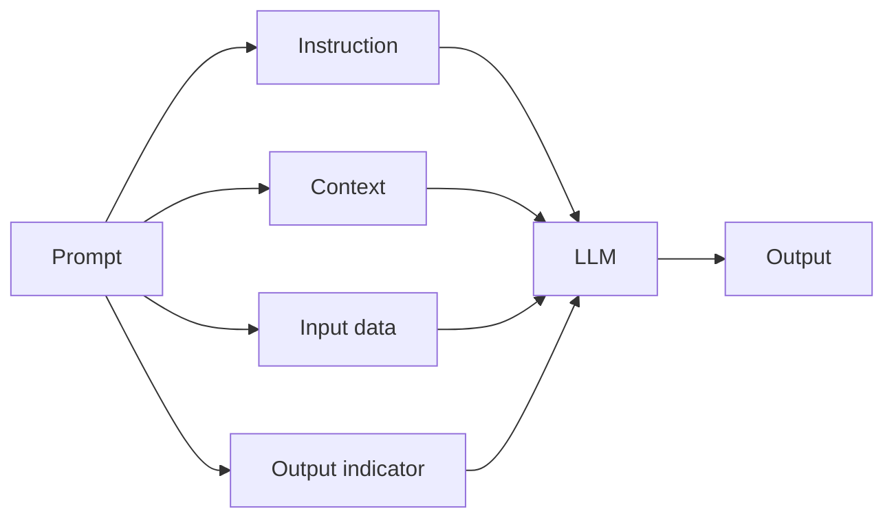

# 🧩 Prompt là gì? Khám phá 4 thành phần của một prompt chuẩn chỉnh

> Nguồn: `066-What-is-a-Prompt-Composition-of-a-formal-prompt.txt` · [Udemy](https://ua.udemy.com/course/langchain/learn/lecture/37507516)

Tiếp nối hành trình Prompt Engineering, hôm nay chúng ta sẽ cùng nhau mổ xẻ một khái niệm tưởng chừng ai cũng biết nhưng ít ai định nghĩa được chính xác: **Prompt**.

Mục tiêu của bài này không chỉ là hiểu prompt là gì, mà còn là **chuẩn hóa ngôn ngữ chung** để chúng ta nói chuyện với nhau về AI một cách rõ ràng nhất.

---

### 🗣️ Vì sao cần định nghĩa "chuẩn" cho prompt?

Cũng giống như trong hóa học hay toán học có hệ thống thuật ngữ riêng, AI và prompt engineering cũng cần có **hệ thuật ngữ chính thức**.

Khi mọi người dùng chung một cách hiểu, việc **cộng tác và trao đổi ý tưởng về AI** trở nên dễ dàng hơn rất nhiều.

Và quan trọng hơn, sau khi định nghĩa được prompt gồm những gì, chúng ta sẽ biết cách **tùy chỉnh (customize)** và **tối ưu (optimize)** prompt của mình.

Nhìn vào là biết ngay phần nào cần sửa, phần nào còn thiếu.

Vậy khi nói về các AI language model, prompt là gì? **Prompt chính là đầu vào (input) mà chúng ta đưa cho AI model để nó tạo ra đầu ra (output).**

Bạn có thể nghĩ về prompt như một tấm bản đồ chỉ đường cho model.

Nó giúp model hiểu ngữ cảnh, xử lý thông tin, và tạo ra một phản hồi **liên quan, ý nghĩa và dùng được** cho chúng ta.

---

### 🎯 Instruction — trái tim của prompt

Thành phần đầu tiên là **instruction (chỉ dẫn)** — bạn có thể xem đây là trái tim của cả prompt.

Instruction cho AI model biết **nhiệm vụ nó cần thực hiện**.

Dù bạn đang cần tóm tắt văn bản, dịch thuật, hay phân loại (classification), chính instruction là thứ "dàn cảnh" cho phản hồi của AI.

---

### 📎 Context và Input data — "nhiên liệu" giúp AI chính xác hơn

Thành phần thứ hai là **context (ngữ cảnh)**.

Context cung cấp thông tin bổ sung giúp AI model hiểu nhiệm vụ rõ hơn và tạo ra câu trả lời chính xác hơn.

* Với một số tác vụ, context có thể **không thực sự cần thiết**.
* Với những tác vụ khác, context lại **cải thiện hiệu suất của AI một cách đáng kể**.

Thành phần thứ ba là **input data (dữ liệu đầu vào)** — thông tin mà AI model sẽ xử lý để hoàn thành nhiệm vụ bạn giao.

Nó có thể là một đoạn văn bản, một hình ảnh, hoặc bất kỳ dữ liệu nào liên quan đến tác vụ.

---

### 🚦 Output indicator — "tín hiệu xuất phát" cho model

Thành phần cuối cùng trong một prompt là **output indicator (tín hiệu đầu ra)**.

Nó báo cho AI model biết rằng **chúng ta đang mong chờ câu trả lời ngay bây giờ**.

Điều thú vị là output indicator đôi khi **ẩn (implicit)** ngay trong instruction.

Nhưng cũng có lúc nó **hiện (explicit)** và được viết ra rõ ràng.

Chúng ta sẽ gặp những ví dụ cụ thể về nó rất sớm thôi!

Bốn thành phần ấy cùng đổ vào model theo sơ đồ sau:

Bảng tóm tắt nhanh bốn thành phần:

| Thành phần | Vai trò | Ghi chú |
|---|---|---|
| **Instruction** | Nhiệm vụ model cần thực hiện | "Trái tim" của prompt |
| **Context** | Thông tin bổ sung giúp model hiểu nhiệm vụ | Có tác vụ không thật sự cần |
| **Input data** | Dữ liệu model sẽ xử lý | Có thể là văn bản, hình ảnh... |
| **Output indicator** | Báo model rằng đang chờ câu trả lời | Có thể ẩn hoặc hiện |

Nắm vững bốn thành phần này xem như bạn đã có trong tay bộ "đồ nghề" đầu tiên của một prompt engineer.

Hãy ghi nhớ chúng, vì mọi kỹ thuật phía sau — zero-shot, few-shot, chain-of-thought — đều xoay quanh bốn phần này.

### 🎯 Tự kiểm tra nhanh

**Câu 1:** Trong ngữ cảnh AI language model, prompt là gì?

<b>Xem đáp án</b>

**Đáp án:** Là đầu vào (input) mà chúng ta đưa cho model để nó tạo ra đầu ra (output).

Giải thích: Có thể hình dung prompt như tấm bản đồ chỉ đường cho model.

Tham chiếu: Mục Vì sao cần định nghĩa chuẩn cho prompt.

**Câu 2:** Một prompt chuẩn chỉnh gồm bốn thành phần nào?

<b>Xem đáp án</b>

**Đáp án:** Instruction, context, input data và output indicator.

Giải thích: Đây là bộ "đồ nghề" đầu tiên của một prompt engineer.

Tham chiếu: Toàn bài.

**Câu 3:** Thành phần nào được ví là "trái tim" của prompt?

<b>Xem đáp án</b>

**Đáp án:** Instruction.

Giải thích: Instruction cho model biết nhiệm vụ cần thực hiện, "dàn cảnh" cho phản hồi.

Tham chiếu: Mục Instruction.

**Câu 4:** Context có phải lúc nào cũng cần thiết không?

<b>Xem đáp án</b>

**Đáp án:** Không. Có tác vụ context không thật sự cần, nhưng có tác vụ nó cải thiện hiệu suất đáng kể.

Giải thích: Tùy tác vụ mà context phát huy vai trò khác nhau.

Tham chiếu: Mục Context và Input data.

**Câu 5:** Output indicator "ẩn" và "hiện" nghĩa là gì?

<b>Xem đáp án</b>

**Đáp án:** Đôi khi nó nằm ngầm trong instruction, đôi khi được viết ra rõ ràng.

Giải thích: Cả hai dạng đều báo cho model rằng ta đang chờ câu trả lời.

Tham chiếu: Mục Output indicator.

Hẹn gặp các bạn ở bài tiếp theo nhé! 🚀

## Nguồn tham khảo

- [Udemy — What is a Prompt? Composition of a formal prompt](https://ua.udemy.com/course/langchain/learn/lecture/37507516)
- [Prompt Engineering Guide — Elements of a Prompt](https://www.promptingguide.ai/introduction/elements)
