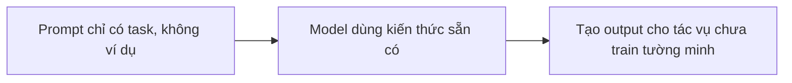

# ⚡ Zero Shot Prompting: Khi AI trả lời mà không cần bạn "mớm" ví dụ

> Nguồn: `067-Zero-Shot-Prompting.txt` · [Udemy](https://ua.udemy.com/course/langchain/learn/lecture/37507510)

Các bạn có bao giờ thắc mắc vì sao một LLM có thể trả lời về những chủ đề mình chưa từng dạy nó?

Câu trả lời nằm ở khái niệm chúng ta sẽ cùng khám phá hôm nay: **Zero Shot Prompting (prompt không kèm ví dụ)**.

Đây cũng chính là kiểu prompt phổ biến nhất mà hầu hết mọi người dùng khi mới làm quen với AI — nên hiểu thật rõ nó là bước đi đầu tiên vô cùng quan trọng.

---

### 📚 Nền tảng: LLM được "nuôi" bằng lượng dữ liệu khổng lồ

Large language models được huấn luyện trên **lượng dữ liệu khổng lồ**.

Người ta tin rằng **GPT-3 được train trên hơn một tỷ từ (over a billion words)**.

Để các bạn dễ hình dung mức độ "khổng lồ" này, mình có một phép so sánh thú vị.

Nếu xếp **một tỷ tờ tiền 1 đô la** thành một chồng, chồng tiền đó sẽ cao **hơn 67 dặm (hơn 100 km)**!

Lượng dữ liệu này chuyển hóa trực tiếp thành **kiến thức (knowledge)** của model.

Nhờ đó, nó hoàn toàn có khả năng trả lời câu hỏi và thực hiện chỉ dẫn **mà không cần được cung cấp dữ liệu đầu vào (input data)**.

---

### 🔍 Zero-shot prompt chính xác là gì?

**Zero-shot prompt** là kiểu prompt mà model tạo ra đầu ra cho một tác vụ **mà nó chưa từng được huấn luyện tường minh (explicitly trained)**.

Nói cách khác: model được yêu cầu thực hiện một tác vụ mà không hề có bất kỳ dữ liệu huấn luyện riêng nào cho tác vụ đó.

Thay vào đó, nó dùng **kiến thức sẵn có (preexisting knowledge)** để hoàn thành nhiệm vụ dựa trên thông tin được cung cấp trong prompt.

Cơ chế đó gói gọn trong sơ đồ sau:

Một ví dụ dễ hiểu: một language model không được huấn luyện trên văn bản tiếng Anh vẫn có thể tạo ra kết quả chính xác cho văn bản tiếng Pháp — dù nó không hề được train riêng cho tiếng Pháp.

---

### ✍️ Ví dụ minh họa: "10 thành phố nhất định phải ghé thăm"

Đây là một prompt zero-shot điển hình:

*"Create a list of the 10 must-visit cities in the world in no particular order."*

*Hãy liệt kê 10 thành phố nhất định phải ghé thăm trên thế giới, không cần theo thứ tự cụ thể.*

Bạn có thể thấy chúng ta **không hề đưa cho model bất kỳ ví dụ hay input data nào** để gợi ý câu trả lời.

Vậy mà nó vẫn liệt kê cho chúng ta một danh sách đẹp đẽ và mạch lạc.

Đó chính là zero-shot prompt.

Khi mới dấn thân vào prompt engineering, bạn sẽ nhận ra zero-shot là **kiểu prompt phổ biến nhất** mà mọi người sử dụng khi bắt đầu với AI.

Ở giai đoạn đầu, bạn đang học cách tương tác với model.

Việc hỏi thẳng nó mà không cần đưa ví dụ hay "gợi ý cách nghĩ" là một cách làm cực kỳ tự nhiên.

---

### ⚠️ Những giới hạn bạn cần biết của zero-shot

Zero-shot prompting cũng đi kèm một loạt giới hạn:

1. **Độ chính xác (accuracy):** câu trả lời model trả về có thể không đúng chính xác thứ bạn đang tìm, vì bạn không cung cấp dữ liệu hay chỉ dẫn nào.
2. **Phạm vi (scope) có thể bị hạn chế.**
3. **Mức độ kiểm soát thấp hơn hẳn:** vì chỉ có một prompt duy nhất dựa trên kiến thức sẵn có của model, nó không thể được tinh chỉnh (fine-tune) cho một use case cụ thể nào.

### 🎯 Tự kiểm tra nhanh

**Câu 1:** Zero-shot prompt được định nghĩa như thế nào?

<b>Xem đáp án</b>

**Đáp án:** Là kiểu prompt model tạo đầu ra cho một tác vụ mà nó chưa từng được train tường minh, dựa vào kiến thức sẵn có.

Giải thích: Không có dữ liệu huấn luyện riêng nào cho tác vụ đó.

Tham chiếu: Mục Zero-shot prompt chính xác là gì.

**Câu 2:** Theo niềm tin phổ biến trong bài, GPT-3 được train trên bao nhiêu từ?

<b>Xem đáp án</b>

**Đáp án:** Hơn một tỷ từ (over a billion words).

Giải thích: Bài dùng phép so sánh chồng một tỷ tờ 1 đô la cao hơn 67 dặm để hình dung.

Tham chiếu: Mục Nền tảng.

**Câu 3:** Ví dụ zero-shot điển hình trong bài là gì?

<b>Xem đáp án</b>

**Đáp án:** "Create a list of the 10 must-visit cities in the world in no particular order."

Giải thích: Không kèm bất kỳ ví dụ hay input data nào, model vẫn liệt kê danh sách mạch lạc.

Tham chiếu: Mục Ví dụ minh họa.

**Câu 4:** Ba giới hạn của zero-shot prompting là gì?

<b>Xem đáp án</b>

**Đáp án:** Độ chính xác, phạm vi bị hạn chế, và mức độ kiểm soát thấp hơn.

Giải thích: Vì không có dữ liệu hay chỉ dẫn kèm theo, cũng không thể tinh chỉnh cho use case riêng.

Tham chiếu: Mục Những giới hạn bạn cần biết.

**Câu 5:** Vì sao zero-shot là kiểu prompt phổ biến nhất với người mới?

<b>Xem đáp án</b>

**Đáp án:** Vì hỏi thẳng model mà không cần ví dụ là cách tương tác tự nhiên khi bắt đầu với AI.

Giải thích: Giai đoạn đầu, ta đang học cách tương tác với model.

Tham chiếu: Mục Ví dụ minh họa.

*Đừng lo lắng nhé — chính những giới hạn này là lý do ra đời của các kỹ thuật mạnh mẽ hơn mà chúng ta sắp học.*

Ở bài tiếp theo, chúng ta sẽ nâng cấp lên **Few-Shot Prompting** — kỹ thuật "dạy" model bằng một vài ví dụ để kết quả bám sát ý bạn hơn.

Hẹn gặp lại! 🚀

## Nguồn tham khảo

- [Udemy — Zero-Shot Prompting](https://ua.udemy.com/course/langchain/learn/lecture/37507510)
- [arXiv — Language Models are Few-Shot Learners](https://arxiv.org/abs/2005.14165)
- [Prompt Engineering Guide — Basics of Prompting](https://www.promptingguide.ai/introduction/basics)
